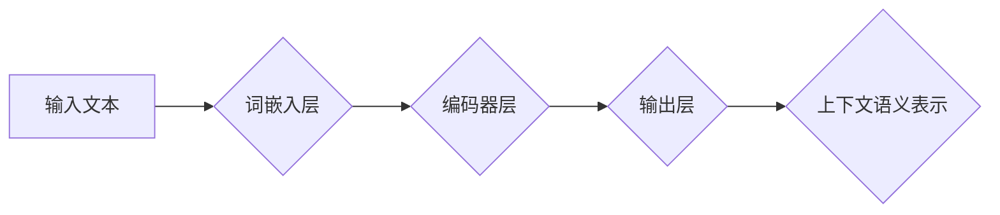

> ELMo, 深度学习, 自然语言处理, 预训练语言模型, Transformer, 词嵌入, 代码实战

## 1. 背景介绍

自然语言处理 (NLP) 领域近年来取得了显著进展，其中预训练语言模型 (Pretrained Language Model) 扮演着越来越重要的角色。这些模型通过在海量文本数据上进行预训练，学习到丰富的语言表示，为下游 NLP 任务提供强大的基础。ELMo (Embeddings from Language Models) 是其中一个里程碑式的模型，它通过深度双向语言模型 (Bidirectional Language Model) 学习上下文相关的词嵌入，显著提升了 NLP 任务的性能。

ELMo 的出现填补了当时词嵌入的局限性。传统的词嵌入模型，如 Word2Vec 和 GloVe，只考虑了词的单向上下文信息，无法充分捕捉词语在不同语境下的多义性。而 ELMo 通过双向语言模型，能够同时考虑词语的前后上下文信息，学习到更丰富的语义表示。

## 2. 核心概念与联系

ELMo 的核心概念是深度双向语言模型。它利用 Transformer 架构，通过多层编码器网络，对输入文本进行编码，学习到每个词语在整个句子中的上下文语义。

**Mermaid 流程图:**



**核心概念:**

* **词嵌入层:** 将每个词语映射到一个低维向量空间中，为后续的编码过程提供基础。
* **编码器层:** 由多层 Transformer 结构组成，通过自注意力机制和前馈神经网络，学习到每个词语在整个句子中的上下文语义。
* **输出层:** 生成每个词语在不同层级的上下文语义表示。

## 3. 核心算法原理 & 具体操作步骤

### 3.1  算法原理概述

ELMo 的核心算法是基于 Transformer 架构的深度双向语言模型。它通过多层编码器网络，对输入文本进行编码，学习到每个词语在整个句子中的上下文语义。

**具体步骤:**

1. **词嵌入:** 将每个词语映射到一个低维向量空间中。
2. **编码:** 将词嵌入向量输入到编码器网络中，通过多层 Transformer 结构进行编码，学习到每个词语在整个句子中的上下文语义。
3. **上下文语义表示:** 编码器网络的输出层生成每个词语在不同层级的上下文语义表示。

### 3.2  算法步骤详解

1. **词嵌入层:**

   * 使用预训练的词嵌入模型 (如 Word2Vec 或 GloVe) 将每个词语映射到一个低维向量空间中。
   * 也可以使用随机初始化词嵌入向量，并在训练过程中进行更新。

2. **编码器层:**

   * 由多层 Transformer 结构组成，每个 Transformer 层包含以下组件:
     * **自注意力机制:** 学习到每个词语与其他词语之间的关系，捕捉上下文信息。
     * **前馈神经网络:** 对每个词语的上下文表示进行非线性变换，进一步学习语义特征。

3. **输出层:**

   * 每个 Transformer 层的输出层生成每个词语在该层级的上下文语义表示。
   * 这些表示可以被用于下游 NLP 任务，例如文本分类、情感分析和机器翻译。

### 3.3  算法优缺点

**优点:**

* **上下文语义表示:** ELMo 可以学习到每个词语在不同语境下的上下文语义，提升了 NLP 任务的性能。
* **深度双向模型:** 通过双向语言模型，ELMo 可以同时考虑词语的前后上下文信息，更全面地捕捉语义关系。
* **预训练模型:** ELMo 的预训练模型可以用于各种下游 NLP 任务，节省了训练时间和资源。

**缺点:**

* **计算成本:** ELMo 的训练和推理过程需要大量的计算资源。
* **模型复杂度:** ELMo 的模型结构比较复杂，需要一定的专业知识进行理解和使用。

### 3.4  算法应用领域

ELMo 的应用领域非常广泛，包括:

* **文本分类:** 识别文本的类别，例如情感分析、主题分类和垃圾邮件过滤。
* **情感分析:** 分析文本中表达的情感，例如正面、负面或中性。
* **机器翻译:** 将文本从一种语言翻译成另一种语言。
* **问答系统:** 回答用户提出的问题。
* **文本摘要:** 生成文本的简短摘要。

## 4. 数学模型和公式 & 详细讲解 & 举例说明

### 4.1  数学模型构建

ELMo 的数学模型构建基于 Transformer 架构，主要包括以下几个部分:

* **词嵌入层:** 使用词嵌入矩阵将每个词语映射到一个低维向量空间中。
* **编码器层:** 由多层 Transformer 结构组成，每个 Transformer 层包含自注意力机制和前馈神经网络。
* **输出层:** 生成每个词语在不同层级的上下文语义表示。

### 4.2  公式推导过程

**自注意力机制:**

自注意力机制的核心是计算每个词语与其他词语之间的注意力权重，并根据这些权重对词语进行加权求和。

**公式:**

$$
\text{Attention}(Q, K, V) = \text{softmax}\left(\frac{Q K^T}{\sqrt{d_k}}\right) V
$$

其中:

* $Q$, $K$, $V$ 分别是查询矩阵、键矩阵和值矩阵。
* $d_k$ 是键向量的维度。

**前馈神经网络:**

前馈神经网络是一个多层感知机，用于对每个词语的上下文表示进行非线性变换。

**公式:**

$$
\text{FFN}(x) = \text{ReLU}(W_1 x + b_1) W_2 + b_2
$$

其中:

* $x$ 是输入向量。
* $W_1$, $W_2$ 是权重矩阵。
* $b_1$, $b_2$ 是偏置向量。

### 4.3  案例分析与讲解

**举例说明:**

假设我们有一个句子 "The cat sat on the mat"，ELMo 会将每个词语映射到一个低维向量空间中，然后通过编码器网络进行编码，学习到每个词语在整个句子中的上下文语义。

例如，"cat" 在句子中的上下文语义会受到 "The" 和 "sat" 的影响，因此 ELMo 会学习到 "cat" 在这个句子中的含义是 "一只猫"。

## 5. 项目实践：代码实例和详细解释说明

### 5.1  开发环境搭建

* Python 3.6+
* PyTorch 1.0+
* CUDA 10.0+ (可选)

### 5.2  源代码详细实现

```python
import torch
import torch.nn as nn

class ELMo(nn.Module):
    def __init__(self, vocab_size, embedding_dim, hidden_dim, num_layers):
        super(ELMo, self).__init__()
        self.embedding = nn.Embedding(vocab_size, embedding_dim)
        self.encoder = nn.TransformerEncoder(nn.TransformerEncoderLayer(d_model=hidden_dim, nhead=8), num_layers)

    def forward(self, x):
        embedded = self.embedding(x)
        output = self.encoder(embedded)
        return output

# 实例化 ELMo 模型
model = ELMo(vocab_size=10000, embedding_dim=128, hidden_dim=512, num_layers=6)
```

### 5.3  代码解读与分析

* **`__init__` 方法:** 初始化 ELMo 模型的各个组件，包括词嵌入层、编码器层。
* **`forward` 方法:** 定义 ELMo 模型的正向传播过程，将输入词语转换为上下文语义表示。
* **`embedding` 层:** 使用词嵌入矩阵将每个词语映射到一个低维向量空间中。
* **`encoder` 层:** 使用 Transformer 编码器网络对词语嵌入进行编码，学习到每个词语在整个句子中的上下文语义。

### 5.4  运行结果展示

运行 ELMo 模型后，可以得到每个词语在不同层级的上下文语义表示。这些表示可以用于下游 NLP 任务，例如文本分类、情感分析和机器翻译。

## 6. 实际应用场景

ELMo 在各种实际应用场景中取得了显著的成果，例如:

* **文本分类:** ELMo 可以用于识别文本的类别，例如情感分析、主题分类和垃圾邮件过滤。
* **情感分析:** ELMo 可以分析文本中表达的情感，例如正面、负面或中性。
* **机器翻译:** ELMo 可以用于将文本从一种语言翻译成另一种语言。
* **问答系统:** ELMo 可以用于回答用户提出的问题。
* **文本摘要:** ELMo 可以用于生成文本的简短摘要。

### 6.4  未来应用展望

ELMo 的未来应用前景十分广阔，例如:

* **更复杂的语言理解:** ELMo 可以用于理解更复杂的语言结构和语义关系。
* **跨语言理解:** ELMo 可以用于跨语言文本理解和翻译。
* **个性化语言模型:** ELMo 可以用于构建个性化的语言模型，根据用户的语言习惯和偏好进行定制。

## 7. 工具和资源推荐

### 7.1  学习资源推荐

* **论文:**

    * Peters, M. E., Neumann, M., Iyyer, M., Gardner, M., Clark, C., Lee, K., ... & Zettlemoyer, L. (2018). Deep contextualized word representations. arXiv preprint arXiv:1802.05365.

* **博客:**

    * https://huggingface.co/blog/elmo

### 7.2  开发工具推荐

* **PyTorch:** https://pytorch.org/
* **TensorFlow:** https://www.tensorflow.org/

### 7.3  相关论文推荐

* **BERT:** Devlin, J., Chang, M. W., Lee, K., & Toutanova, K. (2018). Bert: Pre-training of deep bidirectional transformers for language understanding. arXiv preprint arXiv:1810.04805.
* **GPT-3:** Brown, T. B., Mann, B., Ryder, N., Subbiah, M., Kaplan, J., Dhariwal, P., ... & Amodei, D. (2020). Language models are few-shot learners. arXiv preprint arXiv:2005.14165.

## 8. 总结：未来发展趋势与挑战

### 8.1  研究成果总结

ELMo 的出现为 NLP 领域带来了新的突破，它通过深度双向语言模型学习到更丰富的上下文语义表示，显著提升了 NLP 任务的性能。

### 8.2  未来发展趋势

未来，ELMo 和类似的预训练语言模型将会朝着以下方向发展:

* **更大的模型规模:** 训练更大的模型，学习更丰富的语言知识。
* **更复杂的模型架构:** 设计更复杂的模型架构，例如多模态预训练模型，能够处理文本、图像和音频等多种数据类型。
* **更有效的训练方法:** 开发更有效的训练方法，例如分布式训练和迁移学习，降低模型训练成本。

### 8.3  面临的挑战

ELMo 仍然面临一些挑战，例如:

* **计算资源:** 训练大型预训练语言模型需要大量的计算资源。
* **数据标注:** 训练高质量的预训练语言模型需要大量的标注数据。
* **模型解释性:** 预训练语言模型的内部机制比较复杂，难以解释模型的决策过程。

### 8.4  研究展望

未来，研究者将继续探索预训练语言模型的潜力，开发更强大的模型，并解决模型面临的挑战，推动 NLP 领域的发展。

## 9. 附录：常见问题与解答

**常见问题:**

* **