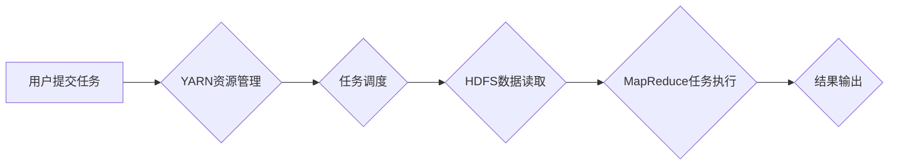

> Hadoop, HDFS, YARN, MapReduce, Spark, Big Data, Distributed Computing, Data Processing

## 1. 背景介绍

在当今数据爆炸的时代，海量数据的存储和处理已成为一个巨大的挑战。传统数据库和计算模型难以应对如此庞大的数据规模。为了解决这一问题，Apache Hadoop 应运而生，它是一种分布式存储和处理框架，能够高效地处理海量数据。Hadoop 的核心组件包括 HDFS（Hadoop Distributed File System）和 YARN（Yet Another Resource Negotiator）。

HDFS 提供了一种分布式文件系统，将数据存储在多个节点上，提高了数据可靠性和可用性。YARN 负责资源管理和任务调度，将任务分配到不同的节点上执行，并协调任务之间的依赖关系。

Hadoop 的出现极大地推动了大数据处理的发展，为各种领域提供了强大的数据处理能力，例如：

* **商业智能:** 分析用户行为、市场趋势等数据，帮助企业做出更明智的决策。
* **科学研究:** 处理天文、基因组等海量数据，加速科学发现。
* **互联网:** 处理用户日志、搜索记录等数据，提高网站性能和用户体验。

## 2. 核心概念与联系

Hadoop 的核心概念包括：

* **分布式存储:** 数据存储在多个节点上，提高数据可靠性和可用性。
* **并行处理:** 将任务分解成多个子任务，并行执行，提高处理速度。
* **容错机制:** 即使部分节点故障，也能保证数据完整性和任务执行。

Hadoop 的架构可以概括为以下流程：



## 3. 核心算法原理 & 具体操作步骤

### 3.1  算法原理概述

Hadoop 的核心算法是 MapReduce，它是一种用于处理海量数据的编程模型。MapReduce 将任务分解成两个阶段：

* **Map 阶段:** 将输入数据映射到一系列键值对。
* **Reduce 阶段:** 对 Map 阶段产生的键值对进行聚合，生成最终结果。

### 3.2  算法步骤详解

1. **数据切分:** 将输入数据切分成多个块，每个块分配给一个 Map 任务。
2. **Map 阶段:** 每个 Map 任务对数据块进行处理，将数据映射到一系列键值对。
3. **数据分组:** 将 Map 阶段产生的键值对根据键值进行分组。
4. **Reduce 阶段:** 每个 Reduce 任务对同一组键值对进行聚合，生成最终结果。
5. **结果输出:** 将 Reduce 阶段产生的结果输出到文件系统。

### 3.3  算法优缺点

**优点:**

* **并行处理:** 可以充分利用集群的计算资源，提高处理速度。
* **容错机制:** 即使部分节点故障，也能保证任务执行的可靠性。
* **易于编程:** MapReduce 提供了简单的编程模型，易于理解和使用。

**缺点:**

* **数据倾斜问题:** 如果数据分布不均匀，会导致某些 Reduce 任务处理量过大，影响整体性能。
* **性能瓶颈:** 数据传输和任务调度可能会成为性能瓶颈。

### 3.4  算法应用领域

MapReduce 广泛应用于各种领域，例如：

* **搜索引擎:** 处理海量网页数据，构建索引和进行搜索。
* **社交网络:** 分析用户关系、推荐好友等。
* **电子商务:** 处理订单数据、推荐商品等。

## 4. 数学模型和公式 & 详细讲解 & 举例说明

### 4.1  数学模型构建

MapReduce 算法可以抽象为一个数学模型，其中：

* **输入数据:**  $D = \{d_1, d_2, ..., d_n\}$
* **Map 函数:** $f_m: d_i \rightarrow \{k_j, v_j\}$
* **Reduce 函数:** $f_r: \{v_1, v_2, ..., v_m\} \rightarrow v'$

其中，$f_m$ 将每个数据项 $d_i$ 映射到一系列键值对 $(k_j, v_j)$，$f_r$ 将相同键值对的 $v$ 进行聚合，生成最终结果 $v'$。

### 4.2  公式推导过程

MapReduce 算法的执行过程可以表示为以下公式：

$$
R = \bigcup_{i=1}^{n} f_r(f_m(d_i))
$$

其中，$R$ 表示最终结果集。

### 4.3  案例分析与讲解

例如，假设我们想要统计每个单词出现的次数。我们可以使用 MapReduce 算法，其中：

* **Map 函数:** 将每个句子中的单词作为键，单词出现的次数作为值。
* **Reduce 函数:** 对相同单词的次数进行累加，得到最终的单词计数结果。

## 5. 项目实践：代码实例和详细解释说明

### 5.1  开发环境搭建

为了使用 Hadoop，需要搭建一个开发环境。

* **硬件:** 需要一台或多台服务器，用于搭建 Hadoop 集群。
* **软件:** 需要安装 Hadoop 软件包，以及其他必要的工具，例如 Java、Python 等。

### 5.2  源代码详细实现

以下是一个简单的 MapReduce 程序示例，用于统计每个单词出现的次数：

```java
import org.apache.hadoop.conf.Configuration;
import org.apache.hadoop.fs.Path;
import org.apache.hadoop.io.IntWritable;
import org.apache.hadoop.io.Text;
import org.apache.hadoop.mapreduce.Job;
import org.apache.hadoop.mapreduce.Mapper;
import org.apache.hadoop.mapreduce.Reducer;
import org.apache.hadoop.mapreduce.lib.input.FileInputFormat;
import org.apache.hadoop.mapreduce.lib.output.FileOutputFormat;

public class WordCount {

    public static class Map extends Mapper<Object, Text, Text, IntWritable> {
        private final static IntWritable one = new IntWritable(1);
        private Text word = new Text();

        public void map(Object key, Text value, Context context) throws IOException, InterruptedException {
            String line = value.toString();
            String[] words = line.split("\\s+");
            for (String word : words) {
                this.word.set(word);
                context.write(this.word, one);
            }
        }
    }

    public static class Reduce extends Reducer<Text, IntWritable, Text, IntWritable> {
        public void reduce(Text key, Iterable<IntWritable> values, Context context) throws IOException, InterruptedException {
            int sum = 0;
            for (IntWritable value : values) {
                sum += value.get();
            }
            context.write(key, new IntWritable(sum));
        }
    }

    public static void main(String[] args) throws Exception {
        Configuration conf = new Configuration();
        Job job = Job.getInstance(conf, "word count");
        job.setJarByClass(WordCount.class);
        job.setMapperClass(Map.class);
        job.setReducerClass(Reduce.class);
        job.setOutputKeyClass(Text.class);
        job.setOutputValueClass(IntWritable.class);
        FileInputFormat.addInputPath(job, new Path(args[0]));
        FileOutputFormat.setOutputPath(job, new Path(args[1]));
        System.exit(job.waitForCompletion(true) ? 0 : 1);
    }
}
```

### 5.3  代码解读与分析

* **Map 类:** 负责将输入数据映射到一系列键值对。
* **Reduce 类:** 负责对相同键值对进行聚合，生成最终结果。
* **main 方法:** 负责配置 Hadoop 任务，并提交任务到集群执行。

### 5.4  运行结果展示

运行该程序后，会在输出目录下生成一个文件，其中包含每个单词出现的次数。

## 6. 实际应用场景

Hadoop 在各种实际应用场景中发挥着重要作用，例如：

* **电商平台:** 处理用户行为数据，分析商品推荐、用户画像等。
* **金融机构:** 处理交易数据，进行风险控制、欺诈检测等。
* **医疗机构:** 处理患者数据，进行疾病诊断、药物研发等。

### 6.4  未来应用展望

随着大数据时代的到来，Hadoop 的应用场景将更加广泛，例如：

* **人工智能:** 处理海量数据，训练机器学习模型。
* **物联网:** 处理传感器数据，进行设备监控、数据分析等。
* **云计算:** 提供大数据处理服务，支持云端应用开发。

## 7. 工具和资源推荐

### 7.1  学习资源推荐

* **Hadoop 官方文档:** https://hadoop.apache.org/docs/
* **Hadoop 中文社区:** http://hadoop.apache.org/zh-cn/
* **Hadoop 入门教程:** https://www.tutorialspoint.com/hadoop/index.htm

### 7.2  开发工具推荐

* **Eclipse:** https://www.eclipse.org/
* **IntelliJ IDEA:** https://www.jetbrains.com/idea/
* **Apache Maven:** https://maven.apache.org/

### 7.3  相关论文推荐

* **Hadoop: Distributed Storage and Processing of Large Datasets:** https://www.usenix.org/system/files/conference/osdi04/osdi04-dean.pdf
* **MapReduce: Simplified Data Processing on Large Clusters:** https://static.googleusercontent.com/media/research.google.com/en//pubs/archive/34981.pdf

## 8. 总结：未来发展趋势与挑战

### 8.1  研究成果总结

Hadoop 作为一种分布式存储和处理框架，在处理海量数据方面取得了显著的成果，为大数据时代的发展做出了重要贡献。

### 8.2  未来发展趋势

Hadoop 将继续朝着以下方向发展：

* **性能优化:** 提高数据处理速度和效率。
* **功能扩展:** 支持更多类型的应用场景。
* **生态系统建设:** 完善 Hadoop 生态系统，提供更多工具和服务。

### 8.3  面临的挑战

Hadoop 也面临着一些挑战，例如：

* **数据安全:** 保护海量数据的安全性和隐私性。
* **数据治理:** 建立有效的管理机制，确保数据质量和一致性。
* **人才培养:** 培养更多 Hadoop 领域的专业人才。

### 8.4  研究展望

未来，Hadoop 将继续作为大数据处理领域的重要技术，并与其他新兴技术融合发展，例如人工智能、云计算等，为人类社会带来更多价值。

## 9. 附录：常见问题与解答

### 9.1  常见问题

* **Hadoop 和 Spark 的区别是什么？**
* **如何搭建 Hadoop 集群？**
* **如何使用 MapReduce 编程？**

### 9.2  解答

...

作者：禅与计算机程序设计艺术 / Zen and the Art of Computer Programming


<end_of_turn>