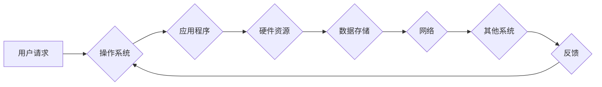

> IT基础资源、硬软件、运行流程、系统架构、计算机网络、操作系统、应用程序、数据存储、安全保障

## 1. 背景介绍

在当今数字化时代，信息技术 (IT) 基础资源已成为社会经济发展和个人生活的重要支柱。从个人电脑到大型数据中心，从互联网到云计算，IT基础资源的构建和运行支撑着我们生活的方方面面。 

理解IT基础资源的运行流程对于IT从业者、技术爱好者以及对数字技术感兴趣的每个人来说都至关重要。它不仅有助于我们更好地理解计算机系统是如何工作的，还能帮助我们更高效地利用IT资源，并为构建更安全、可靠、高效的IT系统提供理论基础。

## 2. 核心概念与联系

IT基础资源主要包括硬件资源和软件资源。

**2.1 硬件资源**

硬件资源是指计算机系统中可物理触及的设备，例如：

* **中央处理器 (CPU):** 计算机系统的核心，负责执行指令和处理数据。
* **内存 (RAM):** 用于临时存储正在运行的程序和数据，提供高速数据访问。
* **存储设备 (硬盘、固态硬盘):** 用于长期存储数据和程序，即使计算机关闭后数据也能保留。
* **输入/输出设备 (键盘、鼠标、显示器、网络接口卡):** 用于与用户和外部设备进行交互。

**2.2 软件资源**

软件资源是指计算机系统中运行的程序和数据，例如：

* **操作系统 (OS):** 管理计算机硬件资源，提供应用程序运行环境。
* **应用程序 (App):** 用于完成特定任务的软件，例如办公软件、游戏、浏览器等。
* **数据库:** 用于存储和管理大量数据。

**2.3 核心概念联系**

硬件资源和软件资源相互依赖，共同构成一个完整的IT系统。

* 软件资源运行在硬件资源之上，操作系统管理硬件资源，应用程序利用硬件资源执行任务。
* 硬件资源的性能直接影响软件资源的运行效率，例如CPU速度、内存容量等。
* 软件资源的合理配置和管理可以提高硬件资源的利用率。

**2.4 运行流程示意图**

## 3. 核心算法原理 & 具体操作步骤

### 3.1  算法原理概述

IT基础资源的运行流程涉及到许多算法，例如操作系统调度算法、数据存储算法、网络路由算法等。这些算法的目的是为了提高系统性能、效率和可靠性。

### 3.2  算法步骤详解

以操作系统调度算法为例，其核心目的是公平地分配CPU时间片给各个进程，确保每个进程都能得到执行机会。常见的调度算法包括：

* **先到先服务 (FCFS):** 按照进程到达时间顺序执行。
* **最短作业优先 (SJF):** 按照进程执行时间最短的顺序执行。
* **轮转调度 (Round Robin):** 给每个进程分配固定的时间片，轮流执行。

### 3.3  算法优缺点

不同的调度算法各有优缺点，需要根据实际情况选择合适的算法。例如，FCFS算法简单易实现，但容易出现饥饿现象；SJF算法可以提高系统吞吐量，但需要提前知道进程执行时间，难以实现；轮转调度算法可以保证每个进程都有执行机会，但时间片过短会导致上下文切换频繁，降低系统性能。

### 3.4  算法应用领域

调度算法不仅应用于操作系统，也应用于其他领域，例如：

* **云计算:** 分配虚拟机资源。
* **网络流量控制:** 控制网络流量，避免拥塞。
* **数据库查询优化:** 优化数据库查询语句执行顺序。

## 4. 数学模型和公式 & 详细讲解 & 举例说明

### 4.1  数学模型构建

IT基础资源的运行流程可以用数学模型来描述，例如：

* **CPU时间片分配模型:** 可以用队列理论来描述，分析不同调度算法的性能。
* **网络流量模型:** 可以用马尔可夫链来描述，分析网络流量的动态变化。

### 4.2  公式推导过程

例如，我们可以用公式来计算CPU时间片分配算法的平均等待时间：

$$
W = \frac{\sum_{i=1}^{n} w_i}{n}
$$

其中：

* $W$ 表示平均等待时间。
* $w_i$ 表示第 $i$ 个进程的等待时间。
* $n$ 表示进程总数。

### 4.3  案例分析与讲解

我们可以通过分析实际案例，验证数学模型的准确性，并进一步优化算法。例如，我们可以分析不同操作系统调度算法在不同负载下的性能表现，并根据分析结果调整算法参数，提高系统性能。

## 5. 项目实践：代码实例和详细解释说明

### 5.1  开发环境搭建

为了更好地理解IT基础资源的运行流程，我们可以通过项目实践来加深理解。例如，我们可以开发一个简单的操作系统模拟器，来模拟CPU调度、内存管理、文件系统等功能。

### 5.2  源代码详细实现

我们可以使用C语言或Python等编程语言来实现操作系统模拟器。代码实现需要考虑以下几个方面：

* **进程管理:** 模拟进程的创建、调度、执行和终止。
* **内存管理:** 模拟内存分配、释放和保护。
* **文件系统:** 模拟文件创建、读写和删除。

### 5.3  代码解读与分析

在代码实现过程中，我们需要仔细分析算法的实现细节，并理解代码是如何与硬件资源交互的。例如，我们需要了解CPU指令集、内存访问方式、文件系统结构等。

### 5.4  运行结果展示

通过运行操作系统模拟器，我们可以观察到进程的调度情况、内存分配情况、文件系统操作情况等，从而更深入地理解IT基础资源的运行流程。

## 6. 实际应用场景

IT基础资源的运行流程在实际应用场景中有着广泛的应用，例如：

* **云计算:** 云计算平台需要高效地管理虚拟机资源、网络资源和存储资源，保证用户能够按需获取资源，并实现资源的动态分配和释放。
* **大数据处理:** 大数据处理系统需要处理海量数据，需要高效的存储、计算和传输能力，以及可靠的容灾备份机制。
* **物联网:** 物联网设备需要实时收集和传输数据，需要低功耗、高可靠性和高安全性。

### 6.4  未来应用展望

随着技术的不断发展，IT基础资源的运行流程将更加智能化、自动化和虚拟化。例如：

* **人工智能:** 人工智能技术可以用于优化IT基础资源的配置和管理，提高系统性能和效率。
* **区块链:** 区块链技术可以用于保障IT基础资源的安全性和可靠性。
* **边缘计算:** 边缘计算技术可以将计算资源部署到更靠近数据源的位置，降低数据传输延迟，提高实时性。

## 7. 工具和资源推荐

### 7.1  学习资源推荐

* **书籍:** 《计算机系统：架构与实现》、《操作系统导论》
* **在线课程:** Coursera、edX、Udemy等平台提供有关操作系统、计算机网络、数据库等方面的课程。
* **博客和论坛:** 许多技术博客和论坛提供有关IT基础资源的讨论和分享。

### 7.2  开发工具推荐

* **虚拟机软件:** VMware、VirtualBox等软件可以用于模拟计算机系统环境。
* **调试工具:** GDB、LLDB等工具可以用于调试程序代码。
* **性能分析工具:** perf、top等工具可以用于分析系统性能。

### 7.3  相关论文推荐

* **操作系统调度算法:** 
    * "The Linux Scheduler"
    * "A Comparative Study of Scheduling Algorithms for Real-Time Systems"
* **网络流量模型:**
    * "A Survey of Network Traffic Modeling Techniques"
    * "Modeling and Analysis of Network Traffic"

## 8. 总结：未来发展趋势与挑战

### 8.1  研究成果总结

IT基础资源的运行流程研究取得了显著成果，例如：

* **操作系统调度算法:** 开发出多种高效的调度算法，提高了系统性能和资源利用率。
* **网络流量控制:** 开发出多种流量控制算法，避免网络拥塞，提高网络可靠性。
* **数据存储技术:** 开发出多种高效的数据存储技术，提高了数据存储容量和访问速度。

### 8.2  未来发展趋势

未来IT基础资源的运行流程研究将朝着以下方向发展：

* **智能化:** 利用人工智能技术，实现IT基础资源的智能配置、管理和优化。
* **自动化:** 利用自动化技术，实现IT基础资源的自动部署、维护和升级。
* **虚拟化:** 进一步发展虚拟化技术，实现IT基础资源的资源池化和弹性伸缩。

### 8.3  面临的挑战

IT基础资源的运行流程研究也面临着一些挑战：

* **复杂性:** IT基础资源的运行流程非常复杂，涉及多个层次和多个领域。
* **动态性:** IT基础资源的运行环境不断变化，需要不断更新和改进算法和模型。
* **安全性:** IT基础资源的安全问题日益突出，需要开发出更加安全的运行流程和防护机制。

### 8.4  研究展望

未来，我们将继续深入研究IT基础资源的运行流程，探索更智能、更自动化、更安全的运行模式，为数字经济发展提供坚实的技术支撑。

## 9. 附录：常见问题与解答

**常见问题:**

* **什么是IT基础资源？**
* **IT基础资源的运行流程有哪些？**
* **常见的IT基础资源调度算法有哪些？**
* **如何优化IT基础资源的运行效率？**

**解答:**

* IT基础资源是指计算机系统中可物理触及的设备和运行的程序，包括硬件资源和软件资源。
* IT基础资源的运行流程包括硬件资源的管理、软件资源的运行、数据存储和传输等环节。
* 常见的IT基础资源调度算法包括先到先服务、最短作业优先和轮转调度等。
* 优化IT基础资源的运行效率可以通过调整算法参数、优化硬件配置、合理分配资源等方式实现。

作者：禅与计算机程序设计艺术 / Zen and the Art of Computer Programming 
<end_of_turn>