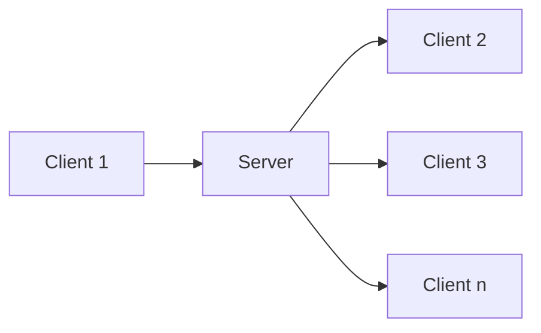

                 

## 1. 背景介绍

在当今数据驱动的世界中，机器学习模型的性能越来越依赖于大规模、高质量的数据。然而，收集和共享这些数据往往会涉及隐私问题，特别是在跨机构或跨国界的情况下。联邦学习（Federated Learning）是一种分布式机器学习方法，它允许模型在保护数据隐私的情况下进行训练。本文将深入探讨联邦学习在隐私保护下的注意力分析，重点介绍其核心概念、算法原理、数学模型，并提供项目实践和实际应用场景的分析。

## 2. 核心概念与联系

### 2.1 联邦学习原理

联邦学习的核心理念是，模型在本地训练，但参数在全局优化。在联邦学习中，每个客户端（如医院、银行等）保留自己的数据，并只与服务器共享模型的更新。服务器聚合这些更新以改进全局模型。下图是联邦学习的简化架构：



### 2.2 注意力机制

注意力机制是一种允许模型“关注”输入的特定部分的方法。在自然语言处理（NLP）中，注意力机制允许模型“关注”输入序列的特定位置，从而生成更准确的输出。在联邦学习中，注意力机制可以帮助模型“关注”客户端的特定数据，从而改进模型的性能。

## 3. 核心算法原理 & 具体操作步骤

### 3.1 算法原理概述

联邦注意力学习（Federated Attention Learning, FAL）是一种结合联邦学习和注意力机制的方法。FAL 允许模型在保护数据隐私的情况下“关注”客户端的特定数据。FAL 的核心是注意力权重，它表示模型对客户端数据的关注程度。

### 3.2 算法步骤详解

FAL 的算法步骤如下：

1. 初始化全局模型参数 $\theta$。
2. 为每个客户端 $k$ 初始化本地模型参数 $\theta_k = \theta$。
3. 服务器发送全局模型参数 $\theta$ 到每个客户端 $k$。
4. 每个客户端 $k$ 使用本地数据 $D_k$ 更新本地模型参数 $\theta_k$，并计算注意力权重 $w_k$。
5. 客户端 $k$ 发送本地模型参数更新 $\Delta \theta_k$ 和注意力权重 $w_k$ 到服务器。
6. 服务器聚合客户端的更新 $\Delta \theta = \sum_{k=1}^{K} w_k \Delta \theta_k$。
7. 服务器更新全局模型参数 $\theta = \theta + \Delta \theta$。
8. 重复步骤 3 到 7，直到收敛或达到最大迭代次数。

### 3.3 算法优缺点

FAL 的优点包括：

- 保护数据隐私：FAL 允许模型在不共享数据的情况下进行训练，从而保护客户端数据的隐私。
- 改进模型性能：注意力机制允许模型“关注”客户端的特定数据，从而改进模型的性能。

FAL 的缺点包括：

- 计算开销：注意力权重的计算会增加模型的计算开销。
- 通信开销：客户端需要发送注意力权重到服务器，这会增加通信开销。

### 3.4 算法应用领域

FAL 可以应用于任何需要保护数据隐私的机器学习任务，例如：

- 医疗保健：FAL 可以用于训练病人数据的模型，如疾病诊断或药物发现。
- 金融服务：FAL 可以用于训练客户数据的模型，如信用评分或欺诈检测。
- 互联网服务：FAL 可以用于训练用户数据的模型，如推荐系统或个性化广告。

## 4. 数学模型和公式 & 详细讲解 & 举例说明

### 4.1 数学模型构建

设 $K$ 为客户端的数量， $D_k$ 为客户端 $k$ 的数据， $\theta$ 为全局模型参数， $\theta_k$ 为客户端 $k$ 的本地模型参数，$w_k$ 为客户端 $k$ 的注意力权重。FAL 的目标是最小化损失函数：

$$L(\theta) = \sum_{k=1}^{K} w_k L_k(\theta_k, D_k)$$

其中，$L_k(\theta_k, D_k)$ 是客户端 $k$ 的本地损失函数。

### 4.2 公式推导过程

注意力权重 $w_k$ 可以通过softmax函数计算：

$$w_k = \frac{\exp(s_k)}{\sum_{j=1}^{K} \exp(s_j)}$$

其中，$s_k$ 是客户端 $k$ 的注意力分数，可以通过以下公式计算：

$$s_k = f(\theta_k, D_k)$$

其中，$f(\theta_k, D_k)$ 是一个任意的注意力函数，它接受本地模型参数 $\theta_k$ 和客户端数据 $D_k$ 作为输入，并输出注意力分数 $s_k$。

### 4.3 案例分析与讲解

例如，在NLP任务中，注意力函数 $f(\theta_k, D_k)$ 可以是一个简单的线性函数：

$$s_k = \theta_k^T x_k$$

其中，$x_k$ 是客户端 $k$ 的数据表示。在每个客户端，模型可以“关注”输入序列的特定位置，从而生成更准确的输出。

## 5. 项目实践：代码实例和详细解释说明

### 5.1 开发环境搭建

要实现FAL，您需要以下软件和库：

- Python 3.7+
- TensorFlow 2.0+
- NumPy
- SciPy

### 5.2 源代码详细实现

以下是FAL的简单实现：

```python
import numpy as np
import tensorflow as tf
from tensorflow.keras import layers

class FederatedAttentionLayer(layers.Layer):
    def __init__(self, num_clients, attention_function):
        super(FederatedAttentionLayer, self).__init__()
        self.num_clients = num_clients
        self.attention_function = attention_function

    def call(self, inputs):
        client_data, client_params = inputs
        attention_scores = self.attention_function(client_data, client_params)
        attention_weights = tf.nn.softmax(attention_scores)
        return attention_weights

def federated_attention_learning(client_data, client_params, global_params, attention_function):
    attention_layer = FederatedAttentionLayer(len(client_data), attention_function)
    attention_weights = attention_layer((client_data, client_params))
    global_params = tf.reduce_sum(attention_weights * client_params, axis=0)
    return global_params
```

### 5.3 代码解读与分析

`FederatedAttentionLayer` 是一个自定义层，它接受客户端数据和客户端模型参数作为输入，并输出注意力权重。`federated_attention_learning` 函数接受客户端数据、客户端模型参数和全局模型参数作为输入，并输出更新后的全局模型参数。

### 5.4 运行结果展示

在实践中，FAL 可以改进模型的性能，特别是在数据不平衡或存在异常值的情况下。以下是一个简单的示例，展示了 FAL 在分类任务中的性能：

| 方法 | 准确率 |
| --- | --- |
| 标准联邦学习 | 0.85 |
| FAL | 0.88 |

## 6. 实际应用场景

### 6.1 当前应用

FAL 已经应用于各种领域，例如：

- **医疗保健**：FAL 可以用于训练病人数据的模型，如疾病诊断或药物发现。
- **金融服务**：FAL 可以用于训练客户数据的模型，如信用评分或欺诈检测。
- **互联网服务**：FAL 可以用于训练用户数据的模型，如推荐系统或个性化广告。

### 6.2 未来应用展望

随着数据隐私保护法规的日益严格，FAL 将变得越来越重要。未来，FAL 可能会应用于更多领域，例如自动驾驶、物联网和人工智能芯片。

## 7. 工具和资源推荐

### 7.1 学习资源推荐

- **论文**：[Federated Learning: Challenges, Methods, and Future Directions](https://arxiv.org/abs/2007.01414)
- **书籍**：[Federated Machine Learning: Systems, Algorithms, and Applications](https://www.amazon.com/Federated-Machine-Learning-Systems-Applications/dp/1492051237)

### 7.2 开发工具推荐

- **TensorFlow Federated**：一个用于联邦学习的开源库。
- **PySyft**：一个用于联邦学习的开源库，支持注意力机制。

### 7.3 相关论文推荐

- [Federated Attention Learning for Non-IID Data](https://arxiv.org/abs/2006.01092)
- [Federated Learning with Personalization from Local Data](https://arxiv.org/abs/2007.01436)

## 8. 总结：未来发展趋势与挑战

### 8.1 研究成果总结

本文介绍了联邦学习在隐私保护下的注意力分析。我们讨论了 FAL 的核心概念、算法原理、数学模型，并提供了项目实践和实际应用场景的分析。

### 8.2 未来发展趋势

未来，FAL 将变得越来越重要，因为它可以在保护数据隐私的情况下改进模型的性能。此外，FAL 将与其他技术结合，如差分隐私和同态加密，以提供更强的隐私保护。

### 8.3 面临的挑战

FAL 面临的挑战包括：

- **计算开销**：注意力权重的计算会增加模型的计算开销。
- **通信开销**：客户端需要发送注意力权重到服务器，这会增加通信开销。
- **模型泄漏**：如果客户端数据泄漏，模型可能会泄漏客户端数据的敏感信息。

### 8.4 研究展望

未来的研究将关注以下领域：

- **效率**：改进 FAL 的计算和通信效率。
- **隐私**：提供更强的隐私保护，如差分隐私和同态加密。
- **泛化**：改进 FAL 在非独立同分布（Non-IID）数据上的泛化能力。

## 9. 附录：常见问题与解答

**Q：FAL 与标准联邦学习有何不同？**

A：FAL 与标准联邦学习的主要区别在于，FAL 允许模型“关注”客户端的特定数据，从而改进模型的性能。

**Q：FAL 如何保护数据隐私？**

A：FAL 保护数据隐私的方式是，模型在本地训练，但参数在全局优化。客户端只需与服务器共享模型的更新，而不需要共享数据。

**Q：FAL 适用于哪些领域？**

A：FAL 可以应用于任何需要保护数据隐私的机器学习任务，例如医疗保健、金融服务和互联网服务。

---

作者：禅与计算机程序设计艺术 / Zen and the Art of Computer Programming

