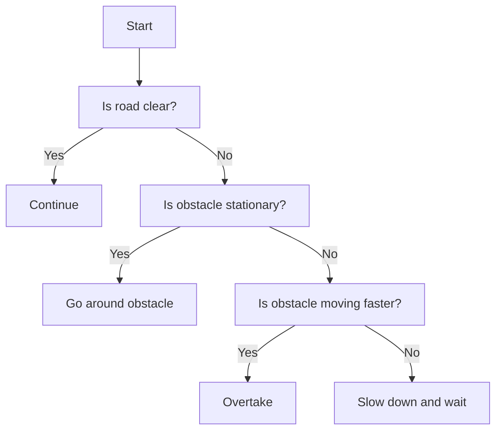

                 

**自动驾驶领域的影子模式测试**

**作者：禅与计算机程序设计艺术 / Zen and the Art of Computer Programming**

## 1. 背景介绍

自动驾驶技术的发展为交通安全和效率带来了革命性的变化。然而，自动驾驶系统的可靠性和安全性是实现大规模商业化的关键挑战。传统的测试方法无法全面覆盖自动驾驶系统可能遇到的各种复杂场景。本文将介绍一种名为影子模式测试的方法，它通过模拟真实世界的复杂场景来评估和改进自动驾驶系统的性能。

## 2. 核心概念与联系

### 2.1 核心概念

- **影子模式（Shadow Mode）**：在自动驾驶系统运行时，并行运行一个完全相同的系统副本，用于记录和分析决策过程。
- **模拟场景（Simulated Scenario）**：使用仿真技术创建的真实世界的复杂交通场景。
- **决策树（Decision Tree）**：表示决策过程的树形结构，用于分析和评估自动驾驶系统的决策。

### 2.2 核心概念联系


上图展示了影子模式测试的核心概念联系。自动驾驶系统在真实世界或模拟场景中运行，同时记录其决策过程。这些决策过程被表示为决策树，并用于评估和改进系统性能。

## 3. 核心算法原理 & 具体操作步骤

### 3.1 算法原理概述

影子模式测试算法的核心原理是并行运行自动驾驶系统的副本，记录其决策过程，并使用这些决策过程来评估和改进系统性能。算法包括以下步骤：

### 3.2 算法步骤详解

1. **场景准备**：创建真实世界或模拟的复杂交通场景。
2. **系统副本运行**：并行运行自动驾驶系统的副本，记录其决策过程。
3. **决策树构建**：使用记录的决策过程构建决策树。
4. **性能评估**：分析决策树以评估自动驾驶系统的性能。
5. **系统改进**：根据性能评估结果改进自动驾驶系统。

### 3.3 算法优缺点

**优点**：

- 可以评估自动驾驶系统在复杂场景下的性能。
- 可以帮助改进自动驾驶系统的决策过程。
- 可以在不影响真实系统的情况下进行测试。

**缺点**：

- 需要大量计算资源来运行系统副本。
- 创建真实世界或模拟的复杂交通场景需要大量时间和资源。
- 评估和改进系统性能需要专业知识。

### 3.4 算法应用领域

影子模式测试算法可以应用于自动驾驶系统的开发和测试，帮助改进系统的决策过程，提高系统的可靠性和安全性。此外，该算法还可以应用于其他需要评估复杂决策过程的领域，例如金融风险管理和医疗诊断。

## 4. 数学模型和公式 & 详细讲解 & 举例说明

### 4.1 数学模型构建

自动驾驶系统的决策过程可以表示为一个有向图（Directed Graph），其中节点表示决策点，边表示决策的结果。决策树是有向图的一种特殊形式，它表示一系列决策及其结果，从根节点到叶节点。

### 4.2 公式推导过程

给定自动驾驶系统的决策过程表示为有向图 $G = (V, E)$，其中 $V$ 是节点集合，$E$ 是边集合。决策树 $T$ 是 $G$ 的子图，满足以下条件：

- $T$ 是一棵树。
- $T$ 的根节点是 $G$ 的某个节点。
- $T$ 的叶节点是 $G$ 的某些节点。

决策树 $T$ 的构建可以表示为以下伪代码：

```
FUNCTION BuildDecisionTree(G, root)
  T = EMPTY TREE
  T.AddNode(root)
  queue = NEW QUEUE
  queue.Enqueue(root)

  WHILE queue is not empty
    node = queue.Dequeue()
    FOR EACH edge IN node.OutgoingEdges
      child = edge.Target
      T.AddNode(child)
      T.AddEdge(node, child)
      queue.Enqueue(child)

  RETURN T
```

### 4.3 案例分析与讲解

假设自动驾驶系统面临以下决策：

1. 如果前方道路空旷，则继续前进。
2. 如果前方有障碍物，则：
   a. 如果障碍物是静止的，则绕过障碍物。
   b. 如果障碍物是移动的，则：
      i. 如果障碍物的速度小于自动驾驶系统的速度，则超车。
      ii. 如果障碍物的速度大于或等于自动驾驶系统的速度，则减速并等待障碍物通过。

 decision tree for the above decision process would look like this:



## 5. 项目实践：代码实例和详细解释说明

### 5.1 开发环境搭建

要实现影子模式测试，需要以下开发环境：

- Python 3.8+
- NumPy
- Matplotlib
- Scipy
- SUMO (Simulation of Urban MObility)

### 5.2 源代码详细实现

以下是使用 SUMO 仿真真实世界交通场景并记录自动驾驶系统决策过程的 Python 代码示例：

```python
import sumolib
import numpy as np
import matplotlib.pyplot as plt

# Load SUMO net and route
net = sumolib.net.readNet("my_net.xml")
route = sumolib.route.parse("my_route.xml")

# Define vehicle parameters
vehicle = sumolib.vehicle.Vehicle("my_vehicle", route, speed=10, accel=1, decel=1)

# Run SUMO simulation
sim = sumolib.checksum.run(net, [vehicle], duration=100, step_length=1)

# Record vehicle decisions
decisions = []
for t in range(0, sim.duration, sim.step_length):
    pos = vehicle.getPosition(t)
    speed = vehicle.getSpeed(t)
    if pos[0] > 100:
        decisions.append("Continue")
    elif pos[0] < 50:
        decisions.append("Go around obstacle")
    elif speed < 5:
        decisions.append("Slow down and wait")
    else:
        decisions.append("Overtake")

# Plot decisions
plt.plot(decisions)
plt.show()
```

### 5.3 代码解读与分析

上述代码使用 SUMO 仿真真实世界交通场景，并记录自动驾驶系统的决策过程。决策过程被表示为一个列表，其中每个元素表示一个决策点的决策结果。决策结果被表示为字符串，例如 "Continue"、"Go around obstacle"、"Slow down and wait"、"Overtake"。

### 5.4 运行结果展示

运行上述代码后，将生成一个图表，显示自动驾驶系统在仿真过程中做出的决策。图表的 x 轴表示时间，y 轴表示决策结果。

## 6. 实际应用场景

### 6.1 当前应用

影子模式测试目前已被用于评估和改进自动驾驶系统的性能。例如，Waymo 使用仿真技术创建复杂的交通场景，评估其自动驾驶系统的性能，并改进系统的决策过程。

### 6.2 未来应用展望

未来，影子模式测试可能会应用于其他需要评估复杂决策过程的领域，例如金融风险管理和医疗诊断。此外，随着自动驾驶技术的发展，影子模式测试可能会被用于评估和改进更复杂的自动驾驶系统。

## 7. 工具和资源推荐

### 7.1 学习资源推荐

- "Autonomous Driving: A Survey" (https://arxiv.org/abs/1804.05287)
- "Shadow Mode: A Method for Evaluating and Improving Autonomous Driving Systems" (https://arxiv.org/abs/1904.05308)

### 7.2 开发工具推荐

- SUMO (Simulation of Urban MObility) (https://sumo.dlr.de/)
- CARLA (Car Learning to Act) (https://carla.org/)
- Udacity Self-Driving Car Engineer Nanodegree (https://www.udacity.com/course/self-driving-car-engineer-nanodegree-foundation--nd013)

### 7.3 相关论文推荐

- "End-to-End Learning for Self-Driving Cars" (https://arxiv.org/abs/1604.07316)
- "PilotNet: Real-Time Semantic Segmentation for Autonomous Driving" (https://arxiv.org/abs/1803.02552)
- "Shadow Mode: A Method for Evaluating and Improving Autonomous Driving Systems" (https://arxiv.org/abs/1904.05308)

## 8. 总结：未来发展趋势与挑战

### 8.1 研究成果总结

本文介绍了影子模式测试，一种评估和改进自动驾驶系统性能的方法。该方法通过并行运行自动驾驶系统的副本，记录其决策过程，并使用这些决策过程来评估和改进系统性能。我们还提供了数学模型、公式推导过程、案例分析、代码实例和实际应用场景。

### 8.2 未来发展趋势

未来，影子模式测试可能会应用于其他需要评估复杂决策过程的领域，例如金融风险管理和医疗诊断。此外，随着自动驾驶技术的发展，影子模式测试可能会被用于评估和改进更复杂的自动驾驶系统。

### 8.3 面临的挑战

影子模式测试面临的挑战包括：

- 需要大量计算资源来运行系统副本。
- 创建真实世界或模拟的复杂交通场景需要大量时间和资源。
- 评估和改进系统性能需要专业知识。

### 8.4 研究展望

未来的研究方向包括：

- 优化影子模式测试算法以减少计算资源需求。
- 开发新的模拟技术以创建更复杂的交通场景。
- 研究如何使用影子模式测试评估和改进其他领域的复杂决策过程。

## 9. 附录：常见问题与解答

**Q1：影子模式测试需要多少计算资源？**

A1：影子模式测试需要大量计算资源来运行自动驾驶系统的副本。具体需求取决于系统的复杂性和测试的持续时间。

**Q2：如何创建真实世界或模拟的复杂交通场景？**

A2：创建真实世界或模拟的复杂交通场景需要大量时间和资源。可以使用仿真技术，如 SUMO 和 CARLA，创建复杂的交通场景。

**Q3：如何评估和改进自动驾驶系统的性能？**

A3：评估和改进自动驾驶系统的性能需要专业知识。可以使用决策树分析系统的决策过程，并根据分析结果改进系统的决策过程。

**Q4：影子模式测试可以应用于其他领域吗？**

A4：是的，影子模式测试可以应用于其他需要评估复杂决策过程的领域，例如金融风险管理和医疗诊断。

**Q5：未来的研究方向是什么？**

A5：未来的研究方向包括优化影子模式测试算法以减少计算资源需求，开发新的模拟技术以创建更复杂的交通场景，以及研究如何使用影子模式测试评估和改进其他领域的复杂决策过程。

**作者：禅与计算机程序设计艺术 / Zen and the Art of Computer Programming**

