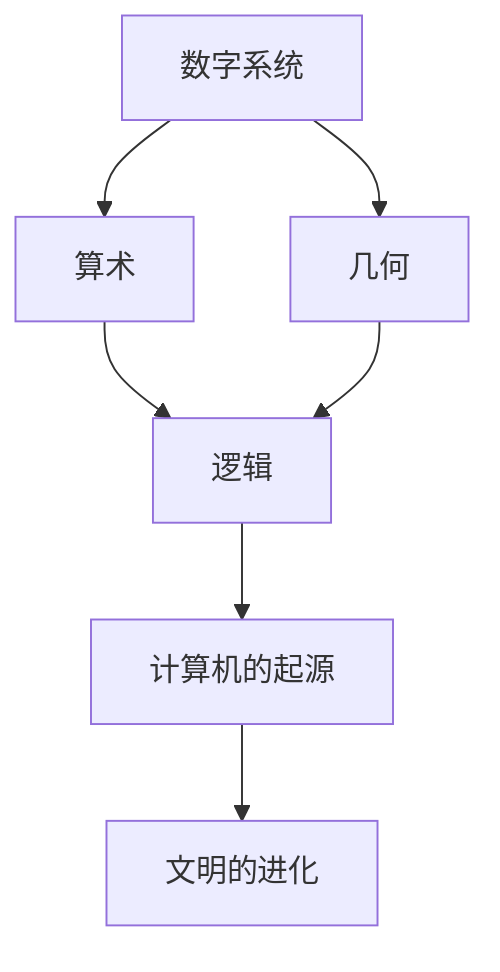

                 

数字系统、算术、几何、逻辑、计算机的起源、文明的进化

## 1. 背景介绍

在人类文明的早期，我们的祖先面临着一个困惑：如何描述和理解世界？这个问题的答案导致了数字系统、算术、几何和逻辑的诞生，最终引发了计算机的起源。本章将探讨这些概念的起源，并展示它们如何在文明古国中发展。

## 2. 核心概念与联系

### 2.1 数字系统

数字系统是计算的基础。最早的数字系统可以追溯到公元前3000年，在美索不达米亚和古埃及使用的符号表示法。这些系统使用了不同的符号来表示不同的数值，并使用加法和减法进行运算。

### 2.2 算术

算术是数字系统的扩展，它允许进行乘法和除法运算。算术的起源可以追溯到公元前1700年，在美索不达米亚使用的性质系统。这个系统使用了60进制，并发展了乘法和除法的概念。

### 2.3 几何

几何是对空间关系的研究。它的起源可以追溯到公元前3000年，在古埃及和美索不达米亚使用的测量系统。几何学发展了对角度、距离和面积的理解，并为数学和计算机图形学奠定了基础。

### 2.4 逻辑

逻辑是推理的科学。它的起源可以追溯到公元前400年，在古希腊哲学家如亚里士多德的著作中。逻辑发展了推理的规则，并为计算机科学中的逻辑门和逻辑电路奠定了基础。

### 2.5 计算机的起源

计算机的起源可以追溯到公元前100年，在古罗马使用的计算器。这些计算器使用了齿轮和杠杆来进行算术运算。随着工业革命的到来，计算机的发展加速了，最终导致了现代计算机的诞生。

### 2.6 文明的进化

文明的进化与计算的发展密切相关。随着文明的发展，我们对世界的理解也在不断深化，这导致了数字系统、算术、几何和逻辑的发展，最终引发了计算机的起源。



## 3. 核心算法原理 & 具体操作步骤

### 3.1 算法原理概述

算法是计算的核心。算法是一系列明确的指令，用于在有限时间内解决特定问题。算法的原理是基于数字系统、算术、几何和逻辑的。

### 3.2 算法步骤详解

算法的步骤包括：

1. 输入：算法接受输入数据。
2. 初始化：算法初始化变量和数据结构。
3. 处理：算法处理输入数据，执行一系列操作。
4. 输出：算法输出结果。

### 3.3 算法优缺点

算法的优点包括：

* 可重复性：算法可以重复执行，并产生相同的结果。
* 可靠性：算法可以在不同的环境中运行，并产生相同的结果。
* 可扩展性：算法可以扩展到更大的数据集。

算法的缺点包括：

* 复杂性：算法可能很复杂，难以理解和维护。
* 时间和空间开销：算法可能需要大量的时间和空间资源。

### 3.4 算法应用领域

算法应用于各种领域，包括：

* 计算机科学：算法用于设计和实现计算机程序。
* 数学：算法用于解决数学问题。
* 物理：算法用于模拟物理现象。
* 生物信息学：算法用于分析生物数据。

## 4. 数学模型和公式 & 详细讲解 & 举例说明

### 4.1 数学模型构建

数学模型是计算的基础。数学模型描述了世界的数学关系。数学模型的构建包括：

1. 识别问题：识别需要解决的问题。
2. 定义变量：定义模型的变量。
3. 定义关系：定义变量之间的关系。

### 4.2 公式推导过程

公式是数学模型的表示。公式的推导过程包括：

1. 定义符号：定义公式中的符号。
2. 定义关系：定义符号之间的关系。
3. 简化公式：简化公式，使其更易于理解。

例如， Consider the quadratic equation $ax^2 + bx + c = 0$. The solutions to this equation can be found using the quadratic formula:

$$x = \frac{-b \pm \sqrt{b^2 - 4ac}}{2a}$$

### 4.3 案例分析与讲解

数学模型和公式可以应用于各种领域。例如，在计算机图形学中，数学模型和公式用于描述几何形状和变换。在金融领域，数学模型和公式用于预测风险和回报。

## 5. 项目实践：代码实例和详细解释说明

### 5.1 开发环境搭建

要实现算法，需要一个开发环境。推荐使用Python，因为它简单易用，并具有丰富的库和工具。

### 5.2 源代码详细实现

以下是一个简单的算法实现，用于计算斐波那契数列：

```python
def fibonacci(n):
    if n <= 0:
        return 0
    elif n == 1:
        return 1
    else:
        return fibonacci(n-1) + fibonacci(n-2)
```

### 5.3 代码解读与分析

这个算法使用递归来计算斐波那契数列。它接受一个整数`n`作为输入，并返回斐波那契数列的第`n`项。如果`n`小于或等于0，则返回0。如果`n`等于1，则返回1。否则，它递归地计算斐波那契数列的前两项，并将它们相加。

### 5.4 运行结果展示

以下是运行这个算法的结果：

```
>>> fibonacci(10)
55
```

## 6. 实际应用场景

算法在各种实际应用场景中使用。例如：

* 搜索算法：用于搜索数据库中的数据。
* 排序算法：用于排序数据集。
* 图算法：用于分析图形数据。

### 6.4 未来应用展望

未来，算法将继续发展，以适应新的应用领域。例如，深度学习算法将继续发展，以改进图像和语音识别。量子计算算法将继续发展，以解决目前无法解决的问题。

## 7. 工具和资源推荐

### 7.1 学习资源推荐

推荐以下资源学习算法：

* 书籍：
	+ "算法导论"（Thomas H. Cormen, Charles E. Leiserson, Ronald L. Rivest, and Clifford Stein）
	+ "计算机程序设计艺术"（Donald E. Knuth）
* 在线课程：
	+ Coursera上的"算法"课程（Princeton University）
	+ edX上的"计算机科学导论"课程（Harvard University）

### 7.2 开发工具推荐

推荐以下工具用于算法开发：

* Python：一个简单易用的编程语言，具有丰富的库和工具。
* Visual Studio Code：一个功能强大的集成开发环境（IDE），支持Python和其他语言。
* Jupyter Notebook：一个交互式笔记本，用于开发和展示算法。

### 7.3 相关论文推荐

推荐以下论文学习算法：

* "大O符号"（C. P. Schnorr and A. J. W. Stearns）
* "NP-完全性"（Stephen A. Cook）
* "图算法"（Thomas H. Cormen, Charles E. Leiserson, Ronald L. Rivest, and Clifford Stein）

## 8. 总结：未来发展趋势与挑战

### 8.1 研究成果总结

本章总结了数字系统、算术、几何、逻辑和计算机的起源。我们看到，这些概念如何在文明古国中发展，并如何导致了算法和数学模型的诞生。

### 8.2 未来发展趋势

未来，计算将继续发展，以适应新的应用领域。我们将看到新的算法和数学模型的发展，以解决目前无法解决的问题。

### 8.3 面临的挑战

未来，计算面临着几个挑战：

* 复杂性：算法和数学模型可能很复杂，难以理解和维护。
* 时间和空间开销：算法和数学模型可能需要大量的时间和空间资源。
* 算法偏见：算法可能会导致偏见，如果它们没有考虑到所有可能的情况。

### 8.4 研究展望

未来，计算的研究将继续关注这些挑战。我们将看到新的算法和数学模型的发展，以提高计算的可靠性、可扩展性和效率。

## 9. 附录：常见问题与解答

**Q：什么是算法？**

A：算法是一系列明确的指令，用于在有限时间内解决特定问题。

**Q：什么是数学模型？**

A：数学模型是计算的基础。数学模型描述了世界的数学关系。

**Q：什么是计算机的起源？**

A：计算机的起源可以追溯到公元前100年，在古罗马使用的计算器。这些计算器使用了齿轮和杠杆来进行算术运算。

## 作者：禅与计算机程序设计艺术 / Zen and the Art of Computer Programming

