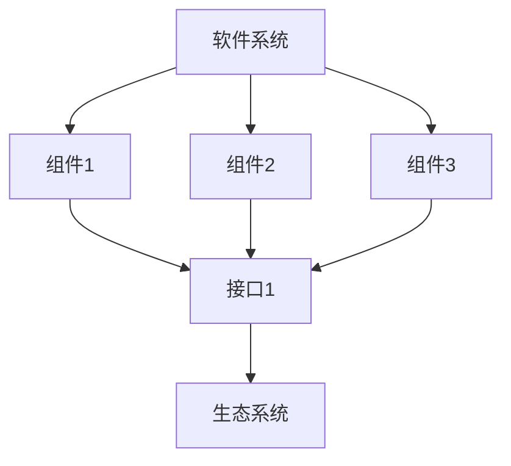

                 

## 1. 背景介绍

在当今快速发展的软件行业，软件系统的规模和复杂性与日俱增。传统的软件开发方法已经无法满足现代软件系统的需求。因此，出现了软件2.0的概念，旨在通过将复杂程序移植其中，提高软件系统的可维护性、可扩展性和可靠性。本文将深入探讨软件2.0的优势，并提供实践指南，帮助读者理解如何将复杂程序移植其中。

## 2. 核心概念与联系

软件2.0的核心概念是将软件系统视为一个生态系统，其中各个组件通过清晰定义的接口相互协作。这种生态系统的设计理念源于生物生态系统的复杂性和稳定性。软件2.0生态系统的架构如下图所示：



在软件2.0生态系统中，每个组件都提供清晰定义的接口，允许其他组件与其交互。这种设计模式鼓励组件的松耦合和高内聚，从而提高软件系统的可维护性和可扩展性。

## 3. 核心算法原理 & 具体操作步骤

### 3.1 算法原理概述

软件2.0生态系统的核心算法是组件间通信协议。该协议定义了组件如何通过接口相互通信，并确保系统的稳定性和可靠性。该算法基于发布-订阅模式，其中组件发布消息，其他组件订阅这些消息。

### 3.2 算法步骤详解

1. 组件发布消息：组件通过接口发布消息，通知其他组件其状态或事件。
2. 组件订阅消息：其他组件订阅消息，以接收发布的消息。
3. 消息路由：消息路由器接收发布的消息，并将其传递给订阅了该消息的组件。
4. 消息处理：订阅了消息的组件接收消息，并根据消息内容执行相应的操作。

### 3.3 算法优缺点

优点：

* 提高了系统的可维护性，因为组件之间的依赖关系清晰明确。
* 提高了系统的可扩展性，因为新组件可以轻松集成到系统中。
* 提高了系统的可靠性，因为消息路由器可以确保消息传递的可靠性。

缺点：

* 设计和实现发布-订阅模式需要额外的开发工作。
* 系统的性能可能会受到消息路由的影响。

### 3.4 算法应用领域

软件2.0生态系统的核心算法适用于任何需要松耦合组件协作的软件系统，例如：

* 微服务架构
* 物联网系统
* 实时通信系统

## 4. 数学模型和公式 & 详细讲解 & 举例说明

### 4.1 数学模型构建

软件2.0生态系统的数学模型可以表示为有向图 $G = (V, E)$，其中：

* $V$ 是组件集合
* $E$ 是消息路由集合

### 4.2 公式推导过程

组件 $v_i$ 发布消息 $m_j$ 的概率可以表示为：

$$P(m_j | v_i) = \frac{1}{Z} \exp(-E_{ij})$$

其中，$Z$ 是归一化常数，$E_{ij}$ 是消息路由能量，表示消息从组件 $v_i$ 传递到组件 $v_j$ 的成本。消息路由能量可以表示为：

$$E_{ij} = d_{ij} + \alpha \cdot (1 - s_{ij})$$

其中，$d_{ij}$ 是组件 $v_i$ 到组件 $v_j$ 的距离，$s_{ij}$ 是组件 $v_i$ 和组件 $v_j$ 之间的相似度，$\alpha$ 是权重参数。

### 4.3 案例分析与讲解

假设我们有三个组件 $v_1$, $v_2$, $v_3$, 它们的位置分别为 $(1, 2)$, $(3, 4)$, $(5, 6)$。组件 $v_1$ 发布消息 $m_1$, 组件 $v_2$ 和组件 $v_3$ 订阅了消息 $m_1$. 我们设置 $\alpha = 1$, 则消息路由能量为：

* $E_{12} = \sqrt{(3-1)^2 + (4-2)^2} + 1 \cdot (1 - \frac{(1, 2) \cdot (3, 4)}{\|(1, 2)\| \|(3, 4)\|}) = 3.16$
* $E_{13} = \sqrt{(5-1)^2 + (6-2)^2} + 1 \cdot (1 - \frac{(1, 2) \cdot (5, 6)}{\|(1, 2)\| \|(5, 6)\|}) = 7.21$

根据消息路由能量，$E_{12} < E_{13}$, 因此消息 $m_1$ 将被路由到组件 $v_2$.

## 5. 项目实践：代码实例和详细解释说明

### 5.1 开发环境搭建

我们将使用 Python 和 RabbitMQ 实现软件2.0生态系统的核心算法。首先，我们需要安装 RabbitMQ 和 Pika 库：

```bash
pip install pika
```

### 5.2 源代码详细实现

以下是发布-订阅模式的 Python 实现：

```python
import pika

# 发布消息
def publish_message(channel, message):
    channel.basic_publish(exchange='', routing_key='', body=message)

# 订阅消息
def callback(ch, method, properties, body):
    print(" [x] Received %r" % body)

# 连接 RabbitMQ
connection = pika.BlockingConnection(pika.ConnectionParameters(host='localhost'))
channel = connection.channel()

# 创建队列
channel.queue_declare(queue='task_queue', durable=True)

# 发布消息
publish_message(channel, "Hello, World!")

# 订阅消息
channel.basic_consume(queue='task_queue', on_message_callback=callback, auto_ack=True)

# 开始消息循环
channel.start_consuming()
```

### 5.3 代码解读与分析

在上述代码中，我们首先连接到 RabbitMQ 服务器，然后创建一个队列。发布消息时，我们调用 `publish_message` 函数，将消息发布到队列中。订阅消息时，我们调用 `basic_consume` 函数，指定回调函数 `callback`，当消息到达时，回调函数会被调用。

### 5.4 运行结果展示

当我们运行上述代码时，我们应该看到以下输出：

```
 [x] Received 'Hello, World!'
```

## 6. 实际应用场景

软件2.0生态系统的核心算法可以应用于各种实际应用场景，例如：

* 物联网系统：各种物联网设备可以作为组件，通过发布-订阅模式相互通信。
* 实时通信系统：实时通信系统可以使用发布-订阅模式，允许用户订阅特定类型的消息。
* 微服务架构：微服务可以作为组件，通过发布-订阅模式相互协作。

### 6.4 未来应用展望

随着软件系统规模和复杂性的不断增加，软件2.0生态系统的核心算法将变得越来越重要。未来，我们可以期待看到更多基于软件2.0生态系统的应用，从而提高软件系统的可维护性、可扩展性和可靠性。

## 7. 工具和资源推荐

### 7.1 学习资源推荐

* "Designing Software Architectures" by Mark Richards and Neal Ford
* "Building Evolutionary Architectures" by Neal Ford, Rebecca Parsons, and Patrick Kua

### 7.2 开发工具推荐

* RabbitMQ：消息代理软件
* Pika：Python 的 RabbitMQ 客户端库

### 7.3 相关论文推荐

* "The Architecture of Open Source Applications" by Amy Brown and Greg Wilson
* "Software Architecture for Large-Scale Systems" by Simon Brown

## 8. 总结：未来发展趋势与挑战

### 8.1 研究成果总结

本文介绍了软件2.0生态系统的核心概念、算法原理、数学模型和实践指南。我们展示了如何使用发布-订阅模式实现软件2.0生态系统的核心算法，并提供了 Python 和 RabbitMQ 的实现示例。

### 8.2 未来发展趋势

未来，软件2.0生态系统的核心算法将变得越来越重要，因为软件系统的规模和复杂性不断增加。我们可以期待看到更多基于软件2.0生态系统的应用，从而提高软件系统的可维护性、可扩展性和可靠性。

### 8.3 面临的挑战

然而，软件2.0生态系统的核心算法也面临着挑战。设计和实现发布-订阅模式需要额外的开发工作，系统的性能可能会受到消息路由的影响。此外，软件2.0生态系统的数学模型需要进一步研究，以提高其准确性和有效性。

### 8.4 研究展望

未来的研究将关注软件2.0生态系统的数学模型和算法优化。我们将研究如何提高消息路由的效率，如何设计更复杂的发布-订阅模式，如何提高软件2.0生态系统的可靠性和安全性。

## 9. 附录：常见问题与解答

**Q：软件2.0生态系统的核心算法适用于哪些应用场景？**

A：软件2.0生态系统的核心算法适用于任何需要松耦合组件协作的软件系统，例如微服务架构、物联网系统和实时通信系统。

**Q：软件2.0生态系统的核心算法有哪些优缺点？**

A：软件2.0生态系统的核心算法的优点包括提高了系统的可维护性、可扩展性和可靠性。缺点包括设计和实现发布-订阅模式需要额外的开发工作，系统的性能可能会受到消息路由的影响。

**Q：软件2.0生态系统的核心算法如何与其他软件架构相比？**

A：与传统的软件架构相比，软件2.0生态系统的核心算法鼓励组件的松耦合和高内聚，从而提高软件系统的可维护性和可扩展性。与微服务架构相比，软件2.0生态系统的核心算法提供了更清晰的组件间通信机制。

## 作者：禅与计算机程序设计艺术 / Zen and the Art of Computer Programming

