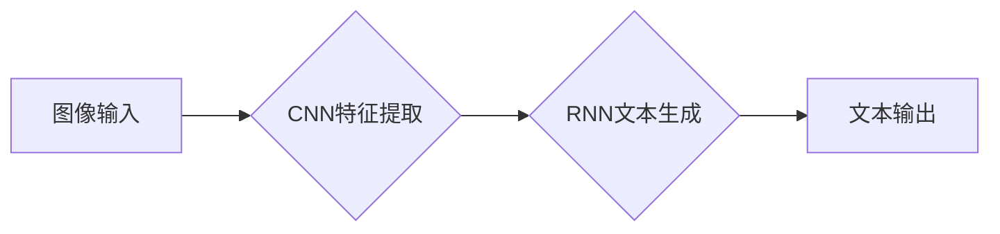

> 图像字幕生成，计算机视觉，深度学习，卷积神经网络，循环神经网络，Transformer，自然语言处理，图像识别

## 1. 背景介绍

图像字幕生成（Image Captioning）是计算机视觉和自然语言处理（NLP）交叉领域的重要研究方向，旨在自动为图像生成描述性文本。这项技术在自动图像描述、图像搜索、辅助视觉障碍人士等方面具有广泛的应用前景。

随着深度学习技术的快速发展，图像字幕生成取得了显著进展。传统的图像字幕生成方法主要依赖于手工设计的特征提取和规则匹配，效率低且难以捕捉图像的复杂语义信息。而深度学习方法则能够自动学习图像和文本之间的映射关系，生成更准确、更自然、更丰富的图像描述。

## 2. 核心概念与联系

图像字幕生成系统通常由两个主要模块组成：图像特征提取模块和文本生成模块。

**2.1 图像特征提取模块**

该模块负责从图像中提取特征，并将其表示为计算机可理解的向量形式。常用的图像特征提取方法包括：

* **卷积神经网络（CNN）:** CNN能够自动学习图像的局部和全局特征，并提取图像的语义信息。常用的CNN模型包括AlexNet、VGGNet、ResNet等。

* **预训练模型:** 

   利用在大型图像数据集上预训练的CNN模型，例如ImageNet，可以获得更强大的图像特征提取能力。

**2.2 文本生成模块**

该模块负责根据提取的图像特征生成描述性文本。常用的文本生成方法包括：

* **循环神经网络（RNN）:** RNN能够处理序列数据，并学习文本的上下文信息。常用的RNN模型包括LSTM、GRU等。

* **Transformer:** Transformer是一种基于注意力机制的序列模型，能够更有效地捕捉文本的全局依赖关系。

**2.3 核心架构**



## 3. 核心算法原理 & 具体操作步骤

### 3.1  算法原理概述

图像字幕生成算法的核心是学习图像和文本之间的映射关系。常用的算法包括：

* **端到端训练:** 将图像特征提取和文本生成模块联合训练，直接学习图像到文本的映射关系。

* **编码器-解码器架构:** 将图像特征提取模块作为编码器，文本生成模块作为解码器，分别对图像和文本进行编码和解码，并通过注意力机制进行交互。

### 3.2  算法步骤详解

1. **图像预处理:** 将图像调整到合适的尺寸，并进行数据增强等操作。

2. **图像特征提取:** 使用CNN模型提取图像特征，并将其表示为向量形式。

3. **文本编码:** 使用RNN或Transformer模型对目标文本进行编码，并将其表示为向量形式。

4. **注意力机制:** 使用注意力机制计算图像特征和文本编码之间的相关性，并根据相关性调整文本生成过程。

5. **文本生成:** 使用RNN或Transformer模型根据图像特征和文本编码生成描述性文本。

6. **损失函数:** 使用交叉熵损失函数或其他损失函数评估模型的性能。

7. **模型训练:** 使用梯度下降算法或其他优化算法训练模型，并不断更新模型参数。

### 3.3  算法优缺点

**优点:**

* 能够自动学习图像和文本之间的映射关系。
* 生成结果更准确、更自然、更丰富。

**缺点:**

* 训练数据量大，计算资源消耗高。
* 难以处理长文本和复杂场景。

### 3.4  算法应用领域

* **自动图像描述:** 为图像生成描述性文本，方便用户理解和搜索图像。

* **图像搜索:** 根据图像描述进行图像搜索，提高搜索效率。

* **辅助视觉障碍人士:** 为视觉障碍人士生成图像描述，帮助他们理解图像内容。

* **视频字幕生成:** 为视频生成字幕，提高视频的可访问性。

## 4. 数学模型和公式 & 详细讲解 & 举例说明

### 4.1  数学模型构建

图像字幕生成模型通常采用编码器-解码器架构，其中编码器负责提取图像特征，解码器负责生成文本。

**4.1.1  编码器:**

编码器通常使用CNN模型提取图像特征，并将图像表示为一个固定长度的特征向量。

**4.1.2  解码器:**

解码器通常使用RNN或Transformer模型生成文本，并根据图像特征进行调整。

**4.1.3  注意力机制:**

注意力机制用于计算图像特征和文本编码之间的相关性，并根据相关性调整文本生成过程。

### 4.2  公式推导过程

**4.2.1  图像特征提取:**

假设图像为I，CNN模型的输出为特征向量h，则有：

$$h = CNN(I)$$

**4.2.2  文本编码:**

假设目标文本为T，RNN模型的输出为文本编码向量c，则有：

$$c = RNN(T)$$

**4.2.3  注意力机制:**

注意力机制计算图像特征h和文本编码c之间的相关性，并生成注意力权重α，则有：

$$\alpha = Attention(h, c)$$

**4.2.4  文本生成:**

解码器根据图像特征h和注意力权重α生成文本，则有：

$$y = Decoder(h, \alpha)$$

### 4.3  案例分析与讲解

假设有一张图片显示一只猫在草地上玩耍。

* **图像特征提取:** CNN模型提取图像特征，得到一个包含猫、草地等语义信息的特征向量。
* **文本编码:** RNN模型对目标文本“一只猫在草地上玩耍”进行编码，得到一个包含单词语义信息的文本编码向量。
* **注意力机制:** 注意力机制计算图像特征和文本编码之间的相关性，例如，注意力权重会将猫的特征与“猫”这个单词相关联，将草地的特征与“草地上”这个短语相关联。
* **文本生成:** 解码器根据图像特征和注意力权重生成文本，最终生成描述性文本“一只猫在草地上玩耍”。

## 5. 项目实践：代码实例和详细解释说明

### 5.1  开发环境搭建

* Python 3.x
* TensorFlow 或 PyTorch 深度学习框架
* OpenCV 图像处理库
* NLTK 自然语言处理库

### 5.2  源代码详细实现

```python
# 使用 TensorFlow 实现图像字幕生成模型

import tensorflow as tf

# 定义图像特征提取模型
def build_image_encoder(input_shape):
  # 使用预训练的 ResNet 模型提取图像特征
  model = tf.keras.applications.ResNet50(
      include_top=False,
      weights='imagenet',
      input_shape=input_shape
  )
  # 冻结 ResNet 模型的权重
  model.trainable = False
  # 添加全连接层，将特征向量映射到固定长度
  x = model.output
  x = tf.keras.layers.GlobalAveragePooling2D()(x)
  x = tf.keras.layers.Dense(256, activation='relu')(x)
  return tf.keras.Model(inputs=model.input, outputs=x)

# 定义文本生成模型
def build_text_decoder(vocab_size, embedding_dim, hidden_dim):
  # 使用 LSTM 模型生成文本
  model = tf.keras.Sequential([
      tf.keras.layers.Embedding(vocab_size, embedding_dim),
      tf.keras.layers.LSTM(hidden_dim),
      tf.keras.layers.Dense(vocab_size, activation='softmax')
  ])
  return model

# 构建图像字幕生成模型
def build_image_captioning_model(input_shape, vocab_size, embedding_dim, hidden_dim):
  # 构建图像特征提取模型和文本生成模型
  image_encoder = build_image_encoder(input_shape)
  text_decoder = build_text_decoder(vocab_size, embedding_dim, hidden_dim)
  # 将两个模型连接起来
  model = tf.keras.Model(inputs=image_encoder.input, outputs=text_decoder(image_encoder.output))
  return model

# ...
```

### 5.3  代码解读与分析

* **图像特征提取模型:** 使用预训练的 ResNet 模型提取图像特征，并将其映射到固定长度的特征向量。
* **文本生成模型:** 使用 LSTM 模型生成文本，并使用 softmax 函数将输出概率分布到每个单词。
* **图像字幕生成模型:** 将图像特征提取模型和文本生成模型连接起来，形成一个端到端的模型。

### 5.4  运行结果展示

训练好的模型可以用于生成图像的描述性文本。

## 6. 实际应用场景

### 6.1  自动图像描述

自动图像描述可以为图像生成描述性文本，方便用户理解和搜索图像。例如，可以为社交媒体上的图片生成描述，帮助用户更好地理解图片内容。

### 6.2  图像搜索

根据图像描述进行图像搜索，可以提高搜索效率。例如，用户可以输入“一只猫在草地上玩耍”作为搜索关键词，搜索引擎可以根据图像描述找到相关的图片。

### 6.3  辅助视觉障碍人士

为视觉障碍人士生成图像描述，可以帮助他们理解图像内容。例如，可以为盲人阅读的电子书生成图像描述，帮助他们更好地理解书中的内容。

### 6.4  未来应用展望

图像字幕生成技术在未来将有更广泛的应用，例如：

* **虚拟现实和增强现实:** 为虚拟现实和增强现实场景生成描述性文本，提高用户体验。
* **机器人视觉:** 为机器人提供图像理解能力，帮助机器人更好地感知周围环境。
* **医疗诊断:** 为医学图像生成描述性文本，帮助医生更快、更准确地诊断疾病。

## 7. 工具和资源推荐

### 7.1  学习资源推荐

* **书籍:**
    * Deep Learning with Python by Francois Chollet
    * Computer Vision: Algorithms and Applications by Richard Szeliski
* **在线课程:**
    * Stanford CS231n: Convolutional Neural Networks for Visual Recognition
    * Coursera: Deep Learning Specialization

### 7.2  开发工具推荐

* **TensorFlow:** https://www.tensorflow.org/
* **PyTorch:** https://pytorch.org/
* **OpenCV:** https://opencv.org/

### 7.3  相关论文推荐

* **Show, Attend and Tell: Neural Image Caption Generation with Visual Attention** by Xu et al. (2015)
* **Image Captioning with Deep Recurrent Neural Networks** by Karpathy et al. (2014)
* **Attention Is All You Need** by Vaswani et al. (2017)

## 8. 总结：未来发展趋势与挑战

### 8.1  研究成果总结

图像字幕生成技术取得了显著进展，能够生成更准确、更自然、更丰富的图像描述。

### 8.2  未来发展趋势

* **更长文本生成:** 能够生成更长、更复杂的文本描述。
* **多模态图像字幕生成:** 能够结合其他模态信息，例如音频和视频，生成更丰富的图像描述。
* **个性化图像字幕生成:** 能够根据用户的偏好和需求生成个性化的图像描述。

### 8.3  面临的挑战

* **数据标注:** 图像字幕生成需要大量的标注数据，数据标注成本高。
* **模型复杂度:** 现有的图像字幕生成模型比较复杂，训练和推理成本高。
* **可解释性:** 图像字幕生成模型的决策过程难以解释，缺乏可解释性。

### 8.4  研究展望

未来研究将集中在解决上述挑战，例如：

* 开发新的数据标注方法，降低数据标注成本。
* 设计更轻量级的模型，降低训练和推理成本。
* 研究图像字幕生成模型的可解释性，提高模型的透明度。

## 9.