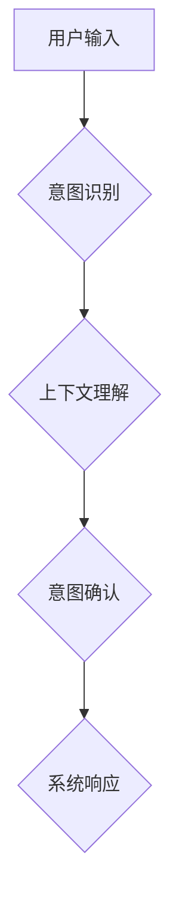

> LUI, 意图理解, 上下文理解, 自然语言处理, 人机交互, 聊天机器人, 语义理解

## 1. 背景介绍

随着人工智能技术的飞速发展，自然语言处理（NLP）领域取得了显著的进展。其中，意图理解和上下文理解是构建自然、流畅的人机交互的关键技术。用户界面（UI）的演变也从传统的图形界面（GUI）向更智能、更自然的语言界面（LUI）转变。LUI 允许用户使用自然语言与系统进行交互，从而提升用户体验和便捷性。

然而，LUI 的实现面临着巨大的挑战，其中意图理解和上下文理解是两大核心难题。意图理解是指识别用户在特定语境下表达的意图，例如查询信息、执行操作或表达情感。上下文理解是指理解用户 utterances 中的隐含信息和语义关系，从而更准确地识别用户意图。

## 2. 核心概念与联系

**2.1 意图理解**

意图理解是自然语言理解的核心任务之一，旨在识别用户表达的意图。例如，用户输入“今天的天气怎么样？”，意图是查询天气信息。

**2.2 上下文理解**

上下文理解是指理解用户 utterances 中的隐含信息和语义关系，从而更准确地识别用户意图。上下文信息可以来自用户历史 utterances、对话场景、用户个人信息等多个方面。

**2.3 LUI 中意图和上下文理解的联系**

在 LUI 中，意图理解和上下文理解是相互关联的。上下文信息可以帮助更准确地识别用户意图。例如，用户在对话中多次提到“电影”，当用户说“我想看一部喜剧电影”时，上下文信息可以帮助系统理解用户意图是查询喜剧电影信息。

**2.4  Mermaid 流程图**



## 3. 核心算法原理 & 具体操作步骤

**3.1 算法原理概述**

意图理解和上下文理解常用的算法包括：

* **机器学习算法:** 
    * **分类算法:** 使用训练数据学习用户 utterances 和意图之间的映射关系，例如支持向量机（SVM）、决策树、随机森林等。
    * **序列标注算法:** 用于识别用户 utterances 中每个词语的意图标签，例如条件随机场（CRF）、循环神经网络（RNN）等。
* **深度学习算法:** 
    * **Transformer:**  利用注意力机制学习用户 utterances 中词语之间的语义关系，例如BERT、GPT等。

**3.2 算法步骤详解**

**3.2.1  意图识别**

1. **数据预处理:** 将用户 utterances 进行清洗、分词、词干提取等预处理操作。
2. **特征提取:** 从预处理后的 utterances 中提取特征，例如词频、词向量、语法结构等。
3. **模型训练:** 使用训练数据训练意图识别模型，例如分类算法或序列标注算法。
4. **意图预测:** 将新用户 utterances 输入到训练好的模型中，预测其意图。

**3.2.2 上下文理解**

1. **上下文信息提取:** 从用户历史 utterances、对话场景、用户个人信息等方面提取上下文信息。
2. **上下文表示:** 将上下文信息转换为向量表示，例如词向量、句子向量等。
3. **上下文融合:** 将上下文向量与用户当前 utterances 的特征向量融合，形成更完整的语义表示。
4. **意图修正:** 根据上下文信息，对初始意图预测进行修正，提高意图识别准确率。

**3.3 算法优缺点**

**3.3.1 机器学习算法**

* **优点:** 
    * 算法相对简单，易于理解和实现。
    * 训练速度较快，适合处理中等规模的数据集。
* **缺点:** 
    * 对训练数据的依赖性强，需要大量高质量的训练数据。
    * 难以捕捉长距离依赖关系，对上下文理解能力有限。

**3.3.2 深度学习算法**

* **优点:** 
    * 能够捕捉长距离依赖关系，对上下文理解能力强。
    * 性能优于传统机器学习算法。
* **缺点:** 
    * 训练成本高，需要大量计算资源和训练数据。
    * 模型复杂度高，难以解释模型决策过程。

**3.4 算法应用领域**

意图理解和上下文理解算法广泛应用于以下领域：

* **聊天机器人:** 理解用户意图，提供更精准的回复。
* **语音助手:** 识别用户语音指令，执行相应的操作。
* **搜索引擎:** 理解用户搜索意图，提供更相关的搜索结果。
* **客服系统:** 自动处理用户咨询，提高客服效率。

## 4. 数学模型和公式 & 详细讲解 & 举例说明

**4.1 数学模型构建**

意图识别和上下文理解可以建模为概率问题。例如，假设用户 utterances 为 $u$，其对应的意图为 $y$，则意图识别可以表示为：

$$P(y|u)$$

上下文理解可以表示为：

$$P(y|u, c)$$

其中，$c$ 为上下文信息。

**4.2 公式推导过程**

可以使用贝叶斯定理推导上述概率公式：

$$P(y|u) = \frac{P(u|y)P(y)}{P(u)}$$

$$P(y|u, c) = \frac{P(u, c|y)P(y)}{P(u, c)}$$

其中，$P(u|y)$ 为给定意图 $y$ 下用户 utterances $u$ 的概率，$P(y)$ 为意图 $y$ 的先验概率，$P(u)$ 为用户 utterances $u$ 的概率。

**4.3 案例分析与讲解**

假设用户输入 utterances 为“今天天气怎么样？”，其对应的意图为“查询天气信息”。

* $P(u|y)$ 为给定“查询天气信息”意图下“今天天气怎么样？”的概率，可以根据训练数据估计。
* $P(y)$ 为“查询天气信息”意图的先验概率，可以根据历史数据统计。
* $P(u)$ 为“今天天气怎么样？”的概率，可以根据语料库统计。

通过贝叶斯定理，可以计算出给定用户 utterances 的情况下，“查询天气信息”意图的概率。

## 5. 项目实践：代码实例和详细解释说明

**5.1 开发环境搭建**

* Python 3.x
* TensorFlow 或 PyTorch
* NLTK 或 SpaCy

**5.2 源代码详细实现**

```python
import tensorflow as tf

# 定义模型结构
model = tf.keras.Sequential([
    tf.keras.layers.Embedding(input_dim=vocab_size, output_dim=embedding_dim),
    tf.keras.layers.LSTM(units=128),
    tf.keras.layers.Dense(units=num_classes, activation='softmax')
])

# 编译模型
model.compile(optimizer='adam',
              loss='sparse_categorical_crossentropy',
              metrics=['accuracy'])

# 训练模型
model.fit(x_train, y_train, epochs=10)

# 预测意图
predictions = model.predict(x_test)
```

**5.3 代码解读与分析**

* 代码使用 TensorFlow 库构建一个 LSTM 模型，用于意图识别。
* 模型输入是用户 utterances 的词向量表示，输出是每个意图的概率分布。
* 模型使用 Adam 优化器，交叉熵损失函数，并使用准确率作为评估指标。

**5.4 运行结果展示**

训练完成后，可以评估模型的性能，例如准确率、召回率、F1 值等。

## 6. 实际应用场景

**6.1 聊天机器人**

LUI 聊天机器人可以利用意图理解和上下文理解技术，更自然地与用户进行对话，例如：

* 理解用户的问答需求，提供相关信息。
* 识别用户的指令，执行相应的操作。
* 记住用户历史对话，提供更个性化的服务。

**6.2 语音助手**

LUI 语音助手可以理解用户的语音指令，执行相应的操作，例如：

* 设置闹钟、提醒事项。
* 控制智能家居设备。
* 查询天气、新闻等信息。

**6.3 搜索引擎**

LUI 搜索引擎可以理解用户的搜索意图，提供更相关的搜索结果，例如：

* 识别用户的关键词和查询类型。
* 理解用户的语义关系，提供更精准的搜索结果。
* 提供个性化的搜索结果推荐。

**6.4 未来应用展望**

随着人工智能技术的不断发展，LUI 将在更多领域得到应用，例如：

* 教育领域：提供个性化的学习体验。
* 医疗领域：辅助医生诊断疾病、提供医疗咨询。
* 商业领域：提供个性化的商品推荐、客户服务。

## 7. 工具和资源推荐

**7.1 学习资源推荐**

* **书籍:**
    * 《深度学习》
    * 《自然语言处理》
* **在线课程:**
    * Coursera: 自然语言处理
    * edX: 深度学习
* **博客:**
    * Jay Alammar's Blog
    * Google AI Blog

**7.2 开发工具推荐**

* **Python:** 
    * TensorFlow
    * PyTorch
    * NLTK
    * SpaCy
* **其他工具:**
    * Rasa
    * Dialogflow

**7.3 相关论文推荐**

* BERT: Pre-training of Deep Bidirectional Transformers for Language Understanding
* GPT-3: Language Models are Few-Shot Learners
* Transformer: Attention Is All You Need

## 8. 总结：未来发展趋势与挑战

**8.1 研究成果总结**

近年来，意图理解和上下文理解领域取得了显著进展，深度学习算法在该领域取得了突破性进展。

**8.2 未来发展趋势**

* **更强大的模型:** 研究更强大的深度学习模型，例如 Transformer 的变体，以提高意图理解和上下文理解的准确率。
* **跨模态理解:** 研究跨模态意图理解，例如结合文本、图像、音频等多模态信息，提高意图理解的鲁棒性。
* **个性化理解:** 研究个性化意图理解，根据用户的历史行为和偏好，提供更精准的意图识别和上下文理解。

**8.3 面临的挑战**

* **数据标注:** 高质量的训练数据是深度学习模型的关键，但数据标注成本高，难以获取大量标注数据。
* **模型解释性:** 深度学习模型的决策过程难以解释，这限制了模型在一些安全敏感领域应用。
* **鲁棒性:** 目前意图理解和上下文理解模型对噪声和错误数据较为敏感，需要提高模型的鲁棒性。

**8.4 研究展望**

未来，意图理解和上下文理解技术将继续发展，为构建更智能、更自然的 LUI 提供技术支持，推动人工智能技术在更多领域应用。

## 9. 附录：常见问题与解答

**9.1 如何选择合适的意图识别算法？**

选择合适的意图识别算法需要考虑以下因素：

* 数据规模：对于小规模数据集，可以使用传统机器学习算法；对于大规模数据集，可以使用深度学习算法。
* 复杂度：如果意图分类较为复杂，可以使用深度学习算法；如果意图分类相对简单，可以使用传统机器学习算法。
* 计算资源：深度学习算法需要较多的计算资源，如果计算资源有限，可以使用传统机器学习算法。

**9.2 如何提高上下文理解的准确率？**

提高上下文理解的准确率可以从以下几个方面入手：

* 提取更丰富的上下文信息：例如用户历史对话、用户个人信息、对话场景等。
* 使用更强大的上下文表示方法：例如 Transformer、BERT 等。
* 使用多任务学习：例如将意图识别和情感分析等