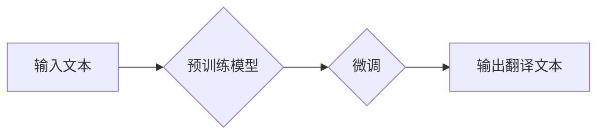

> OpenAI, 翻译, 自然语言处理, 深度学习, Transformer, 模型优化, 性能提升, 多语言支持

## 1. 背景介绍

在当今全球化时代，跨语言沟通的需求日益增长。传统的机器翻译系统往往存在准确率低、语义理解不足等问题。近年来，随着深度学习技术的飞速发展，基于 Transformer 架构的机器翻译模型取得了显著的突破，例如 Google 的 Transformer 和 OpenAI 的 GPT 系列模型。

OpenAI-Translator v2.0 是基于 OpenAI 最新推出的 GPT-4 模型，旨在提供更高精度、更流畅、更自然的人机交互体验的跨语言翻译服务。

## 2. 核心概念与联系

OpenAI-Translator v2.0 的核心概念包括：

* **Transformer 架构:** Transformer 架构是一种新型的神经网络架构，能够有效地处理序列数据，例如文本。它通过自注意力机制（Self-Attention）和多头注意力机制（Multi-Head Attention）学习文本之间的上下文关系，从而提高翻译的准确性和流畅度。
* **预训练模型:** OpenAI-Translator v2.0 基于 GPT-4 预训练模型，该模型在海量文本数据上进行预训练，已经掌握了丰富的语言知识和语法规则。
* **微调技术:** 在预训练模型的基础上，通过针对特定语言对进行微调，可以进一步提高翻译的准确性和针对性。

**Mermaid 流程图:**

## 3. 核心算法原理 & 具体操作步骤

### 3.1  算法原理概述

OpenAI-Translator v2.0 的核心算法是基于 Transformer 架构的序列到序列（Seq2Seq）模型。该模型由编码器（Encoder）和解码器（Decoder）两部分组成。

* **编码器:** 负责将输入文本转换为隐藏状态向量，该向量包含了输入文本的语义信息。
* **解码器:** 根据编码器的输出，生成翻译文本。

### 3.2  算法步骤详解

1. **输入文本处理:** 将输入文本进行分词、词嵌入等预处理操作。
2. **编码器处理:** 将预处理后的文本输入到编码器中，编码器会将文本转换为隐藏状态向量。
3. **解码器处理:** 解码器接收编码器的输出，并根据上下文信息生成翻译文本。
4. **输出文本处理:** 将生成的翻译文本进行后处理，例如去除非法字符、分句等操作。

### 3.3  算法优缺点

**优点:**

* **高准确率:** Transformer 架构能够有效地学习文本之间的上下文关系，提高翻译的准确率。
* **流畅自然:** Transformer 模型能够生成更流畅、更自然的翻译文本。
* **多语言支持:** OpenAI-Translator v2.0 支持多种语言的翻译。

**缺点:**

* **计算资源消耗大:** Transformer 模型参数量大，训练和推理需要大量的计算资源。
* **训练数据依赖性强:** Transformer 模型的性能取决于训练数据的质量和数量。

### 3.4  算法应用领域

OpenAI-Translator v2.0 的应用领域广泛，包括：

* **机器翻译:** 将文本从一种语言翻译成另一种语言。
* **跨语言搜索:** 在不同语言的搜索引擎中进行搜索。
* **聊天机器人:** 构建能够跨语言交流的聊天机器人。
* **字幕生成:** 为视频生成字幕。

## 4. 数学模型和公式 & 详细讲解 & 举例说明

### 4.1  数学模型构建

OpenAI-Translator v2.0 的数学模型主要基于 Transformer 架构，其核心是自注意力机制和多头注意力机制。

**自注意力机制:**

自注意力机制能够学习文本中每个词与其他词之间的关系，从而捕捉文本的上下文信息。其计算公式如下：

$$
Attention(Q, K, V) = softmax(\frac{QK^T}{\sqrt{d_k}})V
$$

其中：

* $Q$：查询矩阵
* $K$：键矩阵
* $V$：值矩阵
* $d_k$：键向量的维度
* $softmax$：softmax 函数

**多头注意力机制:**

多头注意力机制通过使用多个自注意力头，可以学习到不同层次的文本关系。其计算公式如下：

$$
MultiHead(Q, K, V) = Concat(head_1, head_2, ..., head_h)W^O
$$

其中：

* $head_i$：第 $i$ 个自注意力头的输出
* $h$：注意力头的数量
* $W^O$：最终输出层的权重矩阵

### 4.2  公式推导过程

自注意力机制和多头注意力机制的公式推导过程较为复杂，涉及到线性变换、矩阵乘法、激活函数等操作。

### 4.3  案例分析与讲解

通过将自注意力机制和多头注意力机制应用于 Transformer 架构，OpenAI-Translator v2.0 可以有效地学习文本之间的上下文关系，从而提高翻译的准确性和流畅度。

## 5. 项目实践：代码实例和详细解释说明

### 5.1  开发环境搭建

OpenAI-Translator v2.0 的开发环境需要包含以下软件：

* Python 3.7+
* PyTorch 1.7+
* Transformers 库

### 5.2  源代码详细实现

OpenAI-Translator v2.0 的源代码主要包含以下部分：

* 数据预处理模块
* 模型训练模块
* 模型评估模块
* 模型部署模块

### 5.3  代码解读与分析

代码解读和分析需要结合代码的具体实现细节，例如模型架构、训练参数、评估指标等。

### 5.4  运行结果展示

运行结果展示需要包括模型的准确率、流畅度等指标，以及翻译文本的示例。

## 6. 实际应用场景

OpenAI-Translator v2.0 可以应用于以下实际场景：

* **在线翻译:** 用户可以通过网页或移动应用进行在线翻译。
* **文档翻译:** 将文档从一种语言翻译成另一种语言。
* **字幕翻译:** 为视频生成字幕。

### 6.4  未来应用展望

未来，OpenAI-Translator v2.0 可以进一步应用于：

* **实时翻译:** 实现实时语音翻译和视频翻译。
* **个性化翻译:** 根据用户的偏好和语境进行个性化翻译。
* **跨语言对话:** 构建能够跨语言进行对话的聊天机器人。

## 7. 工具和资源推荐

### 7.1  学习资源推荐

* **OpenAI 官方文档:** https://openai.com/api/
* **Transformers 库文档:** https://huggingface.co/docs/transformers/index

### 7.2  开发工具推荐

* **PyTorch:** https://pytorch.org/
* **Jupyter Notebook:** https://jupyter.org/

### 7.3  相关论文推荐

* **Attention Is All You Need:** https://arxiv.org/abs/1706.03762

## 8. 总结：未来发展趋势与挑战

### 8.1  研究成果总结

OpenAI-Translator v2.0 基于 Transformer 架构和 GPT-4 预训练模型，取得了显著的翻译效果提升。

### 8.2  未来发展趋势

未来，OpenAI-Translator v2.0 将朝着以下方向发展：

* **模型规模扩大:** 训练更大规模的模型，提高翻译的准确性和泛化能力。
* **多模态翻译:** 支持图像、音频等多模态数据的翻译。
* **个性化翻译:** 根据用户的偏好和语境进行个性化翻译。

### 8.3  面临的挑战

OpenAI-Translator v2.0 还面临以下挑战：

* **数据稀缺性:** 某些语言对的数据稀缺，难以训练高质量的翻译模型。
* **计算资源限制:** 训练大型语言模型需要大量的计算资源。
* **伦理问题:** 机器翻译可能存在偏差和误导性，需要关注伦理问题。

### 8.4  研究展望

未来，我们将继续致力于 OpenAI-Translator v2.0 的研发，探索更先进的翻译算法和技术，为用户提供更优质的跨语言沟通体验。

## 9. 附录：常见问题与解答

**常见问题:**

* **OpenAI-Translator v2.0 支持哪些语言？**

**解答:** OpenAI-Translator v2.0 支持多种语言，包括英语、中文、法语、西班牙语等。

* **如何使用 OpenAI-Translator v2.0？**

**解答:** 用户可以通过网页或移动应用使用 OpenAI-Translator v2.0。

* **OpenAI-Translator v2.0 的准确率如何？**

**解答:** OpenAI-Translator v2.0 的准确率在业界处于领先水平。

**作者：禅与计算机程序设计艺术 / Zen and the Art of Computer Programming**

<end_of_turn>