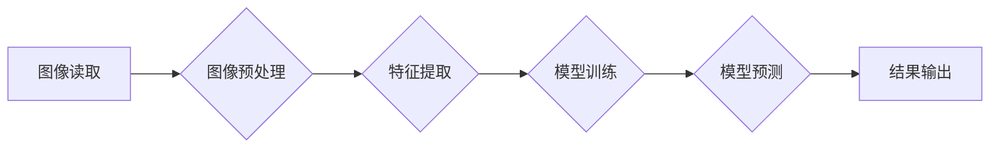

> OpenCV, 图像处理, 机器学习, 深度学习, 计算机视觉, C++, Python, 实战案例

## 1. 背景介绍

在当今数据爆炸的时代，图像和视频数据已成为重要的信息来源。如何有效地处理和分析这些数据，从中提取有价值的信息，成为了一个重要的研究方向。OpenCV（Open Source Computer Vision Library）作为开源的计算机视觉库，为图像处理、计算机视觉和机器学习提供了丰富的工具和算法。它支持多种编程语言，包括C++和Python，并广泛应用于各个领域，例如自动驾驶、人脸识别、医疗影像分析等。

本篇文章将深入讲解OpenCV的核心原理和算法，并通过实战案例，帮助读者理解OpenCV的使用方法和应用场景。

## 2. 核心概念与联系

OpenCV是一个庞大的库，包含了大量的图像处理、计算机视觉和机器学习算法。为了更好地理解OpenCV，我们需要先了解其核心概念和架构。

**2.1  图像处理**

图像处理是指对数字图像进行各种操作，以提取、增强或修改图像信息的过程。OpenCV提供了丰富的图像处理函数，例如：

* **图像读取和写入:**  `imread()` 和 `imwrite()` 函数用于读取和写入图像文件。
* **图像变换:**  `resize()`, `rotate()`, `flip()` 函数用于改变图像的大小、方向和镜像。
* **图像滤波:**  `GaussianBlur()`, `medianBlur()`, `Canny()` 函数用于去除图像噪声和边缘检测。
* **颜色空间转换:**  `cvtColor()` 函数用于将图像从一种颜色空间转换为另一种颜色空间。

**2.2  计算机视觉**

计算机视觉是指让计算机“看”和理解图像的能力。OpenCV提供了许多计算机视觉算法，例如：

* **特征检测和描述:**  `SIFT()`, `SURF()`, `ORB()` 函数用于检测图像中的特征点并描述其特征。
* **目标检测:**  `HOG()`, `Haar Cascades()` 函数用于检测图像中的特定目标。
* **图像分割:**  `threshold()`, `watershed()` 函数用于将图像分割成不同的区域。
* **立体视觉:**  `stereoCalibrate()` 和 `reprojectImageTo3D()` 函数用于从两幅图像中重建三维场景。

**2.3  机器学习**

机器学习是指让计算机从数据中学习并进行预测的过程。OpenCV支持一些机器学习算法，例如：

* **支持向量机 (SVM):**  用于分类和回归问题。
* **决策树:**  用于分类问题。
* **随机森林:**  用于分类和回归问题。

**2.4  架构图**



## 3. 核心算法原理 & 具体操作步骤

### 3.1  算法原理概述

OpenCV提供了大量的图像处理和计算机视觉算法，其中一些核心算法包括：

* **Canny边缘检测算法:**  Canny算法是一种常用的边缘检测算法，它通过高斯滤波、梯度计算和非极大值抑制等步骤，从图像中提取边缘信息。
* **SIFT特征点检测算法:**  SIFT算法是一种特征点检测和描述算法，它可以检测图像中的关键点，并为每个关键点生成一个描述向量，用于图像匹配和识别。
* **Haar特征分类器:**  Haar特征分类器是一种用于目标检测的算法，它使用一系列Haar特征来描述目标的形状和纹理，并通过训练分类器来识别目标。

### 3.2  算法步骤详解

**3.2.1 Canny边缘检测算法步骤:**

1. **高斯滤波:**  使用高斯滤波器平滑图像，去除噪声。
2. **梯度计算:**  计算图像的梯度幅值和方向。
3. **非极大值抑制:**  对梯度方向进行非极大值抑制，保留边缘像素。
4. **双阈值法:**  使用两个阈值对边缘像素进行分类，并进行边缘连接。

**3.2.2 SIFT特征点检测算法步骤:**

1. **差分金字塔构建:**  构建图像的金字塔结构，并计算图像在不同尺度下的差分图像。
2. **关键点检测:**  在差分图像中检测关键点，并根据关键点的尺度和方向进行筛选。
3. **关键点描述:**  为每个关键点生成一个描述向量，用于图像匹配和识别。

**3.2.3 Haar特征分类器步骤:**

1. **特征提取:**  使用Haar特征描述目标的形状和纹理。
2. **分类器训练:**  使用训练数据训练分类器，将目标和背景分类。
3. **目标检测:**  将分类器应用于图像，检测目标的区域。

### 3.3  算法优缺点

**3.3.1 Canny边缘检测算法:**

* **优点:**  效果较好，能够检测出较多的边缘信息。
* **缺点:**  计算量较大，对噪声敏感。

**3.3.2 SIFT特征点检测算法:**

* **优点:**  鲁棒性强，能够检测出稳定的特征点。
* **缺点:**  计算量较大，专利问题。

**3.3.3 Haar特征分类器:**

* **优点:**  计算量较小，速度快。
* **缺点:**  识别精度较低，对复杂目标的识别能力较弱。

### 3.4  算法应用领域

* **Canny边缘检测算法:**  图像分割、目标识别、图像分析等。
* **SIFT特征点检测算法:**  图像匹配、物体识别、3D重建等。
* **Haar特征分类器:**  人脸检测、目标跟踪、视频分析等。

## 4. 数学模型和公式 & 详细讲解 & 举例说明

### 4.1  数学模型构建

OpenCV中的许多算法都基于数学模型，例如：

* **Canny边缘检测算法:**  基于梯度算子、非极大值抑制和双阈值法的数学模型。
* **SIFT特征点检测算法:**  基于差分金字塔、尺度空间和关键点检测的数学模型。
* **Haar特征分类器:**  基于特征工程和分类器的数学模型。

### 4.2  公式推导过程

**4.2.1 Canny边缘检测算法公式:**

* **梯度算子:**  $G = \sqrt{I_x^2 + I_y^2}$
* **非极大值抑制:**  $I_{nms}(x,y) = \begin{cases} I(x,y), & \text{if } I(x,y) \ge I(x+1,y) \text{ and } I(x,y) \ge I(x-1,y) \\ 0, & \text{otherwise} \end{cases}$

**4.2.2 SIFT特征点检测算法公式:**

* **尺度空间极值检测:**  $L(x,y, \sigma) = \sum_{i,j} w(i,j) \cdot I(x+i, y+j, \sigma)$

### 4.3  案例分析与讲解

**4.3.1 Canny边缘检测算法案例:**

使用Canny算法检测图像中的边缘信息，可以用于图像分割、目标识别等。

**4.3.2 SIFT特征点检测算法案例:**

使用SIFT算法检测图像中的关键点，可以用于图像匹配、物体识别等。

## 5. 项目实践：代码实例和详细解释说明

### 5.1  开发环境搭建

* **操作系统:**  Windows, macOS, Linux
* **编程语言:**  C++, Python
* **OpenCV库:**  下载并安装OpenCV库

### 5.2  源代码详细实现

**5.2.1  Canny边缘检测代码示例 (Python):**

```python
import cv2

# 读取图像
image = cv2.imread('image.jpg')

# 将图像转换为灰度图像
gray = cv2.cvtColor(image, cv2.COLOR_BGR2GRAY)

# 使用Canny算法检测边缘
edges = cv2.Canny(gray, 100, 200)

# 显示边缘图像
cv2.imshow('Edges', edges)
cv2.waitKey(0)
cv2.destroyAllWindows()
```

**5.2.2  SIFT特征点检测代码示例 (Python):**

```python
import cv2

# 读取图像
image = cv2.imread('image.jpg')

# 使用SIFT算法检测特征点
sift = cv2.SIFT_create()
keypoints, descriptors = sift.detectAndCompute(image, None)

# 绘制特征点
image_with_keypoints = cv2.drawKeypoints(image, keypoints, None, flags=cv2.DRAW_MATCHES_FLAGS_DRAW_RICH_KEYPOINTS)

# 显示图像
cv2.imshow('SIFT Keypoints', image_with_keypoints)
cv2.waitKey(0)
cv2.destroyAllWindows()
```

### 5.3  代码解读与分析

* **Canny边缘检测代码:**  该代码首先读取图像，然后将其转换为灰度图像。接着使用Canny算法检测边缘，并将结果显示出来。
* **SIFT特征点检测代码:**  该代码首先读取图像，然后使用SIFT算法检测特征点。最后将特征点绘制在图像上，并显示出来。

### 5.4  运行结果展示

运行以上代码，可以分别得到Canny边缘检测后的图像和SIFT特征点检测后的图像。

## 6. 实际应用场景

OpenCV在各个领域都有广泛的应用，例如：

* **自动驾驶:**  用于车道线检测、障碍物识别、交通标志识别等。
* **人脸识别:**  用于人脸检测、人脸识别、人脸验证等。
* **医疗影像分析:**  用于图像分割、肿瘤检测、病灶识别等。
* **机器人视觉:**  用于物体识别、场景理解、导航等。

### 6.4  未来应用展望

随着人工智能和计算机视觉技术的不断发展，OpenCV的应用场景将会更加广泛，例如：

* **增强现实 (AR):**  用于AR应用中的物体识别、场景理解、虚拟物体渲染等。
* **虚拟现实 (VR):**  用于VR应用中的场景重建、虚拟物体交互等。
* **智能家居:**  用于智能家居中的物体识别、场景感知、人机交互等。

## 7. 工具和资源推荐

### 7.1  学习资源推荐

* **OpenCV官方文档:**  https://docs.opencv.org/
* **OpenCV中文文档:**  http://docs.opencv.org/3.4/d9/d0c/tutorial_py_table_of_contents.html
* **OpenCV教程:**  https://www.pyimagesearch.com/

### 7.2  开发工具推荐

* **Visual Studio Code:**  https://code.visualstudio.com/
* **PyCharm:**  https://www.jetbrains.com/pycharm/

### 7.3  相关论文推荐

* **SIFT特征点检测算法论文:**  http://www.cs.ubc.ca/~lowe/papers/ijcv04.pdf
* **Canny边缘检测算法论文:**  https://ieeexplore.ieee.org/document/631387

## 8. 总结：未来发展趋势与挑战

### 8.1  研究成果总结

OpenCV是一个强大的计算机视觉库，它为图像处理、计算机视觉和机器学习提供了丰富的工具和算法。OpenCV的开源特性和易于使用的接口，使其成为研究人员和开发人员的首选工具。

### 8.2  未来发展趋势

* **深度学习:**  OpenCV将更加紧密地与深度学习框架集成，提供更强大的图像识别、物体检测和场景理解能力。
* **实时处理:**  OpenCV将更加注重实时处理能力，支持更高