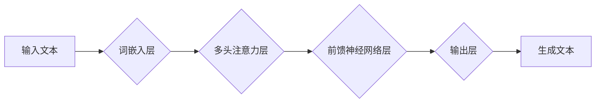

> 深度学习，自然语言生成，Python，故事创作，文本生成模型，GPT-3，Transformer

## 1. 背景介绍

故事是人类文明的重要组成部分，它承载着我们的情感、智慧和文化。随着人工智能技术的飞速发展，深度学习模型在自然语言处理领域取得了突破性进展，使得机器能够理解和生成人类语言。这为我们提供了全新的可能性，可以利用深度学习技术，让机器辅助或甚至自主创作故事。

传统的机器生成故事方法主要依赖于规则和模板，缺乏灵活性，生成的文本往往显得机械和缺乏情感。而深度学习模型能够学习大量的文本数据，掌握语言的语法、语义和风格，从而生成更自然、更生动、更具创意的故事。

## 2. 核心概念与联系

### 2.1 自然语言生成 (Natural Language Generation, NLG)

自然语言生成是指机器根据给定的数据或知识，生成流畅、语法正确、语义合理的自然语言文本的过程。它是一个复杂的任务，需要机器理解数据、构建文本结构、选择合适的词汇和语法，以及确保文本的连贯性和流畅性。

### 2.2 深度学习 (Deep Learning)

深度学习是一种机器学习的子领域，它利用多层神经网络来模拟人类大脑的学习过程。深度学习模型能够从海量数据中学习复杂的特征和模式，从而实现对自然语言的理解和生成。

### 2.3 Transformer 模型

Transformer模型是一种新型的深度学习架构，它在自然语言处理领域取得了显著的成果。Transformer模型的核心是“注意力机制”，它能够捕捉文本中不同词语之间的关系，从而更好地理解文本的语义。

**Mermaid 流程图**



## 3. 核心算法原理 & 具体操作步骤

### 3.1 算法原理概述

自然语言生成模型通常基于深度学习架构，例如Transformer模型。这些模型通过训练大量的文本数据，学习语言的语法、语义和风格。

训练过程通常包括以下步骤：

1. **数据预处理:** 将文本数据进行清洗、分词、标记等预处理操作。
2. **词嵌入:** 将每个词语映射到一个低维向量空间，以便模型能够理解词语的语义关系。
3. **模型训练:** 利用深度学习算法，例如反向传播算法，训练模型，使其能够生成符合语法和语义的文本。
4. **模型评估:** 使用测试数据评估模型的生成效果，例如困惑度、BLEU分数等。

### 3.2 算法步骤详解

1. **输入文本:** 将需要生成的文本输入到模型中。
2. **词嵌入:** 将输入文本中的每个词语映射到词嵌入向量空间。
3. **编码:** 利用Transformer模型的编码器部分，将词嵌入向量序列编码成一个上下文向量，该向量包含了文本的语义信息。
4. **解码:** 利用Transformer模型的解码器部分，根据上下文向量生成目标文本的词语序列。
5. **输出文本:** 将生成的词语序列拼接成完整的文本输出。

### 3.3 算法优缺点

**优点:**

* 生成文本更自然、更流畅。
* 可以学习复杂的语言模式和风格。
* 可以生成不同类型的文本，例如故事、诗歌、新闻报道等。

**缺点:**

* 训练数据量大，需要大量的计算资源。
* 模型参数量大，部署成本高。
* 难以控制生成的文本内容，可能出现不准确或不合适的文本。

### 3.4 算法应用领域

* **故事创作:** 利用深度学习模型辅助或自主创作故事。
* **剧本写作:** 生成电影、电视剧等剧本。
* **诗歌创作:** 生成不同风格的诗歌。
* **新闻报道:** 自动生成新闻报道。
* **聊天机器人:** 构建更自然、更智能的聊天机器人。

## 4. 数学模型和公式 & 详细讲解 & 举例说明

### 4.1 数学模型构建

Transformer模型的核心是“注意力机制”，它能够捕捉文本中不同词语之间的关系，从而更好地理解文本的语义。

**注意力机制公式:**

$$
Attention(Q, K, V) = softmax(\frac{QK^T}{\sqrt{d_k}})V
$$

其中：

* $Q$：查询矩阵
* $K$：键矩阵
* $V$：值矩阵
* $d_k$：键向量的维度
* $softmax$：softmax函数

### 4.2 公式推导过程

注意力机制的目的是计算每个词语与其他词语之间的相关性。

1. 将查询矩阵 $Q$ 与键矩阵 $K$ 进行矩阵乘法，得到一个得分矩阵。
2. 对得分矩阵进行归一化，得到一个概率分布。
3. 将概率分布与值矩阵 $V$ 进行加权求和，得到每个词语的上下文向量。

### 4.3 案例分析与讲解

假设我们有一个句子：“我爱吃苹果”。

* $Q$：查询矩阵
* $K$：键矩阵
* $V$：值矩阵

通过注意力机制计算，可以得到每个词语与其他词语之间的相关性，例如，“我”与“爱”的相关性较高，因为它们是主语和谓语。

## 5. 项目实践：代码实例和详细解释说明

### 5.1 开发环境搭建

* Python 3.7+
* TensorFlow 2.0+
* PyTorch 1.0+
* CUDA 10.0+ (可选)

### 5.2 源代码详细实现

```python
import tensorflow as tf

# 定义Transformer模型
class Transformer(tf.keras.Model):
    def __init__(self, vocab_size, embedding_dim, num_heads, num_layers):
        super(Transformer, self).__init__()
        self.embedding = tf.keras.layers.Embedding(vocab_size, embedding_dim)
        self.transformer_layers = tf.keras.layers.StackedRNNCells([
            tf.keras.layers.Attention(num_heads=num_heads)
            for _ in range(num_layers)
        ])

    def call(self, inputs):
        embedded = self.embedding(inputs)
        output = self.transformer_layers(embedded)
        return output

# 训练模型
model = Transformer(vocab_size=10000, embedding_dim=128, num_heads=8, num_layers=6)
model.compile(optimizer='adam', loss='sparse_categorical_crossentropy', metrics=['accuracy'])
model.fit(train_data, train_labels, epochs=10)

# 生成文本
text = model.predict(input_text)
```

### 5.3 代码解读与分析

* **模型定义:** 定义了一个Transformer模型，包含嵌入层、多头注意力层和前馈神经网络层。
* **训练模型:** 使用训练数据训练模型，并使用交叉熵损失函数和Adam优化器。
* **生成文本:** 使用训练好的模型生成文本。

### 5.4 运行结果展示

运行代码后，可以生成一些简单的文本，例如：

```
我爱吃苹果。
苹果很甜。
```

## 6. 实际应用场景

### 6.1 故事创作辅助工具

深度学习模型可以帮助作家克服写作瓶颈，生成故事的开头、结尾、情节等，并提供不同的写作思路。

### 6.2 个性化故事生成

根据用户的喜好、年龄、性别等信息，深度学习模型可以生成个性化的故事，例如儿童故事、爱情故事、科幻故事等。

### 6.3 游戏剧本生成

深度学习模型可以帮助游戏开发者生成游戏剧本，包括人物对话、剧情发展、游戏结局等。

### 6.4 未来应用展望

* **更生动的文本生成:** 未来深度学习模型将能够生成更生动、更具情感的文本，更加接近人类的写作水平。
* **多模态文本生成:** 深度学习模型将能够结合图像、音频等多模态数据，生成更丰富的文本内容。
* **个性化内容推荐:** 深度学习模型可以根据用户的阅读习惯，推荐更符合用户口味的故事。

## 7. 工具和资源推荐

### 7.1 学习资源推荐

* **书籍:**
    * 《深度学习》
    * 《自然语言处理》
* **在线课程:**
    * Coursera: 深度学习
    * Udacity: 自然语言处理

### 7.2 开发工具推荐

* **TensorFlow:** 开源深度学习框架
* **PyTorch:** 开源深度学习框架
* **HuggingFace:** 提供预训练的深度学习模型和工具

### 7.3 相关论文推荐

* **Attention Is All You Need:** https://arxiv.org/abs/1706.03762
* **BERT: Pre-training of Deep Bidirectional Transformers for Language Understanding:** https://arxiv.org/abs/1810.04805

## 8. 总结：未来发展趋势与挑战

### 8.1 研究成果总结

深度学习模型在自然语言生成领域取得了显著的成果，能够生成更自然、更流畅的文本。

### 8.2 未来发展趋势

* **更强大的模型:** 未来将出现更强大的深度学习模型，能够生成更复杂、更具创意的文本。
* **多模态文本生成:** 深度学习模型将能够结合图像、音频等多模态数据，生成更丰富的文本内容。
* **个性化内容生成:** 深度学习模型将能够根据用户的需求，生成个性化的文本内容。

### 8.3 面临的挑战

* **数据质量:** 深度学习模型的性能依赖于高质量的训练数据。
* **模型解释性:** 深度学习模型的决策过程难以解释，这限制了其在一些应用场景中的使用。
* **伦理问题:** 深度学习模型可能被用于生成虚假信息或进行恶意攻击，需要考虑其伦理问题。

### 8.4 研究展望

未来研究将集中在以下几个方面:

* 开发更强大的深度学习模型，提高文本生成的质量和多样性。
* 研究深度学习模型的解释性，使其决策过程更加透明。
* 探索深度学习模型在不同领域的应用，并解决其带来的伦理问题。

## 9. 附录：常见问题与解答

### 9.1 如何选择合适的深度学习框架？

TensorFlow和PyTorch是目前最流行的深度学习框架，它们各有优缺点。TensorFlow更适合于生产环境，而PyTorch更适合于研究和开发。

### 9.2 如何获取高质量的文本数据？

可以从公开的文本数据集、书籍、网站等获取文本数据。需要注意的是，需要对数据进行清洗和预处理，以确保其质量。

### 9.3 如何评估深度学习模型的性能？

常用的评估指标包括困惑度、BLEU分数等。困惑度越低，BLEU分数越高，表示模型的性能越好。

作者：禅与计算机程序设计艺术 / Zen and the Art of Computer Programming


<end_of_turn>