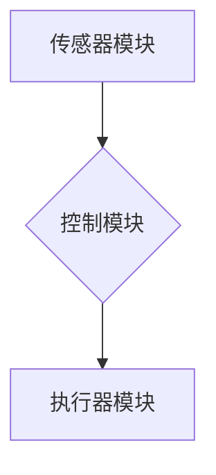

> 机器人学，机器人控制，路径规划，运动控制，人工智能，深度学习，ROS

## 1. 背景介绍

机器人技术作为人工智能领域的重要分支，近年来发展迅速，在工业自动化、医疗服务、家政服务等领域展现出巨大的应用潜力。从简单的工业机器人到复杂的自主导航机器人，机器人技术正在深刻地改变着我们的生活。

然而，构建一个能够自主感知、决策和执行任务的机器人并非易事。它需要融合多学科知识，包括机械工程、控制理论、计算机科学、人工智能等。

本篇文章将深入探讨机器人学的基本原理和核心算法，并通过代码实例和实战案例，帮助读者理解机器人控制的本质，并掌握基本的机器人开发技能。

## 2. 核心概念与联系

机器人系统通常由以下几个核心模块组成：

* **传感器模块:** 用于感知环境信息，例如摄像头、激光雷达、超声波传感器等。
* **控制模块:** 负责根据传感器信息进行决策和控制机器人运动，通常由微控制器或计算机实现。
* **执行器模块:** 用于执行控制指令，例如电机、舵机、气缸等。

这些模块之间通过数据通信和控制信号进行交互，共同完成机器人的任务。

**Mermaid 流程图:**



## 3. 核心算法原理 & 具体操作步骤

### 3.1  算法原理概述

机器人控制的核心算法主要包括：

* **路径规划算法:** 用于规划机器人从起点到终点的运动路径。
* **运动控制算法:** 用于控制机器人的运动速度、方向和姿态。

路径规划算法的目标是找到一条安全、高效的路径，避免碰撞和障碍物。常见的路径规划算法包括：

* **A* 算法:** 基于启发式搜索的路径规划算法，能够找到最短路径。
* **Dijkstra 算法:** 基于贪婪搜索的路径规划算法，能够找到最短路径。
* **RRT 算法:** 基于随机采样的路径规划算法，能够规划复杂环境中的路径。

运动控制算法的目标是使机器人的运动轨迹与规划路径尽可能一致。常见的运动控制算法包括：

* **PID 控制:** 基于比例、积分、微分控制的算法，能够有效控制系统的稳定性和精度。
* **模型预测控制 (MPC):** 基于系统模型的预测控制算法，能够在考虑系统约束的情况下，规划最优的控制策略。

### 3.2  算法步骤详解

**A* 算法步骤:**

1. 建立地图，表示环境中的障碍物和可通行区域。
2. 定义起点和终点。
3. 使用启发函数估算从当前节点到终点的距离。
4. 使用开放列表和关闭列表存储待探索节点和已探索节点。
5. 从开放列表中选择启发函数值最小的节点，将其添加到关闭列表中。
6. 探索当前节点的邻居节点，并更新邻居节点的估算距离。
7. 如果邻居节点是终点，则算法结束，返回路径。
8. 重复步骤 5-7，直到找到路径或开放列表为空。

**PID 控制步骤:**

1. 测量系统的实际输出值。
2. 计算误差值，即目标值与实际输出值的差值。
3. 根据误差值计算比例、积分和微分项。
4. 将比例、积分和微分项加权求和，得到控制量。
5. 将控制量应用于系统，调节系统的输出值。

### 3.3  算法优缺点

**A* 算法:**

* **优点:** 能够找到最短路径，效率较高。
* **缺点:** 需要定义启发函数，启发函数的选择会影响算法的性能。

**PID 控制:**

* **优点:** 简单易实现，能够有效控制系统的稳定性和精度。
* **缺点:** 需要手动调整控制参数，对系统模型要求较高。

### 3.4  算法应用领域

* **A* 算法:** 路径规划、导航、游戏 AI 等。
* **PID 控制:** 机器人控制、工业自动化、汽车驾驶辅助系统等。

## 4. 数学模型和公式 & 详细讲解 & 举例说明

### 4.1  数学模型构建

机器人运动可以抽象为一个多自由度系统，每个自由度对应一个关节或移动方向。我们可以使用数学模型来描述机器人运动的动力学和运动学。

**动力学模型:** 描述机器人运动的力和力矩，以及它们对机器人运动的影响。

**运动学模型:** 描述机器人关节角度和末端执行器位置之间的关系。

### 4.2  公式推导过程

**运动学模型的推导:**

假设机器人有一个关节，其角度为 $\theta$，关节长度为 $l$，末端执行器位置为 $(x,y)$。

根据三角函数关系，我们可以得到：

$$
x = l \cos \theta
$$

$$
y = l \sin \theta
$$

### 4.3  案例分析与讲解

**案例:** 一个两关节机器人，其关节角度分别为 $\theta_1$ 和 $\theta_2$，关节长度分别为 $l_1$ 和 $l_2$。

我们可以使用运动学模型来计算末端执行器的位置 $(x,y)$：

$$
x = l_1 \cos \theta_1 + l_2 \cos (\theta_1 + \theta_2)
$$

$$
y = l_1 \sin \theta_1 + l_2 \sin (\theta_1 + \theta_2)
$$

## 5. 项目实践：代码实例和详细解释说明

### 5.1  开发环境搭建

* 操作系统: Ubuntu 20.04
* 编程语言: Python 3.8
* 机器人操作系统 (ROS): Melodic

### 5.2  源代码详细实现

```python
import rospy
from geometry_msgs.msg import Twist

def move_robot(linear_x, angular_z):
    pub = rospy.Publisher('/cmd_vel', Twist, queue_size=10)
    twist = Twist()
    twist.linear.x = linear_x
    twist.angular.z = angular_z
    pub.publish(twist)

if __name__ == '__main__':
    rospy.init_node('robot_control')
    rate = rospy.Rate(10)  # 10Hz
    while not rospy.is_shutdown():
        move_robot(0.2, 0.5)  # 前进0.2米，旋转0.5弧度
        rate.sleep()
```

### 5.3  代码解读与分析

* `rospy.init_node('robot_control')`: 初始化 ROS 节点。
* `rospy.Publisher('/cmd_vel', Twist, queue_size=10)`: 创建一个发布器，发布到 `/cmd_vel` 主题，消息类型为 `Twist`。
* `Twist()`: 创建一个 `Twist` 消息对象，用于控制机器人运动。
* `twist.linear.x = 0.2`: 设置机器人前进速度为 0.2 米/秒。
* `twist.angular.z = 0.5`: 设置机器人旋转速度为 0.5 弧度/秒。
* `pub.publish(twist)`: 发布 `Twist` 消息，控制机器人运动。
* `rospy.Rate(10)`: 设置循环频率为 10Hz。
* `rate.sleep()`: 暂停循环，确保循环频率稳定。

### 5.4  运行结果展示

运行代码后，机器人将向前移动 0.2 米，同时顺时针旋转 0.5 弧度。

## 6. 实际应用场景

机器人技术在各个领域都有广泛的应用，例如：

* **工业自动化:** 机器人用于自动化生产线，提高生产效率和降低成本。
* **医疗服务:** 机器人用于手术辅助、康复治疗、药物配送等。
* **家政服务:** 机器人用于扫地、擦桌子、做饭等家务。
* **探索领域:** 机器人用于探索深海、太空等危险环境。

### 6.4  未来应用展望

随着人工智能、机器学习等技术的不断发展，机器人技术将更加智能化、自主化和人性化。未来，机器人将更加广泛地应用于我们的生活，为我们提供更加便捷、舒适和安全的生活体验。

## 7. 工具和资源推荐

### 7.1  学习资源推荐

* **ROS 官方文档:** https://docs.ros.org/en/
* **机器人学教材:** 《机器人学导论》
* **在线课程:** Coursera、edX 等平台上的机器人学课程

### 7.2  开发工具推荐

* **ROS:** 机器人操作系统，用于开发机器人应用程序。
* **Gazebo:** 机器人仿真软件，用于模拟机器人运动和环境。
* **MoveIt!:** 机器人运动规划库，用于规划机器人运动路径。

### 7.3  相关论文推荐

* **A* 算法:**
    * Hart, P. E., Nilsson, N. J., & Raphael, B. (1968). A formal basis for the heuristic determination of minimum cost paths.
* **PID 控制:**
    * Åström, K. J., & Hägglund, T. (1995). PID controllers: Theory, design, and tuning.

## 8. 总结：未来发展趋势与挑战

### 8.1  研究成果总结

机器人技术取得了长足的进步，从简单的工业机器人到复杂的自主导航机器人，机器人技术正在深刻地改变着我们的生活。

### 8.2  未来发展趋势

* **人工智能:** 机器人将更加智能化，能够自主学习和决策。
* **柔性化:** 机器人将更加灵活和适应性强，能够完成更加复杂的任务。
* **协作:** 机器人将与人类更加协作，共同完成任务。

### 8.3  面临的挑战

* **安全性:** 机器人需要更加安全可靠，避免对人类造成伤害。
* **伦理问题:** 机器人的发展需要考虑伦理问题，例如机器人权利和责任。
* **成本:** 机器人技术成本仍然较高，需要进一步降低成本，使其更加普及。

### 8.4  研究展望

未来，机器人技术将继续朝着更加智能化、柔性化和协作化的方向发展，并将为人类社会带来更加美好的未来。

## 9. 附录：常见问题与解答

* **Q: 如何选择合适的路径规划算法？**
* **A:** 选择合适的路径规划算法需要根据具体的应用场景和环境特点进行选择。例如，对于简单环境，A* 算法是一个不错的选择；对于复杂环境，RRT 算法可能更合适。

* **Q: 如何调试机器人控制程序？**
* **A:** 调试机器人控制程序需要使用仿真软件进行模拟测试，并根据测试结果调整控制参数。

* **Q: 如何提高机器人的运动精度？**
* **A:** 提高机器人的运动精度需要考虑多个因素，例如传感器精度、控制算法、机械结构等。


作者：禅与计算机程序设计艺术 / Zen and the Art of Computer Programming 
<end_of_turn>