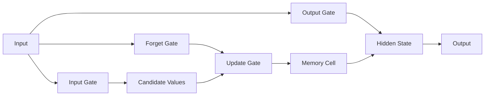

                 

## 1. 背景介绍

长短时记忆网络（Long Short-Term Memory, LSTM）是一种特殊的递归神经网络（Recurrent Neural Network, RNN），专门用于处理和预测序列数据。LSTM于1997年由Sepp Hochreiter和Jürgen Schmidhuber提出，旨在解决常规RNN在学习长期依赖性时面临的梯度消失或梯度爆炸问题。自其问世以来，LSTM已被广泛应用于自然语言处理、语音识别、图像和视频处理等领域。

## 2. 核心概念与联系

### 2.1 核心概念

LSTM的核心概念是记忆单元（Memory Cell）和门控结构（Gating Mechanism）。记忆单元用于存储和更新信息，门控结构则控制信息的流动。


### 2.2 LSTM架构流程图

下面是LSTM架构的Mermaid流程图，展示了信息在LSTM单元内的流动过程：



## 3. 核心算法原理 & 具体操作步骤

### 3.1 算法原理概述

LSTM的核心原理是通过门控结构来控制信息的流动，从而解决梯度消失或梯度爆炸问题。LSTM包含三种门：输入门、遗忘门和输出门。每个门都通过 sigmoid 函数来控制信息的流动。

### 3.2 算法步骤详解

1. **输入门（Input Gate）：** 接受当前输入 `x_t` 和上一时刻的隐藏状态 `h_t-1`，决定哪些信息需要被更新。

2. **遗忘门（Forget Gate）：** 接受当前输入 `x_t` 和上一时刻的隐藏状态 `h_t-1`，决定哪些信息需要被遗忘。

3. **候选值（Candidate Values）：** 接受当前输入 `x_t` 和上一时刻的隐藏状态 `h_t-1`，产生新的候选值，这些值可能会被添加到当前记忆单元中。

4. **更新门（Update Gate）：** 接受当前输入 `x_t` 和上一时刻的隐藏状态 `h_t-1`，决定哪些信息需要被更新。

5. **输出门（Output Gate）：** 接受当前输入 `x_t` 和上一时刻的隐藏状态 `h_t-1`，决定哪些信息需要被输出。

6. **记忆单元（Memory Cell）：** 存储和更新信息，是LSTM的核心。

7. **隐藏状态（Hidden State）：** 表示LSTM单元的当前状态，用于产生输出和更新记忆单元。

### 3.3 算法优缺点

**优点：**

- 可以学习长期依赖性，解决了常规RNN的梯度消失或梯度爆炸问题。
- 具有记忆功能，可以保留和删除信息。
- 可以处理和预测序列数据。

**缺点：**

- 结构复杂，训练时间长。
- 训练过程易受超参数影响。
- 解释性差，黑箱模型。

### 3.4 算法应用领域

LSTM广泛应用于自然语言处理、语音识别、图像和视频处理等领域。例如，LSTM可以用于文本分类、命名实体识别、机器翻译、语音合成等任务。

## 4. 数学模型和公式 & 详细讲解 & 举例说明

### 4.1 数学模型构建

LSTM的数学模型可以表示为以下方程组：

$$
\begin{align}
i_t &= \sigma(W_{ii} \cdot x_t + b_{ii} + W_{hi} \cdot h_{t-1} + b_{hi}) \\
f_t &= \sigma(W_{if} \cdot x_t + b_{if} + W_{hf} \cdot h_{t-1} + b_{hf}) \\
o_t &= \sigma(W_{io} \cdot x_t + b_{io} + W_{ho} \cdot h_{t-1} + b_{ho}) \\
g_t &= \tanh(W_{ig} \cdot x_t + b_{ig} + W_{hg} \cdot h_{t-1} + b_{hg}) \\
c_t &= f_t \cdot c_{t-1} + i_t \cdot g_t \\
h_t &= o_t \cdot \tanh(c_t)
\end{align}
$$

其中，$\sigma$表示sigmoid函数，$\tanh$表示双曲正切函数，$W$表示权重，$b$表示偏置，$i_t$，$f_t$，$o_t$，$g_t$，$c_t$，$h_t$分别表示输入门、遗忘门、输出门、候选值、记忆单元、隐藏状态在时刻$t$的值。

### 4.2 公式推导过程

LSTM的公式推导过程基于门控结构和记忆单元的概念。通过对信息的选择性遗忘和更新，LSTM可以学习长期依赖性。

### 4.3 案例分析与讲解

例如，假设我们要使用LSTM来预测一系列数据点。我们可以将数据输入LSTM，LSTM会学习数据的模式并预测下一个数据点。下面是一个简单的例子：

$$
\begin{align}
x_t &= [1, 2, 3, 4, 5] \\
h_0 &= [0, 0, 0, 0] \\
c_0 &= [0, 0, 0, 0]
\end{align}
$$

通过运行LSTM算法，我们可以得到隐藏状态$h_t$和记忆单元$c_t$的值，从而预测下一个数据点。

## 5. 项目实践：代码实例和详细解释说明

### 5.1 开发环境搭建

要实现LSTM，我们需要安装以下库：

- Python 3.7+
- TensorFlow 2.0+
- NumPy 1.16+
- Matplotlib 3.1+

### 5.2 源代码详细实现

下面是一个简单的LSTM实现代码示例：

```python
import numpy as np
import tensorflow as tf
from tensorflow.keras.models import Sequential
from tensorflow.keras.layers import LSTM, Dense

# 定义LSTM模型
model = Sequential()
model.add(LSTM(50, activation='relu', input_shape=(None, 1)))
model.add(Dense(1))
model.compile(optimizer='adam', loss='mse')

# 训练数据
x_train = np.random.rand(1000, 10, 1)
y_train = np.random.rand(1000, 1)

# 训练模型
model.fit(x_train, y_train, epochs=10, batch_size=32)
```

### 5.3 代码解读与分析

在代码中，我们首先导入必要的库，然后定义LSTM模型。我们使用TensorFlow的Keras API来构建模型。我们添加一个LSTM层，激活函数为ReLU，输入形状为(None, 1)，表示序列长度可变，每个时间步一个特征。然后，我们添加一个密集连接层，用于输出预测值。我们使用Adam优化器和均方误差（MSE）作为损失函数。

我们生成一些随机数据作为训练数据，然后使用`fit`方法训练模型。

### 5.4 运行结果展示

训练完成后，我们可以使用`model.evaluate`方法评估模型的性能，或者使用`model.predict`方法进行预测。

## 6. 实际应用场景

### 6.1 当前应用

LSTM广泛应用于自然语言处理、语音识别、图像和视频处理等领域。例如，LSTM可以用于文本分类、命名实体识别、机器翻译、语音合成等任务。

### 6.2 未来应用展望

随着深度学习技术的发展，LSTM的应用领域将会进一步扩展。未来，LSTM可能会应用于更复杂的任务，如自动驾驶、医疗诊断等。

## 7. 工具和资源推荐

### 7.1 学习资源推荐

- [LSTM网络的数学原理](https://colah.github.io/posts/2015-08-Understanding-LSTMs/)
- [LSTM教程](https://www.tensorflow.org/tutorials/sequences/lstm)
- [LSTM的数学原理（中文）](https://zhuanlan.zhihu.com/p/25711578)

### 7.2 开发工具推荐

- TensorFlow
- PyTorch
- Keras

### 7.3 相关论文推荐

- [Long Short-Term Memory](https://www.researchgate.net/publication/13686517_Long_Short-Term_Memory)
- [LSTM: A Search Space Odyssey](https://arxiv.org/abs/1503.04069)

## 8. 总结：未来发展趋势与挑战

### 8.1 研究成果总结

LSTM自问世以来，已取得了显著的研究成果，解决了常规RNN的梯度消失或梯度爆炸问题，并广泛应用于各种领域。

### 8.2 未来发展趋势

未来，LSTM的发展趋势将朝着更复杂的任务和更大的数据集方向发展。此外，LSTM的解释性和可视化也将是未来研究的重点。

### 8.3 面临的挑战

LSTM面临的挑战包括结构复杂、训练时间长、易受超参数影响等。此外，LSTM的解释性差，黑箱模型等问题也需要解决。

### 8.4 研究展望

未来的研究将关注LSTM的解释性、可视化、结构简化等方面。此外，LSTM的应用领域也将进一步扩展。

## 9. 附录：常见问题与解答

**Q：LSTM的记忆单元是如何工作的？**

A：记忆单元用于存储和更新信息。它可以选择性地遗忘或保留信息，从而学习长期依赖性。

**Q：LSTM的优点是什么？**

A：LSTM的优点包括可以学习长期依赖性，具有记忆功能，可以处理和预测序列数据等。

**Q：LSTM的缺点是什么？**

A：LSTM的缺点包括结构复杂，训练时间长，易受超参数影响，解释性差等。

**Q：LSTM的应用领域有哪些？**

A：LSTM广泛应用于自然语言处理、语音识别、图像和视频处理等领域。

**Q：如何实现LSTM？**

A：可以使用TensorFlow、PyTorch、Keras等库来实现LSTM。

## 作者：禅与计算机程序设计艺术 / Zen and the Art of Computer Programming

