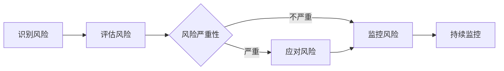

                 

## 1. 背景介绍

在当今快速变化的商业环境中，风险无处不在。从供应链中断到市场需求变化，再到技术故障，企业面临着各种各样的风险。有效管理这些风险是确保企业持续成功的关键。本文将深入探讨风险管理的核心概念、算法原理、数学模型，并提供实践项目和工具推荐，帮助读者预防和应对商业风险。

## 2. 核心概念与联系

风险管理是指识别、评估、应对和监控风险的过程。它的目的是帮助企业在面对不确定性时做出明智的决策，并最大限度地减少风险对业务的影响。风险管理的核心概念包括：

- **风险识别**：识别可能影响企业目标的事件或条件。
- **风险评估**：评估风险的可能性和影响，以确定其严重性。
- **风险应对**：制定计划以减少风险或缓解其影响。
- **风险监控**：持续监控风险，并根据需要调整风险管理计划。

下面是风险管理过程的 Mermaid 流程图：



## 3. 核心算法原理 & 具体操作步骤

### 3.1 算法原理概述

风险管理算法的核心原理是基于可能性和影响评估风险，并根据其严重性采取相应的措施。常用的风险管理算法包括决策树、模糊逻辑和 Monte Carlo 仿真。

### 3.2 算法步骤详解

1. **风险识别**：列出所有可能影响企业目标的事件或条件。
2. **风险评估**：为每个风险分配可能性和影响评分。可能性评分通常在 0 到 1 之间，表示风险发生的概率。影响评分则表示风险对企业目标的影响程度。
3. **风险严重性评估**：使用可能性和影响评分计算风险严重性。常用的方法是使用可能性乘以影响的乘积。
4. **风险应对**：根据风险严重性，制定计划减少风险或缓解其影响。常用的应对策略包括接受、转移、减少和规避。
5. **风险监控**：持续监控风险，并根据需要调整风险管理计划。

### 3.3 算法优缺点

**优点**：

- 有助于企业做出明智的决策。
- 有助于减少风险对业务的影响。
- 有助于提高企业的可预测性和稳定性。

**缺点**：

- 需要大量时间和资源来识别和评估风险。
- 可能会导致过度风险规避，从而错失机会。
- 可能会导致风险忽视，从而导致严重后果。

### 3.4 算法应用领域

风险管理算法在各个行业都有广泛的应用，包括金融、保险、能源、交通、制造等。它也可以应用于项目管理、供应链管理和企业战略决策中。

## 4. 数学模型和公式 & 详细讲解 & 举例说明

### 4.1 数学模型构建

风险管理的数学模型通常基于可能性和影响评分构建。可能性通常使用概率分布表示，影响则使用线性或非线性函数表示。

### 4.2 公式推导过程

风险严重性可以使用以下公式计算：

$$R = P \times I$$

其中，$R$ 是风险严重性，$P$ 是可能性评分，$I$ 是影响评分。

### 4.3 案例分析与讲解

假设一家企业面临着供应链中断的风险。可能性评分为 0.3（30% 的概率），影响评分为 8（严重影响企业目标）。那么，风险严重性为：

$$R = 0.3 \times 8 = 2.4$$

根据风险严重性，企业可以制定计划减少风险或缓解其影响。

## 5. 项目实践：代码实例和详细解释说明

### 5.1 开发环境搭建

本项目使用 Python 编程语言，并需要安装 NumPy、Pandas 和 Matplotlib 库。

### 5.2 源代码详细实现

```python
import numpy as np
import pandas as pd
import matplotlib.pyplot as plt

# 定义风险数据
risks = {
    '风险1': {'可能性': 0.2, '影响': 7},
    '风险2': {'可能性': 0.5, '影响': 5},
    '风险3': {'可能性': 0.8, '影响': 3},
}

# 计算风险严重性
risk_severity = {}
for risk, data in risks.items():
    risk_severity[risk] = data['可能性'] * data['影响']

# 打印风险严重性
print("风险严重性：")
for risk, severity in risk_severity.items():
    print(f"{risk}: {severity}")

# 绘制风险严重性图
plt.bar(risk_severity.keys(), risk_severity.values())
plt.xlabel('风险')
plt.ylabel('严重性')
plt.title('风险严重性')
plt.show()
```

### 5.3 代码解读与分析

代码首先定义了风险数据，包括可能性和影响评分。然后，它计算每个风险的严重性，并打印结果。最后，它绘制了风险严重性图，以直观地显示风险严重性。

### 5.4 运行结果展示

运行结果将显示每个风险的严重性，并绘制风险严重性图。根据严重性，企业可以制定计划减少风险或缓解其影响。

## 6. 实际应用场景

风险管理在各个行业都有广泛的应用。例如，在金融行业，风险管理用于识别和评估市场风险、信用风险和操作风险。在能源行业，风险管理用于识别和评估供应链中断、设备故障和自然灾害等风险。

### 6.1 当前应用

当前，风险管理在企业中广泛应用，用于识别和评估各种风险，并制定计划减少风险或缓解其影响。

### 6.2 未来应用展望

随着人工智能和大数据技术的发展，风险管理将变得更加智能和精确。企业将能够使用实时数据和预测模型来识别和评估风险，并实时调整风险管理计划。

## 7. 工具和资源推荐

### 7.1 学习资源推荐

- "风险管理：预防和应对商业风险的技巧" 书籍
- "风险管理与控制" 课程
- "风险管理" 维基百科页面

### 7.2 开发工具推荐

- Python：用于风险管理算法实现。
- R：用于统计分析和数据可视化。
- Power BI：用于风险数据可视化。

### 7.3 相关论文推荐

- "Enterprise Risk Management: A New Paradigm" (2002)
- "Risk Management: A Guide to the COSO Framework" (2004)
- "Integrated Risk Management: A New Approach to Enterprise Risk Management" (2013)

## 8. 总结：未来发展趋势与挑战

### 8.1 研究成果总结

本文介绍了风险管理的核心概念、算法原理、数学模型，并提供了实践项目和工具推荐。它展示了如何识别、评估、应对和监控风险，以帮助企业在面对不确定性时做出明智的决策。

### 8.2 未来发展趋势

未来，风险管理将变得更加智能和精确。企业将能够使用实时数据和预测模型来识别和评估风险，并实时调整风险管理计划。

### 8.3 面临的挑战

风险管理面临的挑战包括识别和评估所有可能的风险，制定有效的应对策略，并持续监控风险。

### 8.4 研究展望

未来的研究将关注风险管理的智能化、实时化和自动化。此外，研究还将关注风险管理在各个行业的具体应用，以及如何将风险管理与企业战略和运营更好地结合起来。

## 9. 附录：常见问题与解答

**Q：风险管理的目的是什么？**

A：风险管理的目的是帮助企业在面对不确定性时做出明智的决策，并最大限度地减少风险对业务的影响。

**Q：风险管理的核心概念是什么？**

A：风险管理的核心概念包括风险识别、风险评估、风险应对和风险监控。

**Q：如何计算风险严重性？**

A：风险严重性可以使用可能性乘以影响的乘积计算。

---

作者：禅与计算机程序设计艺术 / Zen and the Art of Computer Programming

