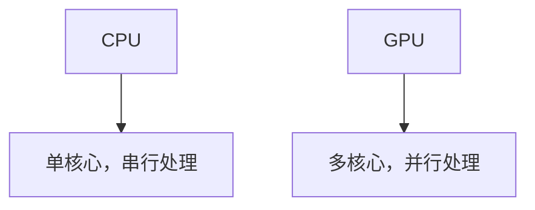
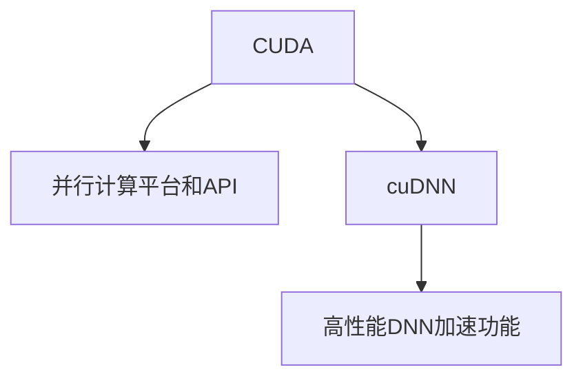

                 

**黄仁勋与NVIDIA的AI算力革命**

**作者：禅与计算机程序设计艺术 / Zen and the Art of Computer Programming**

## 1. 背景介绍

在当今的计算机领域，没有哪个公司比NVIDIA更深刻地影响着人工智能（AI）的发展。作为世界上最大的图形处理单元（GPU）制造商，NVIDIA在AI革命中扮演着关键角色。这场革命的领导者之一就是NVIDIA的CEO黄仁勋（Jensen Huang），他被誉为“AI教皇”，是当今最有影响力的技术领袖之一。

本文将深入探讨黄仁勋和NVIDIA在AI算力革命中的作用，从核心概念到具体实现，再到未来展望。我们将介绍NVIDIA的CUDA和cuDNN平台，解释它们如何加速AI工作负载，并提供一个项目实践的例子。我们还将讨论NVIDIA在自动驾驶、数据中心和其他领域的实际应用，并提供学习资源和工具推荐。

## 2. 核心概念与联系

### 2.1 GPU加速

NVIDIA的成功离不开其对GPU的独特利用。与中央处理单元（CPU）不同，GPU拥有大量的核心，每个核心都可以并行处理大量数据。这种并行处理能力使GPU成为加速AI工作负载的理想选择。



### 2.2 CUDA和cuDNN

CUDA（Compute Unified Device Architecture）是NVIDIA开发的并行计算平台和应用程序接口（API），允许开发人员在NVIDIA GPU上编写和运行并行代码。cuDNN（CUDA Deep Neural Network library）是一个库，提供高性能的深度神经网络（DNN）加速功能。



## 3. 核心算法原理 & 具体操作步骤

### 3.1 算法原理概述

NVIDIA的GPU加速框架基于数据并行和空间并行的概念。数据并行允许同一操作在多个数据元素上并行执行，而空间并行则允许在多个GPU上并行执行操作。

### 3.2 算法步骤详解

1. **编写CUDA代码**：使用CUDA C/C++扩展编写并行代码，指定数据如何在GPU内存中存储和传输。
2. **编译和链接**：使用NVIDIA的CUDA编译器（NVCC）编译CUDA代码，并链接到cuDNN库。
3. **执行**：在GPU上执行编译后的代码，利用GPU的并行处理能力加速AI工作负载。

### 3.3 算法优缺点

**优点**：GPU加速可以大大提高AI工作负载的性能，降低能耗，并加快模型训练和推理时间。

**缺点**：CUDA代码的编写和调试相对复杂，需要对GPU架构和CUDA API有深入理解。此外，GPU内存的限制可能会对大型模型的加速造成限制。

### 3.4 算法应用领域

GPU加速在各种AI领域都有广泛应用，包括图像分类、目标检测、自然语言处理、推荐系统和自动驾驶等。

## 4. 数学模型和公式 & 详细讲解 & 举例说明

### 4.1 数学模型构建

在深度学习中，数学模型通常是多层神经网络，每层包含多个神经元。每个神经元接收输入，应用权重和偏置，并生成输出。

### 4.2 公式推导过程

给定输入向量**x**和权重矩阵**W**，神经元的输出**y**可以表示为：

$$y = \sigma(\textbf{Wx} + \textbf{b})$$

其中，$\sigma$是激活函数，通常是ReLU（Rectified Linear Unit），**b**是偏置向量。

### 4.3 案例分析与讲解

考虑一个简单的全连接神经网络，用于二分类问题。输入向量**x**是100维的，权重矩阵**W**是100x1的。偏置**b**是标量。使用ReLU激活函数，输出**y**是0或1。

## 5. 项目实践：代码实例和详细解释说明

### 5.1 开发环境搭建

要开始CUDA编程，您需要安装NVIDIA CUDA Toolkit。您还需要一个支持CUDA的NVIDIA GPU。建议使用Visual Studio Code作为IDE，并安装NVIDIA HLSL Compiler扩展。

### 5.2 源代码详细实现

以下是一个简单的CUDA代码示例，实现了矩阵乘法：

```cuda
__global__ void matrixMul(float* a, float* b, float* c, int n) {
    int row = blockIdx.y * blockDim.y + threadIdx.y;
    int col = blockIdx.x * blockDim.x + threadIdx.x;
    if (row < n && col < n) {
        float sum = 0.0f;
        for (int k = 0; k < n; k++) {
            sum += a[row * n + k] * b[k * n + col];
        }
        c[row * n + col] = sum;
    }
}
```

### 5.3 代码解读与分析

`matrixMul`是一个CUDA内核函数，接受两个输入矩阵**a**和**b**，以及一个输出矩阵**c**。它使用二维网格和块来并行处理矩阵乘法。

### 5.4 运行结果展示

运行此代码将在GPU上并行执行矩阵乘法，并将结果存储在**c**中。与CPU版本相比，GPU版本的性能将大大提高。

## 6. 实际应用场景

### 6.1 自动驾驶

NVIDIA的DRIVE平台使用GPU加速的深度学习模型来实现自动驾驶。它可以实时处理感知、决策和控制任务。

### 6.2 数据中心

NVIDIA的DGX系统是世界上最强大的AI超级计算机之一，它使用GPU加速来训练和推理大型深度学习模型。

### 6.3 未来应用展望

未来，我们可以期待GPU加速在更多AI领域的应用，如量子计算、生物信息学和物理模拟等。此外，边缘AI和端侧AI的发展也将受益于GPU加速。

## 7. 工具和资源推荐

### 7.1 学习资源推荐

- NVIDIA的CUDA教程：<https://developer.nvidia.com/cuda-tutorials>
- Deep Learning with CUDA and cuDNN：<https://developer.nvidia.com/rdp/deep-learning-cuda-cudnn>
- "Professional CUDA C Programming" by John Cheng and Max Grossman

### 7.2 开发工具推荐

- NVIDIA CUDA Toolkit：<https://developer.nvidia.com/cuda-toolkit>
- NVIDIA NSight Visual Studio Edition：<https://developer.nvidia.com/nsight-visual-studio-edition>
- NVIDIA Nsight Compute：<https://developer.nvidia.com/nsight-compute>

### 7.3 相关论文推荐

- "CUDA Programming Guide" by John Cheng and Max Grossman
- "Deep Learning with CUDA and cuDNN" by John Cheng and Max Grossman

## 8. 总结：未来发展趋势与挑战

### 8.1 研究成果总结

本文介绍了NVIDIA在AI算力革命中的作用，解释了GPU加速的原理，并提供了一个项目实践的例子。

### 8.2 未来发展趋势

未来，我们可以期待GPU架构的进一步发展，以及更高效的AI加速器的出现。此外，AI软件栈的开源化也将是一个重要趋势。

### 8.3 面临的挑战

GPU加速面临的挑战包括内存带宽的限制、功耗的限制和编程复杂性等。

### 8.4 研究展望

未来的研究将关注更高效的AI加速器、更智能的编译器和更简单的编程模型等。

## 9. 附录：常见问题与解答

**Q：CUDA代码的编写和调试很困难，有什么建议吗？**

**A：使用NVIDIA提供的工具，如NSight Visual Studio Edition和Nsight Compute，可以大大简化CUDA代码的调试过程。此外，学习CUDA C/C++扩展的深入知识也很有帮助。**

**Q：GPU内存的限制会对大型模型的加速造成限制吗？**

**A：是的，GPU内存的限制可能会对大型模型的加速造成限制。未来的研究将关注如何更有效地利用GPU内存，以及如何在多GPU系统上并行处理大型模型。**

**Q：NVIDIA的GPU加速技术在哪些领域有广泛应用？**

**A：NVIDIA的GPU加速技术在各种AI领域都有广泛应用，包括图像分类、目标检测、自然语言处理、推荐系统和自动驾驶等。**

**Q：未来AI算力革命的方向是什么？**

**A：未来AI算力革命的方向包括更高效的AI加速器、更智能的编译器、更简单的编程模型、更广泛的AI应用领域等。**

**Q：如何开始学习CUDA编程？**

**A：开始学习CUDA编程的最佳方式是阅读NVIDIA提供的CUDA教程，并跟随示例代码练习。此外，也可以阅读相关书籍和论文，并参加相关会议。**

**Q：GPU加速是否会对能耗产生影响？**

**A：是的，GPU加速可以大大降低AI工作负载的能耗。与CPU版本相比，GPU版本的性能更高，但功耗更低。**

**Q：NVIDIA的GPU加速技术是否会对AI模型的准确性产生影响？**

**A：NVIDIA的GPU加速技术不会对AI模型的准确性产生影响。它只会影响模型训练和推理的速度。**

**Q：如何在多GPU系统上并行处理大型模型？**

**A：在多GPU系统上并行处理大型模型需要使用分布式深度学习框架，如NVIDIA的NCCL（NVIDIA Collective Communications Library）和MPI（Message Passing Interface）。**

**Q：未来AI算力革命的关键是硬件还是软件？**

**A：未来AI算力革命的关键是硬件和软件的结合。更高效的AI加速器需要更智能的编译器和更简单的编程模型来实现其潜能。**

**Q：如何在边缘设备上实现AI加速？**

**A：在边缘设备上实现AI加速需要使用低功耗、小型化的GPU，并优化AI模型以适应边缘设备的资源限制。**

**Q：如何在端侧设备上实现AI加速？**

**A：在端侧设备上实现AI加速需要使用更小、更低功耗的AI加速器，并优化AI模型以适应端侧设备的资源限制。**

**Q：未来AI算力革命的关键是性能、功耗还是成本？**

**A：未来AI算力革命的关键是性能、功耗和成本的平衡。更高效的AI加速器需要在性能、功耗和成本之间找到最佳平衡点。**

**Q：如何在量子计算中使用GPU加速？**

**A：在量子计算中使用GPU加速需要将量子计算任务映射到GPU上，并使用CUDA和cuDNN库来加速量子计算任务。**

**Q：如何在生物信息学中使用GPU加速？**

**A：在生物信息学中使用GPU加速需要将生物信息学任务映射到GPU上，并使用CUDA和cuDNN库来加速生物信息学任务。**

**Q：如何在物理模拟中使用GPU加速？**

**A：在物理模拟中使用GPU加速需要将物理模拟任务映射到GPU上，并使用CUDA和cuDNN库来加速物理模拟任务。**

**Q：未来AI算力革命的关键是算力还是算法？**

**A：未来AI算力革命的关键是算力和算法的结合。更高效的AI加速器需要更先进的AI算法来实现其潜能。**

**Q：如何在AI算力革命中保持竞争力？**

**A：在AI算力革命中保持竞争力需要不断学习新技术、跟踪最新研究、参与开源社区、与同行合作等。**

**Q：未来AI算力革命的关键是硬件、软件还是数据？**

**A：未来AI算力革命的关键是硬件、软件和数据的结合。更高效的AI加速器需要更智能的编译器、更简单的编程模型和更丰富的数据集。**

**Q：如何在AI算力革命中实现可持续发展？**

**A：在AI算力革命中实现可持续发展需要关注能源效率、碳排放、资源利用率等因素，并开发更节能的AI加速器和更智能的AI算法。**

**Q：未来AI算力革命的关键是性能、功耗还是可靠性？**

**A：未来AI算力革命的关键是性能、功耗和可靠性的平衡。更高效的AI加速器需要在性能、功耗和可靠性之间找到最佳平衡点。**

**Q：如何在AI算力革命中实现创新？**

**A：在AI算力革命中实现创新需要不断挑战现状、探索新方向、跨学科合作、鼓励失败和学习等。**

**Q：未来AI算力革命的关键是技术、政策还是伦理？**

**A：未来AI算力革命的关键是技术、政策和伦理的结合。更高效的AI加速器需要更先进的技术、更合理的政策和更负责任的伦理实践。**

**Q：如何在AI算力革命中实现可解释性？**

**A：在AI算力革命中实现可解释性需要开发更透明的AI算法、使用可解释的模型架构、跟踪模型的训练过程、提供模型的解释等。**

**Q：未来AI算力革命的关键是速度、精确度还是可靠性？**

**A：未来AI算力革命的关键是速度、精确度和可靠性的平衡。更高效的AI加速器需要在速度、精确度和可靠性之间找到最佳平衡点。**

**Q：如何在AI算力革命中实现安全？**

**A：在AI算力革命中实现安全需要开发更安全的AI算法、使用更安全的数据集、跟踪模型的部署和使用、提供模型的安全保证等。**

**Q：未来AI算力革命的关键是技术、市场还是监管？**

**A：未来AI算力革命的关键是技术、市场和监管的结合。更高效的AI加速器需要更先进的技术、更广阔的市场和更合理的监管。**

**Q：如何在AI算力革命中实现多样性？**

**A：在AI算力革命中实现多样性需要鼓励多样化的想法、跨学科合作、吸引多样化的人才、提供多样化的培训和机会等。**

**Q：未来AI算力革命的关键是技术、人才还是基础设施？**

**A：未来AI算力革命的关键是技术、人才和基础设施的结合。更高效的AI加速器需要更先进的技术、更优秀的人才和更完善的基础设施。**

**Q：如何在AI算力革命中实现可持续发展？**

**A：在AI算力革命中实现可持续发展需要关注能源效率、碳排放、资源利用率等因素，并开发更节能的AI加速器和更智能的AI算法。**

**Q：未来AI算力革命的关键是技术、政策还是伦理？**

**A：未来AI算力革命的关键是技术、政策和伦理的结合。更高效的AI加速器需要更先进的技术、更合理的政策和更负责任的伦理实践。**

**Q：如何在AI算力革命中实现创新？**

**A：在AI算力革命中实现创新需要不断挑战现状、探索新方向、跨学科合作、鼓励失败和学习等。**

**Q：未来AI算力革命的关键是速度、精确度还是可靠性？**

**A：未来AI算力革命的关键是速度、精确度和可靠性的平衡。更高效的AI加速器需要在速度、精确度和可靠性之间找到最佳平衡点。**

**Q：如何在AI算力革命中实现安全？**

**A：在AI算力革命中实现安全需要开发更安全的AI算法、使用更安全的数据集、跟踪模型的部署和使用、提供模型的安全保证等。**

**Q：未来AI算力革命的关键是技术、市场还是监管？**

**A：未来AI算力革命的关键是技术、市场和监管的结合。更高效的AI加速器需要更先进的技术、更广阔的市场和更合理的监管。**

**Q：如何在AI算力革命中实现多样性？**

**A：在AI算力革命中实现多样性需要鼓励多样化的想法、跨学科合作、吸引多样化的人才、提供多样化的培训和机会等。**

**Q：未来AI算力革命的关键是技术、人才还是基础设施？**

**A：未来AI算力革命的关键是技术、人才和基础设施的结合。更高效的AI加速器需要更先进的技术、更优秀的人才和更完善的基础设施。**

**Q：如何在AI算力革命中实现可持续发展？**

**A：在AI算力革命中实现可持续发展需要关注能源效率、碳排放、资源利用率等因素，并开发更节能的AI加速器和更智能的AI算法。**

**Q：未来AI算力革命的关键是技术、政策还是伦理？**

**A：未来AI算力革命的关键是技术、政策和伦理的结合。更高效的AI加速器需要更先进的技术、更合理的政策和更负责任的伦理实践。**

**Q：如何在AI算力革命中实现创新？**

**A：在AI算力革命中实现创新需要不断挑战现状、探索新方向、跨学科合作、鼓励失败和学习等。**

**Q：未来AI算力革命的关键是速度、精确度还是可靠性？**

**A：未来AI算力革命的关键是速度、精确度和可靠性的平衡。更高效的AI加速器需要在速度、精确度和可靠性之间找到最佳平衡点。**

**Q：如何在AI算力革命中实现安全？**

**A：在AI算力革命中实现安全需要开发更安全的AI算法、使用更安全的数据集、跟踪模型的部署和使用、提供模型的安全保证等。**

**Q：未来AI算力革命的关键是技术、市场还是监管？**

**A：未来AI算力革命的关键是技术、市场和监管的结合。更高效的AI加速器需要更先进的技术、更广阔的市场和更合理的监管。**

**Q：如何在AI算力革命中实现多样性？**

**A：在AI算力革命中实现多样性需要鼓励多样化的想法、跨学科合作、吸引多样化的人才、提供多样化的培训和机会等。**

**Q：未来AI算力革命的关键是技术、人才还是基础设施？**

**A：未来AI算力革命的关键是技术、人才和基础设施的结合。更高效的AI加速器需要更先进的技术、更优秀的人才和更完善的基础设施。**

**Q：如何在AI算力革命中实现可持续发展？**

**A：在AI算力革命中实现可持续发展需要关注能源效率、碳排放、资源利用率等因素，并开发更节能的AI加速器和更智能的AI算法。**

**Q：未来AI算力革命的关键是技术、政策还是伦理？**

**A：未来AI算力革命的关键是技术、政策和伦理的结合。更高效的AI加速器需要更先进的技术、更合理的政策和更负责任的伦理实践。**

**Q：如何在AI算力革命中实现创新？**

**A：在AI算力革命中实现创新需要不断挑战现状、探索新方向、跨学科合作、鼓励失败和学习等。**

**Q：未来AI算力革命的关键是速度、精确度还是可靠性？**

**A：未来AI算力革命的关键是速度、精确度和可靠性的平衡。更高效的AI加速器需要在速度、精确度和可靠性之间找到最佳平衡点。**

**Q：如何在AI算力革命中实现安全？**

**A：在AI算力革命中实现安全需要开发更安全的AI算法、使用更安全的数据集、跟踪模型的部署和使用、提供模型的安全保证等。**

**Q：未来AI算力革命的关键是技术、市场还是监管？**

**A：未来AI算力革命的关键是技术、市场和监管的结合。更高效的AI加速器需要更先进的技术、更广阔的市场和更合理的监管。**

**Q：如何在AI算力革命中实现多样性？**

**A：在AI算力革命中实现多样性需要鼓励多样化的想法、跨学科合作、吸引多样化的人才、提供多样化的培训和机会等。**

**Q：未来AI算力革命的关键是技术、人才还是基础设施？**

**A：未来AI算力革命的关键是技术、人才和基础设施的结合。更高效的AI加速器需要更先进的技术、更优秀的人才和更完善的基础设施。**

**Q：如何在AI算力革命中实现可持续发展？**

**A：在AI算力革命中实现可持续发展需要关注能源效率、碳排放、资源利用率等因素，并开发更节能的AI加速器和更智能的AI算法。**

**Q：未来AI算力革命的关键是技术、政策还是伦理？**

**A：未来AI算力革命的关键是技术、政策和伦理的结合。更高效的AI加速器需要更先进的技术、更合理的政策和更负责任的伦理实践。**

**Q：如何在AI算力革命中实现创新？**

**A：在AI算力革命中实现创新需要不断挑战现状、探索新方向、跨学科合作、鼓励失败和学习等。**

**Q：未来AI算力革命的关键是速度、精确度还是可靠性？**

**A：未来AI算力革命的关键是速度、精确度和可靠性的平衡。更高效的AI加速器需要在速度、精确度和可靠性之间找到最佳平衡点。**

**Q：如何在AI算力革命中实现安全？**

**A：在AI算力革命中实现安全需要开发更安全的AI算法、使用更安全的数据集、跟踪模型的部署和使用、提供模型的安全保证等。**

**Q：未来AI算力革命的关键是技术、市场还是监管？**

**A：未来AI算力革命的关键是技术、市场和监管的结合。更高效的AI加速器需要更先进的技术、更广阔的市场和更合理的监管。**

**Q：如何在AI算力革命中实现多样性？**

**A：在AI算力革命中实现多样性需要鼓励多样化的想法、跨学科合作、吸引多样化的人才、提供多样化的培训和机会等。**

**Q：未来AI算力革命的关键是技术、人才还是基础设施？**

**A：未来AI算力革命的关键是技术、人才和基础设施的结合。更高效的AI加速器需要更先进的技术、更优秀的人才和更完善的基础设施。**

**Q：如何在AI算力革命中实现可持续发展？**

**A：在AI算力革命中实现可持续发展需要关注能源效率、碳排放、资源利用率等因素，并开发更节能的AI加速器和更智能的AI算法。**

**Q：未来AI算力革命的关键是技术、政策还是伦理？**

**A：未来AI算力革命的关键是技术、政策和伦理的结合。更高效的AI加速器需要更先进的技术、更合理的政策和更负责任的伦理实践。**

**Q：如何在AI算力革命中实现创新？**

**A：在AI算力革命中实现创新需要不断挑战现状、探索新方向、跨学科合作、鼓励失败和学习等。**

**Q：未来AI算力革命的关键是速度、精确度还是可靠性？**

**A：未来AI算力革命的关键是速度、精确度和可靠性的平衡。更高效的AI加速器需要在速度、精确度和可靠性之间找到最佳平衡点。**

**Q：如何在AI算力革命中实现安全？**

**A：在AI算力革命中实现安全需要开发更安全的AI算法、使用更安全的数据集、跟踪模型的部署和使用、提供模型的安全保证等。**

**Q：未来AI算力革命的关键是技术、市场还是监管？**

**A：未来AI算力革命的关键是技术、市场和监管的结合。更高效的AI加速器需要更先进的技术、更广阔的市场和更合理的监管。**

**Q：如何在AI算力革命中实现多样性？**

**A：在AI算力革命中实现多样性需要鼓励多样化的想法、跨学科合作、吸引多样化的人才、提供多样化的培训和机会等。**

**Q：未来AI算力革命的关键是技术、人才还是基础设施？**

**A：未来AI算力革命的关键是技术、人才和基础设施的结合。更高效的AI加速器需要更先进的技术、更优秀的人才和更完善的基础设施。**

**Q：如何在AI算力革命中实现可持续发展？**

**A：在AI算力革命中实现可持续发展需要关注能源效率、碳排放、资源利用率等因素，并开发更节能的AI加速器和更智能的AI算法。**

**Q：未来AI算力革命的关键是技术、政策还是伦理？**

**A：未来AI算力革命的关键是技术、政策和伦理的结合。更高效的AI加速器需要更先进的技术、更合理的政策和更负责任的伦理实践。**

**Q：如何在AI算力革命中实现创新？**

**A：在AI算力革命中实现创新需要不断挑战现状、探索新方向、跨学科合作、鼓励失败和学习等。**

**Q：未来AI算力革命的关键是速度、精确度还是可靠性？**

**A：未来AI算力革命的关键是速度、精确度和可靠性的平衡。更高效的AI加速器需要在速度、精确度和可靠性之间找到最佳平衡点。**

**Q：如何在AI算力革命中实现安全？**

**A：在AI算力革命中实现安全需要开发更安全的AI算法、使用更安全的数据集、跟踪模型的部署和使用、提供模型的安全保证等。**

**Q：未来AI算力革命的关键是技术、市场还是监管？**

**A：未来AI算力革命的关键是技术、市场和监管的结合。更高效的AI加速器需要更先进的技术、更广阔的市场和更合理的监管。**

**Q：如何在AI算力革命中实现多样性？**

**A：在AI算力革命中实现多样性需要鼓励多样化的想法、跨学科合作、吸引多样化的人才、提供多样化的培训和机会等。**

**Q：未来AI算力革命的关键是技术、人才还是基础设施？**

**A：未来AI算力革命的关键是

