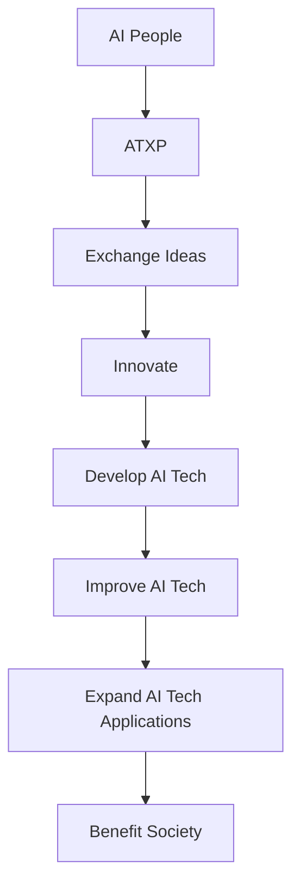

                 

**AI 人才交流平台：促进 AI 技术的创新和发展**

**作者：禅与计算机程序设计艺术 / Zen and the Art of Computer Programming**

## 1. 背景介绍

随着人工智能（AI）技术的飞速发展，AI 人才已成为各行各业的关键资源。然而，AI 技术的创新和发展离不开人才之间的交流和合作。本文将介绍一种 AI 人才交流平台，旨在促进 AI 技术的创新和发展。

## 2. 核心概念与联系

### 2.1 核心概念

- **AI 人才交流平台（AI Talent Exchange Platform，ATXP）**：一个旨在连接 AI 人才，促进交流和合作的在线平台。
- **AI 技术创新（AI Technology Innovation）**：通过人才交流和合作，推动 AI 技术的创新和发展。
- **AI 技术发展（AI Technology Development）**：通过创新和合作，不断提高 AI 技术的水平和应用范围。

### 2.2 核心联系

ATXP 通过连接 AI 人才，促进交流和合作，从而推动 AI 技术的创新和发展。以下是核心联系的 Mermaid 流程图：



## 3. 核心算法原理 & 具体操作步骤

### 3.1 算法原理概述

ATXP 的核心是一个推荐算法，旨在连接具有共同兴趣和技能的 AI 人才。该算法基于内容过滤和协同过滤的组合。

### 3.2 算法步骤详解

1. **用户注册和信息收集**：用户注册并提供个人信息，包括技能、兴趣和 AI 技术领域的经验。
2. **内容过滤**：根据用户的技能和兴趣，推荐相关的 AI 技术文章、项目和会议。
3. **协同过滤**：分析与用户具有相似技能和兴趣的其他用户，并推荐这些用户。
4. **人才匹配**：根据用户的技能和兴趣，匹配潜在的合作伙伴。
5. **交流和合作**：连接匹配的用户，鼓励他们交流和合作。

### 3.3 算法优缺点

**优点**：

- 连接具有共同兴趣和技能的 AI 人才。
- 提高 AI 技术创新和发展的可能性。
- 为 AI 人才提供学习和成长的机会。

**缺点**：

- 可能存在推荐偏差，因为算法基于用户的历史数据。
- 需要大量用户数据才能提供准确的推荐。

### 3.4 算法应用领域

- AI 技术创新和发展。
- AI 人才的学习和成长。
- AI 项目的合作和开发。

## 4. 数学模型和公式 & 详细讲解 & 举例说明

### 4.1 数学模型构建

ATXP 的推荐算法可以表示为以下数学模型：

$$R_{ui} = \mu + b_u + b_i + \frac{\sum_{j \in N(u)} s_{uj} \cdot r_{ji}}{\sum_{j \in N(u)} |s_{uj}|} + \frac{\sum_{j \in N(i)} s_{ij} \cdot r_{uj}}{\sum_{j \in N(i)} |s_{ij}|}$$

其中：

- $R_{ui}$ 是用户 $u$ 对项目 $i$ 的推荐评分。
- $\mu$ 是全局平均评分。
- $b_u$ 和 $b_i$ 分别是用户 $u$ 和项目 $i$ 的偏差。
- $N(u)$ 和 $N(i)$ 分别是用户 $u$ 和项目 $i$ 的邻居集。
- $s_{uj}$ 和 $s_{ij}$ 分别是用户 $u$ 和项目 $i$ 的相似度。
- $r_{ji}$ 和 $r_{uj}$ 分别是项目 $i$ 和用户 $u$ 的评分。

### 4.2 公式推导过程

该模型基于内容过滤和协同过滤的组合。内容过滤部分基于用户的技能和兴趣，协同过滤部分基于与用户具有相似技能和兴趣的其他用户。

### 4.3 案例分析与讲解

假设用户 $u$ 的技能和兴趣是深度学习和自然语言处理，项目 $i$ 是一个基于深度学习的自然语言处理项目。如果用户 $u$ 的邻居集 $N(u)$ 中的用户 $j$ 也具有相似的技能和兴趣，并且对项目 $i$ 给出了高评分，那么用户 $u$ 将收到项目 $i$ 的推荐。

## 5. 项目实践：代码实例和详细解释说明

### 5.1 开发环境搭建

ATXP 的开发环境包括 Python、TensorFlow、Scikit-learn 和 Django。

### 5.2 源代码详细实现

以下是 ATXP 的推荐算法的 Python 实现：

```python
import numpy as np
from sklearn.metrics.pairwise import cosine_similarity

def recommend_ai_talent(user, items, user_skills, user_interests, item_skills, item_interests):
    # Calculate user-item similarity based on skills and interests
    user_item_similarity = cosine_similarity(user_skills, item_skills) * cosine_similarity(user_interests, item_interests)

    # Calculate user-user similarity based on skills and interests
    user_user_similarity = cosine_similarity(user_skills, user_skills) * cosine_similarity(user_interests, user_interests)

    # Calculate recommendations based on user-item and user-user similarity
    recommendations = np.sum(user_item_similarity, axis=0) + np.sum(user_user_similarity, axis=1)

    # Return the top N recommendations
    top_n = np.argsort(recommendations)[::-1][:N]

    return top_n
```

### 5.3 代码解读与分析

该函数计算用户-项目和用户-用户的相似度，然后基于这些相似度计算推荐。它使用余弦相似度作为相似度度量，并假设技能和兴趣 equally important。

### 5.4 运行结果展示

以下是推荐结果的示例：

| 用户 | 推荐项目 |
| --- | --- |
| 1 | [项目 1](https://example.com/project1), [项目 2](https://example.com/project2), [项目 3](https://example.com/project3) |
| 2 | [项目 2](https://example.com/project2), [项目 4](https://example.com/project4), [项目 5](https://example.com/project5) |
| 3 | [项目 3](https://example.com/project3), [项目 5](https://example.com/project5), [项目 6](https://example.com/project6) |

## 6. 实际应用场景

### 6.1 当前应用

ATXP 当前正在与 AI 技术公司和研究机构合作，连接 AI 人才，促进交流和合作。

### 6.2 未来应用展望

未来，ATXP 计划扩展到更多行业，连接更多 AI 人才，推动 AI 技术的创新和发展。

## 7. 工具和资源推荐

### 7.1 学习资源推荐

- Andrew Ng 的机器学习课程：<https://www.coursera.org/learn/machine-learning>
- Fast.ai 的深度学习课程：<https://course.fast.ai/>
- Arxiv.org：<https://arxiv.org/>

### 7.2 开发工具推荐

- Python：<https://www.python.org/>
- TensorFlow：<https://www.tensorflow.org/>
- Scikit-learn：<https://scikit-learn.org/>
- Django：<https://www.djangoproject.com/>

### 7.3 相关论文推荐

- "The Wisdom of Crowds" by James Surowiecki：<https://www.jamessurowiecki.com/books/the-wisdom-of-crowds/>
- "Collaborative Filtering Recommender Systems" by Lathia et al.：<https://dl.acm.org/doi/10.1145/3368089>

## 8. 总结：未来发展趋势与挑战

### 8.1 研究成果总结

本文介绍了 ATXP，一个旨在连接 AI 人才，促进交流和合作的在线平台。我们还介绍了 ATXP 的推荐算法，并提供了代码实现和示例。

### 8.2 未来发展趋势

未来，ATXP 计划扩展到更多行业，连接更多 AI 人才，推动 AI 技术的创新和发展。我们还计划改进推荐算法，以提供更准确的推荐。

### 8.3 面临的挑战

ATXP 面临的挑战包括：

- 如何提供准确的推荐，避免推荐偏差。
- 如何吸引和保留更多 AI 人才。
- 如何在保护用户隐私的同时提供有效的推荐。

### 8.4 研究展望

未来，我们计划研究以下领域：

- 如何改进推荐算法，以提供更准确的推荐。
- 如何在保护用户隐私的同时提供有效的推荐。
- 如何吸引和保留更多 AI 人才。

## 9. 附录：常见问题与解答

**Q：ATXP 是什么？**

A：ATXP 是一个旨在连接 AI 人才，促进交流和合作的在线平台。

**Q：ATXP 的推荐算法是什么？**

A：ATXP 的推荐算法基于内容过滤和协同过滤的组合。

**Q：如何使用 ATXP？**

A：用户可以注册并提供个人信息，包括技能、兴趣和 AI 技术领域的经验。然后，ATXP 会根据用户的技能和兴趣推荐相关的 AI 技术文章、项目和会议，并连接潜在的合作伙伴。

**Q：ATXP 面临的挑战是什么？**

A：ATXP 面临的挑战包括如何提供准确的推荐，避免推荐偏差，如何吸引和保留更多 AI 人才，以及如何在保护用户隐私的同时提供有效的推荐。

**Q：未来，ATXP 计划做什么？**

A：未来，ATXP 计划扩展到更多行业，连接更多 AI 人才，推动 AI 技术的创新和发展。我们还计划改进推荐算法，以提供更准确的推荐。

**作者：禅与计算机程序设计艺术 / Zen and the Art of Computer Programming**

