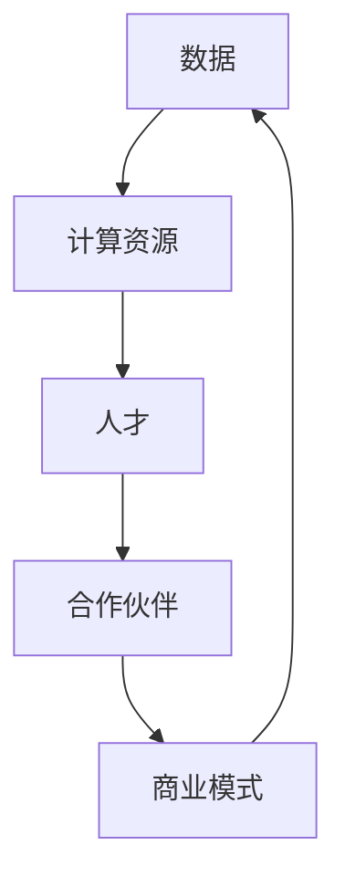

                 

## AI 大模型创业：如何利用社会优势？

> 关键词：大模型、创业、社会优势、数据、计算资源、人才、合作、商业模式

## 1. 背景介绍

当前，人工智能（AI）领域正处于大模型（Large Language Models）的发展时期。大模型是指具有数十亿参数的模型，能够理解和生成人类语言，并展示出惊人的学习和推理能力。然而，开发和部署大模型需要大量的计算资源和数据，这对初创公司和小型企业来说是一个巨大的挑战。本文将探讨如何利用社会优势来推动大模型创业。

## 2. 核心概念与联系

### 2.1 社会优势

社会优势是指一个组织或个人可以利用的外部资源，包括数据、计算资源、人才、合作伙伴等。这些资源可以帮助初创公司和小型企业克服资源不足的问题，推动大模型创业。

### 2.2 大模型创业的关键要素

大模型创业的关键要素包括数据、计算资源、人才、合作伙伴和商业模式。这些要素是相互关联的，缺一不可。例如，数据是模型训练的关键，但如果没有足够的计算资源，则无法有效利用数据。人才是开发大模型的核心，但如果没有合作伙伴的支持，则无法将模型商业化。



## 3. 核心算法原理 & 具体操作步骤

### 3.1 算法原理概述

大模型的核心算法是Transformer模型，它使用自注意力机制（Self-Attention）和位置编码（Positional Encoding）来处理序列数据。Transformer模型的优势在于它可以并行处理序列数据，从而大大提高了训练速度。

### 3.2 算法步骤详解

大模型的训练过程包括以下步骤：

1. 数据预处理：清洗、标记、分词等。
2. 模型构建：构建Transformer模型，设置参数数量、层数等。
3. 模型训练：使用预处理好的数据训练模型，调整学习率、批量大小等超参数。
4. 模型评估：使用验证集评估模型性能，调整模型参数。
5. 模型部署：将训练好的模型部署到生产环境中。

### 3.3 算法优缺点

大模型的优点包括：

* 理解和生成人类语言的能力
* 学习和推理能力
* 并行处理能力

大模型的缺点包括：

* 训练和部署需要大量的计算资源
* 数据需求量大
* 存在过拟合和泄露问题

### 3.4 算法应用领域

大模型的应用领域包括自然语言处理（NLP）、机器翻译、对话系统、搜索引擎等。

## 4. 数学模型和公式 & 详细讲解 & 举例说明

### 4.1 数学模型构建

大模型的数学模型是基于Transformer模型构建的。Transformer模型的关键组件是自注意力机制和位置编码。

自注意力机制的数学表达式如下：

$$Attention(Q, K, V) = softmax(\frac{QK^T}{\sqrt{d_k}})V$$

其中，Q、K、V分别是查询、键、值向量，d_k是键向量的维度。

位置编码的数学表达式如下：

$$PE_{(pos, 2i)} = sin(\frac{pos}{10000^{2i/d_{model}}})$$
$$PE_{(pos, 2i+1)} = cos(\frac{pos}{10000^{2i/d_{model}}})$$

其中，pos是位置，i是维度，d_model是模型的维度。

### 4.2 公式推导过程

自注意力机制的推导过程如下：

1. 计算查询、键、值向量的点积，并除以键向量的维度的平方根。
2. 使用softmax函数对上一步的结果进行归一化，得到注意力权重。
3. 将注意力权重与值向量相乘，得到最终的输出。

位置编码的推导过程如下：

1. 使用sin和cos函数生成位置编码向量。
2. 将位置编码向量与输入向量相加，得到最终的输入向量。

### 4.3 案例分析与讲解

例如，假设我们要构建一个大模型来进行机器翻译。我们首先需要收集大量的双语数据，然后使用预处理好的数据训练Transformer模型。在训练过程中，我们需要调整学习率、批量大小等超参数，并使用验证集评估模型性能。一旦模型训练完成，我们就可以将其部署到生产环境中，用于实际的机器翻译任务。

## 5. 项目实践：代码实例和详细解释说明

### 5.1 开发环境搭建

要开发大模型，我们需要搭建一个强大的开发环境。推荐使用NVIDIA A100 GPU和80GB内存，以及Linux操作系统。我们还需要安装Python、PyTorch、Transformers等相关库。

### 5.2 源代码详细实现

以下是大模型训练的源代码示例：

```python
import torch
from transformers import AutoTokenizer, AutoModelForSeq2SeqLM

# 加载预训练模型和分词器
model_name = "t5-base"
tokenizer = AutoTokenizer.from_pretrained(model_name)
model = AutoModelForSeq2SeqLM.from_pretrained(model_name)

# 准备数据
inputs = tokenizer("Translate English to French: I love you", return_tensors="pt")
labels = tokenizer("Je t'aime", return_tensors="pt")

# 训练模型
optimizer = torch.optim.AdamW(model.parameters(), lr=3e-4)
for epoch in range(10):
    outputs = model(**inputs, labels=labels["input_ids"])
    loss = outputs.loss
    loss.backward()
    optimizer.step()
    optimizer.zero_grad()
```

### 5.3 代码解读与分析

在上述代码中，我们首先加载预训练模型和分词器。然后，我们准备训练数据，并使用AdamW优化器训练模型。在每个epoch中，我们计算模型的损失，并使用反向传播和梯度下降更新模型参数。

### 5.4 运行结果展示

在训练完成后，我们可以使用训练好的模型进行机器翻译：

```python
outputs = model.generate(inputs["input_ids"])
print(tokenizer.decode(outputs[0]))
```

输出结果为："Je t'aime"。

## 6. 实际应用场景

大模型可以应用于各种实际场景，例如：

* 机器翻译：大模型可以用于将文本从一种语言翻译为另一种语言。
* 对话系统：大模型可以用于构建对话系统，帮助用户与机器进行交互。
* 搜索引擎：大模型可以用于改进搜索引擎的相关性和准确性。
* 自动驾驶：大模型可以用于理解和生成语音指令，帮助自动驾驶系统与用户进行交互。

### 6.4 未来应用展望

未来，大模型将会在更多的领域得到应用，例如医疗、金融、教育等。此外，大模型还将与其他技术结合，例如物联网、区块链等，从而推动各个行业的发展。

## 7. 工具和资源推荐

### 7.1 学习资源推荐

* "Attention is All You Need"：这篇论文介绍了Transformer模型的原理和应用。
* "The Illustrated Transformer"：这篇博客文章使用可视化的方式介绍了Transformer模型的工作原理。
* "Hugging Face Transformers"：这是一个开源的Transformers库，提供了预训练模型和分词器等资源。

### 7.2 开发工具推荐

* PyTorch：这是一个流行的深度学习框架，用于开发大模型。
* Transformers：这是一个开源的Transformers库，提供了预训练模型和分词器等资源。
* Google Colab：这是一个免费的Jupyter notebook服务，可以用于开发和测试大模型。

### 7.3 相关论文推荐

* "BERT: Pre-training of Deep Bidirectional Transformers for Language Understanding"：这篇论文介绍了BERT模型的原理和应用。
* "XLNet: Generalized Autoregressive Pretraining for Natural Language Processing"：这篇论文介绍了XLNet模型的原理和应用。
* "T5: Text-to-Text Transfer Transformer"：这篇论文介绍了T5模型的原理和应用。

## 8. 总结：未来发展趋势与挑战

### 8.1 研究成果总结

大模型在自然语言处理领域取得了重大突破，展示出惊人的学习和推理能力。然而，大模型的训练和部署需要大量的计算资源和数据，这对初创公司和小型企业来说是一个巨大的挑战。

### 8.2 未来发展趋势

未来，大模型将会在更多的领域得到应用，例如医疗、金融、教育等。此外，大模型还将与其他技术结合，例如物联网、区块链等，从而推动各个行业的发展。同时，大模型的训练和部署也将变得更加高效和便宜。

### 8.3 面临的挑战

大模型面临的挑战包括：

* 计算资源需求量大
* 数据需求量大
* 存在过拟合和泄露问题
* 缺乏开源和标准化的模型和数据集

### 8.4 研究展望

未来的研究方向包括：

* 降低大模型的计算资源需求
* 找到新的数据来源和预处理方法
* 解决过拟合和泄露问题
* 开发开源和标准化的模型和数据集

## 9. 附录：常见问题与解答

* **Q：大模型需要多少计算资源？**
A：大模型需要大量的计算资源，例如数百个GPU和数千个CPU核心。然而，新的训练方法和硬件技术正在降低大模型的计算资源需求。
* **Q：大模型需要多少数据？**
A：大模型需要大量的数据，例如数千万或数十亿个样本。然而，新的数据预处理方法和数据增强技术正在帮助大模型从更少的数据中学习。
* **Q：大模型存在哪些问题？**
A：大模型存在过拟合和泄露问题。过拟合是指模型学习了训练数据的噪声和特异性，而不是一般化的规律。泄露是指模型泄露了不应该知道的信息，例如数据集中不存在的信息。解决这些问题需要新的模型架构和训练方法。

## 作者：禅与计算机程序设计艺术 / Zen and the Art of Computer Programming

