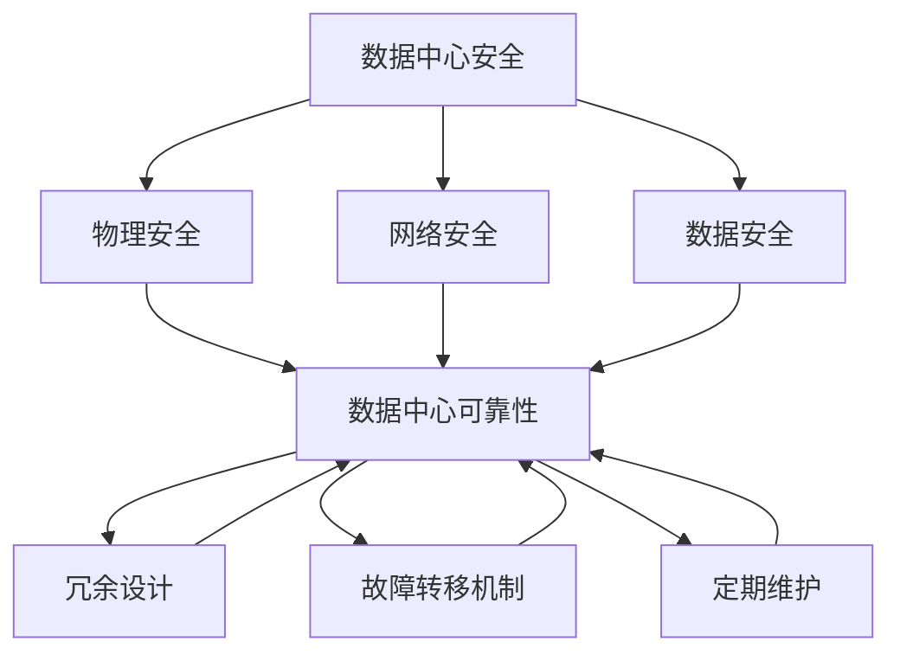

                 

**AI 大模型应用数据中心建设：数据中心安全与可靠性**

**作者：禅与计算机程序设计艺术 / Zen and the Art of Computer Programming**

## 1. 背景介绍

随着人工智能（AI）大模型的发展，其对数据中心的需求也与日俱增。数据中心是AI大模型的基础设施，其安全与可靠性直接关系到AI大模型的性能和稳定性。本文将深入探讨AI大模型应用数据中心建设的安全与可靠性，为读者提供实用的指南。

## 2. 核心概念与联系

### 2.1 数据中心安全

数据中心安全包括物理安全、网络安全和数据安全三个方面。物理安全指的是保护数据中心免受物理破坏和未授权访问；网络安全指的是保护数据中心免受网络攻击和数据泄露；数据安全指的是保护数据中心内的数据免受泄露、篡改和删除。

### 2.2 数据中心可靠性

数据中心可靠性指的是数据中心在正常运行条件下持续提供服务的能力。可靠性取决于数据中心的设计、配置和维护。高可靠性数据中心需要具备冗余设计、故障转移机制和定期维护等特点。

### 2.3 核心概念联系

数据中心安全和可靠性是相辅相成的。安全是可靠性的基础，没有安全保障的数据中心很难提供高可靠性服务。而高可靠性数据中心则需要具备高安全性，以免故障导致安全漏洞。两者共同构成了数据中心的稳定运行环境。



## 3. 核心算法原理 & 具体操作步骤

### 3.1 算法原理概述

数据中心安全和可靠性的实现离不开算法的支持。常用的算法包括加密算法、身份验证算法、故障检测算法和故障转移算法等。

### 3.2 算法步骤详解

#### 3.2.1 加密算法

加密算法用于保护数据安全。常用的加密算法包括对称加密算法（如AES）和非对称加密算法（如RSA）。加密过程包括以下步骤：

1. 生成密钥对：生成公钥和私钥。
2. 加密：使用公钥对数据进行加密。
3. 传输：将加密数据通过网络传输给接收方。
4. 解密：接收方使用私钥对数据进行解密。

#### 3.2.2 身份验证算法

身份验证算法用于保护数据中心免受未授权访问。常用的身份验证算法包括密码验证算法（如PBKDF2）和令牌验证算法（如JWT）。身份验证过程包括以下步骤：

1. 用户输入：用户输入用户名和密码。
2. 验证：系统验证用户名和密码是否正确。
3. 登录：如果验证通过，则允许用户登录。

#### 3.2.3 故障检测算法

故障检测算法用于检测数据中心的故障。常用的故障检测算法包括心跳检测算法和异常检测算法。故障检测过程包括以下步骤：

1. 数据收集：收集数据中心的运行数据。
2. 故障检测：使用故障检测算法对数据进行分析，检测故障。
3. 报警：如果检测到故障，则发出报警。

#### 3.2.4 故障转移算法

故障转移算法用于在故障发生时将服务转移到备用设备上。常用的故障转移算法包括主备故障转移算法和多活故障转移算法。故障转移过程包括以下步骤：

1. 故障检测：检测故障。
2. 故障确认：确认故障。
3. 服务转移：将服务转移到备用设备上。
4. 故障恢复：恢复故障设备。

### 3.3 算法优缺点

各种算法都有其优缺点。例如，加密算法的优点是能够保护数据安全，但缺点是会消耗计算资源；身份验证算法的优点是能够保护数据中心免受未授权访问，但缺点是可能会导致用户体验下降；故障检测算法的优点是能够及时发现故障，但缺点是可能会导致误报；故障转移算法的优点是能够保证服务的连续性，但缺点是可能会导致备用设备的资源浪费。

### 3.4 算法应用领域

数据中心安全和可靠性的算法应用领域非常广泛，包括金融、医疗、电信、政府等各个领域。例如，金融领域需要保护用户的资金安全，医疗领域需要保护患者的隐私安全，电信领域需要保证通信的可靠性，政府领域需要保护国家机密安全。

## 4. 数学模型和公式 & 详细讲解 & 举例说明

### 4.1 数学模型构建

数据中心安全和可靠性的数学模型可以使用可靠性理论和信息安全理论来构建。可靠性理论用于分析数据中心的故障率和可用性；信息安全理论用于分析数据中心的安全等级和风险。

### 4.2 公式推导过程

#### 4.2.1 故障率公式

故障率是指单位时间内发生故障的概率。故障率公式如下：

$$\lambda = \frac{\text{故障数}}{\text{时间}}$$

其中，$\lambda$是故障率，故障数是指某一时间段内发生的故障数，时间是指该时间段的长度。

例如，如果在一周内发生了3次故障，则故障率为：

$$\lambda = \frac{3}{7} \approx 0.43$$

#### 4.2.2 可用性公式

可用性是指系统在某一时间段内处于可用状态的概率。可用性公式如下：

$$A = \frac{\text{可用时间}}{\text{总时间}}$$

其中，$A$是可用性，可用时间是指系统在该时间段内处于可用状态的时间，总时间是指该时间段的长度。

例如，如果系统在一周内处于可用状态的时间为6天，则可用性为：

$$A = \frac{6}{7} \approx 0.86$$

#### 4.2.3 安全等级公式

安全等级是指系统抵御攻击的能力。安全等级公式如下：

$$S = 1 - \frac{\text{风险}}{\text{资产}}$$

其中，$S$是安全等级，风险是指系统面临的风险，资产是指系统的资产。

例如，如果系统面临的风险为100万，资产为1000万，则安全等级为：

$$S = 1 - \frac{100}{1000} = 0.9$$

### 4.3 案例分析与讲解

例如，某数据中心的故障率为0.43，可用性为0.86，安全等级为0.9。根据故障率，我们可以预测每周会发生故障3次；根据可用性，我们可以预测系统每周处于可用状态的时间为6天；根据安全等级，我们可以预测系统抵御攻击的能力为90%。通过数学模型，我们可以量化数据中心的安全和可靠性，并预测其性能。

## 5. 项目实践：代码实例和详细解释说明

### 5.1 开发环境搭建

数据中心安全和可靠性的项目实践需要在开发环境中进行。开发环境需要包括开发工具、编程语言和数据库等。常用的开发工具包括IDE（如Visual Studio Code）、版本控制系统（如Git）和容器化平台（如Docker）；常用的编程语言包括Python、Java和C++；常用的数据库包括MySQL、PostgreSQL和MongoDB。

### 5.2 源代码详细实现

以下是使用Python实现故障检测算法的示例代码：

```python
import time

class FaultDetector:
    def __init__(self, interval=60):
        self.interval = interval
        self.last_check = time.time()

    def check(self, target):
        current_time = time.time()
        if current_time - self.last_check > self.interval:
            self.last_check = current_time
            return self._check(target)
        else:
            return False

    def _check(self, target):
        # 这里实现故障检测逻辑
        pass

# 示例用法
detector = FaultDetector(interval=60)
while True:
    if detector.check('target'):
        print('Fault detected!')
```

### 5.3 代码解读与分析

 FaultDetector类实现了故障检测逻辑。它使用心跳检测算法，每隔指定的时间间隔检测一次目标是否故障。如果目标在指定的时间间隔内没有响应，则认为目标故障。

### 5.4 运行结果展示

当目标故障时，FaultDetector类会打印“Fault detected!”。

## 6. 实际应用场景

### 6.1 数据中心安全

数据中心安全的实际应用场景包括：

* 金融领域：保护用户的资金安全。
* 医疗领域：保护患者的隐私安全。
* 电信领域：保证通信的可靠性。
* 政府领域：保护国家机密安全。

### 6.2 数据中心可靠性

数据中心可靠性的实际应用场景包括：

* 电子商务平台：保证交易的连续性。
* 云计算平台：保证服务的可用性。
* 物联网平台：保证设备的连接稳定性。
* 视频会议平台：保证会议的顺利进行。

### 6.3 未来应用展望

未来，数据中心安全和可靠性的应用将会更加广泛。随着人工智能和物联网的发展，数据中心将会承载更多的数据和服务。数据中心安全和可靠性将会成为关键基础设施，其重要性将会进一步提高。

## 7. 工具和资源推荐

### 7.1 学习资源推荐

* 书籍：《信息安全原理与应用》《可靠性工程》《数据中心建设与管理》《人工智能大模型应用》
* 在线课程：Coursera、Udacity、edX上的信息安全和可靠性相关课程
* 论坛：Stack Overflow、Reddit、Quora上的信息安全和可靠性相关讨论

### 7.2 开发工具推荐

* IDE：Visual Studio Code、Eclipse、IntelliJ IDEA
* 版本控制系统：Git、SVN、Mercurial
* 容器化平台：Docker、Kubernetes、Amazon ECS
* 数据库：MySQL、PostgreSQL、MongoDB

### 7.3 相关论文推荐

* 信息安全领域：《信息安全的数学基础》《信息安全协议标准》《信息安全评估标准》
* 可靠性领域：《可靠性理论基础》《可靠性评估标准》《可靠性设计方法》

## 8. 总结：未来发展趋势与挑战

### 8.1 研究成果总结

本文介绍了数据中心安全和可靠性的核心概念、算法原理、数学模型和实际应用场景。通过实践项目，我们展示了如何使用故障检测算法来实现数据中心的可靠性。

### 8.2 未来发展趋势

未来，数据中心安全和可靠性的发展趋势包括：

* 云原生技术的发展：云原生技术将会进一步提高数据中心的可靠性和安全性。
* AI和物联网的发展：AI和物联网的发展将会带来更多的数据和服务，对数据中心的安全和可靠性提出更高的要求。
* 量子计算的发展：量子计算的发展将会对数据中心的安全提出新的挑战。

### 8.3 面临的挑战

数据中心安全和可靠性面临的挑战包括：

* 安全威胁的多样性：安全威胁的种类越来越多，对数据中心安全提出了更高的要求。
* 可靠性需求的提高：随着业务的发展，对数据中心可靠性的要求也越来越高。
* 成本控制的压力：数据中心建设和运维的成本越来越高，如何平衡成本和安全可靠性是一个挑战。

### 8.4 研究展望

未来，数据中心安全和可靠性的研究将会朝着以下方向发展：

* 云原生安全和可靠性：研究云原生技术在数据中心安全和可靠性中的应用。
* AI驱动的安全和可靠性：研究如何使用AI技术来提高数据中心的安全和可靠性。
* 量子安全：研究量子计算对数据中心安全提出的挑战，并寻找解决方案。

## 9. 附录：常见问题与解答

**Q1：数据中心安全和可靠性有什么区别？**

A1：数据中心安全指的是保护数据中心免受安全威胁，包括物理安全、网络安全和数据安全；数据中心可靠性指的是数据中心在正常运行条件下持续提供服务的能力。

**Q2：如何评估数据中心的安全等级？**

A2：可以使用安全等级公式$S = 1 - \frac{\text{风险}}{\text{资产}}$来评估数据中心的安全等级。其中，风险是指数据中心面临的风险，资产是指数据中心的资产。

**Q3：如何提高数据中心的可靠性？**

A3：可以通过冗余设计、故障转移机制和定期维护等措施来提高数据中心的可靠性。

**Q4：如何检测数据中心的故障？**

A4：可以使用故障检测算法，如心跳检测算法和异常检测算法，来检测数据中心的故障。

**Q5：如何保护数据中心的数据安全？**

A5：可以使用加密算法，如对称加密算法和非对称加密算法，来保护数据中心的数据安全。

**Q6：如何保护数据中心免受未授权访问？**

A6：可以使用身份验证算法，如密码验证算法和令牌验证算法，来保护数据中心免受未授权访问。

**Q7：如何平衡数据中心的成本和安全可靠性？**

A7：可以通过成本效益分析，权衡数据中心的成本和安全可靠性，找到平衡点。

**Q8：未来数据中心安全和可靠性的发展趋势是什么？**

A8：未来数据中心安全和可靠性的发展趋势包括云原生技术的发展、AI和物联网的发展、量子计算的发展等。

**Q9：数据中心安全和可靠性面临的挑战是什么？**

A9：数据中心安全和可靠性面临的挑战包括安全威胁的多样性、可靠性需求的提高、成本控制的压力等。

**Q10：未来数据中心安全和可靠性的研究方向是什么？**

A10：未来数据中心安全和可靠性的研究方向包括云原生安全和可靠性、AI驱动的安全和可靠性、量子安全等。

## 结束语

本文介绍了数据中心安全和可靠性的核心概念、算法原理、数学模型和实际应用场景。通过实践项目，我们展示了如何使用故障检测算法来实现数据中心的可靠性。我们还讨论了数据中心安全和可靠性的未来发展趋势和挑战，并提出了研究展望。我们希望本文能够为读者提供有用的指南，帮助他们更好地理解和应用数据中心安全和可靠性。

**作者：禅与计算机程序设计艺术 / Zen and the Art of Computer Programming**

