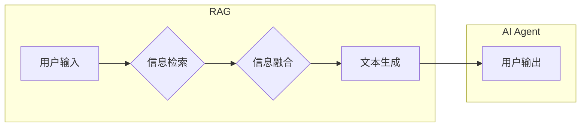

> RAG, Agent, 大模型应用, AI, 知识图谱, 检索, 响应生成, 聊天机器人

## 1. 背景介绍

近年来，大模型技术取得了飞速发展，其强大的语言理解和生成能力为人工智能应用带来了新的机遇。然而，单纯依靠大模型的零样本学习能力往往难以满足复杂场景下的应用需求。为了更好地将大模型应用于实际场景，研究者们提出了 Retrieval Augmented Generation (RAG) 和 AI Agent 等新兴技术。

RAG 技术将大模型与外部知识库相结合，通过检索相关信息来增强模型的理解和生成能力。而 AI Agent 则将大模型作为核心组件，赋予其自主学习、决策和执行任务的能力，使其能够更像人类一样与环境交互。

## 2. 核心概念与联系

### 2.1 RAG

RAG 技术的核心思想是将大模型与外部知识库相结合，通过检索相关信息来增强模型的理解和生成能力。

**RAG 的工作流程通常包括以下步骤：**

1. **用户输入:** 用户提出一个问题或指令。
2. **信息检索:** 根据用户输入，从外部知识库中检索相关信息。
3. **信息融合:** 将检索到的信息与大模型的内部知识进行融合，形成一个更完整的上下文。
4. **文本生成:** 基于融合后的上下文，大模型生成最终的文本响应。

**RAG 的优势:**

* 能够访问和利用外部知识，提升模型的准确性和可靠性。
* 能够处理更复杂和开放式的任务，例如问答、文本摘要、代码生成等。
* 能够降低大模型的训练成本，因为模型不需要学习所有知识。

**RAG 的挑战:**

* 如何有效地检索和融合外部信息，避免信息冗余和冲突。
* 如何评估 RAG 系统的性能，并进行优化。

### 2.2 AI Agent

AI Agent 是一个能够感知环境、做出决策并执行任务的智能体。它通常由以下几个部分组成：

* **感知模块:** 用于感知环境信息，例如传感器数据、文本信息等。
* **决策模块:** 用于根据环境信息和目标做出决策。
* **执行模块:** 用于执行决策，例如控制机器人运动、发送邮件等。

**AI Agent 的应用场景:**

* **聊天机器人:** 可以与用户进行自然语言对话，提供信息、完成任务等。
* **智能客服:** 可以自动处理客户咨询，提高服务效率。
* **自动化办公:** 可以自动完成一些重复性的办公任务，例如安排会议、发送邮件等。

**AI Agent 的挑战:**

* 如何设计有效的决策算法，使 AI Agent能够做出合理的决策。
* 如何让 AI Agent能够更好地理解和响应用户的意图。
* 如何确保 AI Agent的安全性，避免其被恶意利用。

**RAG 和 AI Agent 的联系:**

RAG 技术可以作为 AI Agent 的重要组成部分，为其提供更丰富的知识和理解能力。例如，一个基于 RAG 的聊天机器人可以访问外部知识库，回答用户更复杂的问题，并提供更准确的信息。

**Mermaid 流程图:**



## 3. 核心算法原理 & 具体操作步骤

### 3.1 算法原理概述

RAG 和 AI Agent 的核心算法原理主要包括信息检索、文本生成和决策算法。

**信息检索:**

信息检索的核心是找到与用户输入最相关的文档或信息片段。常用的信息检索算法包括 TF-IDF、BM25 和 BERT 等。

**文本生成:**

文本生成的核心是根据给定的上下文生成流畅、连贯的文本。常用的文本生成算法包括 GPT、T5 和 BART 等。

**决策算法:**

决策算法的核心是根据环境信息和目标做出最优决策。常用的决策算法包括强化学习、决策树和贝叶斯网络等。

### 3.2 算法步骤详解

**RAG 算法步骤详解:**

1. **预处理:** 对用户输入和知识库中的文本进行预处理，例如分词、词干提取和词向量化等。
2. **信息检索:** 使用信息检索算法从知识库中检索与用户输入相关的文档或信息片段。
3. **信息融合:** 将检索到的信息与大模型的内部知识进行融合，形成一个更完整的上下文。
4. **文本生成:** 使用文本生成算法根据融合后的上下文生成最终的文本响应。

**AI Agent 算法步骤详解:**

1. **感知环境:** 使用传感器或其他方式感知环境信息。
2. **决策:** 使用决策算法根据环境信息和目标做出决策。
3. **执行决策:** 使用执行模块执行决策，例如控制机器人运动、发送邮件等。
4. **反馈:** 收集执行决策后的反馈信息，并将其用于后续决策。

### 3.3 算法优缺点

**RAG 算法:**

* **优点:** 能够访问和利用外部知识，提升模型的准确性和可靠性。
* **缺点:** 信息检索和融合的复杂度较高，需要大量的计算资源。

**AI Agent 算法:**

* **优点:** 能够自主学习、决策和执行任务，具有更高的灵活性。
* **缺点:** 算法设计复杂，需要大量的训练数据和计算资源。

### 3.4 算法应用领域

**RAG 算法:**

* 问答系统
* 文本摘要
* 代码生成
* 知识图谱构建

**AI Agent 算法:**

* 聊天机器人
* 智能客服
* 自动化办公
* 机器人控制

## 4. 数学模型和公式 & 详细讲解 & 举例说明

### 4.1 数学模型构建

**信息检索模型:**

TF-IDF 模型：

$$
TF-IDF(t, d) = TF(t, d) \times IDF(t)
$$

其中：

* $TF(t, d)$ 表示词语 $t$ 在文档 $d$ 中的词频。
* $IDF(t)$ 表示词语 $t$ 在整个语料库中的逆向文档频率。

**文本生成模型:**

GPT 模型：

$$
P(w_i | w_{1:i-1}) = \frac{exp(score(w_{1:i-1}, w_i))}{\sum_{w \in V} exp(score(w_{1:i-1}, w))}
$$

其中：

* $w_i$ 表示第 $i$ 个词。
* $w_{1:i-1}$ 表示前 $i-1$ 个词。
* $V$ 表示词典。
* $score(w_{1:i-1}, w_i)$ 表示词语 $w_i$ 在上下文 $w_{1:i-1}$ 下的得分。

**决策模型:**

强化学习模型：

$$
R_t = r(s_t, a_t) + \gamma \max_{a'} Q(s_{t+1}, a')
$$

其中：

* $R_t$ 表示在时间步 $t$ 的奖励。
* $r(s_t, a_t)$ 表示在状态 $s_t$ 下执行动作 $a_t$ 的即时奖励。
* $\gamma$ 表示折扣因子。
* $Q(s_{t+1}, a')$ 表示在状态 $s_{t+1}$ 下执行动作 $a'$ 的期望未来奖励。

### 4.2 公式推导过程

**TF-IDF 模型推导:**

TF-IDF 模型的推导过程基于信息检索的原理，即词语在文档中出现的频率和在整个语料库中出现的频率之间的关系。

**GPT 模型推导:**

GPT 模型的推导过程基于概率论和语言模型的原理，即根据上下文预测下一个词的概率。

**强化学习模型推导:**

强化学习模型的推导过程基于动态规划和马尔可夫决策过程的原理，即通过最大化奖励来学习最优策略。

### 4.3 案例分析与讲解

**案例分析:**

* **信息检索:** 使用 TF-IDF 模型检索与“人工智能”相关的文档。
* **文本生成:** 使用 GPT 模型生成一篇关于“人工智能”的新闻报道。
* **决策:** 使用强化学习模型训练一个智能体，使其能够在游戏中获得最高分。

**讲解:**

通过以上案例分析，我们可以看到 RAG 和 AI Agent 的核心算法原理及其在实际应用中的应用场景。

## 5. 项目实践：代码实例和详细解释说明

### 5.1 开发环境搭建

* Python 3.7+
* PyTorch 或 TensorFlow
* NLTK、SpaCy 等自然语言处理库
* Transformers 库

### 5.2 源代码详细实现

```python
# RAG 代码示例
from transformers import AutoModelForSeq2SeqLM, AutoTokenizer

# 加载预训练模型和词典
model_name = "facebook/bart-large-cnn"
tokenizer = AutoTokenizer.from_pretrained(model_name)
model = AutoModelForSeq2SeqLM.from_pretrained(model_name)

# 用户输入
user_input = "什么是人工智能？"

# 信息检索
# ...

# 信息融合
# ...

# 文本生成
input_ids = tokenizer(user_input, return_tensors="pt").input_ids
output = model.generate(input_ids)
response = tokenizer.decode(output[0], skip_special_tokens=True)

print(response)

# AI Agent 代码示例
import gym

# 创建环境
env = gym.make("CartPole-v1")

# 定义策略
def policy(state):
    # ...

# 训练智能体
for episode in range(100):
    state = env.reset()
    done = False
    while not done:
        action = policy(state)
        next_state, reward, done, _ = env.step(action)
        state = next_state

```

### 5.3 代码解读与分析

* RAG 代码示例：
    * 使用预训练的 BART 模型进行文本生成。
    * 用户输入经过 tokenization 处理后，输入到模型中生成响应。
* AI Agent 代码示例：
    * 使用 OpenAI Gym 库创建 CartPole 环境。
    * 定义一个简单的策略，根据状态选择动作。
    * 使用强化学习算法训练智能体，使其能够在环境中获得最高分。

### 5.4 运行结果展示

* RAG 代码示例：
    * 输出关于“人工智能”的文本响应。
* AI Agent 代码示例：
    * 智能体能够在 CartPole 环境中保持平衡，获得高分。

## 6. 实际应用场景

### 6.1 聊天机器人

RAG 技术可以帮助聊天机器人访问外部知识库，提供更准确和丰富的回答。例如，一个基于 RAG 的聊天机器人可以访问 Wikipedia 来回答用户关于历史事件的问题。

### 6.2 智能客服

RAG 技术可以帮助智能客服自动处理客户咨询，提高服务效率。例如，一个基于 RAG 的智能客服可以访问产品知识库，回答用户关于产品功能的问题。

### 6.3 自动化办公

RAG 技术可以帮助自动化办公，例如自动生成邮件、安排会议等。例如，一个基于 RAG 的工具可以根据用户的需求自动生成一封邮件。

### 6.4 未来应用展望

* **个性化教育:** RAG 技术可以根据学生的学习进度和需求，提供个性化的学习内容和辅导。
* **医疗诊断:** RAG 技术可以帮助医生更快、更准确地诊断疾病。
* **法律服务:** RAG 技术可以帮助律师更快、更准确地查找法律法规和案例。

## 7. 工具和资源推荐

### 7.1 学习资源推荐

* **书籍:**
    * 《深度学习》
    * 《自然语言处理》
    * 《机器学习》
* **在线课程:**
    * Coursera
    * edX
    * Udacity

### 7.2 开发工具推荐

* **Python:**
    * PyTorch
    * TensorFlow
    