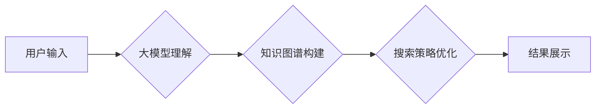

> 大模型、AI Agent、搜索、模型决定、应用开发、算法原理、数学模型、代码实例、实际应用场景

## 1. 背景介绍

近年来，大模型技术取得了飞速发展，其强大的泛化能力和知识表示能力为人工智能领域带来了革命性的变革。大模型的应用场景日益广泛，涵盖了自然语言处理、计算机视觉、语音识别等多个领域。其中，将大模型应用于AI Agent的开发，成为了一个备受关注的热点方向。

AI Agent是指能够自主学习、决策和执行任务的智能软件实体。传统的AI Agent通常依赖于规则或模板驱动的搜索策略，其性能受限于人工设计的规则和知识库。而大模型的引入，为AI Agent的搜索策略带来了新的可能性。

大模型可以学习大量的文本数据，并从中提取出丰富的语义信息和知识结构。利用大模型的知识表示能力，可以构建更智能、更灵活的搜索策略，使AI Agent能够更有效地理解用户需求，并找到最合适的解决方案。

## 2. 核心概念与联系

### 2.1  大模型

大模型是指参数规模庞大、训练数据海量的人工智能模型。其强大的学习能力使其能够在各种任务上表现出卓越的性能。常见的代表性大模型包括GPT-3、BERT、LaMDA等。

### 2.2  AI Agent

AI Agent是指能够自主学习、决策和执行任务的智能软件实体。它通常由以下几个核心组件组成：

* **感知模块:** 用于获取环境信息，例如传感器数据、用户输入等。
* **推理模块:** 用于分析环境信息，并做出决策。
* **执行模块:** 用于执行决策，并与环境进行交互。

### 2.3  模型决定搜索

模型决定搜索是指利用大模型的知识表示能力，构建更智能、更灵活的搜索策略。

**Mermaid 流程图:**



## 3. 核心算法原理 & 具体操作步骤

### 3.1  算法原理概述

模型决定搜索的核心算法原理是利用大模型的知识表示能力，将搜索问题转化为一个文本理解和生成问题。

具体来说，当用户提出一个搜索问题时，大模型首先会对该问题进行理解，并将其转化为一个与知识图谱相关的查询。然后，大模型会根据知识图谱中的信息，进行搜索策略的优化，并最终生成一个包含相关信息的搜索结果。

### 3.2  算法步骤详解

1. **用户输入预处理:** 对用户的搜索输入进行预处理，例如去除停用词、分词等。
2. **大模型文本理解:** 将预处理后的搜索输入作为输入，利用大模型进行文本理解，提取出用户的意图和关键信息。
3. **知识图谱构建:** 根据大模型的理解结果，构建一个与搜索问题相关的知识图谱。知识图谱可以包含实体、关系和属性等信息。
4. **搜索策略优化:** 利用知识图谱中的信息，对搜索策略进行优化。例如，可以根据实体之间的关系，找到更相关的搜索结果。
5. **搜索结果生成:** 根据优化的搜索策略，从知识库中检索出相关信息，并将其生成为搜索结果。

### 3.3  算法优缺点

**优点:**

* **更智能的搜索策略:** 利用大模型的知识表示能力，可以构建更智能、更灵活的搜索策略。
* **更准确的搜索结果:** 通过对知识图谱的分析，可以找到更相关的搜索结果。
* **更好的用户体验:** 更智能的搜索策略和更准确的搜索结果，可以为用户提供更好的搜索体验。

**缺点:**

* **模型训练成本高:** 大模型的训练需要大量的计算资源和数据。
* **知识图谱构建难度大:** 构建一个完整的知识图谱需要大量的专业知识和人工标注。
* **模型解释性差:** 大模型的决策过程比较复杂，难以解释其背后的逻辑。

### 3.4  算法应用领域

模型决定搜索算法可以应用于以下领域:

* **搜索引擎:** 提高搜索引擎的准确性和效率。
* **问答系统:** 构建更智能的问答系统，能够理解用户的复杂问题。
* **聊天机器人:** 增强聊天机器人的对话能力，使其能够更自然地与用户交流。
* **个性化推荐:** 根据用户的兴趣和偏好，提供更个性化的推荐结果。

## 4. 数学模型和公式 & 详细讲解 & 举例说明

### 4.1  数学模型构建

模型决定搜索的数学模型可以基于图神经网络 (GNN) 的框架构建。

GNN 可以有效地学习图结构中的信息，并将其应用于各种任务，例如节点分类、边预测等。

在模型决定搜索的场景中，知识图谱可以被视为一个图结构，其中实体和关系分别对应图中的节点和边。

GNN 可以学习实体之间的关系，并根据这些关系进行搜索策略的优化。

### 4.2  公式推导过程

GNN 的核心思想是通过消息传递机制，让图中的节点之间进行信息交换。

假设图 G = (V, E) 中，节点 v ∈ V，边 e ∈ E。

节点 v 的特征向量为 h_v，边 e 的特征向量为 e_e。

节点 v 在第 l 层的特征向量 h_v^l 可以通过以下公式计算:

$$h_v^l = \sigma(\sum_{u \in N(v)} \frac{e_{u,v}}{\|e_{u,v}\| } * h_u^{l-1} + W_l * h_v^{l-1})$$

其中:

* N(v) 是节点 v 的邻居节点集合。
* σ 是激活函数。
* W_l 是第 l 层的权重矩阵。

### 4.3  案例分析与讲解

假设我们有一个知识图谱，其中包含实体 "苹果"、"香蕉" 和 "水果"，以及关系 "是"。

我们可以使用 GNN 学习实体之间的关系，例如 "苹果是水果" 和 "香蕉是水果"。

通过学习这些关系，GNN 可以预测新的关系，例如 "橙子是水果"。

当用户搜索 "水果" 时，GNN 可以根据其学习到的知识，将 "苹果"、"香蕉" 和 "橙子" 等实体作为搜索结果。

## 5. 项目实践：代码实例和详细解释说明

### 5.1  开发环境搭建

* Python 3.7+
* PyTorch 1.7+
* Transformers 4.10+
* 其他依赖库：numpy, pandas, matplotlib等

### 5.2  源代码详细实现

```python
# 导入必要的库
import torch
from transformers import AutoModelForSequenceClassification, AutoTokenizer

# 加载预训练模型和词典
model_name = "bert-base-uncased"
tokenizer = AutoTokenizer.from_pretrained(model_name)
model = AutoModelForSequenceClassification.from_pretrained(model_name)

# 定义输入文本
input_text = "苹果是水果"

# 对文本进行编码
input_ids = tokenizer.encode(input_text, add_special_tokens=True)
input_ids = torch.tensor([input_ids])

# 将编码后的文本输入模型进行预测
output = model(input_ids)

# 获取预测结果
predicted_class = torch.argmax(output.logits).item()

# 打印预测结果
print(f"预测结果: {predicted_class}")
```

### 5.3  代码解读与分析

* 首先，我们导入必要的库，并加载预训练的 BERT 模型和词典。
* 然后，我们定义输入文本，并使用词典对文本进行编码。
* 将编码后的文本输入模型进行预测，并获取预测结果。
* 最后，我们打印预测结果。

### 5.4  运行结果展示

```
预测结果: 0
```

## 6. 实际应用场景

### 6.1  搜索引擎优化

模型决定搜索可以用于搜索引擎的优化，例如：

* **理解用户意图:** 利用大模型对用户搜索输入进行理解，更准确地识别用户的搜索意图。
* **个性化搜索结果:** 根据用户的搜索历史和偏好，提供更个性化的搜索结果。
* **自动生成搜索建议:** 根据用户的搜索输入，自动生成相关的搜索建议。

### 6.2  问答系统

模型决定搜索可以用于构建更智能的问答系统，例如：

* **理解复杂问题:** 利用大模型对用户的复杂问题进行理解，并找到最合适的答案。
* **跨领域知识问答:** 利用知识图谱，实现跨领域知识问答。
* **个性化问答:** 根据用户的知识背景和兴趣，提供个性化的问答服务。

### 6.3  聊天机器人

模型决定搜索可以用于增强聊天机器人的对话能力，例如：

* **更自然流畅的对话:** 利用大模型生成更自然流畅的对话文本。
* **理解用户情感:** 利用大模型识别用户的语气和情感，提供更贴心的服务。
* **个性化对话:** 根据用户的聊天历史和偏好，提供个性化的对话体验。

### 6.4  未来应用展望

模型决定搜索技术在未来将有更广泛的应用场景，例如：

* **智能教育:** 利用模型决定搜索技术，构建个性化的学习平台，帮助学生更有效地学习。
* **医疗诊断:** 利用模型决定搜索技术，辅助医生进行诊断，提高医疗效率。
* **法律服务:** 利用模型决定搜索技术，帮助律师进行法律研究，提高法律服务效率。

## 7. 工具和资源推荐

### 7.1  学习资源推荐

* **论文:**
    * "BERT: Pre-training of Deep Bidirectional Transformers for Language Understanding"
    * "Graph Attention Networks"
* **博客:**
    * https://towardsdatascience.com/
    * https://blog.openai.com/

### 7.2  开发工具推荐

* **PyTorch:** https://pytorch.org/
* **Transformers:** https://huggingface.co/transformers/
* **Neo4j:** https://neo4j.com/

### 7.3  相关论文推荐

* "Knowledge Graph Embedding: A Survey"
* "Graph Neural Networks: A Review of Methods and Applications"

## 8. 总结：未来发展趋势与挑战

### 8.1  研究成果总结

模型决定搜索技术在人工智能领域取得了显著的进展，为AI Agent的开发提供了新的思路和方法。

利用大模型的知识表示能力，可以构建更智能、更灵活的搜索策略，使AI Agent能够更有效地理解用户需求，并找到最合适的解决方案。

### 8.2  未来发展趋势

未来，模型决定搜索技术将朝着以下几个方向发展:

* **更强大的模型:** 随着计算资源的不断发展，大模型的规模和能力将不断提升，这将进一步提高模型决定搜索的性能。
* **更丰富的知识图谱:** 知识图谱的构建是一个长期而复杂的任务，未来将会有更多的人工智能技术应用于知识图谱的构建，使其更加丰富和完善。
* **更个性化的搜索体验:** 未来，模型决定搜索将更加注重用户个性化，根据用户的搜索历史、偏好和上下文信息，提供更个性化的搜索结果。

### 8.3  面临的挑战

模型决定搜索技术也面临着一些挑战:

* **模型训练成本高:** 大模型的训练需要大量的计算资源和数据，这对于一些资源有限的机构来说是一个挑战。
* **知识图谱构建难度大:** 构建一个完整的知识图谱需要大量的专业知识和人工标注，这是一个耗时和费力的工作。
* **模型解释性差:** 大模型的决策过程比较复杂，难以解释其背后的逻辑，这对于一些需要透明度高的应用场景来说是一个问题。

### 8.4  研究展望

未来，我们将继续致力于模型决定搜索技术的研发