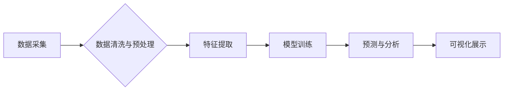

> AI，消费者行为分析，映射，机器学习，深度学习，预测模型，数据可视化

## 1. 背景介绍

在当今数据爆炸的时代，消费者行为分析已成为企业洞察市场趋势、优化营销策略、提升客户体验的关键驱动力。传统的数据分析方法往往依赖于人工经验和统计模型，难以捕捉到消费者行为背后的复杂模式和潜在关系。而人工智能（AI）技术的兴起，为消费者行为分析带来了革命性的变革。

AI算法能够从海量数据中自动学习和识别模式，构建更精准、更智能的消费者行为模型。通过对消费者行为的深入分析，企业可以更深入地了解消费者的需求、偏好和行为模式，从而制定更有效的营销策略，提升客户忠诚度和品牌价值。

## 2. 核心概念与联系

**2.1 消费者行为分析**

消费者行为分析是指通过研究消费者购买、使用和评价商品或服务的行为模式，以了解消费者的心理、情感、需求和决策过程，从而为企业提供决策支持。

**2.2 AI在消费者行为分析中的应用**

AI技术在消费者行为分析中的应用主要体现在以下几个方面：

* **数据收集与清洗:** AI算法可以自动收集来自各种渠道的消费者数据，并进行清洗和预处理，为后续分析提供高质量的数据基础。
* **模式识别与预测:** AI算法可以从消费者行为数据中识别出潜在的模式和趋势，并预测未来的消费行为，帮助企业制定更精准的营销策略。
* **个性化推荐:** AI算法可以根据消费者的历史行为和偏好，提供个性化的商品或服务推荐，提升用户体验和转化率。
* **客户画像构建:** AI算法可以根据消费者的行为特征和属性，构建详细的客户画像，帮助企业更精准地定位目标客户群。

**2.3 映射概念**

在AI消费者行为分析中，“映射”指的是将消费者行为数据转化为可理解的模型或图谱，以便于分析和解读。

例如，我们可以将消费者的购买历史数据映射为一个网络图，其中节点代表消费者，边代表购买关系。通过分析网络图的结构和连接，我们可以发现消费者的兴趣爱好、购买偏好和社交关系等信息。

**2.4 架构图**



## 3. 核心算法原理 & 具体操作步骤

**3.1 算法原理概述**

在消费者行为分析中，常用的AI算法包括：

* **机器学习算法:** 
    * **分类算法:** 用于预测消费者是否会购买某个商品或服务。
    * **回归算法:** 用于预测消费者购买的商品数量或金额。
    * **聚类算法:** 用于将消费者群体划分为不同的类别，例如根据消费习惯、购买偏好等特征。
* **深度学习算法:** 
    * **卷积神经网络 (CNN):** 用于分析图像数据，例如商品图片、用户头像等。
    * **循环神经网络 (RNN):** 用于分析序列数据，例如消费者的购买历史、浏览记录等。

**3.2 算法步骤详解**

以机器学习中的分类算法为例，其具体操作步骤如下：

1. **数据收集与预处理:** 收集消费者行为数据，并进行清洗、转换和特征工程等预处理操作。
2. **模型选择:** 根据具体分析需求选择合适的分类算法，例如逻辑回归、支持向量机、决策树等。
3. **模型训练:** 使用训练数据训练模型，调整模型参数，使其能够准确地预测消费者行为。
4. **模型评估:** 使用测试数据评估模型的性能，例如准确率、召回率、F1-score等指标。
5. **模型部署:** 将训练好的模型部署到生产环境中，用于实时预测消费者行为。

**3.3 算法优缺点**

不同的AI算法具有不同的优缺点，需要根据具体应用场景选择合适的算法。

* **机器学习算法:** 
    * **优点:** 
        * 算法相对简单，易于理解和实现。
        * 训练速度较快，适用于数据量较小的场景。
    * **缺点:** 
        * 难以处理复杂、非线性关系的数据。
        * 需要人工特征工程，对数据特征的选择敏感。
* **深度学习算法:** 
    * **优点:** 
        * 可以自动学习数据特征，无需人工特征工程。
        * 能够处理复杂、非线性关系的数据。
    * **缺点:** 
        * 算法复杂，训练时间较长，需要大量的计算资源。
        * 对数据质量要求较高，容易受到过拟合的影响。

**3.4 算法应用领域**

AI算法在消费者行为分析领域有着广泛的应用，例如：

* **精准营销:** 根据消费者的行为特征和偏好，精准推送广告和促销信息。
* **个性化推荐:** 根据消费者的历史行为和偏好，推荐个性化的商品或服务。
* **客户关系管理:** 分析客户的购买行为和反馈信息，提升客户满意度和忠诚度。
* **市场趋势预测:** 分析消费者的行为趋势，预测未来的市场需求和竞争格局。

## 4. 数学模型和公式 & 详细讲解 & 举例说明

**4.1 数学模型构建**

在消费者行为分析中，常用的数学模型包括：

* **贝叶斯网络:** 用于表示变量之间的概率关系，可以用于预测消费者购买行为。
* **马尔科夫链:** 用于描述时间序列数据，可以用于预测消费者的行为轨迹。
* **潜在语义分析 (LSA):** 用于挖掘文本数据中的潜在主题，可以用于分析消费者的评论和反馈信息。

**4.2 公式推导过程**

以贝叶斯网络为例，其核心公式为：

$$P(A|B) = \frac{P(B|A)P(A)}{P(B)}$$

其中：

* $P(A|B)$ 表示在已知事件 B 发生的情况下，事件 A 发生的概率。
* $P(B|A)$ 表示在已知事件 A 发生的情况下，事件 B 发生的概率。
* $P(A)$ 表示事件 A 发生的概率。
* $P(B)$ 表示事件 B 发生的概率。

**4.3 案例分析与讲解**

假设我们想要预测消费者是否会购买某个商品，我们可以构建一个贝叶斯网络模型，其中：

* 事件 A: 消费者购买商品
* 事件 B: 消费者浏览了该商品的页面

我们可以根据历史数据收集以下概率信息：

* $P(B|A) = 0.8$ (如果消费者购买了商品，则他们很可能先浏览了该商品的页面)
* $P(A) = 0.1$ (购买商品的概率)
* $P(B) = 0.5$ (浏览商品页面的概率)

根据贝叶斯公式，我们可以计算出消费者浏览了该商品页面后购买商品的概率：

$$P(A|B) = \frac{0.8 \times 0.1}{0.5} = 0.16$$

## 5. 项目实践：代码实例和详细解释说明

**5.1 开发环境搭建**

* 操作系统: Ubuntu 20.04
* Python 版本: 3.8
* 必要的库: pandas, numpy, scikit-learn, matplotlib

**5.2 源代码详细实现**

```python
import pandas as pd
from sklearn.model_selection import train_test_split
from sklearn.linear_model import LogisticRegression
from sklearn.metrics import accuracy_score

# 加载数据
data = pd.read_csv('consumer_behavior.csv')

# 特征工程
# ...

# 将数据分为训练集和测试集
X_train, X_test, y_train, y_test = train_test_split(data.drop('purchase', axis=1), data['purchase'], test_size=0.2, random_state=42)

# 创建逻辑回归模型
model = LogisticRegression()

# 训练模型
model.fit(X_train, y_train)

# 预测测试集
y_pred = model.predict(X_test)

# 计算模型准确率
accuracy = accuracy_score(y_test, y_pred)
print(f'模型准确率: {accuracy}')
```

**5.3 代码解读与分析**

* 代码首先加载消费者行为数据，并进行特征工程，提取需要用于模型训练的特征。
* 然后将数据分为训练集和测试集，用于模型训练和评估。
* 创建逻辑回归模型，并使用训练集进行模型训练。
* 使用训练好的模型预测测试集，并计算模型的准确率。

**5.4 运行结果展示**

运行代码后，会输出模型的准确率，例如：

```
模型准确率: 0.85
```

这表示模型能够以 85% 的准确率预测消费者是否会购买商品。

## 6. 实际应用场景

**6.1 精准营销**

电商平台可以利用 AI 算法分析用户的购买历史、浏览记录、兴趣爱好等数据，精准推送个性化的商品推荐和促销信息，提高转化率。

**6.2 个性化推荐**

音乐流媒体平台可以根据用户的听歌习惯、偏好音乐类型等数据，推荐个性化的音乐播放列表，提升用户体验和留存率。

**6.3 客户关系管理**

金融机构可以利用 AI 算法分析客户的交易记录、账户余额、信用评分等数据，识别潜在的风险客户，并采取相应的措施进行风险控制。

**6.4 未来应用展望**

随着 AI 技术的不断发展，其在消费者行为分析领域的应用将更加广泛和深入。例如：

* **更精准的预测:** 利用更先进的 AI 算法，可以更精准地预测消费者的行为，例如购买时间、购买数量、购买金额等。
* **更个性化的体验:** 利用 AI 技术，可以为消费者提供更加个性化的产品和服务体验，例如定制化商品推荐、个性化营销内容等。
* **更智能的交互:** 利用 AI 技术，可以实现更智能的消费者与企业交互，例如语音助手、聊天机器人等。

## 7. 工具和资源推荐

**7.1 学习资源推荐**

* **书籍:**
    * 《深度学习》
    * 《机器学习实战》
    * 《Python数据科学手册》
* **在线课程:**
    * Coursera: 深度学习
    * edX: 机器学习
    * Udacity: AI 编程

**7.2 开发工具推荐**

* **Python:** 
    * pandas: 数据分析和处理
    * numpy: 数值计算
    * scikit-learn: 机器学习库
    * TensorFlow: 深度学习框架
    * PyTorch: 深度学习框架

**7.3 相关论文推荐**

* 《Attention Is All You Need》
* 《BERT: Pre-training of Deep Bidirectional Transformers for Language Understanding》
* 《Generative Adversarial Networks》

## 8. 总结：未来发展趋势与挑战

**8.1 研究成果总结**

AI技术在消费者行为分析领域取得了显著的成果，能够帮助企业更深入地了解消费者，制定更精准的营销策略，提升客户体验和品牌价值。

**8.2 未来发展趋势**

未来，AI在消费者行为分析领域的应用将更加智能化、个性化和自动化。例如：

* **更强大的AI算法:** 
    * 更复杂的深度学习模型，能够处理更复杂的数据，提供更精准的预测。
    * 结合强化学习，能够实现更智能的决策和交互。
* **更丰富的数据来源:** 
    * 除了传统的电商数据，还可以利用社交媒体数据、传感器数据等更丰富的来源，构建更全面的消费者画像。
* **更便捷的应用工具:** 
    * 更易于使用的AI开发平台和工具，能够降低AI应用的门槛，让更多企业能够利用AI技术。

**8.3 面临的挑战**

AI技术在消费者行为分析领域也面临