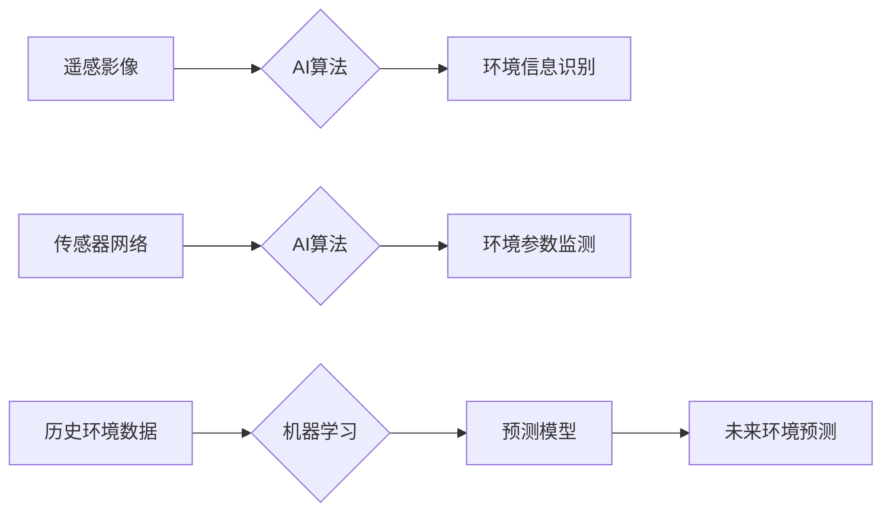

> 环境监测，环境保护，人工智能，机器学习，深度学习，遥感影像，数据分析，预测模型

## 1. 背景介绍

人类社会的发展离不开自然环境的支持，然而，近年来，全球气候变化、资源枯竭、生态破坏等问题日益突出，环境问题已成为制约人类可持续发展的重要因素。传统环境监测手段往往受限于人力、时间和成本等因素，难以实现全面、实时、精准的监测。

人工智能（AI）技术的快速发展为环境监测与保护提供了新的思路和方法。AI算法能够从海量数据中提取有价值的信息，识别环境变化趋势，并预测未来环境状况，为环境保护决策提供科学依据。

## 2. 核心概念与联系

环境监测与保护的核心在于对环境要素的感知、分析和预测。AI技术通过以下核心概念实现对环境的智能感知和管理：

* **遥感影像分析:** 利用卫星、无人机等平台获取的遥感影像数据，结合AI算法，识别植被覆盖率、土地利用变化、水体污染等环境信息。
* **传感器网络:** 部署传感器网络，实时监测空气质量、水质、土壤状况等环境参数，并通过AI算法进行数据分析和预警。
* **机器学习:** 利用机器学习算法，从历史环境数据中学习环境变化规律，建立预测模型，预测未来环境状况。
* **深度学习:** 深度学习算法能够处理复杂的环境数据，例如高分辨率遥感影像、多源传感器数据等，实现更精准的环境监测和分析。

**核心概念架构图:**



## 3. 核心算法原理 & 具体操作步骤

### 3.1  算法原理概述

环境监测与保护中常用的AI算法包括：

* **支持向量机 (SVM):** 用于分类和回归问题，能够有效识别环境变化特征。
* **决策树:** 用于分类和回归问题，能够直观地展示环境因素与环境状况之间的关系。
* **随机森林:** 结合多个决策树，提高分类和回归的准确性。
* **神经网络:** 能够处理复杂的环境数据，实现更精准的环境监测和分析。

### 3.2  算法步骤详解

以支持向量机为例，其具体操作步骤如下：

1. **数据预处理:** 对环境数据进行清洗、转换、归一化等处理，使其满足算法输入要求。
2. **特征选择:** 选择与环境监测目标相关的特征，例如植被覆盖率、温度、降雨量等。
3. **模型训练:** 使用训练数据训练SVM模型，找到最佳的分类边界。
4. **模型评估:** 使用测试数据评估模型的性能，例如准确率、召回率等。
5. **模型部署:** 将训练好的模型部署到实际环境中，用于环境监测和预测。

### 3.3  算法优缺点

**支持向量机:**

* **优点:** 能够处理高维数据，具有较好的泛化能力。
* **缺点:** 对核函数的选择敏感，训练时间较长。

**决策树:**

* **优点:** 易于理解和解释，训练时间短。
* **缺点:** 容易过拟合，对数据噪声敏感。

**随机森林:**

* **优点:** 提高了决策树的鲁棒性，降低了过拟合风险。
* **缺点:** 训练时间较长，难以解释模型决策过程。

**神经网络:**

* **优点:** 能够处理复杂的环境数据，具有较高的准确率。
* **缺点:** 训练时间长，需要大量数据，难以解释模型决策过程。

### 3.4  算法应用领域

* **植被监测:** 利用遥感影像和机器学习算法，监测植被覆盖率、植被类型、植被生长状况等。
* **土地利用变化监测:** 利用遥感影像和机器学习算法，监测土地利用变化趋势，识别土地利用变化类型。
* **水质监测:** 利用传感器网络和机器学习算法，监测水体污染物浓度、水质指标等。
* **空气质量监测:** 利用传感器网络和机器学习算法，监测空气污染物浓度、空气质量指数等。
* **环境风险评估:** 利用AI算法分析环境数据，评估环境风险，预测环境灾害。

## 4. 数学模型和公式 & 详细讲解 & 举例说明

### 4.1  数学模型构建

环境监测与保护中常用的数学模型包括：

* **线性回归模型:** 用于预测连续变量，例如温度、降雨量等。
* **逻辑回归模型:** 用于预测分类变量，例如水体污染程度、植被健康状况等。
* **时间序列模型:** 用于预测时间序列数据，例如空气污染物浓度、水位变化等。

### 4.2  公式推导过程

以线性回归模型为例，其目标是找到最佳的回归系数，使得预测值与实际值之间的误差最小。

**线性回归模型公式:**

$$y = \beta_0 + \beta_1x_1 + \beta_2x_2 + ... + \beta_nx_n + \epsilon$$

其中:

* $y$ 是预测值
* $x_1, x_2, ..., x_n$ 是输入特征
* $\beta_0, \beta_1, ..., \beta_n$ 是回归系数
* $\epsilon$ 是误差项

**最小二乘法:**

最小二乘法是一种常用的回归模型训练方法，其目标是找到使得误差平方和最小的回归系数。

$$SSE = \sum_{i=1}^{n}(y_i - \hat{y}_i)^2$$

其中:

* $SSE$ 是误差平方和
* $y_i$ 是实际值
* $\hat{y}_i$ 是预测值

### 4.3  案例分析与讲解

以空气质量监测为例，可以使用线性回归模型预测空气污染物浓度。

**数据:**

* $x_1$: 温度
* $x_2$: 降雨量
* $y$: 空气污染物浓度

**模型训练:**

使用历史空气质量数据训练线性回归模型，得到最佳的回归系数。

**预测:**

根据最新的温度和降雨量数据，使用训练好的模型预测空气污染物浓度。

## 5. 项目实践：代码实例和详细解释说明

### 5.1  开发环境搭建

* 操作系统: Ubuntu 20.04
* Python 版本: 3.8
* 必要的库: scikit-learn, numpy, pandas, matplotlib

### 5.2  源代码详细实现

```python
import pandas as pd
from sklearn.linear_model import LinearRegression
from sklearn.model_selection import train_test_split
from sklearn.metrics import mean_squared_error

# 加载数据
data = pd.read_csv('air_quality_data.csv')

# 选择特征和目标变量
X = data[['temperature', 'rainfall']]
y = data['pollution']

# 将数据划分为训练集和测试集
X_train, X_test, y_train, y_test = train_test_split(X, y, test_size=0.2, random_state=42)

# 创建线性回归模型
model = LinearRegression()

# 训练模型
model.fit(X_train, y_train)

# 预测测试集数据
y_pred = model.predict(X_test)

# 计算模型性能
mse = mean_squared_error(y_test, y_pred)
print(f'Mean Squared Error: {mse}')

# 可视化预测结果
import matplotlib.pyplot as plt
plt.scatter(y_test, y_pred)
plt.xlabel('Actual Pollution')
plt.ylabel('Predicted Pollution')
plt.title('Linear Regression Model Performance')
plt.show()
```

### 5.3  代码解读与分析

* **数据加载:** 使用pandas库加载空气质量数据。
* **特征选择:** 选择温度和降雨量作为输入特征，空气污染物浓度作为目标变量。
* **数据划分:** 将数据划分为训练集和测试集，用于模型训练和评估。
* **模型创建:** 使用scikit-learn库创建线性回归模型。
* **模型训练:** 使用训练集数据训练模型，得到最佳的回归系数。
* **模型预测:** 使用测试集数据预测空气污染物浓度。
* **模型评估:** 使用均方误差（MSE）评估模型性能。
* **可视化结果:** 使用matplotlib库可视化预测结果。

### 5.4  运行结果展示

运行代码后，会输出模型的均方误差值，以及预测结果与实际值的散点图。

## 6. 实际应用场景

### 6.1  植被监测与保护

* 利用遥感影像和机器学习算法，监测森林覆盖率、植被类型、植被健康状况等，识别森林火灾、非法砍伐等威胁。
* 建立植被生长模型，预测植被生长趋势，为森林管理提供科学依据。

### 6.2  水资源管理与保护

* 利用传感器网络和机器学习算法，监测水质污染物浓度、水位变化、水流速度等，识别水污染源头，预警水灾风险。
* 建立水资源模型，预测水资源供需情况，为水资源管理提供决策支持。

### 6.3  空气质量监测与改善

* 利用传感器网络和机器学习算法，监测空气污染物浓度、空气质量指数等，识别污染源头，预警空气污染风险。
* 建立空气质量模型，预测空气质量变化趋势，为空气污染治理提供科学依据。

### 6.4  未来应用展望

* **环境风险评估:** 利用AI算法分析环境数据，评估环境风险，预测环境灾害。
* **可持续发展:** 利用AI算法优化资源利用，减少环境污染，促进可持续发展。
* **环境教育:** 利用AI技术开发环境教育软件，提高公众环境意识。

## 7. 工具和资源推荐

### 7.1  学习资源推荐

* **在线课程:** Coursera, edX, Udacity 等平台提供环境监测与保护相关的AI课程。
* **书籍:** 《深度学习》、《机器学习实战》等书籍介绍AI算法原理和应用。
* **博客:** 许多AI专家和研究机构的博客分享最新的AI技术和应用案例。

### 7.2  开发工具推荐

* **Python:** 广泛应用于AI开发，拥有丰富的AI库和工具。
* **TensorFlow:** Google开发的开源深度学习框架。
* **PyTorch:** Facebook开发的开源深度学习框架。
* **scikit-learn:** Python机器学习库。

### 7.3  相关论文推荐

* **"Deep Learning for Environmental Monitoring"**
* **"Machine Learning for Environmental Sustainability"**
* **"AI-Powered Environmental Risk Assessment"**

## 8. 总结：未来发展趋势与挑战

### 8.1  研究成果总结

AI技术在环境监测与保护领域取得了显著成果，例如：

* **提高了环境监测的精度和效率:** AI算法能够从海量数据中提取有价值的信息，识别环境变化趋势，并预测未来环境状况。
* **降低了环境监测的成本:** AI技术可以自动化环境监测任务，减少人力成本。
* **为环境保护决策提供科学依据:** AI模型能够分析环境数据，评估环境风险，为环境保护决策提供科学依据。

### 8.2  未来发展趋势

* **更精准的环境监测:** 利用更先进的传感器技术和AI算法，实现更精准的环境监测。
* **更智能的环境管理:** 利用AI技术实现环境管理的智能化，例如自动控制污染排放、优化资源利用等。
* **更可持续的环境发展:** 利用AI技术促进可持续发展，例如预测气候变化影响、评估环境政策效果等。

### 8