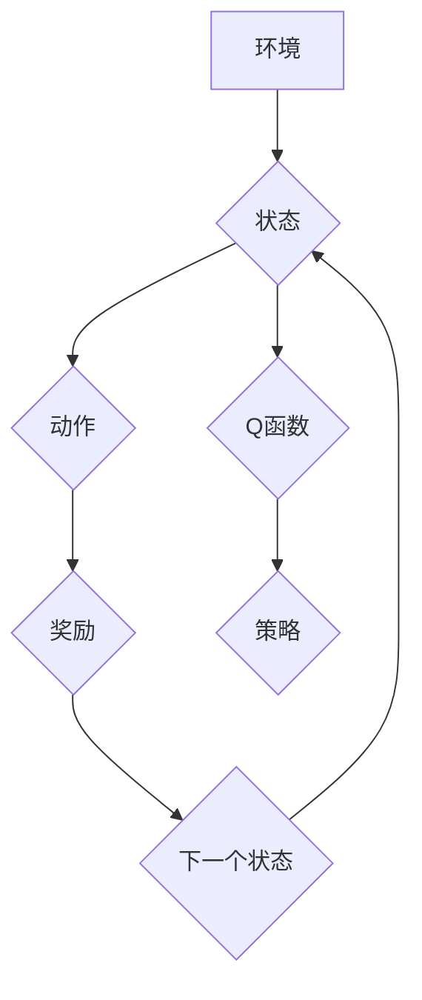

> 深度强化学习，DQN，工业自动化，机器人控制，智能制造，预测控制，模型预测控制

## 1. 背景介绍

工业自动化是现代工业发展的重要驱动力，其核心是通过自动化技术提高生产效率、降低成本和提升产品质量。随着人工智能技术的快速发展，深度强化学习（Deep Reinforcement Learning，DRL）作为一种强大的机器学习方法，在工业自动化领域展现出巨大的应用潜力。

深度强化学习的核心思想是通过训练智能体与环境交互，学习最优的策略，以最大化累积奖励。在工业自动化场景中，智能体可以是机器人、控制系统或其他自动化设备，环境则是工业生产线或其他自动化系统。通过训练，智能体可以学习完成各种复杂的任务，例如：

* **机器人控制:**  学习控制机器人的运动轨迹，完成搬运、装配等任务。
* **预测控制:**  预测未来生产过程中的变化，并根据预测结果调整控制参数，实现生产过程的稳定性和效率。
* **故障诊断:**  学习识别生产设备的异常状态，并及时进行故障诊断和维修。

## 2. 核心概念与联系

深度强化学习的核心概念包括：

* **智能体 (Agent):**  执行动作并与环境交互的实体。
* **环境 (Environment):**  智能体所处的外部世界，会根据智能体的动作做出相应的反馈。
* **状态 (State):**  环境的当前状态，描述了环境中所有相关信息。
* **动作 (Action):**  智能体可以执行的操作，会改变环境的状态。
* **奖励 (Reward):**  环境对智能体动作的反馈，可以是正向奖励或负向奖励。
* **策略 (Policy):**  智能体根据当前状态选择动作的规则。

DQN（Deep Q-Network）是一种基于深度神经网络的强化学习算法，它通过学习一个Q函数来估计在给定状态下执行特定动作的期望累积奖励。

**DQN算法流程图:**



## 3. 核心算法原理 & 具体操作步骤

### 3.1  算法原理概述

DQN算法的核心思想是学习一个Q函数，该函数将状态-动作对映射到期望累积奖励。Q函数的更新基于Bellman方程，通过最小化Q函数与实际奖励的误差来学习。

DQN算法的主要步骤如下：

1. 初始化Q函数网络。
2. 从环境中收集状态-动作-奖励-下一个状态的数据。
3. 使用经验回放机制从数据集中随机采样数据进行训练。
4. 计算Q函数的损失函数。
5. 使用梯度下降算法更新Q函数网络的参数。
6. 重复步骤2-5，直到Q函数收敛。

### 3.2  算法步骤详解

1. **初始化Q函数网络:**

   DQN算法使用一个深度神经网络来表示Q函数，网络的输入是当前状态，输出是每个动作对应的Q值。

2. **从环境中收集数据:**

   智能体与环境交互，收集状态-动作-奖励-下一个状态的数据。这些数据将用于训练Q函数网络。

3. **经验回放机制:**

   DQN算法使用经验回放机制来提高训练效率。经验回放机制将收集到的数据存储在一个经验池中，然后从经验池中随机采样数据进行训练。

4. **计算Q函数损失函数:**

   DQN算法使用均方误差（MSE）作为损失函数，计算Q函数网络的预测值与实际奖励之间的误差。

5. **更新Q函数网络参数:**

   使用梯度下降算法更新Q函数网络的参数，以最小化损失函数。

### 3.3  算法优缺点

**优点:**

* **能够学习复杂的任务:** DQN算法能够学习解决复杂的任务，例如机器人控制和预测控制。
* **能够处理高维状态空间:** DQN算法可以使用深度神经网络来处理高维状态空间。
* **能够利用经验回放机制提高训练效率:** 经验回放机制可以使训练过程更加稳定和高效。

**缺点:**

* **训练过程可能比较慢:** DQN算法的训练过程可能比较慢，需要大量的训练数据和计算资源。
* **容易出现震荡问题:** DQN算法容易出现震荡问题，导致训练不稳定。

### 3.4  算法应用领域

DQN算法在工业自动化领域有广泛的应用前景，例如：

* **机器人控制:**  学习控制机器人的运动轨迹，完成搬运、装配等任务。
* **预测控制:**  预测未来生产过程中的变化，并根据预测结果调整控制参数，实现生产过程的稳定性和效率。
* **故障诊断:**  学习识别生产设备的异常状态，并及时进行故障诊断和维修。
* **智能制造:**  实现智能工厂的自动化控制和优化管理。

## 4. 数学模型和公式 & 详细讲解 & 举例说明

### 4.1  数学模型构建

DQN算法的核心是学习一个Q函数，该函数将状态-动作对映射到期望累积奖励。

**Q函数定义:**

$$Q(s, a) = E[\sum_{t=0}^{\infty} \gamma^t r_{t+1} | s_t = s, a_t = a]$$

其中：

* $s$ 是当前状态。
* $a$ 是执行的动作。
* $r_{t+1}$ 是在时间步$t+1$获得的奖励。
* $\gamma$ 是折扣因子，控制未来奖励的权重。

### 4.2  公式推导过程

DQN算法使用深度神经网络来逼近Q函数，并使用梯度下降算法更新网络参数。

**Bellman方程:**

$$Q(s, a) = r + \gamma \max_{a'} Q(s', a')$$

其中：

* $s'$ 是下一个状态。

DQN算法的目标是最小化Q函数网络的预测值与实际奖励之间的误差。

**损失函数:**

$$L = \frac{1}{N} \sum_{i=1}^{N} (y_i - Q(s_i, a_i))^2$$

其中：

* $N$ 是样本数量。
* $y_i$ 是目标值，计算公式如下：

$$y_i = r_i + \gamma \max_{a'} Q(s'_i, a')$$

### 4.3  案例分析与讲解

假设有一个机器人需要学习在迷宫中找到出口的任务。

* **状态:**  机器人当前的位置。
* **动作:**  向上、向下、向左、向右移动。
* **奖励:**  到达出口获得最大奖励，迷宫内其他位置获得较小奖励，撞墙获得负奖励。

DQN算法可以学习一个Q函数，该函数将机器人当前位置和动作映射到期望累积奖励。通过训练，机器人可以学习最优的策略，找到迷宫出口。

## 5. 项目实践：代码实例和详细解释说明

### 5.1  开发环境搭建

* **操作系统:** Ubuntu 20.04 LTS
* **Python版本:** 3.8
* **深度学习框架:** TensorFlow 2.x
* **其他依赖库:** numpy, matplotlib, gym

### 5.2  源代码详细实现

```python
import tensorflow as tf
import numpy as np

# 定义DQN网络
class DQN(tf.keras.Model):
    def __init__(self, state_size, action_size):
        super(DQN, self).__init__()
        self.dense1 = tf.keras.layers.Dense(64, activation='relu')
        self.dense2 = tf.keras.layers.Dense(64, activation='relu')
        self.output = tf.keras.layers.Dense(action_size)

    def call(self, state):
        x = self.dense1(state)
        x = self.dense2(x)
        return self.output(x)

# 定义DQN算法
class DQNAgent:
    def __init__(self, state_size, action_size, learning_rate=0.001, gamma=0.99, epsilon=1.0, epsilon_decay=0.995, epsilon_min=0.01):
        self.state_size = state_size
        self.action_size = action_size
        self.learning_rate = learning_rate
        self.gamma = gamma
        self.epsilon = epsilon
        self.epsilon_decay = epsilon_decay
        self.epsilon_min = epsilon_min
        self.model = DQN(state_size, action_size)
        self.optimizer = tf.keras.optimizers.Adam(learning_rate=self.learning_rate)

    def choose_action(self, state):
        if np.random.rand() < self.epsilon:
            return np.random.randint(self.action_size)
        else:
            q_values = self.model(state)
            return np.argmax(q_values[0])

    def train(self, state, action, reward, next_state, done):
        with tf.GradientTape() as tape:
            q_values = self.model(state)
            target_q = reward if done else reward + self.gamma * tf.reduce_max(self.model(next_state))
            loss = tf.keras.losses.MSE(target_q, q_values[0][action])
        gradients = tape.gradient(loss, self.model.trainable_variables)
        self.optimizer.apply_gradients(zip(gradients, self.model.trainable_variables))

        self.epsilon = max(self.epsilon * self.epsilon_decay, self.epsilon_min)

### 5.3  代码解读与分析

* **DQN网络:**  DQN网络是一个简单的多层感知机，用于逼近Q函数。
* **DQNAgent类:**  DQNAgent类包含了DQN算法的核心逻辑，包括选择动作、训练模型等。
* **choose_action方法:**  该方法根据当前状态和epsilon-greedy策略选择动作。
* **train方法:**  该方法使用Bellman方程更新Q函数网络的参数。

### 5.4  运行结果展示

运行代码后，可以观察到智能体在环境中学习的过程，最终能够完成目标任务。

## 6. 实际应用场景

### 6.1  机器人控制

DQN算法可以用于控制机器人完成各种复杂的任务，例如：

* **工业机器人:**  学习控制工业机器人的运动轨迹，完成搬运、装配等任务。
* **服务机器人:**  学习控制服务机器人的运动轨迹，完成导航、服务等任务。

### 6.2  预测控制

DQN算法可以用于预测未来生产过程中的变化，并根据预测结果调整控制参数，实现生产过程的稳定性和效率。

* **过程控制:**  预测生产过程中的关键变量变化，并调整控制参数以保持稳定运行。
* **库存管理:**  预测未来需求变化，并调整库存水平以优化库存成本。

### 6.3  故障诊断

DQN算法可以学习识别生产设备的异常状态，并及时进行故障诊断和维修。

* **设备状态监测:**  学习识别设备运行状态的异常模式，并进行预警。
* **故障诊断:**  学习识别设备故障的类型和原因，并提供维修建议。

### 6.4  未来应用展望

DQN算法在工业自动化领域具有巨大的应用潜力，未来将有更多新的应用场景出现，例如：

* **智能制造:**  实现智能工厂的自动化控制和优化管理。
* **工业互联网:**  将工业设备与互联网连接，实现数据共享和协同控制。
* **工业安全:**  学习识别工业安全风险，并采取措施预防事故发生。

## 7. 工具和资源推荐