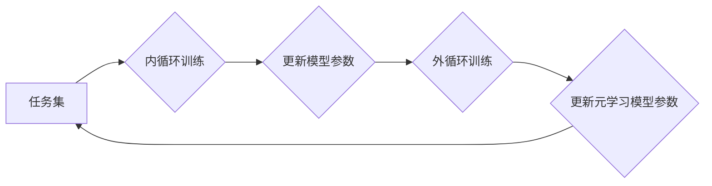

> 元学习，特征提取，深度学习，迁移学习，泛化能力

## 1. 背景介绍

在深度学习领域，特征提取一直是核心问题之一。传统的深度学习模型通常需要大量的 labeled 数据进行训练，并且在面对新的任务或数据分布时，表现往往会下降。为了解决这些问题，元学习 (Meta-Learning) 应运而生。元学习旨在学习如何学习，即学习一个通用的学习策略，能够快速适应新的任务和数据。

元学习的核心思想是将学习过程本身作为训练目标。通过在多个任务上进行训练，元学习模型可以学习到通用的特征表示和学习策略，从而提高对新任务的泛化能力。

## 2. 核心概念与联系

元学习的核心概念包括：

* **内循环 (Inner Loop):** 在每个具体的任务上进行训练，更新模型参数的过程。
* **外循环 (Outer Loop):** 在多个任务上进行训练，更新元学习模型参数的过程。
* **元学习模型:** 学习通用的学习策略的模型，例如 MAML (Model-Agnostic Meta-Learning) 和 Reptile。

**元学习流程图:**



## 3. 核心算法原理 & 具体操作步骤

### 3.1  算法原理概述

MAML (Model-Agnostic Meta-Learning) 是一种通用的元学习算法，它可以应用于各种类型的深度学习模型。MAML 的核心思想是通过在多个任务上进行训练，学习一个初始模型参数，使得该模型在新的任务上能够快速适应。

### 3.2  算法步骤详解

1. **初始化:** 初始化一个深度学习模型，并随机初始化模型参数。
2. **内循环训练:**
    * 从任务集 T 中随机选择一个任务。
    * 在该任务上进行少量的数据迭代训练，更新模型参数。
3. **外循环训练:**
    * 计算所有任务上内循环训练后的模型性能。
    * 使用梯度下降算法更新元学习模型的参数，目标是最大化所有任务上的性能。
4. **重复步骤 2 和 3:** 直到模型性能达到预设目标。

### 3.3  算法优缺点

**优点:**

* **通用性:** 可以应用于各种类型的深度学习模型。
* **高效性:** 只需要在每个任务上进行少量的数据迭代训练。
* **泛化能力:** 可以有效提高模型在新的任务上的泛化能力。

**缺点:**

* **计算成本:** 在多个任务上进行训练，计算成本较高。
* **数据需求:** 需要大量的任务数据进行训练。

### 3.4  算法应用领域

MAML 算法在以下领域具有广泛的应用前景:

* **图像分类:** 在小样本图像分类任务中，MAML 可以有效提高模型的泛化能力。
* **自然语言处理:** 在文本分类、情感分析等任务中，MAML 可以帮助模型快速适应新的文本风格和领域。
* **机器人控制:** 在机器人控制任务中，MAML 可以帮助机器人快速学习新的运动技能。

## 4. 数学模型和公式 & 详细讲解 & 举例说明

### 4.1  数学模型构建

MAML 的目标是学习一个元学习模型，该模型能够在新的任务上快速适应。

假设我们有 T 个任务，每个任务包含一个训练集和一个测试集。每个任务的训练集包含 N 个样本，每个样本包含输入 x 和标签 y。

元学习模型的参数为 θ。MAML 的目标函数为：

$$
L(\theta) = \frac{1}{T} \sum_{t=1}^{T} L_t(\theta)
$$

其中，$L_t(\theta)$ 是第 t 个任务上的损失函数。

### 4.2  公式推导过程

MAML 使用梯度下降算法更新元学习模型的参数。

在内循环训练中，对于每个任务 t，我们使用梯度下降算法更新模型参数：

$$
\theta_t = \theta - \alpha \nabla_{\theta} L_t(\theta)
$$

其中，α 是学习率。

在外循环训练中，我们使用梯度下降算法更新元学习模型的参数：

$$
\theta = \theta - \beta \nabla_{\theta} L(\theta)
$$

其中，β 是学习率。

### 4.3  案例分析与讲解

假设我们有一个图像分类任务，需要对不同类型的动物进行分类。

我们可以使用 MAML 算法训练一个元学习模型，该模型能够在新的动物类别上快速适应。

在训练过程中，我们将将动物图像分为多个任务，每个任务包含不同的动物类别。

在内循环训练中，对于每个任务，我们将使用少量的数据进行训练，更新模型参数。

在外循环训练中，我们将使用所有任务上的性能作为目标函数，更新元学习模型的参数。

经过训练，我们得到的元学习模型能够在新的动物类别上快速适应，并达到较高的分类精度。

## 5. 项目实践：代码实例和详细解释说明

### 5.1  开发环境搭建

* Python 3.6+
* PyTorch 1.0+
* CUDA 10.0+

### 5.2  源代码详细实现

```python
import torch
import torch.nn as nn
import torch.optim as optim

# 定义一个简单的 CNN 模型
class CNN(nn.Module):
    def __init__(self):
        super(CNN, self).__init__()
        self.conv1 = nn.Conv2d(3, 16, kernel_size=3, padding=1)
        self.relu = nn.ReLU()
        self.pool = nn.MaxPool2d(kernel_size=2, stride=2)
        self.fc1 = nn.Linear(16 * 7 * 7, 128)
        self.fc2 = nn.Linear(128, 10)

    def forward(self, x):
        x = self.pool(self.relu(self.conv1(x)))
        x = x.view(-1, 16 * 7 * 7)
        x = self.relu(self.fc1(x))
        x = self.fc2(x)
        return x

# 定义 MAML 算法
class MAML(object):
    def __init__(self, model, lr, meta_lr):
        self.model = model
        self.optimizer = optim.Adam(model.parameters(), lr=lr)
        self.meta_optimizer = optim.Adam(model.parameters(), lr=meta_lr)

    def train(self, tasks):
        for task in tasks:
            # 内循环训练
            for epoch in range(5):
                for x, y in task['train']:
                    self.optimizer.zero_grad()
                    output = self.model(x)
                    loss = nn.CrossEntropyLoss()(output, y)
                    loss.backward()
                    self.optimizer.step()

            # 外循环训练
            self.meta_optimizer.zero_grad()
            loss = self.calculate_loss(task)
            loss.backward()
            self.meta_optimizer.step()

    def calculate_loss(self, task):
        # 计算任务上的损失
        pass

# 训练 MAML 模型
model = CNN()
maml = MAML(model, lr=0.01, meta_lr=0.001)
tasks = ... # 加载任务数据
maml.train(tasks)
```

### 5.3  代码解读与分析

* **模型定义:** 代码中定义了一个简单的 CNN 模型，用于图像分类任务。
* **MAML 算法实现:** 代码中实现了 MAML 算法，包括内循环训练和外循环训练。
* **任务数据:** 需要加载任务数据，每个任务包含训练集和测试集。
* **训练过程:** 使用 MAML 算法训练模型，更新模型参数。

### 5.4  运行结果展示

训练完成后，可以使用测试集评估模型性能。

## 6. 实际应用场景

元学习在以下实际应用场景中具有广泛的应用前景:

* **个性化推荐:** 根据用户的历史行为，学习用户的偏好，提供个性化的推荐。
* **医疗诊断:** 学习病人的症状和病历，辅助医生进行诊断。
* **金融风险控制:** 学习金融数据的特征，识别潜在的风险。

### 6.4  未来应用展望

随着元学习技术的不断发展，未来将有更多新的应用场景出现。例如:

* **自动驾驶:** 元学习可以帮助自动驾驶汽车快速学习新的驾驶场景。
* **机器人学习:** 元学习可以帮助机器人快速学习新的运动技能和任务。
* **人工智能增强:** 元学习可以帮助人类提高学习效率和解决问题的能力。

## 7. 工具和资源推荐

### 7.1  学习资源推荐

* **论文:**
    * Finn, C., Abbeel, P., & Levine, S. (2017). Model-agnostic meta-learning for fast adaptation of deep networks.
* **博客:**
    * https://blog.openai.com/meta-learning/
    * https://towardsdatascience.com/meta-learning-a-powerful-technique-for-few-shot-learning-a7999999999a

### 7.2  开发工具推荐

* **PyTorch:** https://pytorch.org/
* **TensorFlow:** https://www.tensorflow.org/

### 7.3  相关论文推荐

* **MAML:** https://arxiv.org/abs/1703.03465
* **Reptile:** https://arxiv.org/abs/1803.02999

## 8. 总结：未来发展趋势与挑战

### 8.1  研究成果总结

元学习在深度学习领域取得了显著的进展，能够有效提高模型的泛化能力和适应新任务的能力。

### 8.2  未来发展趋势

* **更有效的元学习算法:** 研究更有效的元学习算法，提高模型的学习效率和泛化能力。
* **更广泛的应用场景:** 将元学习应用于更多实际应用场景，例如自动驾驶、机器人学习、医疗诊断等。
* **理论研究:** 深入研究元学习的理论基础，理解元学习的学习机制。

### 8.3  面临的挑战

* **数据需求:** 元学习算法通常需要大量的任务数据进行训练。
* **计算成本:** 元学习算法的训练过程计算成本较高。
* **模型复杂度:** 元学习模型通常比较复杂，难以理解和解释。

### 8.4  研究展望

未来，元学习将继续是一个重要的研究方向，有望推动深度学习技术的进一步发展。


## 9. 附录：常见问题与解答

* **什么是元学习？**

元学习是一种机器学习方法，旨在学习如何学习。它通过在多个任务上进行训练，学习一个通用的学习策略，从而提高模型在新的任务上的泛化能力。

* **元学习与迁移学习有什么区别？**

迁移学习是指将已学习到的知识应用于新的任务。元学习是一种更高级的迁移学习方法，它学习一个通用的学习策略，能够适应各种各样的任务。

* **元学习有哪些应用场景？**

元学习在以下领域具有广泛的应用前景:

* **图像分类:** 在小样本图像分类任务中，元学习可以有效提高模型的泛化能力。
* **自然语言处理:** 在文本分类、情感分析等任务中，元学习可以帮助模型快速适应新的文本风格和领域。
* **机器人控制:** 在机器人控制任务中，元学习可以帮助机器人快速学习新的运动技能。

* **元学习的优势是什么？**

元学习的优势在于:

* **通用性:** 可以应用于各种类型的深度学习模型。
* **高效性:** 只需要在每个任务上进行少量的数据迭代训练。
* **泛化能力:** 可以有效提高模型在新的任务上的泛化能力。


作者：禅