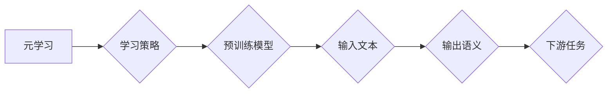

> 元学习，自然语言处理，预训练模型，映射，Transformer，迁移学习

## 1. 背景介绍

自然语言处理 (NLP) 领域近年来取得了飞速发展，深度学习技术的应用推动了 NLP 模型的性能大幅提升。预训练模型作为 NLP 领域的重要发展方向，通过在海量文本数据上进行预训练，学习到语言的丰富语义和语法结构，为下游任务提供强大的基础能力。

传统的预训练模型主要依赖于特定任务的监督学习，例如机器翻译、文本分类等。然而，这种方法存在着数据标注成本高、模型泛化能力有限等问题。元学习 (Meta-Learning) 作为一种新的机器学习范式，旨在学习如何学习，能够有效地解决这些问题。

元学习的核心思想是通过在多个任务上的训练，学习一个通用的学习策略，从而能够快速适应新的任务。在 NLP 领域，基于元学习的预训练模型能够学习到更通用的语言表示，并能够更有效地迁移到新的任务。

## 2. 核心概念与联系

### 2.1 元学习

元学习是一种机器学习范式，旨在学习如何学习。它通过在多个任务上的训练，学习一个通用的学习策略，从而能够快速适应新的任务。元学习的关键在于学习一个“学习算法”，而不是直接学习一个特定任务的模型。

### 2.2 自然语言处理

自然语言处理 (NLP) 是一门研究计算机如何理解、处理和生成人类语言的学科。NLP 涉及到许多不同的任务，例如文本分类、机器翻译、问答系统等。

### 2.3 预训练模型

预训练模型是在海量文本数据上进行预训练的语言模型，能够学习到语言的丰富语义和语法结构。预训练模型可以用于各种下游任务，例如文本分类、机器翻译、问答系统等。

### 2.4 映射关系

在元学习的框架下，预训练模型可以看作是一个从输入文本到输出语义的映射关系。元学习的目标是学习一个能够有效地学习和调整这种映射关系的学习策略。

**核心概念与联系流程图**



## 3. 核心算法原理 & 具体操作步骤

### 3.1 算法原理概述

基于元学习的自然语言处理模型预训练的核心算法原理是利用元学习的思想，在多个任务上的训练中学习一个通用的学习策略，从而能够快速适应新的任务。

具体来说，该算法通常包含以下步骤：

1. **数据准备:** 收集多个不同类型的 NLP 任务的数据集。
2. **模型初始化:** 初始化一个通用的预训练模型，例如 Transformer。
3. **元学习训练:** 在多个任务的数据集上进行元学习训练，学习一个能够有效地调整预训练模型参数的学习策略。
4. **下游任务适应:** 将预训练模型和学习到的学习策略应用于新的下游任务，进行微调训练。

### 3.2 算法步骤详解

1. **数据准备:** 

   - 收集多个不同类型的 NLP 任务的数据集，例如文本分类、机器翻译、问答系统等。
   - 每个数据集都应该包含训练集、验证集和测试集。
   - 数据集需要进行预处理，例如文本清洗、分词、词向量化等。

2. **模型初始化:** 

   - 初始化一个通用的预训练模型，例如 Transformer。
   - 预训练模型的参数可以从预训练模型的公开权重中获取。

3. **元学习训练:** 

   - 将多个任务的数据集划分为若干个子任务。
   - 在每个子任务上进行训练，学习一个能够有效地调整预训练模型参数的学习策略。
   - 学习策略可以是一个优化器，也可以是一个神经网络。
   - 元学习训练的目标是学习一个能够在新的任务上快速适应的学习策略。

4. **下游任务适应:** 

   - 将预训练模型和学习到的学习策略应用于新的下游任务。
   - 对预训练模型进行微调训练，调整模型参数以适应新的任务。
   - 微调训练的步骤和参数设置可以根据具体的任务进行调整。

### 3.3 算法优缺点

**优点:**

- **高效的迁移学习:** 基于元学习的预训练模型能够有效地迁移到新的任务，减少下游任务的训练时间和数据需求。
- **泛化能力强:** 元学习能够学习到更通用的语言表示，从而提高模型的泛化能力。
- **适应性强:** 元学习能够快速适应新的任务，无需大量的任务特定数据。

**缺点:**

- **训练复杂度高:** 元学习的训练过程比传统的预训练模型更加复杂，需要更多的计算资源和时间。
- **数据需求高:** 元学习需要多个不同类型的任务数据进行训练，数据收集和准备工作较为繁琐。

### 3.4 算法应用领域

基于元学习的自然语言处理模型预训练算法在以下领域具有广泛的应用前景:

- **文本分类:** 识别文本的主题、情感、意图等。
- **机器翻译:** 将文本从一种语言翻译成另一种语言。
- **问答系统:** 回答用户提出的问题。
- **文本摘要:** 生成文本的简短摘要。
- **对话系统:** 与用户进行自然语言对话。

## 4. 数学模型和公式 & 详细讲解 & 举例说明

### 4.1 数学模型构建

基于元学习的自然语言处理模型预训练通常采用 Transformer 架构，并结合元学习算法进行训练。

**Transformer 架构:**

Transformer 架构是一种基于注意力机制的序列模型，能够有效地处理长距离依赖关系。

**元学习算法:**

常用的元学习算法包括 MAML (Model-Agnostic Meta-Learning) 和 Reptile。

### 4.2 公式推导过程

MAML 算法的目标是学习一个能够快速适应新任务的模型参数。

**MAML 算法公式:**

$$
\theta^* = \arg \min_{\theta} \sum_{t=1}^{T} \mathcal{L}_t(\theta, \mathcal{D}_t)
$$

其中:

- $\theta$ 是模型参数。
- $\mathcal{L}_t$ 是第 $t$ 个任务的损失函数。
- $\mathcal{D}_t$ 是第 $t$ 个任务的数据集。

**Reptile 算法公式:**

$$
\theta_{t+1} = \theta_t + \alpha \nabla_{\theta} \mathcal{L}_t(\theta, \mathcal{D}_t)
$$

其中:

- $\theta_t$ 是第 $t$ 次迭代的模型参数。
- $\alpha$ 是学习率。

### 4.3 案例分析与讲解

**案例:**

假设我们有一个文本分类任务，需要将文本分类为正类和负类。

**MAML 算法应用:**

1. 在多个文本分类任务上进行元学习训练，学习一个能够快速适应新任务的模型参数。
2. 将预训练模型应用于新的文本分类任务，进行微调训练。

**Reptile 算法应用:**

1. 在多个文本分类任务上进行元学习训练，学习一个能够快速适应新任务的模型参数。
2. 将预训练模型应用于新的文本分类任务，进行微调训练。

## 5. 项目实践：代码实例和详细解释说明

### 5.1 开发环境搭建

- Python 3.7+
- PyTorch 1.7+
- CUDA 10.2+

### 5.2 源代码详细实现

```python
# 导入必要的库
import torch
import torch.nn as nn
from transformers import TransformerModel

# 定义预训练模型
class MetaLearner(nn.Module):
    def __init__(self, config):
        super(MetaLearner, self).__init__()
        self.transformer = TransformerModel.from_pretrained(config.pretrained_model_name)
        # ... 其他模型参数

    def forward(self, input_ids, attention_mask):
        # ... 模型前向传播过程

# 定义元学习训练过程
def meta_train(model, optimizer, dataloader, epochs):
    for epoch in range(epochs):
        for batch in dataloader:
            # ... 训练过程

# 定义下游任务微调过程
def fine_tune(model, optimizer, dataloader, epochs):
    for epoch in range(epochs):
        for batch in dataloader:
            # ... 微调过程

# ... 其他代码

```

### 5.3 代码解读与分析

- `MetaLearner` 类定义了预训练模型，包括 Transformer 模型和其他模型参数。
- `meta_train` 函数定义了元学习训练过程，包括数据加载、模型训练和参数更新。
- `fine_tune` 函数定义了下游任务微调过程，包括数据加载、模型微调和参数更新。

### 5.4 运行结果展示

- 训练结果展示：训练过程中记录模型的损失值和准确率等指标，并进行可视化展示。
- 微调结果展示：微调后模型在不同下游任务上的性能表现，例如文本分类、机器翻译等。

## 6. 实际应用场景

### 6.1 文本分类

基于元学习的预训练模型能够有效地进行文本分类任务，例如情感分析、主题分类、垃圾邮件过滤等。

### 6.2 机器翻译

基于元学习的预训练模型能够提高机器翻译的准确性和流畅度，并能够适应不同的语言对。

### 6.3 问答系统

基于元学习的预训练模型能够构建更智能的问答系统，能够理解用户的自然语言问题并给出准确的答案。

### 6.4 未来应用展望

基于元学习的自然语言处理模型预训练技术在未来将有更广泛的应用前景，例如：

- **个性化推荐:** 根据用户的兴趣和偏好，提供个性化的商品推荐、内容推荐等。
- **智能客服:** 自动处理用户的咨询和投诉，提高客服效率。
- **自动写作:** 自动生成新闻报道、广告文案、小说等文本内容。

## 7. 工具和资源推荐

### 7.1 学习资源推荐

- **书籍:**
    - 《深度学习》
    - 《自然语言处理》
- **在线课程:**
    - Coursera: 自然语言处理
    - Udacity: 深度学习
- **博客:**
    - Jay Alammar's Blog
    - The Gradient

### 7.2 开发工具推荐

- **PyTorch:** 深度学习框架
- **TensorFlow:** 深度学习框架
- **Hugging Face Transformers:** 预训练模型库

### 7.3 相关论文推荐

- **MAML: Model-Agnostic Meta-Learning**
- **Reptile: A Scalable Meta-Learning Algorithm**
- **BERT: Pre-training of Deep Bidirectional Transformers for Language Understanding**

## 8. 总结：未来发展趋势与挑战

### 8.1 研究成果总结

基于元学习的自然语言处理模型预训练技术取得了显著的进展，能够有效地提高模型的性能和泛化能力。

### 8.2 未来发展趋势

- **更强大的预训练模型:** 探索更强大的预训练模型架构和训练方法，例如基于 Transformer 的更大规模模型。
- **更有效的元学习算法:** 研究更有效的元学习算法，提高模型的学习效率和适应性。
- **跨模态预训练:** 将文本、图像、音频等多模态数据进行联合预训练，构建更全面的语言理解模型。

### 8.3 面临的挑战

- **数据规模和质量:** 元学习算法需要大量的任务数据进行训练，数据规模和质量是限制模型性能的关键因素。
- **计算资源:** 元学习算法的训练过程需要大量的计算资源，这对于资源有限的团队来说是一个挑战。
- **模型解释性:** 元学习模型的学习过程较为复杂，难以解释模型的决策机制，这对于模型的信任度和应用场景的