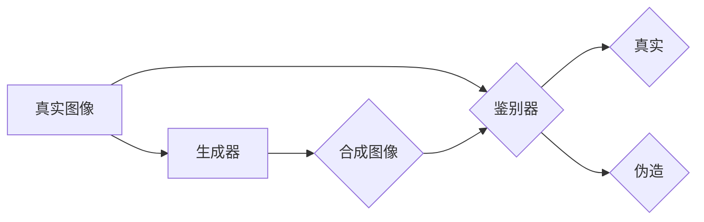

> 深度伪造检测，对抗性神经网络，生成对抗网络 (GAN)，深度学习，图像识别，安全

## 1. 背景介绍

在数字时代，图像和视频信息扮演着越来越重要的角色。它们不仅是信息传播的主要载体，也成为人们获取知识、娱乐休闲的重要工具。然而，随着深度学习技术的快速发展，生成高质量的合成图像和视频变得越来越容易，这也带来了新的安全隐患——深度伪造。

深度伪造是指利用深度学习算法生成逼真的人工图像或视频，这些伪造内容难以被肉眼识别，甚至可以欺骗先进的图像识别系统。深度伪造技术在新闻传播、政治宣传、商业营销等领域都可能被滥用，造成信息失真、社会混乱等严重后果。

因此，如何有效检测深度伪造内容，保障信息安全和社会稳定，成为当今科技界面临的重大挑战。

## 2. 核心概念与联系

深度伪造检测的核心在于识别图像或视频中存在的伪造痕迹。这些痕迹可能包括：

* **图像结构异常：** 合成图像的纹理、细节和结构可能与真实图像存在差异。
* **物理不合理性：** 合成图像中可能存在违反物理规律的现象，例如光影效果不自然、运动轨迹不合理等。
* **数据模式异常：** 合成图像的数据模式可能与真实图像存在差异，例如颜色分布、边缘特征等。

深度伪造检测技术主要依赖于深度学习算法，特别是生成对抗网络 (GAN)。

**GAN** 是一种由两个神经网络组成的框架，分别为生成器 (Generator) 和鉴别器 (Discriminator)。

* **生成器** 负责生成合成图像或视频。
* **鉴别器** 负责判断图像或视频是否为真实内容。

生成器和鉴别器之间进行对抗训练，生成器不断改进生成图像的质量，而鉴别器不断提高识别伪造图像的能力。

**Mermaid 流程图:**



## 3. 核心算法原理 & 具体操作步骤

### 3.1  算法原理概述

深度伪造检测算法通常基于以下原理：

* **特征提取:** 利用卷积神经网络 (CNN) 等深度学习模型提取图像或视频中的特征，例如纹理、边缘、颜色等。
* **异常检测:** 通过分析提取的特征，识别与真实图像或视频不符的异常点，例如结构异常、物理不合理性等。
* **分类判别:** 利用支持向量机 (SVM)、随机森林 (RF) 等机器学习算法，对异常点进行分类判别，判断图像或视频是否为深度伪造内容。

### 3.2  算法步骤详解

1. **数据预处理:** 对图像或视频进行预处理，例如尺寸调整、色彩规范化等。
2. **特征提取:** 利用预训练的 CNN 模型提取图像或视频的特征，例如 ResNet、VGG 等。
3. **异常检测:** 对提取的特征进行异常检测，例如使用 One-Class SVM 识别异常点。
4. **分类判别:** 利用 SVM、RF 等机器学习算法对异常点进行分类判别，判断图像或视频是否为深度伪造内容。
5. **结果输出:** 输出检测结果，例如标记深度伪造图像或视频。

### 3.3  算法优缺点

**优点:**

* **高准确率:** 深度学习算法能够学习到复杂的特征，提高检测准确率。
* **自动化程度高:** 算法自动化程度高，可以实现批量检测。
* **可扩展性强:** 算法可以根据需要扩展到处理不同类型和分辨率的图像或视频。

**缺点:**

* **训练数据依赖性强:** 算法需要大量的真实和伪造图像或视频数据进行训练。
* **计算资源消耗大:** 训练深度学习模型需要大量的计算资源。
* **对抗攻击脆弱:** 攻击者可以利用对抗样本攻击深度学习模型，降低检测准确率。

### 3.4  算法应用领域

深度伪造检测算法在以下领域有广泛的应用:

* **新闻媒体:** 检测新闻报道中的深度伪造图像或视频，保障新闻真实性。
* **金融行业:** 检测金融诈骗中的深度伪造身份证明或交易记录，防止金融损失。
* **法律领域:** 检测法律证据中的深度伪造图像或视频，保障司法公正。
* **社会安全:** 检测网络谣言和虚假信息中的深度伪造内容，维护社会稳定。

## 4. 数学模型和公式 & 详细讲解 & 举例说明

### 4.1  数学模型构建

深度伪造检测算法通常基于以下数学模型:

* **损失函数:** 用于衡量生成器和鉴别器之间的差距，引导模型训练。
* **优化算法:** 用于更新生成器和鉴别器的参数，例如梯度下降法。

**损失函数:**

常用的损失函数包括:

* **二分类交叉熵损失函数:** 用于训练鉴别器，衡量其对真实和伪造图像的分类准确率。

$$
L_{D}(D, x, y) = - \sum_{i=1}^{N} [y_i \log(D(x_i)) + (1-y_i) \log(1-D(x_i))]
$$

* **生成器损失函数:** 用于训练生成器，衡量其生成图像的真实性。

$$
L_{G}(G, D) = - \sum_{i=1}^{N} \log(D(G(z_i)))
$$

**优化算法:**

常用的优化算法包括:

* **随机梯度下降 (SGD):** 用于更新模型参数，通过随机选择一小批数据进行梯度计算。
* **Adam:** 是一种自适应学习率的优化算法，能够更快地收敛到最优解。

### 4.2  公式推导过程

损失函数和优化算法的推导过程通常基于微积分和概率论的知识。

**损失函数的推导:**

二分类交叉熵损失函数的推导过程如下:

1. 假设图像 $x$ 为真实图像，标签 $y$ 为 1，则损失函数为:

$$
L_{D}(D, x, 1) = - \log(D(x))
$$

2. 假设图像 $x$ 为伪造图像，标签 $y$ 为 0，则损失函数为:

$$
L_{D}(D, x, 0) = - \log(1-D(x))
$$

3. 将以上两个损失函数相加，得到二分类交叉熵损失函数:

$$
L_{D}(D, x, y) = - \sum_{i=1}^{N} [y_i \log(D(x_i)) + (1-y_i) \log(1-D(x_i))]
$$

### 4.3  案例分析与讲解

**案例:**

假设我们使用 GAN 训练一个生成人脸图像的模型。

**分析:**

* 生成器会尝试生成逼真的人脸图像。
* 鉴别器会尝试区分真实的人脸图像和生成器生成的伪造人脸图像。
* 通过对抗训练，生成器会不断改进生成图像的质量，而鉴别器会不断提高识别伪造图像的能力。

**讲解:**

这个案例展示了 GAN 如何通过对抗训练来生成逼真的图像。

## 5. 项目实践：代码实例和详细解释说明

### 5.1  开发环境搭建

* **操作系统:** Ubuntu 18.04
* **编程语言:** Python 3.6
* **深度学习框架:** TensorFlow 2.0
* **其他依赖:** numpy, matplotlib, scikit-learn

### 5.2  源代码详细实现

```python
# 生成器模型
def build_generator(input_shape):
    # ...

# 鉴别器模型
def build_discriminator(input_shape):
    # ...

# 训练循环
for epoch in range(num_epochs):
    # ...

# 保存模型
generator.save("generator.h5")
discriminator.save("discriminator.h5")
```

### 5.3  代码解读与分析

* **模型构建:** 代码中定义了生成器和鉴别器模型，并使用 TensorFlow 的 API 进行构建。
* **训练循环:** 训练循环中，会对生成器和鉴别器进行交替训练，并使用损失函数和优化算法进行更新。
* **模型保存:** 训练完成后，会将生成器和鉴别器模型保存为 .h5 文件。

### 5.4  运行结果展示

训练完成后，可以利用生成器模型生成新的图像，并与真实图像进行比较。

## 6. 实际应用场景

### 6.1  新闻媒体

深度伪造检测可以帮助新闻媒体识别和标记深度伪造新闻，保障新闻真实性，维护社会舆论环境。

### 6.2  金融行业

深度伪造检测可以帮助金融机构识别和防范深度伪造身份证明、交易记录等，防止金融诈骗和资金损失。

### 6.3  法律领域

深度伪造检测可以帮助法律机构识别和验证法律证据中的深度伪造图像或视频，保障司法公正。

### 6.4  未来应用展望

随着深度学习技术的不断发展，深度伪造检测技术将应用于更多领域，例如医疗、教育、娱乐等。

## 7. 工具和资源推荐

### 7.1  学习资源推荐

* **书籍:**
    * Deep Learning by Ian Goodfellow
    * Generative Adversarial Networks by Ian Goodfellow
* **在线课程:**
    * Deep Learning Specialization by Andrew Ng
    * Generative Adversarial Networks by TensorFlow

### 7.2  开发工具推荐

* **深度学习框架:** TensorFlow, PyTorch
* **图像处理库:** OpenCV, Pillow
* **数据可视化工具:** Matplotlib, Seaborn

### 7.3  相关论文推荐

* **Generative Adversarial Networks** by Ian Goodfellow et al. (2014)
* **Deepfakes: A Survey** by Sharma et al. (2020)
* **Detecting Deepfakes: A Survey** by Li et al. (2021)

## 8. 总结：未来发展趋势与挑战

### 8.1  研究成果总结

深度伪造检测技术取得了显著进展，能够识别多种类型的深度伪造内容。

### 8.2  未来发展趋势

* **更鲁棒的检测算法:** 开发更鲁棒的检测算法，能够抵抗对抗攻击和新的伪造技术。
* **多模态深度伪造检测:** 研究多模态深度伪造检测，例如结合音频、视频和文本信息进行检测。
* **可解释性增强:** 提高深度伪造检测算法的可解释性，帮助用户理解检测结果。

### 8.3  面临的挑战

* **伪造技术的不断发展:** 攻击者不断开发新的伪造技术，挑战现有检测算法的有效性。
* **数据标注困难:** 深度伪造检测需要大量的真实和伪造数据进行训练，数据标注工作量大且成本高。
* **伦理问题:** 深度伪造技术可能被滥用，造成信息失真和社会混乱，需要关注其伦理问题。

### 8.4  研究展望

未来，深度伪造检测技术将继续发展，成为保障信息安全和维护社会稳定的重要技术。

## 9. 附录：常见问题与解答

**常见问题:**

* **如何判断图像是否为深度伪造？**

**解答:**

可以使用深度伪造检测工具或算法进行检测。

* **深度伪造检测技术是否完美？**

**解答:**

目前，深度伪造检测技术还没有达到完美，仍然存在一定的误判率。

* **如何防止深度伪造的滥用？**

**解答:**

需要加强法律法规建设，提高公众的辨别能力，并鼓励技术研发，开发更有效的检测和防范手段