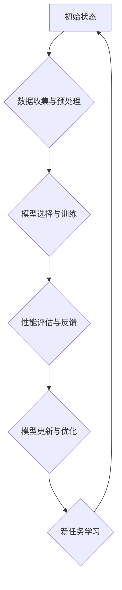

>终身学习，元学习，知识迁移，模型训练，深度学习，人工智能

## 1. 背景介绍

在当今瞬息万变的科技时代，知识更新迭代的速度前所未有。面对海量信息和不断涌现的新技术，传统的学习模式已难以满足个人和社会发展的需求。终身学习应运而生，成为适应时代发展和个人成长必不可少的理念。

终身学习强调的是持续不断的学习和自我提升，它不仅限于获取新的知识和技能，更重要的是培养学习能力、解决问题的能力和适应变化的能力。而元学习作为一种新型的学习范式，旨在学习如何学习，从而更高效地掌握新的知识和技能。

## 2. 核心概念与联系

**2.1 终身学习**

终身学习是指从出生到死亡，个人不断学习和自我提升的过程。它强调的是学习的持续性、主动性和个性化。终身学习者始终保持好奇心和求知欲，积极探索新的知识和技能，并将其应用于实际生活中。

**2.2 元学习**

元学习是指学习如何学习，从而更高效地掌握新的知识和技能。它关注的是学习过程本身，旨在构建一个能够自动学习和适应新环境的学习系统。元学习的核心思想是通过学习过去的经验，优化未来的学习策略，从而提高学习效率和效果。

**2.3 终身学习与元学习的关系**

终身学习和元学习之间存在着密切的联系。元学习可以为终身学习提供强大的工具和支持。通过元学习，我们可以：

* **提高学习效率:** 元学习可以帮助我们识别学习规律，优化学习策略，从而更高效地掌握新的知识和技能。
* **增强知识迁移能力:** 元学习可以帮助我们将已有的知识和技能迁移到新的领域，从而更快地适应新的环境和挑战。
* **促进个性化学习:** 元学习可以根据个人的学习风格和需求，定制个性化的学习方案，从而提高学习的兴趣和效果。

**2.4 元学习流程图**



## 3. 核心算法原理 & 具体操作步骤

**3.1 算法原理概述**

元学习的核心算法通常基于强化学习的原理。强化学习是一种机器学习方法，它通过奖励机制来训练智能体，使其在特定环境中做出最优决策。

在元学习中，智能体学习的是如何学习，而不是学习具体的知识或技能。智能体通过不断尝试不同的学习策略，并根据学习效果获得奖励或惩罚，最终学习到最优的学习策略。

**3.2 算法步骤详解**

1. **数据收集与预处理:** 收集大量的数据，并对数据进行预处理，例如清洗、转换和特征工程。
2. **模型选择与训练:** 选择合适的模型架构，并对模型进行训练，使其能够学习数据的规律。
3. **性能评估与反馈:** 对模型的性能进行评估，并根据评估结果提供反馈。
4. **模型更新与优化:** 根据反馈信息，更新模型的参数，使其性能得到提升。
5. **新任务学习:** 使用训练好的模型，对新的任务进行学习。

**3.3 算法优缺点**

**优点:**

* **高效学习:** 元学习可以帮助智能体更快地学习新的知识和技能。
* **知识迁移:** 元学习可以帮助智能体将已有的知识和技能迁移到新的领域。
* **适应性强:** 元学习可以帮助智能体适应不断变化的环境。

**缺点:**

* **数据需求高:** 元学习需要大量的训练数据。
* **计算资源消耗大:** 元学习的训练过程需要大量的计算资源。
* **算法复杂:** 元学习算法相对复杂，需要专业的知识和技能。

**3.4 算法应用领域**

元学习在许多领域都有着广泛的应用，例如：

* **教育:** 个性化学习、智能辅导
* **医疗:** 疾病诊断、药物研发
* **金融:** 风险管理、投资决策
* **机器人:** 运动控制、任务规划

## 4. 数学模型和公式 & 详细讲解 & 举例说明

**4.1 数学模型构建**

元学习的数学模型通常基于强化学习的框架，其中包括以下几个关键要素：

* **状态空间:** 表示智能体所处的环境状态。
* **动作空间:** 表示智能体可以采取的行动。
* **奖励函数:** 用于评估智能体采取行动后的效果。
* **策略函数:** 用于决定智能体在特定状态下采取的行动。

**4.2 公式推导过程**

元学习的目标是学习一个通用的策略函数，该函数能够在不同的任务环境中表现良好。常用的元学习算法，例如MAML（Model-Agnostic Meta-Learning），通过以下公式来更新策略函数：

$$
\theta = \theta - \alpha \sum_{i=1}^{N} \nabla_{\theta} L_i(\theta)
$$

其中：

* $\theta$ 是策略函数的参数。
* $\alpha$ 是学习率。
* $N$ 是训练样本的数量。
* $L_i(\theta)$ 是第 $i$ 个样本的损失函数。

**4.3 案例分析与讲解**

假设我们有一个元学习任务，目标是训练一个模型能够识别不同的图像类别。我们可以使用MAML算法来训练这个模型。

在训练过程中，我们会将图像数据集划分为多个子集，每个子集作为一次训练任务。对于每个子集，我们都会使用MAML算法更新模型的参数，使其能够在该子集上表现良好。

经过多次训练后，模型将学习到一个通用的策略函数，该函数能够在新的图像类别上表现良好，即使这些类别在训练数据中没有出现过。

## 5. 项目实践：代码实例和详细解释说明

**5.1 开发环境搭建**

* Python 3.7+
* TensorFlow 2.0+
* PyTorch 1.0+

**5.2 源代码详细实现**

```python
import tensorflow as tf

# 定义元学习模型
class MetaModel(tf.keras.Model):
    def __init__(self, input_shape, num_classes):
        super(MetaModel, self).__init__()
        self.layers = tf.keras.Sequential([
            tf.keras.layers.Flatten(input_shape=input_shape),
            tf.keras.layers.Dense(128, activation='relu'),
            tf.keras.layers.Dense(num_classes, activation='softmax')
        ])

    def call(self, x):
        return self.layers(x)

# 定义元学习训练函数
def meta_train(model, train_data, test_data, epochs, lr):
    optimizer = tf.keras.optimizers.Adam(learning_rate=lr)
    for epoch in range(epochs):
        for batch in train_data:
            # 训练模型
            with tf.GradientTape() as tape:
                loss = model.train_step(batch)
            # 更新模型参数
            gradients = tape.gradient(loss, model.trainable_variables)
            optimizer.apply_gradients(zip(gradients, model.trainable_variables))
        # 评估模型
        loss = model.evaluate(test_data)
        print(f'Epoch {epoch+1}, Loss: {loss}')

# 实例化模型
model = MetaModel(input_shape=(28, 28), num_classes=10)

# 加载训练数据和测试数据
train_data = ...
test_data = ...

# 训练模型
meta_train(model, train_data, test_data, epochs=10, lr=0.001)
```

**5.3 代码解读与分析**

* 代码首先定义了一个元学习模型 `MetaModel`，该模型是一个简单的多层感知机。
* 然后定义了一个元学习训练函数 `meta_train`，该函数使用Adam优化器对模型进行训练。
* 在训练过程中，模型会对多个子集进行训练，每个子集作为一次任务。
* 最后，代码实例化模型，加载训练数据和测试数据，并调用 `meta_train` 函数进行训练。

**5.4 运行结果展示**

训练完成后，我们可以使用测试数据评估模型的性能。

## 6. 实际应用场景

**6.1 个性化教育**

元学习可以用于构建个性化学习系统，根据学生的学习风格和需求，定制个性化的学习方案。

**6.2 智能医疗诊断**

元学习可以用于训练智能医疗诊断系统，帮助医生更快、更准确地诊断疾病。

**6.3 自动驾驶**

元学习可以用于训练自动驾驶系统，使其能够在复杂的环境中安全驾驶。

**6.4 未来应用展望**

元学习在未来将有更广泛的应用，例如：

* **自然语言处理:** 元学习可以用于训练更智能的聊天机器人和机器翻译系统。
* **计算机视觉:** 元学习可以用于训练更强大的图像识别和视频分析系统。
* **科学研究:** 元学习可以用于加速科学发现，例如药物研发和材料科学。

## 7. 工具和资源推荐

**7.1 学习资源推荐**

* **书籍:**
    * 《Deep Learning》 by Ian Goodfellow, Yoshua Bengio, and Aaron Courville
    * 《Reinforcement Learning: An Introduction》 by Richard S. Sutton and Andrew G. Barto
* **课程:**
    * Stanford CS231n: Convolutional Neural Networks for Visual Recognition
    * DeepMind's AlphaStar: Mastering StarCraft II with Deep Reinforcement Learning

**7.2 开发工具推荐**

* **TensorFlow:** https://www.tensorflow.org/
* **PyTorch:** https://pytorch.org/
* **OpenAI Gym:** https://gym.openai.com/

**7.3 相关论文推荐**

* MAML: Model-Agnostic Meta-Learning
* Reptile: A Scalable Meta-Learning Algorithm
* Prototypical Networks for Few-Shot Learning

## 8. 总结：未来发展趋势与挑战

**8.1 研究成果总结**

元学习近年来取得了显著的进展，在许多领域展现出巨大的潜力。

**8.2 未来发展趋势**

* **更有效的元学习算法:** 研究更有效的元学习算法，提高学习效率和泛化能力。
* **更广泛的应用场景:** 将元学习应用到更多领域，例如自然语言处理、计算机视觉和科学研究。
* **更强大的计算能力:** 利用更强大的计算能力，训练更复杂的元学习模型。

**8.3 面临的挑战**

* **数据需求高:** 元学习需要大量的训练数据，这在某些领域可能难以获得。
* **算法复杂:** 元学习算法相对复杂，需要专业的知识和技能。
* **可解释性:** 元学习模型的决策过程难以解释，这可能阻碍其在某些领域应用。

**8.4 研究展望**

未来，元学习将继续是一个重要的研究方向，我们期待看到更多突破性的进展，并将元学习技术应用于更多领域，为人类社会带来更多福祉。

## 9. 附录：常见问题与解答

**9.1 什么是元学习？**

元学习是指学习如何学习，从而更高效地掌握新的知识和技能。

**9.2 元学习与深度学习有什么关系？**

元学习可以应用于深度学习，例如使用元学习算法训练深度神经网络。

**9.3 元学习有哪些应用场景？**

元学习在许多领域都有着广泛的应用，例如教育、医疗、自动驾驶等。

**9.4 元学习的未来发展趋势是什么？**

未来，元学习将更加高效、泛化能力更强，并应用于更多领域。


作者：禅与计算机程序设计艺术 / Zen and the Art of Computer Programming 
<end_of_turn>