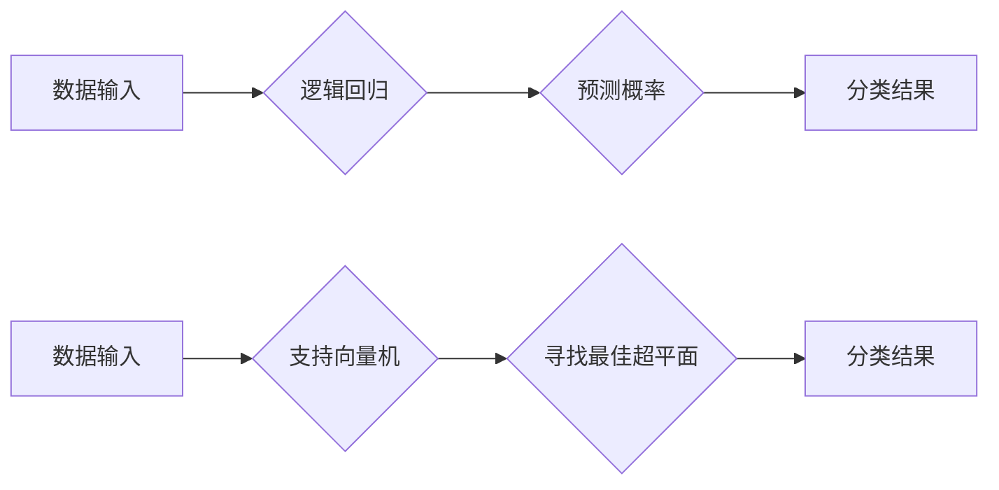

> 逻辑回归，支持向量机，机器学习，分类算法，回归分析，线性模型，非线性模型

## 1. 背景介绍

在当今数据爆炸的时代，机器学习作为人工智能的核心技术，在各个领域发挥着越来越重要的作用。从医疗诊断到金融预测，从图像识别到自然语言处理，机器学习算法帮助我们从海量数据中提取有价值的信息，并做出更智能的决策。

经典的机器学习算法，如逻辑回归和支持向量机（SVM），是机器学习领域的基础，它们为理解更复杂算法奠定了基础。本文将深入解析这两类算法，从原理到应用，全面解读其工作机制和应用场景。

## 2. 核心概念与联系

**2.1 核心概念**

* **逻辑回归:** 是一种用于二分类问题的线性模型，通过 sigmoid 函数将线性模型的输出映射到 [0, 1] 的概率区间，从而预测样本属于某一类的概率。
* **支持向量机 (SVM):** 是一种强大的分类算法，其核心思想是找到一个最佳的分隔超平面，将不同类别的样本尽可能地分开。

**2.2 联系**

逻辑回归和 SVM 都是监督学习算法，都需要训练数据来学习模型参数。它们都试图找到一个能够将数据点分类的决策边界。然而，它们在模型假设和优化目标方面存在差异。

逻辑回归假设数据服从线性关系，而 SVM 可以处理非线性数据。逻辑回归的目标是最大化似然函数，而 SVM 的目标是最大化分类间隔。

**2.3 Mermaid 流程图**



## 3. 核心算法原理 & 具体操作步骤

### 3.1 算法原理概述

**3.1.1 逻辑回归**

逻辑回归是一种基于概率的分类算法，它将线性模型的输出映射到 [0, 1] 的概率区间，从而预测样本属于某一类的概率。

**3.1.2 支持向量机 (SVM)**

SVM 的核心思想是找到一个最佳的分隔超平面，将不同类别的样本尽可能地分开。

### 3.2 算法步骤详解

**3.2.1 逻辑回归**

1. **特征选择和预处理:** 选择与目标变量相关的特征，并对数据进行预处理，例如标准化或归一化。
2. **模型训练:** 使用训练数据训练逻辑回归模型，通过最大化似然函数来学习模型参数。
3. **模型评估:** 使用测试数据评估模型的性能，例如准确率、召回率和 F1-score。
4. **模型预测:** 将新样本输入到训练好的模型中，预测其属于某一类的概率。

**3.2.2 支持向量机 (SVM)**

1. **核函数选择:** 选择合适的核函数，例如线性核、多项式核或径向基函数核，以处理非线性数据。
2. **参数调优:** 调优 SVM 的参数，例如惩罚参数 C 和核函数参数 γ。
3. **模型训练:** 使用训练数据训练 SVM 模型，找到最佳的分隔超平面。
4. **模型预测:** 将新样本输入到训练好的模型中，预测其属于某一类的类别。

### 3.3 算法优缺点

**3.3.1 逻辑回归**

* **优点:**
    * 算法简单易懂，易于实现。
    * 计算效率高，适合处理大规模数据。
    * 可以输出概率，方便进行概率分析。
* **缺点:**
    * 只能处理线性可分的数据。
    * 对异常值敏感。

**3.3.2 支持向量机 (SVM)**

* **优点:**
    * 可以处理非线性数据。
    * 具有较好的泛化能力。
    * 可以找到最大分类间隔，提高模型鲁棒性。
* **缺点:**
    * 训练时间较长，尤其是在处理高维数据时。
    * 参数调优较为复杂。

### 3.4 算法应用领域

**3.4.1 逻辑回归**

* **文本分类:** 垃圾邮件过滤、情感分析。
* **医疗诊断:** 疾病预测、患者风险评估。
* **金融预测:** 欺诈检测、信用评分。

**3.4.2 支持向量机 (SVM)**

* **图像识别:** 对象检测、图像分类。
* **手写识别:** 数字识别、字符识别。
* **生物信息学:** 基因分类、蛋白质结构预测。

## 4. 数学模型和公式 & 详细讲解 & 举例说明

### 4.1 数学模型构建

**4.1.1 逻辑回归**

逻辑回归模型的数学表达式为：

$$
p(y=1|x) = \frac{1}{1 + e^{-(w^T x + b)}}
$$

其中：

* $p(y=1|x)$ 是样本 $x$ 属于类别 1 的概率。
* $w$ 是模型参数向量。
* $x$ 是样本特征向量。
* $b$ 是模型偏置项。
* $e$ 是自然对数的底数。

**4.1.2 支持向量机 (SVM)**

SVM 的目标函数为：

$$
\min_{w,b} \frac{1}{2} ||w||^2 + C \sum_{i=1}^{n} \xi_i
$$

其中：

* $w$ 是模型参数向量。
* $b$ 是模型偏置项。
* $C$ 是惩罚参数。
* $\xi_i$ 是松弛变量，用于容忍分类错误。

### 4.2 公式推导过程

**4.2.1 逻辑回归**

逻辑回归模型的推导过程基于最大似然估计。

**4.2.2 支持向量机 (SVM)**

SVM 的目标函数推导过程基于拉格朗日乘子法。

### 4.3 案例分析与讲解

**4.3.1 逻辑回归**

假设我们有一个二分类问题，用于预测客户是否会购买某款产品。我们可以使用逻辑回归模型来学习客户购买行为的规律。

**4.3.2 支持向量机 (SVM)**

假设我们有一个图像分类问题，用于识别猫和狗的图片。我们可以使用 SVM 模型来学习猫和狗的特征，并进行分类。

## 5. 项目实践：代码实例和详细解释说明

### 5.1 开发环境搭建

* Python 3.x
* scikit-learn 库

### 5.2 源代码详细实现

```python
# 逻辑回归示例
from sklearn.linear_model import LogisticRegression
from sklearn.model_selection import train_test_split
from sklearn.metrics import accuracy_score

# 加载数据
# ...

# 将数据分割为训练集和测试集
X_train, X_test, y_train, y_test = train_test_split(X, y, test_size=0.2)

# 创建逻辑回归模型
model = LogisticRegression()

# 训练模型
model.fit(X_train, y_train)

# 预测测试集结果
y_pred = model.predict(X_test)

# 计算准确率
accuracy = accuracy_score(y_test, y_pred)
print(f"准确率: {accuracy}")

# 支持向量机示例
from sklearn.svm import SVC

# 创建 SVM 模型
model = SVC(kernel='linear')

# 训练模型
model.fit(X_train, y_train)

# 预测测试集结果
y_pred = model.predict(X_test)

# 计算准确率
accuracy = accuracy_score(y_test, y_pred)
print(f"准确率: {accuracy}")
```

### 5.3 代码解读与分析

* 逻辑回归和 SVM 的代码实现都非常简单，主要包括数据加载、数据分割、模型创建、模型训练、模型预测和性能评估等步骤。
* 我们可以根据实际需求选择不同的核函数、惩罚参数等参数来调优 SVM 模型。

### 5.4 运行结果展示

运行上述代码后，我们可以得到逻辑回归和 SVM 模型的准确率。

## 6. 实际应用场景

**6.1 逻辑回归**

* **电商推荐:** 根据用户的购买历史和浏览记录，预测用户可能感兴趣的产品。
* **广告投放:** 根据用户的特征和行为，预测用户点击广告的概率。

**6.2 支持向量机 (SVM)**

* **图像识别:** 用于识别人脸、物体、场景等。
* **自然语言处理:** 用于文本分类、情感分析、机器翻译等。

### 6.4 未来应用展望

随着人工智能技术的不断发展，逻辑回归和 SVM 将在更多领域得到应用，例如：

* **医疗诊断:** 辅助医生诊断疾病，预测患者的风险。
* **金融预测:** 预测股票价格、信用风险等。
* **自动驾驶:** 用于识别道路场景、预测车辆运动轨迹等。

## 7. 工具和资源推荐

### 7.1 学习资源推荐

* **书籍:**
    * 《机器学习》 - 周志华
    * 《深入理解机器学习》 - 彭明
* **在线课程:**
    * Coursera: Machine Learning by Andrew Ng
    * edX: Introduction to Machine Learning

### 7.2 开发工具推荐

* **Python:** 
    * scikit-learn
    * TensorFlow
    * PyTorch

### 7.3 相关论文推荐

* **逻辑回归:**
    * Logistic Regression: A Simple and Powerful Algorithm
* **支持向量机 (SVM):**
    * Support Vector Machines

## 8. 总结：未来发展趋势与挑战

### 8.1 研究成果总结

逻辑回归和 SVM 都是经典的机器学习算法，它们在分类问题中取得了显著的成果。

### 8.2 未来发展趋势

* **模型融合:** 将多个算法组合起来，提高模型的性能。
* **深度学习:** 使用深度神经网络来学习更复杂的特征。
* **迁移学习:** 利用已训练好的模型，在新的任务上进行快速训练。

### 8.3 面临的挑战

* **数据质量:** 机器学习算法对数据质量要求很高，数据不完整、不准确或存在偏差都会影响模型性能。
* **模型解释性:** 许多机器学习算法是黑盒模型，难以解释模型的决策过程。
* **计算资源:** 训练大型机器学习模型需要大量的计算资源。

### 8.4 研究展望

未来，机器学习领域将继续朝着更智能、更通用、更可解释的方向发展。


## 9. 附录：常见问题与解答

**9.1 逻辑回归为什么只能处理线性可分的数据？**

逻辑回归的假设是数据服从线性关系，因此只能处理线性可分的数据。

**9.2 如何选择 SVM 的核函数？**

核函数的选择取决于数据的特征和问题类型。常用的核函数包括线性核、多项式核和径向基函数核。

**9.3 如何调优 SVM 的参数？**

SVM 的参数调优可以使用交叉验证等方法进行。

**9.4 逻辑回归和 SVM 的区别是什么？**

逻辑回归和 SVM 都是分类算法，但它们在模型假设、优化目标和应用场景方面存在差异。

**9.5 机器学习算法的未来发展趋势是什么？**

机器学习算法的未来发展趋势包括模型融合、深度学习、迁移学习等。


作者：禅与计算机程序设计艺术 / Zen and the Art of Computer Programming 
<end_of_turn>