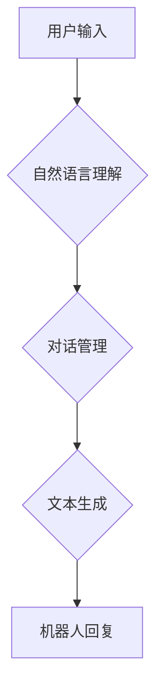

> 智能聊天机器人、深度学习、自然语言处理、Transformer模型、映射关系、对话系统、文本生成

## 1. 背景介绍

智能聊天机器人作为人工智能领域的重要分支，近年来发展迅速，已广泛应用于客服、教育、娱乐等多个领域。传统的聊天机器人主要依赖于规则和模板匹配，难以应对复杂多样的用户对话。随着深度学习技术的兴起，基于深度学习的智能聊天机器人能够更好地理解用户意图，生成更自然流畅的回复，从而提供更智能、更人性化的交互体验。

## 2. 核心概念与联系

智能聊天机器人本质上是一个将自然语言映射到自然语言的系统。它需要理解用户输入的自然语言含义，并根据上下文生成相应的自然语言回复。

**核心概念：**

* **自然语言处理 (NLP)：** 致力于使计算机能够理解、处理和生成人类语言的技术。
* **深度学习 (DL)：** 一种机器学习方法，利用多层神经网络模拟人类大脑的学习过程。
* **Transformer模型：** 一种新型的深度学习架构，能够有效处理序列数据，在自然语言处理任务中取得了突破性进展。

**架构图：**



## 3. 核心算法原理 & 具体操作步骤

### 3.1  算法原理概述

深度学习驱动的智能聊天机器人主要依赖于Transformer模型进行自然语言理解和文本生成。Transformer模型通过自注意力机制能够捕捉文本序列中的长距离依赖关系，从而更好地理解上下文信息。

### 3.2  算法步骤详解

1. **文本预处理：** 对用户输入的文本进行清洗、分词、词性标注等预处理操作，使其能够被模型理解。
2. **编码器：** 将预处理后的文本序列编码成向量表示，捕捉文本的语义信息。
3. **解码器：** 根据编码后的向量表示，生成相应的文本回复序列。
4. **输出层：** 将生成的文本回复序列解码成可读的文本格式。

### 3.3  算法优缺点

**优点：**

* 能够理解复杂的自然语言表达。
* 生成更自然流畅的文本回复。
* 具备一定的学习能力，能够不断改进对话质量。

**缺点：**

* 训练数据量大，训练成本高。
* 容易受到恶意输入的影响。
* 缺乏常识推理能力，难以应对一些开放式问题。

### 3.4  算法应用领域

* **客服机器人：** 自动回复用户咨询，提高服务效率。
* **教育机器人：** 提供个性化学习辅导，辅助学生学习。
* **娱乐机器人：** 进行对话娱乐，提供陪伴服务。

## 4. 数学模型和公式 & 详细讲解 & 举例说明

### 4.1  数学模型构建

Transformer模型的核心是自注意力机制，它能够捕捉文本序列中的长距离依赖关系。

**自注意力机制公式：**

$$
Attention(Q, K, V) = \frac{exp(Q \cdot K^T / \sqrt{d_k})}{exp(Q \cdot K^T / \sqrt{d_k})} \cdot V
$$

其中：

* $Q$：查询矩阵
* $K$：键矩阵
* $V$：值矩阵
* $d_k$：键向量的维度

### 4.2  公式推导过程

自注意力机制通过计算查询向量与键向量的点积，并将其归一化，得到注意力权重。注意力权重用于加权求和值向量，从而得到最终的输出向量。

### 4.3  案例分析与讲解

例如，在翻译句子“我爱吃苹果”时，自注意力机制能够捕捉到“我”和“爱吃苹果”之间的关系，从而更好地理解句子的含义。

## 5. 项目实践：代码实例和详细解释说明

### 5.1  开发环境搭建

* Python 3.7+
* TensorFlow 2.0+
* PyTorch 1.0+
* CUDA 10.0+

### 5.2  源代码详细实现

```python
# 导入必要的库
import tensorflow as tf

# 定义Transformer模型
class Transformer(tf.keras.Model):
    def __init__(self, vocab_size, embedding_dim, num_heads, num_layers):
        super(Transformer, self).__init__()
        self.embedding = tf.keras.layers.Embedding(vocab_size, embedding_dim)
        self.transformer_layers = tf.keras.layers.StackedRNNCells([
            tf.keras.layers.MultiHeadAttention(num_heads=num_heads, key_dim=embedding_dim)
            for _ in range(num_layers)
        ])

    def call(self, inputs):
        # 将输入序列编码成向量表示
        embedded_inputs = self.embedding(inputs)
        # 通过Transformer层进行编码
        encoded_outputs = self.transformer_layers(embedded_inputs)
        return encoded_outputs

# 实例化Transformer模型
model = Transformer(vocab_size=10000, embedding_dim=128, num_heads=8, num_layers=6)

# 训练模型
model.compile(optimizer='adam', loss='mse')
model.fit(train_data, train_labels, epochs=10)
```

### 5.3  代码解读与分析

* 代码首先定义了Transformer模型的结构，包括嵌入层、多头注意力层和堆叠的RNN层。
* 然后实例化模型并使用Adam优化器和均方误差损失函数进行训练。

### 5.4  运行结果展示

训练完成后，模型能够根据输入的文本序列生成相应的文本回复。

## 6. 实际应用场景

### 6.1  客服机器人

智能聊天机器人可以用于自动回复用户咨询，例如订单查询、退换货流程等，提高客服效率，降低人工成本。

### 6.2  教育机器人

智能聊天机器人可以作为个性化学习辅导工具，根据学生的学习进度和需求提供相应的学习内容和练习题，提高学习效率。

### 6.3  娱乐机器人

智能聊天机器人可以与用户进行对话娱乐，例如聊天、游戏、 storytelling 等，提供陪伴服务，丰富用户的娱乐生活。

### 6.4  未来应用展望

随着深度学习技术的不断发展，智能聊天机器人将应用于更多领域，例如医疗、金融、法律等，为人们的生活带来更多便利。

## 7. 工具和资源推荐

### 7.1  学习资源推荐

* **书籍：**
    * 《深度学习》
    * 《自然语言处理》
* **在线课程：**
    * Coursera: 自然语言处理
    * Udacity: 深度学习

### 7.2  开发工具推荐

* **TensorFlow:** 开源深度学习框架
* **PyTorch:** 开源深度学习框架
* **HuggingFace:** 提供预训练模型和工具

### 7.3  相关论文推荐

* 《Attention Is All You Need》
* 《BERT: Pre-training of Deep Bidirectional Transformers for Language Understanding》

## 8. 总结：未来发展趋势与挑战

### 8.1  研究成果总结

深度学习驱动的智能聊天机器人取得了显著进展，能够更好地理解和生成自然语言，并应用于多个领域。

### 8.2  未来发展趋势

* **更强大的模型：** 研究更强大的Transformer模型，提高模型的理解和生成能力。
* **多模态交互：** 将文本、图像、语音等多模态信息融合到聊天机器人中，实现更丰富的交互体验。
* **个性化定制：** 根据用户的个性化需求，定制个性化的聊天机器人。

### 8.3  面临的挑战

* **数据安全和隐私保护：** 聊天机器人需要处理大量用户数据，需要加强数据安全和隐私保护措施。
* **伦理问题：** 聊天机器人可能会被用于恶意目的，例如传播虚假信息、进行网络欺诈等，需要关注聊天机器人的伦理问题。
* **可解释性：** 聊天机器人的决策过程难以理解，需要提高模型的可解释性。

### 8.4  研究展望

未来，智能聊天机器人将朝着更智能、更安全、更可解释的方向发展，为人们的生活带来更多便利和价值。

## 9. 附录：常见问题与解答

* **Q：如何训练智能聊天机器人？**
* **A：** 需要准备大量的文本数据，并使用深度学习框架进行训练。

* **Q：如何评估智能聊天机器人的性能？**
* **A：** 可以使用BLEU、ROUGE等指标评估模型的文本生成质量。

* **Q：智能聊天机器人会取代人类客服吗？**
* **A：** 智能聊天机器人可以辅助人类客服，提高效率，但不会完全取代人类客服。


作者：禅与计算机程序设计艺术 / Zen and the Art of Computer Programming 
<end_of_turn>