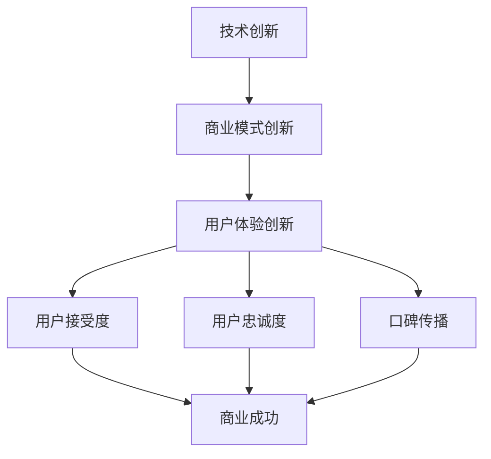

                 

**AI创业者的坚持：以用户体验为核心**

**作者：禅与计算机程序设计艺术 / Zen and the Art of Computer Programming**

## 1. 背景介绍

在当今快速发展的AI时代，创业者面临着前所未有的机遇和挑战。AI技术的进步为各行各业带来了颠覆性的变化，但同时也要求创业者具备更强的技术能力和商业洞察力。本文将从用户体验的角度出发，分享AI创业者需要坚持的核心理念和实践方法。

## 2. 核心概念与联系

### 2.1 用户体验的定义

用户体验（User Experience, UX）是指用户在使用产品或服务时的总体感受，包括效用、易用性、可靠性、学习性和满意度等方面。用户体验是AI创业成功的关键因素之一。

### 2.2 AI创业的核心要素

AI创业的核心要素包括技术创新、商业模式创新和用户体验创新。其中，用户体验创新是区分成功与失败的关键因素。

### 2.3 用户体验与AI创业的关系

用户体验是AI创业的核心，因为它直接影响着产品或服务的用户接受度、忠诚度和口碑传播。良好的用户体验可以帮助AI创业者建立竞争优势，提高用户满意度和忠诚度，从而实现商业成功。



## 3. 核心算法原理 & 具体操作步骤

### 3.1 算法原理概述

在AI创业中，用户体验优化的核心是基于用户数据的个性化推荐算法。个性化推荐算法的目的是为每个用户提供最相关、最有价值的内容或服务，从而提高用户体验。

### 3.2 算法步骤详解

个性化推荐算法的步骤包括：

1. **数据收集**：收集用户行为数据、内容数据和用户属性数据。
2. **特征工程**：提取数据中的特征，如用户点击、购买历史、内容特征等。
3. **模型训练**：使用机器学习算法（如协同过滤、内容过滤、混合过滤等）训练推荐模型。
4. **推荐生成**：使用训练好的模型为每个用户生成个性化推荐列表。
5. **评估与优化**：评估推荐算法的性能，并不断优化模型。

### 3.3 算法优缺点

个性化推荐算法的优点包括：

* 提高了用户体验，为用户提供了更相关、更有价值的内容或服务。
* 增加了用户忠诚度和留存率。
* 提高了商业成功的可能性。

缺点包括：

* 需要大量的用户数据和计算资源。
* 可能导致过度个性化，从而限制了用户接触到的内容或服务的多样性。
* 可能存在隐私和偏见问题。

### 3.4 算法应用领域

个性化推荐算法在各种AI创业领域都有广泛应用，如电子商务、内容推荐、广告推荐、个性化营销等。

## 4. 数学模型和公式 & 详细讲解 & 举例说明

### 4.1 数学模型构建

个性化推荐算法的数学模型可以表示为：

$$R_{ui} = f(u, i, \theta_{ui})$$

其中，$R_{ui}$表示用户$u$对项目$i$的评分，$f$表示推荐函数，$u$表示用户特征，$i$表示项目特征，$\theta_{ui}$表示用户$u$对项目$i$的偏好。

### 4.2 公式推导过程

推荐函数$f$通常是一个机器学习模型，如线性回归、神经网络等。模型的目标是最小化预测误差，即：

$$\min_{\theta_{ui}} \sum_{u, i} (R_{ui} - \hat{R}_{ui})^2$$

其中，$\hat{R}_{ui}$表示模型预测的用户$u$对项目$i$的评分。

### 4.3 案例分析与讲解

例如，在电子商务平台中，用户特征$u$可以包括用户的购买历史、浏览历史、兴趣爱好等，项目特征$i$可以包括项目的描述、类别、价格等。推荐函数$f$可以是一个基于协同过滤的模型，该模型利用用户之间的相似性和项目之间的相似性来预测用户对项目的评分。

## 5. 项目实践：代码实例和详细解释说明

### 5.1 开发环境搭建

要实现个性化推荐算法，需要以下开发环境：

* Python 3.7+
* Pandas
* NumPy
* Scikit-learn
* TensorFlow或PyTorch

### 5.2 源代码详细实现

以下是个性化推荐算法的简单实现示例，使用协同过滤算法：

```python
import pandas as pd
from sklearn.model_selection import train_test_split
from sklearn.metrics import mean_squared_error
from surprise import KNNWithMeans

# 加载数据
ratings = pd.read_csv('ratings.csv')

# 将数据分为训练集和测试集
train_data, test_data = train_test_split(ratings, test_size=0.2)

# 训练模型
model = KNNWithMeans(k=50, sim_options={'name': 'pearson_baseline', 'user_based': True})
model.fit(train_data)

# 预测测试集
predictions = model.test(test_data)

# 评估模型
rmse = mean_squared_error(test_data.rating, [pred.est for pred in predictions], squared=False)
print(f'RMSE: {rmse}')
```

### 5.3 代码解读与分析

该示例使用Surprise库实现了基于用户的协同过滤算法。首先，加载了用户评分数据，然后将数据分为训练集和测试集。接着，使用KNNWithMeans算法训练模型，并使用测试集评估模型的性能。最后，打印出模型的RMSE值。

### 5.4 运行结果展示

运行该示例代码后，将打印出模型的RMSE值。RMSE值越小，模型的性能越好。

## 6. 实际应用场景

### 6.1 电子商务平台

在电子商务平台中，个性化推荐算法可以帮助用户发现更相关、更有价值的商品，从而提高购买意愿和转化率。

### 6.2 内容推荐平台

在内容推荐平台中，个性化推荐算法可以帮助用户发现更相关、更有价值的内容，从而提高用户忠诚度和留存率。

### 6.3 个性化营销

在个性化营销中，个性化推荐算法可以帮助企业为每个用户提供最相关、最有效的营销信息，从而提高营销效果和转化率。

### 6.4 未来应用展望

未来，个性化推荐算法将继续发展，并应用于更多领域。例如，在自动驾驶汽车中，个性化推荐算法可以帮助用户发现最合适的路线和目的地；在智能家居中，个性化推荐算法可以帮助用户发现最合适的家居设置和服务。

## 7. 工具和资源推荐

### 7.1 学习资源推荐

* "推荐系统实践"（项立刚著）：这是一本深入浅出的推荐系统入门书籍，适合初学者阅读。
* "推荐系统：从内容到算法"（布莱恩·里德著）：这是一本更深入的推荐系统书籍，适合有经验的读者阅读。
* Coursera上的"推荐系统"课程：这是一门在线课程，由斯坦福大学的教授讲授，内容涵盖推荐系统的原理、算法和实践。

### 7.2 开发工具推荐

* Surprise：这是一个Python库，提供了推荐系统的实现工具。
* LightFM：这是一个Python库，提供了基于协同过滤和内容过滤的推荐系统实现工具。
* TensorFlow Recommenders：这是一个TensorFlow扩展，提供了基于深度学习的推荐系统实现工具。

### 7.3 相关论文推荐

* "The BellKor Prize for Rating Prediction"：这是一篇经典论文，介绍了Netflix推荐系统的实现细节。
* "DeepFM: A Factorization-Machine based Neural Network for CTR Prediction"：这是一篇论文，介绍了基于深度学习的点击率预测算法。
* "Recurrent Recommender Networks"：这是一篇论文，介绍了基于循环神经网络的推荐系统算法。

## 8. 总结：未来发展趋势与挑战

### 8.1 研究成果总结

本文介绍了个性化推荐算法的原理、实现步骤和应用领域。通过实践项目，我们展示了如何使用协同过滤算法实现个性化推荐系统。我们还推荐了学习资源、开发工具和相关论文，以帮助读者进一步学习和实践。

### 8.2 未来发展趋势

未来，个性化推荐算法将继续发展，并应用于更多领域。我们预计将看到以下趋势：

* **多模式学习**：个性化推荐算法将结合多种数据模式，如用户数据、内容数据和上下文数据。
* **深度学习**：个性化推荐算法将越来越多地使用深度学习技术，以提高推荐精确度和效率。
* **可解释性**：个性化推荐算法将越来越注重可解释性，以帮助用户理解推荐结果。

### 8.3 面临的挑战

个性化推荐算法面临着以下挑战：

* **数据隐私**：个性化推荐算法需要大量的用户数据，但同时也面临着数据隐私保护的挑战。
* **偏见**：个性化推荐算法可能导致偏见，从而限制了用户接触到的内容或服务的多样性。
* **冷启动**：个性化推荐算法面临着冷启动问题，即如何为新用户或新项目提供个性化推荐。

### 8.4 研究展望

未来，个性化推荐算法的研究将侧重于以下方向：

* **多模式学习**：研究如何结合多种数据模式，以提高推荐精确度和效率。
* **深度学习**：研究如何使用深度学习技术，以提高推荐精确度和效率。
* **可解释性**：研究如何提高推荐算法的可解释性，以帮助用户理解推荐结果。

## 9. 附录：常见问题与解答

**Q1：个性化推荐算法的优点是什么？**

A1：个性化推荐算法的优点包括提高了用户体验，为用户提供了更相关、更有价值的内容或服务，增加了用户忠诚度和留存率，提高了商业成功的可能性。

**Q2：个性化推荐算法的缺点是什么？**

A2：个性化推荐算法的缺点包括需要大量的用户数据和计算资源，可能导致过度个性化，从而限制了用户接触到的内容或服务的多样性，可能存在隐私和偏见问题。

**Q3：个性化推荐算法的应用领域有哪些？**

A3：个性化推荐算法在各种AI创业领域都有广泛应用，如电子商务、内容推荐、广告推荐、个性化营销等。

**Q4：如何实现个性化推荐算法？**

A4：个性化推荐算法的实现步骤包括数据收集、特征工程、模型训练、推荐生成和评估与优化。可以使用开源库，如Surprise、LightFM和TensorFlow Recommenders等，来实现个性化推荐算法。

**Q5：个性化推荐算法的未来发展趋势是什么？**

A5：未来，个性化推荐算法将继续发展，并应用于更多领域。我们预计将看到多模式学习、深度学习和可解释性等趋势。

**Q6：个性化推荐算法面临的挑战是什么？**

A6：个性化推荐算法面临着数据隐私、偏见和冷启动等挑战。未来的研究将侧重于多模式学习、深度学习和可解释性等方向。

**Q7：如何学习个性化推荐算法？**

A7：我们推荐阅读"推荐系统实践"和"推荐系统：从内容到算法"等书籍，以及Coursera上的"推荐系统"课程。我们还推荐阅读相关论文，并使用开源库实践个性化推荐算法。

**Q8：如何评估个性化推荐算法的性能？**

A8：可以使用精确度、召回率、F1分数、AUC-ROC和RMSE等指标评估个性化推荐算法的性能。我们还推荐使用交叉验证和A/B测试等方法评估算法的性能。

**Q9：如何优化个性化推荐算法？**

A9：可以使用超参数调优、特征工程、模型融合和在线学习等方法优化个性化推荐算法。我们还推荐使用用户反馈和实时数据来优化算法。

**Q10：如何应用个性化推荐算法？**

A10：个性化推荐算法可以应用于电子商务平台、内容推荐平台、个性化营销等领域。我们还推荐将个性化推荐算法与其他技术结合使用，以提高用户体验和商业成功。

## 结尾

本文介绍了个性化推荐算法的原理、实现步骤和应用领域。我们展示了如何使用协同过滤算法实现个性化推荐系统，并推荐了学习资源、开发工具和相关论文。我们还讨论了个性化推荐算法的未来发展趋势和挑战。我们希望本文能够帮助读者理解个性化推荐算法的核心理念和实践方法，从而为AI创业者提供有价值的指南。

**作者：禅与计算机程序设计艺术 / Zen and the Art of Computer Programming**

