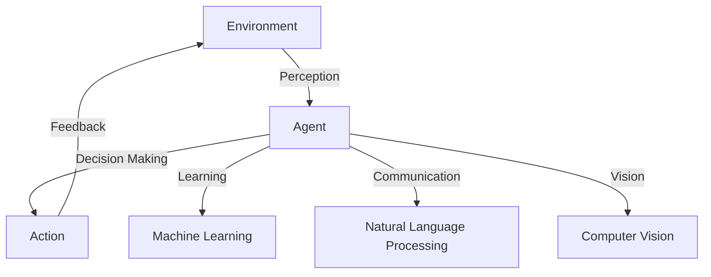

                 

## Agent代理技术在AI系统中的角色

> 关键词：Agent代理技术、AI系统、决策、学习、协作、环境感知、行动计划

## 1. 背景介绍

在人工智能（AI）系统中，Agent代理技术扮演着至关重要的角色。Agent代理技术是一种使计算机系统能够感知环境并自主做出决策的方法。这种技术在AI领域已经存在了几十年，但随着AI的发展，它变得越来越重要。本文将深入探讨Agent代理技术在AI系统中的角色，包括其核心概念、算法原理、数学模型，以及实际应用场景。

## 2. 核心概念与联系

### 2.1 Agent代理的定义

Agent代理是一种能够感知环境并自主做出决策的软件实体。它具有以下特征：

- **自主性（Autonomy）**：Agent代理能够自主地做出决策，而不需要外部控制。
- **反应性（Reactivity）**：Agent代理能够感知环境的变化并及时做出反应。
- **主动性（Proactiveness）**：Agent代理能够主动地采取行动以实现其目标。
- **社交性（Social Ability）**：Agent代理能够与其他Agent代理或人类交互。

### 2.2 Agent代理的类型

根据其能力和功能，Agent代理可以分为以下几类：

- **反应型Agent代理（Reactive Agent）**：只能感知环境并做出反应，没有内部状态或记忆。
- **简单反射型Agent代理（Simple Reflex Agent）**：根据当前感知到的环境状态做出决策。
- **模型反射型Agent代理（Model-Based Reflex Agent）**：维护环境的内部模型，根据模型做出决策。
- **目标导向型Agent代理（Goal-Based Agent）**：具有内部目标，能够计划和执行行动以实现目标。
- **学习型Agent代理（Learning Agent）**：能够从经验中学习，改进其决策能力。
- **协作型Agent代理（Cooperative Agent）**：能够与其他Agent代理或人类协作以实现共同目标。

### 2.3 Agent代理与AI系统的联系

Agent代理技术是AI系统的核心组成部分。AI系统通过Agent代理感知环境，做出决策，并采取行动。 Agent代理技术与AI系统的其他组成部分，如机器学习、自然语言处理、计算机视觉等，密切相关。例如，学习型Agent代理可以使用机器学习算法改进其决策能力。



## 3. 核心算法原理 & 具体操作步骤

### 3.1 算法原理概述

Agent代理技术的核心是决策算法。决策算法根据当前环境状态和Agent代理的目标，选择最佳行动。决策算法可以分为两大类：基于规则的决策算法和基于模型的决策算法。

### 3.2 算法步骤详解

#### 3.2.1 基于规则的决策算法

基于规则的决策算法使用一组预定义的规则来做出决策。其步骤如下：

1. **感知环境**：Agent代理感知环境，获取当前环境状态。
2. **匹配规则**：Agent代理搜索其规则集，找到与当前环境状态匹配的规则。
3. **选择行动**：根据匹配的规则，选择最佳行动。
4. **执行行动**：Agent代理执行选择的行动。
5. **更新环境**：环境根据Agent代理的行动发生变化。

#### 3.2.2 基于模型的决策算法

基于模型的决策算法使用环境模型来预测不同行动的结果，选择最佳行动。其步骤如下：

1. **感知环境**：Agent代理感知环境，获取当前环境状态。
2. **更新模型**：Agent代理使用当前环境状态更新其环境模型。
3. **预测结果**：Agent代理使用环境模型预测每个可能行动的结果。
4. **选择行动**：Agent代理选择预期结果最佳的行动。
5. **执行行动**：Agent代理执行选择的行动。
6. **更新环境**：环境根据Agent代理的行动发生变化。

### 3.3 算法优缺点

基于规则的决策算法简单易行，但缺乏灵活性和适应能力。基于模型的决策算法更灵活，能够适应环境变化，但需要大量计算资源。

### 3.4 算法应用领域

Agent代理技术在各种AI系统中得到广泛应用，包括自动驾驶、机器人导航、搜索引擎、电子商务推荐系统等。

## 4. 数学模型和公式 & 详细讲解 & 举例说明

### 4.1 数学模型构建

Agent代理技术的数学模型通常是环境模型。环境模型描述环境的状态转移规则和结果。环境模型可以是马尔科夫决策过程（Markov Decision Process, MDP）或部分可观察马尔科夫决策过程（Partially Observable Markov Decision Process, POMDP）。

### 4.2 公式推导过程

假设环境模型是一个MDP，其公式如下：

- **状态集（State Set）**：S
- **行动集（Action Set）**：A
- **状态转移函数（State Transition Function）**：P：S×A×S→[0,1]
- **奖励函数（Reward Function）**：R：S×A×S→R

Agent代理的目标是学习最优策略π\*，使期望累积奖励最大化：

$$\pi\* = \arg\max_{\pi} \mathbb{E}_{\pi}[R_{t} | s_{0}=s]$$

其中，R<sub>t</sub>是时刻t的奖励，s<sub>0</sub>是初始状态。

### 4.3 案例分析与讲解

例如，在自动驾驶系统中，环境模型描述了汽车的运动和其他车辆的行为。状态集S包括汽车的位置、速度和方向等信息。行动集A包括加速、减速、转向等。状态转移函数P描述了汽车根据行动改变位置和速度的概率。奖励函数R鼓励汽车安全、平稳地行驶，避免与其他车辆碰撞。

## 5. 项目实践：代码实例和详细解释说明

### 5.1 开发环境搭建

本项目使用Python作为编程语言，并使用Gym库来构建环境模型。Gym是一个开源的机器学习和深度学习研究平台，提供了各种环境模型，包括Atari 2600、CartPole、Mountain Car等。

### 5.2 源代码详细实现

以下是一个简单的Agent代理示例，使用Q学习算法在CartPole环境中学习最优策略。

```python
import gym
import numpy as np

# 创建环境
env = gym.make('CartPole-v0')

# 设置参数
learning_rate = 0.1
discount_factor = 0.95
episodes = 1000

# 初始化Q表
q_table = np.zeros((env.observation_space.n, env.action_space.n))

# 学习
for episode in range(episodes):
    state = env.reset()
    done = False
    while not done:
        action = np.argmax(q_table[state])
        next_state, reward, done, _ = env.step(action)
        old_value = q_table[state, action]
        next_max = np.max(q_table[next_state])
        new_value = (1 - learning_rate) * old_value + learning_rate * (reward + discount_factor * next_max)
        q_table[state, action] = new_value
        state = next_state

# 测试
state = env.reset()
done = False
while not done:
    action = np.argmax(q_table[state])
    next_state, reward, done, _ = env.step(action)
    state = next_state
    env.render()
```

### 5.3 代码解读与分析

代码首先创建环境模型，并设置学习参数。然后，它初始化Q表，并使用Q学习算法在环境中学习。最后，它使用学习到的Q表在环境中测试Agent代理。

### 5.4 运行结果展示

在学习1000个回合后，Agent代理能够稳定地平衡杆子，使其保持在目标位置。在测试中，Agent代理能够连续平衡杆子数百个回合。

## 6. 实际应用场景

### 6.1 自动驾驶

在自动驾驶系统中，Agent代理感知环境，做出决策，并控制汽车的行动。它需要能够感知环境，预测其他车辆的行为，并做出安全的决策。

### 6.2 机器人导航

在机器人导航系统中，Agent代理感知环境，计划路径，并控制机器人行动。它需要能够感知环境，避免障碍物，并找到最佳路径。

### 6.3 搜索引擎

在搜索引擎中，Agent代理感知用户查询，选择最佳结果，并提供给用户。它需要能够理解用户查询的意图，并从海量数据中找到最相关的结果。

### 6.4 未来应用展望

未来，Agent代理技术将在更多领域得到应用，包括智能家居、医疗保健、能源管理等。随着AI技术的发展，Agent代理将变得更加智能，更加自主，更加人性化。

## 7. 工具和资源推荐

### 7.1 学习资源推荐

- Russell, S., & Norvig, P. (2020). Artificial Intelligence: A Modern Approach (3rd ed.). Pearson.
- Sutton, R. S., & Barto, A. G. (2018). Reinforcement Learning: An Introduction (2nd ed.). MIT press.
- Wooldridge, M. (2009). An Introduction to Multiagent Systems (2nd ed.). Wiley.

### 7.2 开发工具推荐

- Gym：<https://gym.openai.com/>
- TensorFlow：<https://www.tensorflow.org/>
- PyTorch：<https://pytorch.org/>

### 7.3 相关论文推荐

- Russell, S., & Norvig, P. (1995). Learning to act: An introduction to reinforcement learning. Artificial Intelligence, 74(1), 323-382.
- Sutton, R. S., & Barto, A. G. (1998). Reinforcement learning: A survey. Journal of Artificial Intelligence Research, 11, 1-117.
- Wooldridge, M. (2002). An introduction to multiagent systems. Artificial Intelligence, 134(1-2), 1-21.

## 8. 总结：未来发展趋势与挑战

### 8.1 研究成果总结

本文介绍了Agent代理技术在AI系统中的角色，包括其核心概念、算法原理、数学模型，以及实际应用场景。我们还提供了一个简单的Agent代理示例，使用Q学习算法在CartPole环境中学习最优策略。

### 8.2 未来发展趋势

未来，Agent代理技术将朝着更智能、更自主、更人性化的方向发展。这将需要解决一系列挑战，包括环境感知、决策不确定性、协作学习等。

### 8.3 面临的挑战

Agent代理技术面临的挑战包括：

- **环境感知**：Agent代理需要能够感知复杂环境，理解环境的状态和动态。
- **决策不确定性**：Agent代理需要能够处理不确定性，做出最佳决策。
- **协作学习**：多个Agent代理需要能够协作学习，共同实现目标。
- **安全和可靠性**：Agent代理需要能够保证安全和可靠性，避免对环境或用户造成伤害。

### 8.4 研究展望

未来的研究将关注以下几个方向：

- **环境感知**：开发更先进的感知技术，使Agent代理能够理解复杂环境。
- **决策不确定性**：开发更先进的决策算法，使Agent代理能够处理不确定性。
- **协作学习**：开发更先进的协作学习算法，使多个Agent代理能够共同实现目标。
- **安全和可靠性**：开发更先进的安全和可靠性技术，保证Agent代理的安全和可靠性。

## 9. 附录：常见问题与解答

**Q1：什么是Agent代理技术？**

A1：Agent代理技术是一种使计算机系统能够感知环境并自主做出决策的方法。

**Q2：Agent代理技术有哪些类型？**

A2：根据其能力和功能，Agent代理可以分为反应型、简单反射型、模型反射型、目标导向型、学习型和协作型等。

**Q3：Agent代理技术与AI系统的其他组成部分有什么联系？**

A3：Agent代理技术与AI系统的其他组成部分，如机器学习、自然语言处理、计算机视觉等，密切相关。例如，学习型Agent代理可以使用机器学习算法改进其决策能力。

**Q4：什么是环境模型？**

A4：环境模型描述环境的状态转移规则和结果。环境模型可以是马尔科夫决策过程（MDP）或部分可观察马尔科夫决策过程（POMDP）。

**Q5：什么是最优策略？**

A5：最优策略是一种决策策略，使期望累积奖励最大化。最优策略是Agent代理的目标。

## 作者：禅与计算机程序设计艺术 / Zen and the Art of Computer Programming

