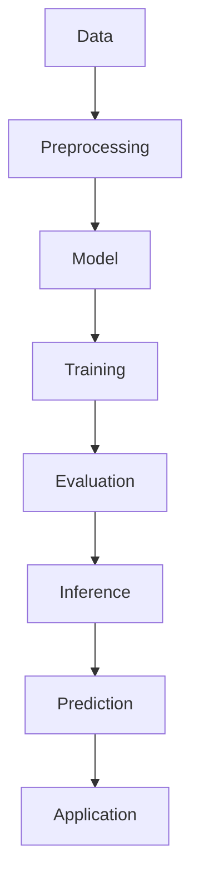

                 

**Andrej Karpathy's Perspective on AI**

## 1. Background Introduction

Andrej Karpathy, a renowned computer scientist, software engineer, and AI expert, has made significant contributions to the field of artificial intelligence, particularly in the areas of deep learning and computer vision. His work includes developing the Fast.ai library, a practical deep learning library that makes it easy for developers to use deep learning in their applications. In this article, we will delve into Karpathy's views on AI, his contributions, and the future of the field.

## 2. Core Concepts and Relations

Karpathy's work is deeply rooted in the principles of deep learning and computer vision. Here's a simplified Mermaid flowchart illustrating the core concepts and their relations:



### 2.1 Data Preprocessing

Karpathy emphasizes the importance of data preprocessing in AI. This step involves cleaning, transforming, and augmenting data to improve the model's performance.

### 2.2 Model

The model is the core of any AI system. Karpathy's work primarily focuses on deep learning models, which are inspired by the structure and function of the human brain.

### 2.3 Training

Training involves feeding the model data and adjusting its internal parameters to minimize the difference between its predictions and the actual values.

### 2.4 Evaluation

After training, the model's performance is evaluated using a separate dataset to ensure it generalizes well to unseen data.

### 2.5 Inference

In this stage, the trained model makes predictions on new, unseen data.

### 2.6 Prediction

The model's output is interpreted as a prediction, which can be a classification, regression, or other form of output, depending on the task.

### 2.7 Application

Finally, the predictions are applied in the real world, driving decision-making processes or enabling autonomous systems.

## 3. Core Algorithms and Operations

### 3.1 Algorithm Overview

Karpathy's work is centered around convolutional neural networks (CNNs) and other deep learning architectures. These models are designed to automatically learn hierarchical representations of data, making them particularly effective for image and speech recognition tasks.

### 3.2 Algorithm Steps

1. **Data Collection and Preprocessing**: Gather and preprocess data to make it suitable for the model.
2. **Model Architecture Design**: Design the architecture of the deep learning model, choosing the appropriate layers and activation functions.
3. **Training**: Train the model using backpropagation and stochastic gradient descent (SGD) or its variants.
4. **Evaluation**: Evaluate the model's performance using appropriate metrics.
5. **Fine-tuning**: If necessary, fine-tune the model to improve its performance.
6. **Deployment**: Deploy the model in a production environment.

### 3.3 Algorithm Pros and Cons

**Pros**:
- **Automatic Feature Learning**: Deep learning models can automatically learn relevant features from raw data.
- **High Accuracy**: Deep learning models often achieve state-of-the-art performance on various tasks.

**Cons**:
- **Data Hungry**: Deep learning models require large amounts of data to train effectively.
- **Computationally Expensive**: Training deep learning models can be resource-intensive and time-consuming.
- **Lack of Interpretability**: Deep learning models are often considered "black boxes," making it difficult to understand how they make predictions.

### 3.4 Algorithm Applications

Karpathy's work has been applied to various domains, including:

- **Computer Vision**: Object detection, image classification, and semantic segmentation.
- **Natural Language Processing (NLP)**: Sentiment analysis, machine translation, and text generation.
- **Speech Recognition**: Transcribing spoken language into written text.

## 4. Mathematical Models and Formulations

### 4.1 Model Construction

The mathematical model for a deep learning network can be represented as:

$$
y = f(x; \theta) + \epsilon
$$

where:
- $x$ is the input data,
- $y$ is the target output,
- $\theta$ are the model's parameters,
- $f$ is the model's architecture (e.g., CNN, RNN, etc.),
- $\epsilon$ is the noise or error in the data.

### 4.2 Formulation Derivation

The goal is to find the parameters $\theta$ that minimize the loss function $L(y, f(x; \theta))$, which measures the difference between the model's predictions and the actual values. This is typically done using gradient descent:

$$
\theta_{t+1} = \theta_t - \eta \nabla L(y, f(x; \theta_t))
$$

where $\eta$ is the learning rate, and $\nabla$ denotes the gradient.

### 4.3 Case Study

Consider a simple CNN for image classification:

1. **Convolutional Layer**: The convolutional layer applies a set of learnable filters to the input image, extracting features such as edges and textures.
2. **Activation Function**: An activation function, such as ReLU, is applied to introduce non-linearity into the model.
3. **Pooling Layer**: The pooling layer reduces the spatial dimensions of the input, making the model more robust to small translations.
4. **Fully Connected Layer**: The fully connected layer takes the flattened output of the convolutional layers and maps it to the desired number of classes.

## 5. Project Practice: Code Example

### 5.1 Development Environment Setup

To follow along with this example, you'll need to have Python, PyTorch, and a GPU (optional but recommended) installed on your machine.

### 5.2 Source Code Implementation

Here's a simple implementation of a CNN for image classification using PyTorch:

```python
import torch
import torch.nn as nn
import torch.optim as optim

class Net(nn.Module):
    def __init__(self):
        super(Net, self).__init__()
        self.conv1 = nn.Conv2d(3, 6, 5)
        self.pool = nn.MaxPool2d(2, 2)
        self.conv2 = nn.Conv2d(6, 16, 5)
        self.fc1 = nn.Linear(16 * 5 * 5, 120)
        self.fc2 = nn.Linear(120, 84)
        self.fc3 = nn.Linear(84, 10)

    def forward(self, x):
        x = self.pool(F.relu(self.conv1(x)))
        x = self.pool(F.relu(self.conv2(x)))
        x = x.view(-1, 16 * 5 * 5)
        x = F.relu(self.fc1(x))
        x = F.relu(self.fc2(x))
        x = self.fc3(x)
        return x

net = Net()
criterion = nn.CrossEntropyLoss()
optimizer = optim.SGD(net.parameters(), lr=0.001, momentum=0.9)
```

### 5.3 Code Explanation

This code defines a simple CNN with two convolutional layers, followed by two fully connected layers. The `forward` method defines the forward pass of the network.

### 5.4 Running the Code

To run this code, you would need to load a dataset, train the model using the `optimizer` and `criterion`, and evaluate its performance.

## 6. Practical Applications

### 6.1 Current Applications

Karpathy's work has been applied to various real-world applications, such as:

- **Self-driving Cars**: Deep learning models are used for object detection, tracking, and prediction in autonomous vehicles.
- **Medical Imaging**: Deep learning models can assist radiologists in detecting diseases, such as cancer, from medical images.
- **Recommender Systems**: Deep learning models can analyze user behavior and preferences to provide personalized recommendations.

### 6.2 Future Prospects

The future of AI, and deep learning in particular, holds great promise. Some potential advancements include:

- **Explainable AI (XAI)**: Developing models that can explain their predictions, making them more interpretable and trustworthy.
- **Federated Learning**: Enabling collaborative model training on decentralized data without exchanging it, preserving privacy.
- **AutoML**: Automating the process of designing, training, and deploying machine learning models.

## 7. Tools and Resources

### 7.1 Learning Resources

- **Books**:
  - "Deep Learning" by Ian Goodfellow, Yoshua Bengio, and Aaron Courville
  - "Hands-On Machine Learning with Scikit-Learn, Keras, and TensorFlow" by Aurélien Géron
- **Online Courses**:
  - Fast.ai's Practical Deep Learning for Coders course
  - Andrew Ng's Machine Learning course on Coursera

### 7.2 Development Tools

- **Libraries**:
  - PyTorch
  - TensorFlow
  - Keras
- **Hardware**:
  - GPUs (NVIDIA CUDA-enabled GPUs are commonly used)
  - TPUs (Tensor Processing Units)

### 7.3 Related Papers

- "ImageNet Classification with Deep Convolutional Neural Networks" by Krizhevsky, Sutskever, and Hinton
- "A Neural Algorithm of Artistic Style" by Gatys, Ecker, and Bethge
- "Attention Is All You Need" by Vaswani, et al.

## 8. Conclusion

### 8.1 Research Summary

Andrej Karpathy's work has significantly contributed to the field of deep learning, making it more accessible and practical for developers. His focus on practical, easy-to-use tools and libraries has enabled many developers to leverage the power of deep learning in their applications.

### 8.2 Future Trends

The future of AI is promising, with advancements in explainable AI, federated learning, and autoML on the horizon. However, these advancements also present challenges, such as ensuring the privacy and security of user data.

### 8.3 Challenges Faced

Some of the challenges faced by the AI community include:

- **Data Privacy**: Ensuring the privacy and security of user data, especially in the era of big data and federated learning.
- **Bias and Fairness**: Developing models that are fair and unbiased, avoiding discrimination and other ethical issues.
- **Explainability**: Making models more interpretable and explainable, especially in critical domains such as healthcare and finance.

### 8.4 Research Outlook

Future research should focus on addressing these challenges while continuing to push the boundaries of AI, enabling it to tackle more complex and diverse tasks.

## 9. Appendix: FAQs

**Q: What is the difference between deep learning and machine learning?**

A: Deep learning is a subset of machine learning that focuses on learning hierarchical representations of data using artificial neural networks with many layers.

**Q: How can I get started with deep learning?**

A: Start by learning the basics of Python, linear algebra, and calculus. Then, explore online courses and resources on deep learning, such as Fast.ai's Practical Deep Learning for Coders course.

**Q: What is the difference between convolutional neural networks (CNNs) and recurrent neural networks (RNNs)?**

A: CNNs are primarily used for processing grid-like data, such as images, while RNNs are designed for sequential data, such as time series or natural language.

**Q: How can I make my deep learning models more interpretable?**

A: Techniques such as layer-wise relevance propagation (LRP), saliency maps, and attention mechanisms can help make deep learning models more interpretable.

**Q: What is the difference between supervised and unsupervised learning?**

A: In supervised learning, the model is trained on labeled data, where the desired output is known. In unsupervised learning, the model must find patterns and structure in unlabeled data on its own.

## Author

**Author:** [Zen and the Art of Computer Programming](https://en.wikipedia.org/wiki/Zen_and_the_Art_of_Computer_Programming)

