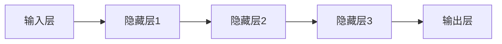

                 

**关键词：**深度学习、人工神经网络、反向传播、卷积神经网络、循环神经网络、长短期记忆网络、自动编码器

## 1. 背景介绍

在人工智能（AI）领域， Geoffrey Hinton、Yann LeCun 和 Yoshua Bengio 这三位科学家被广泛认为是深度学习（Deep Learning）的奠基者。他们于 2018 年共同荣获图灵奖，以表彰他们在人工神经网络（Artificial Neural Networks, ANNs）领域的开创性工作。本文将深入探讨他们的贡献，包括核心概念、算法原理、数学模型，并提供项目实践和实际应用场景的分析。

## 2. 核心概念与联系

### 2.1 深度学习与人工神经网络

深度学习是一种机器学习方法，它使用人工神经网络模拟人类大脑的学习过程。深度学习的关键特征是其网络结构的深度，即多个隐藏层的存在。



### 2.2 反向传播（Backpropagation）

反向传播是深度学习中使用的一种算法，用于调整网络权重以最小化预测误差。它通过计算每层神经元的梯度，然后使用梯度下降法更新权重。

### 2.3 卷积神经网络（Convolutional Neural Networks, CNN）

卷积神经网络是一种特殊类型的神经网络，专门设计用于处理网格数据，如图像和视频。CNN 使用卷积层和池化层来提取特征，然后使用全连接层进行分类。

### 2.4 循环神经网络（Recurrent Neural Networks, RNN）和长短期记忆网络（Long Short-Term Memory, LSTM）

循环神经网络是一种用于处理序列数据的神经网络，它可以保持状态以便在序列中传递信息。长短期记忆网络是 RNN 的一种变体，旨在解决长期依赖问题。

## 3. 核心算法原理 & 具体操作步骤

### 3.1 算法原理概述

- **Hinton：**提出了自动编码器（Autoencoders）的概念，用于学习数据的表示。他还改进了反向传播算法，使其更适合深度网络。
- **LeCun：**发明了卷积神经网络，并提出了用于训练 CNN 的有效算法，如对比感知器（Contrastive Divergence, CD）和随机梯度下降（Stochastic Gradient Descent, SGD）。
- **Bengio：**提出了长短期记忆网络，解决了 RNN 中的长期依赖问题。他还开发了用于自然语言处理的循环神经网络模型。

### 3.2 算法步骤详解

#### 3.2.1 反向传播

1. 初始化网络权重。
2. 向前传播：计算每层神经元的输出。
3. 计算误差：比较网络输出和真实值。
4. 向后传播：计算每层神经元的梯度。
5. 更新权重：使用梯度下降法更新权重。
6. 重复步骤 2-5，直到收敛。

#### 3.2.2 卷积神经网络

1. 使用卷积层提取图像特征。
2. 使用池化层减小特征图的空间维度。
3. 使用全连接层进行分类。
4. 使用反向传播训练网络。

#### 3.2.3 长短期记忆网络

1. 初始化 LSTM 单元的权重和状态。
2. 为每个时间步骤：
   a. 计算 LSTM 单元的输入门、遗忘门和输出门。
   b. 更新 LSTM 单元的状态和隐藏状态。
   c. 计算 LSTM 单元的输出。
3. 使用反向传播训练网络。

### 3.3 算法优缺点

**优点：**

- 深度学习模型可以自动学习特征，无需手动特征工程。
- 深度学习在图像、语音和自然语言处理等领域取得了显著成功。

**缺点：**

- 深度学习模型需要大量数据和计算资源。
- 深度学习模型缺乏解释性，难以理解其决策过程。
- 深度学习模型易受过拟合和梯度消失/爆炸问题影响。

### 3.4 算法应用领域

- **Hinton：**自动编码器在数据压缩、表示学习和生成模型中得到广泛应用。
- **LeCun：**卷积神经网络在计算机视觉领域非常成功，用于图像分类、目标检测和图像分割。
- **Bengio：**长短期记忆网络和循环神经网络在自然语言处理领域得到广泛应用，用于语言模型、机器翻译和文本生成。

## 4. 数学模型和公式 & 详细讲解 & 举例说明

### 4.1 数学模型构建

#### 4.1.1 人工神经网络

人工神经网络是由神经元组成的层次结构。每个神经元接收输入，应用激活函数，并产生输出。神经元之间通过权重连接。

#### 4.1.2 反向传播

反向传播使用链式法则计算梯度。给定一个神经网络的输出 $y = f(x; \theta)$，其中 $\theta$ 是网络权重，则梯度为：

$$ \nabla_\theta L(\theta) = \nabla_\theta f(x; \theta) \nabla_\theta L(\theta) $$

#### 4.1.3 卷积神经网络

卷积神经网络使用卷积核（滤波器）提取图像特征。给定输入图像 $x$ 和卷积核 $w$，卷积操作为：

$$ (x * w)[i, j] = \sum_{m, n} x[m, n] w[i - m, j - n] $$

#### 4.1.4 长短期记忆网络

长短期记忆网络使用三个门控机制（输入门、遗忘门和输出门）来控制信息流。给定输入 $x_t$ 和隐藏状态 $h_{t-1}$，LSTM 单元的更新公式为：

$$ i_t = \sigma(W_{ii} x_t + b_{ii} + W_{hi} h_{t-1} + b_{hi}) $$
$$ f_t = \sigma(W_{if} x_t + b_{if} + W_{hf} h_{t-1} + b_{hf}) $$
$$ o_t = \sigma(W_{io} x_t + b_{io} + W_{ho} h_{t-1} + b_{ho}) $$
$$ \tilde{C}_t = \tanh(W_{ig} x_t + b_{ig} + W_{hg} h_{t-1} + b_{hg}) $$
$$ C_t = f_t * C_{t-1} + i_t * \tilde{C}_t $$
$$ h_t = o_t * \tanh(C_t) $$

### 4.2 公式推导过程

详细公式推导过程超出了本文的范围。感兴趣的读者可以参考相关文献和教材，如 Goodfellow et al. (2016) 的《深度学习》一书。

### 4.3 案例分析与讲解

**示例：使用 CNN 进行手写数字识别**

给定输入图像 $x$ 和真实标签 $y$，我们希望训练一个 CNN 来预测图像中的数字。我们可以使用 MNIST 数据集，其中包含 60,000 个训练样本和 10,000 个测试样本。CNN 的结构可以如下所示：

- 一个卷积层（32 个滤波器，大小为 3x3，ReLU 激活函数）
- 一个最大池化层（池化窗口大小为 2x2）
- 一个全连接层（128 个神经元，ReLU 激活函数）
- 一个输出层（10 个神经元，softmax 激活函数）

我们可以使用交叉熵损失函数和随机梯度下降算法训练网络。在训练过程中，我们可以监控训练集和验证集上的准确性，并调整学习率和其他超参数以提高性能。

## 5. 项目实践：代码实例和详细解释说明

### 5.1 开发环境搭建

要实现深度学习项目，我们需要安装以下软件和库：

- Python（3.7 及以上版本）
- TensorFlow（2.0 及以上版本）
- NumPy
- Matplotlib
- Jupyter Notebook（可选）

### 5.2 源代码详细实现

以下是使用 TensorFlow 和 Keras 实现 MNIST 手写数字识别的示例代码：

```python
import tensorflow as tf
from tensorflow.keras.datasets import mnist
from tensorflow.keras.models import Sequential
from tensorflow.keras.layers import Conv2D, MaxPooling2D, Flatten, Dense

# 加载 MNIST 数据集
(x_train, y_train), (x_test, y_test) = mnist.load_data()

# 将数据转换为张量并进行预处理
x_train = x_train.reshape(-1, 28, 28, 1).astype('float32') / 255
x_test = x_test.reshape(-1, 28, 28, 1).astype('float32') / 255
y_train = tf.keras.utils.to_categorical(y_train, 10)
y_test = tf.keras.utils.to_categorical(y_test, 10)

# 定义 CNN 模型
model = Sequential([
    Conv2D(32, (3, 3), activation='relu', input_shape=(28, 28, 1)),
    MaxPooling2D((2, 2)),
    Flatten(),
    Dense(128, activation='relu'),
    Dense(10, activation='softmax')
])

# 编译模型
model.compile(optimizer='adam', loss='categorical_crossentropy', metrics=['accuracy'])

# 训练模型
model.fit(x_train, y_train, epochs=5, validation_data=(x_test, y_test))
```

### 5.3 代码解读与分析

- 我们首先加载 MNIST 数据集并进行预处理，将图像转换为张量并进行标准化。
- 然后，我们定义一个 CNN 模型，包括一个卷积层、一个最大池化层、一个全连接层和一个输出层。
- 我们使用 Adam 优化器和交叉熵损失函数编译模型。
- 最后，我们使用训练集训练模型，并使用验证集评估模型性能。

### 5.4 运行结果展示

在训练 5 个 epoch 后，模型在测试集上的准确性约为 98%。我们可以在 Jupyter Notebook 中运行代码并绘制训练和验证准确性的图表来监控模型性能。

## 6. 实际应用场景

### 6.1 图像分类

卷积神经网络在图像分类任务中表现出色，例如 CIFAR-10、CIFAR-100、ImageNet 等数据集。CNN 还用于目标检测、图像分割和人脸识别等任务。

### 6.2 自然语言处理

循环神经网络和长短期记忆网络在自然语言处理领域得到广泛应用，用于语言模型、机器翻译、文本生成和情感分析等任务。

### 6.3 未来应用展望

未来，深度学习将继续在各种领域得到应用，包括自动驾驶、医疗影像分析、生物信息学和物联网等。此外，生成式对抗网络（Generative Adversarial Networks, GANs）和变分自动编码器（Variational Autoencoders, VAEs）等新兴技术将推动深度学习在合成数据生成和表示学习等领域的进展。

## 7. 工具和资源推荐

### 7.1 学习资源推荐

- 书籍：
  - Goodfellow, I., Bengio, Y., & Courville, A. (2016). Deep learning. MIT press.
  - Hinton, G. E., & Salakhutdinov, R. R. (2006). Reducing the dimensionality of data with neural networks. Science, 313(5786), 504-507.
  - LeCun, Y., Bengio, Y., & Hinton, G. (2015). Deep learning. Nature, 521(7553), 436-444.
- 在线课程：
  - Andrew Ng 的机器学习课程（Coursera）
  - Fast.ai 的深度学习为非专业人士（Practical Deep Learning for Coders）
- 博客和论坛：
  - Towards Data Science（towardsdatascience.com）
  - Kaggle（kaggle.com）
  - Stack Overflow（stackoverflow.com）

### 7.2 开发工具推荐

- TensorFlow（tensorflow.org）
- PyTorch（pytorch.org）
- Keras（keras.io）
- Jupyter Notebook（jupyter.org）
- Google Colab（colab.research.google.com）

### 7.3 相关论文推荐

- Hinton, G. E., & Salakhutdinov, R. R. (2006). Reducing the dimensionality of data with neural networks. Science, 313(5786), 504-507.
- LeCun, Y., Bengio, Y., & Hinton, G. (2015). Deep learning. Nature, 521(7553), 436-444.
- Hochreiter, S., & Schmidhuber, J. (1997). Long short-term memory. Neural computation, 9(8), 1735-1780.
- Rumelhart, D. E., Hinton, G. E., & Williams, R. J. (1986). Learning representations by back-propagating errors. Nature, 323(6088), 533-536.

## 8. 总结：未来发展趋势与挑战

### 8.1 研究成果总结

Hinton、LeCun 和 Bengio 的工作奠定了深度学习的基础，推动了人工智能在各种领域的进展。他们的贡献包括自动编码器、卷积神经网络、反向传播算法、长短期记忆网络和循环神经网络等关键技术。

### 8.2 未来发展趋势

未来，深度学习将继续在各种领域得到应用，并与其他人工智能技术（如强化学习和符号人工智能）结合。此外，新的架构（如transformer）和技术（如生成式对抗网络和变分自动编码器）将推动深度学习的进展。

### 8.3 面临的挑战

深度学习面临的挑战包括：

- 计算资源需求：深度学习模型需要大量计算资源进行训练。
- 数据需求：深度学习模型需要大量数据进行训练，且数据质量至关重要。
- 解释性：深度学习模型缺乏解释性，难以理解其决策过程。
- 过拟合和泛化：深度学习模型易受过拟合和泛化问题影响。
- 道德和安全：深度学习模型的道德和安全问题，如偏见、隐私和可靠性。

### 8.4 研究展望

未来的研究方向包括：

- 更有效的优化算法和架构，以降低计算资源需求。
- 更好的数据增强和生成技术，以缓解数据需求问题。
- 更好的解释性模型和技术，以提高模型可解释性。
- 更好的正则化技术，以减少过拟合和泛化问题。
- 更好的道德和安全保障，以保护用户隐私和安全。

## 9. 附录：常见问题与解答

**Q1：什么是人工神经网络？**

A1：人工神经网络是一种计算模型，受大脑神经元启发，旨在模拟人类大脑的学习和决策过程。

**Q2：什么是反向传播？**

A2：反向传播是一种算法，用于调整人工神经网络的权重，以最小化预测误差。它通过计算每层神经元的梯度，然后使用梯度下降法更新权重。

**Q3：什么是卷积神经网络？**

A3：卷积神经网络是一种特殊类型的神经网络，专门设计用于处理网格数据，如图像和视频。CNN 使用卷积层和池化层来提取特征，然后使用全连接层进行分类。

**Q4：什么是循环神经网络？**

A4：循环神经网络是一种用于处理序列数据的神经网络，它可以保持状态以便在序列中传递信息。循环神经网络常用于自然语言处理任务。

**Q5：什么是长短期记忆网络？**

A5：长短期记忆网络是一种循环神经网络的变体，旨在解决长期依赖问题。LSTM 使用三个门控机制（输入门、遗忘门和输出门）来控制信息流。

## 作者：禅与计算机程序设计艺术 / Zen and the Art of Computer Programming

**参考文献**

- Goodfellow, I., Bengio, Y., & Courville, A. (2016). Deep learning. MIT press.
- Hinton, G. E., & Salakhutdinov, R. R. (2006). Reducing the dimensionality of data with neural networks. Science, 313(5786), 504-507.
- LeCun, Y., Bengio, Y., & Hinton, G. (2015). Deep learning. Nature, 521(7553), 436-444.
- Hochreiter, S., & Schmidhuber, J. (1997). Long short-term memory. Neural computation, 9(8), 1735-1780.
- Rumelhart, D. E., Hinton, G. E., & Williams, R. J. (1986). Learning representations by back-propagating errors. Nature, 323(6088), 533-536.

