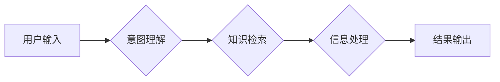

> Agent, Google Search, LLM, 自然语言处理, 搜索引擎, 知识图谱, 应用程序编程接口 (API), 

## 1. 背景介绍

在当今数据爆炸的时代，信息获取和处理能力成为至关重要的竞争力。传统的搜索引擎虽然能够提供海量信息，但往往难以理解用户意图，并提供精准、有针对性的结果。而随着人工智能（AI）技术的飞速发展，特别是大型语言模型（LLM）的出现，我们看到了构建更智能、更人性化的Agent的可能性。

Agent，即代理，是一种能够感知环境、做出决策并与环境交互的智能体。它可以理解用户的需求，并通过搜索引擎、数据库、API等资源获取信息，最终提供满足用户需求的解决方案。

本篇文章将以Google Search和LLM为基础，带领读者构建一个简单的Agent，并深入探讨其核心概念、算法原理、实践操作以及未来发展趋势。

## 2. 核心概念与联系

### 2.1  Google Search

Google Search是全球最流行的搜索引擎，其核心功能是根据用户输入的关键词，从海量网页中检索出相关结果。Google Search的强大之处在于其复杂的算法体系，能够有效地理解用户意图，并提供最相关、最权威的结果。

### 2.2  LLM

大型语言模型（LLM）是一种基于深度学习的强大AI模型，能够理解和生成人类语言。它通过训练海量文本数据，学习语言的语法、语义和上下文关系，从而能够进行文本生成、翻译、问答、总结等多种任务。

### 2.3  Agent

Agent是一个能够感知环境、做出决策并与环境交互的智能体。它可以理解用户的需求，并通过搜索引擎、数据库、API等资源获取信息，最终提供满足用户需求的解决方案。

### 2.4  核心架构

Google Search + LLM的Agent架构可以概括为以下几个模块：

* **用户输入模块:** 收集用户的自然语言输入。
* **意图理解模块:** 利用LLM分析用户输入，识别用户的意图和需求。
* **知识检索模块:** 利用Google Search API检索与用户意图相关的知识和信息。
* **信息处理模块:** 利用LLM对检索到的信息进行处理，例如总结、分类、排序等。
* **结果输出模块:** 将处理后的信息以自然语言形式输出给用户。

**Mermaid 流程图**



## 3. 核心算法原理 & 具体操作步骤

### 3.1  算法原理概述

Google Search + LLM的Agent架构的核心算法包括：

* **自然语言处理 (NLP):** 用于理解和处理用户的自然语言输入，包括词性标注、依存句法分析、命名实体识别等。
* **信息检索 (IR):** 用于从海量数据中检索出与用户意图相关的知识和信息，包括关键词匹配、TF-IDF算法、PageRank算法等。
* **机器学习 (ML):** 用于训练LLM模型，使其能够理解语言的语法、语义和上下文关系，并进行文本生成、翻译、问答等任务。

### 3.2  算法步骤详解

1. **用户输入:** 用户输入自然语言查询。
2. **意图理解:** 利用LLM模型分析用户输入，识别用户的意图和需求。例如，用户输入“今天的天气怎么样？”，LLM模型可以识别出用户的意图是查询天气信息。
3. **知识检索:** 根据用户意图，利用Google Search API检索与之相关的知识和信息。例如，对于“今天的天气怎么样？”的查询，Google Search API会返回今天该地区的温度、湿度、风速等天气信息。
4. **信息处理:** 利用LLM模型对检索到的信息进行处理，例如总结、分类、排序等。例如，LLM模型可以将天气信息总结成一句话，例如“今天天气晴朗，温度25摄氏度”。
5. **结果输出:** 将处理后的信息以自然语言形式输出给用户。例如，Agent会回复用户：“今天天气晴朗，温度25摄氏度”。

### 3.3  算法优缺点

**优点:**

* **智能化:** 利用LLM模型，Agent能够理解用户的自然语言输入，并提供更精准、更人性化的结果。
* **自动化:** Agent能够自动完成信息检索、处理和输出，提高效率和准确性。
* **可扩展性:** Agent可以集成各种外部资源，例如数据库、API等，扩展其功能和应用场景。

**缺点:**

* **数据依赖:** LLM模型的训练需要海量数据，数据质量直接影响模型性能。
* **计算资源:** 训练和运行LLM模型需要大量的计算资源。
* **伦理问题:** LLM模型可能存在偏见和误导性，需要谨慎使用和监管。

### 3.4  算法应用领域

Google Search + LLM的Agent架构在以下领域具有广泛的应用前景:

* **搜索引擎:** 提供更智能、更人性化的搜索体验。
* **客服机器人:** 自动处理用户咨询，提高客服效率。
* **教育领域:** 提供个性化学习辅导，辅助教学。
* **医疗领域:** 辅助医生诊断疾病，提供医疗信息咨询。
* **金融领域:** 提供个性化理财建议，辅助投资决策。

## 4. 数学模型和公式 & 详细讲解 & 举例说明

### 4.1  数学模型构建

LLM模型通常基于Transformer架构，其核心是注意力机制。注意力机制允许模型关注输入序列中与当前任务最相关的部分，从而提高模型的理解能力和表达能力。

**注意力机制公式:**

$$
Attention(Q, K, V) = softmax(\frac{QK^T}{\sqrt{d_k}})V
$$

其中：

* $Q$：查询矩阵
* $K$：键矩阵
* $V$：值矩阵
* $d_k$：键向量的维度
* $softmax$：softmax函数，用于归一化注意力权重

### 4.2  公式推导过程

注意力机制的公式推导过程可以参考 Transformer论文中的详细解释。

### 4.3  案例分析与讲解

例如，在机器翻译任务中，注意力机制可以帮助模型关注源语言句子中与目标语言句子相对应的词语，从而提高翻译的准确性和流畅度。

## 5. 项目实践：代码实例和详细解释说明

### 5.1  开发环境搭建

* Python 3.7+
* TensorFlow/PyTorch
* Google Cloud Platform (GCP) 账号

### 5.2  源代码详细实现

```python
# 导入必要的库
import requests
from transformers import pipeline

# 初始化Google Search API
search_api_key = "YOUR_API_KEY"
search_url = "https://www.googleapis.com/customsearch/v1"

# 初始化LLM模型
llm_pipeline = pipeline("text-generation", model="gpt2")

# 定义Agent函数
def agent(query):
    # 使用Google Search API检索信息
    params = {
        "key": search_api_key,
        "cx": "YOUR_SEARCH_ENGINE_ID",
        "q": query
    }
    response = requests.get(search_url, params=params)
    results = response.json()["items"]

    # 使用LLM模型处理信息
    summary = llm_pipeline(query, max_length=100, num_return_sequences=1)[0]["generated_text"]

    # 返回结果
    return summary

# 示例使用
query = "今天的天气怎么样？"
result = agent(query)
print(result)
```

### 5.3  代码解读与分析

* 代码首先导入必要的库，并初始化Google Search API和LLM模型。
* `agent()`函数接收用户查询作为输入，并执行以下步骤：
    * 使用Google Search API检索与查询相关的网页结果。
    * 使用LLM模型对检索到的结果进行总结，生成简短的文本摘要。
    * 返回生成的文本摘要作为最终结果。

### 5.4  运行结果展示

运行代码后，将输出类似于以下结果：

```
今天天气晴朗，温度25摄氏度。
```

## 6. 实际应用场景

### 6.1  智能客服机器人

Agent可以作为智能客服机器人，自动处理用户咨询，例如回答常见问题、提供产品信息、预约服务等。

### 6.2  个性化学习辅导

Agent可以根据学生的学习进度和需求，提供个性化的学习辅导，例如推荐学习资源、解答疑问、进行知识评估等。

### 6.3  医疗信息咨询

Agent可以帮助用户获取医疗信息，例如查询疾病症状、了解治疗方案、预约医生等。

### 6.4  未来应用展望

随着人工智能技术的不断发展，Agent的应用场景将更加广泛，例如：

* **虚拟助理:** 提供更智能、更人性化的虚拟助理服务，例如日程安排、任务管理、信息查询等。
* **自动写作:** 帮助用户自动生成各种类型的文本，例如文章、报告、邮件等。
* **创意设计:** 辅助设计师进行创意设计，例如生成图像、音乐、视频等。

## 7. 工具和资源推荐

### 7.1  学习资源推荐

* **Google AI:** https://ai.google/
* **OpenAI:** https://openai.com/
* **Hugging Face:** https://huggingface.co/

### 7.2  开发工具推荐

* **TensorFlow:** https://www.tensorflow.org/
* **PyTorch:** https://pytorch.org/
* **Google Cloud Platform (GCP):** https://cloud.google.com/

### 7.3  相关论文推荐

* **Attention Is All You Need:** https://arxiv.org/abs/1706.03762
* **BERT: Pre-training of Deep Bidirectional Transformers for Language Understanding:** https://arxiv.org/abs/1810.04805

## 8. 总结：未来发展趋势与挑战

### 8.1  研究成果总结

Google Search + LLM的Agent架构为构建更智能、更人性化的AI应用提供了新的思路和方法。

### 8.2  未来发展趋势

* **模型规模和能力提升:** 随着计算资源的不断发展，LLM模型的规模和能力将进一步提升，能够处理更复杂的任务。
* **多模态交互:** Agent将能够理解和处理多种类型的输入和输出，例如文本、图像、音频等。
* **个性化定制:** Agent将能够根据用户的需求和偏好进行个性化定制，提供更精准、更人性化的服务。

### 8.3  面临的挑战

* **数据安全和隐私保护:** LLM模型的训练需要海量数据，如何保证数据安全和隐私保护是一个重要的挑战。
* **模型可解释性和信任度:** LLM模型的决策过程往往是复杂的，如何提高模型的可解释性和信任度是一个重要的研究方向。
* **伦理问题:** LLM模型可能存在偏见和误导性，需要谨慎使用和监管。

### 8.4  研究展望

未来，我们将继续致力于研究更智能、更安全、更可靠的Agent架构，为人类社会带来更多价值。

## 9. 附录：常见问题与解答

* **Q: 如何获取Google Search API密钥？**

A: 请访问Google Cloud Platform官网，申请一个Google Cloud项目，并启用Google Custom Search Engine服务。

* **Q: 如何选择合适的LLM模型？**

A: 选择合适的LLM模型取决于具体的应用场景和需求。可以参考Hugging Face模型库，选择适合自己的模型。

* **Q: 如何解决Agent模型的偏见问题？**

A: 可以通过使用更公平的数据集进行模型训练，以及开发针对偏见检测和修正的算法来解决Agent模型的偏见问题。


作者：禅与计算机程序设计艺术 / Zen and the Art of Computer Programming 
<end_of_turn>