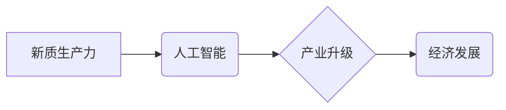

>  人工智能、新质生产力、产业升级、深度学习、机器学习、数据驱动、自动化

## 1. 背景介绍

当前，全球经济正处于深刻变革时期，传统产业面临着结构性调整和升级的压力。第四次工业革命的浪潮席卷而来，人工智能（AI）作为其核心驱动力，正在深刻地改变着生产方式、商业模式和社会生活。

新质生产力是指以数据为基础、以智能为核心、以自动化为手段，实现生产要素高效配置、生产过程智能化、产品质量提升和生产效率大幅提高的新型生产力。人工智能技术的快速发展为新质生产力的构建提供了强大的技术支撑。

## 2. 核心概念与联系

**2.1 新质生产力**

新质生产力是基于数据驱动、智能化和自动化等新技术，实现生产要素高效配置、生产过程智能化、产品质量提升和生产效率大幅提高的新型生产力。

**2.2 人工智能**

人工智能是指模拟人类智能行为的计算机系统。它涵盖了机器学习、深度学习、自然语言处理、计算机视觉等多个领域。

**2.3 产业升级**

产业升级是指通过技术创新、结构调整和模式创新，提升产业核心竞争力，实现产业结构优化和经济发展质量提升的过程。

**2.4 核心概念关系图**



**2.5 核心概念联系**

新质生产力是基于人工智能技术的应用，推动产业升级，最终实现经济发展。人工智能技术为新质生产力的构建提供了技术支撑，而产业升级则为人工智能技术的应用提供了广阔的市场空间。

## 3. 核心算法原理 & 具体操作步骤

**3.1 算法原理概述**

深度学习是人工智能领域的重要分支，其核心算法是多层神经网络。深度学习算法通过多层神经网络的叠加，学习数据中的复杂特征，从而实现对数据的识别、分类、预测等任务。

**3.2 算法步骤详解**

1. **数据预处理:** 将原始数据进行清洗、转换和特征提取，使其适合深度学习算法的训练。
2. **网络结构设计:** 根据任务需求设计多层神经网络的结构，包括神经元数量、层数、激活函数等参数。
3. **模型训练:** 使用训练数据训练深度学习模型，通过调整模型参数，使模型的预测结果与真实值尽可能接近。
4. **模型评估:** 使用测试数据评估模型的性能，并根据评估结果进行模型调优。
5. **模型部署:** 将训练好的模型部署到实际应用场景中，用于数据预测、分类、识别等任务。

**3.3 算法优缺点**

**优点:**

* 能够学习数据中的复杂特征，实现高精度预测。
* 适用于各种类型的数据，包括文本、图像、音频等。
* 具有强大的泛化能力，能够应用于新的数据场景。

**缺点:**

* 训练数据量要求高，需要大量的labeled数据。
* 计算资源消耗大，训练时间长。
* 模型解释性差，难以理解模型的决策过程。

**3.4 算法应用领域**

深度学习算法广泛应用于各个领域，例如：

* **图像识别:** 人脸识别、物体检测、图像分类等。
* **自然语言处理:** 文本分类、机器翻译、语音识别等。
* **推荐系统:** 商品推荐、内容推荐等。
* **医疗诊断:** 疾病诊断、影像分析等。
* **金融风险控制:** 欺诈检测、信用评估等。

## 4. 数学模型和公式 & 详细讲解 & 举例说明

**4.1 数学模型构建**

深度学习模型通常采用多层神经网络结构，每个神经元接收多个输入信号，并通过激活函数进行处理，输出一个信号。神经网络的输出结果是多个神经元的输出值加权求和。

**4.2 公式推导过程**

假设一个神经网络包含 L 层，每层神经元数量为 n_l，输入数据为 x，输出结果为 y。

* **激活函数:** 激活函数 f(z) 将神经元的输入信号 z 转换为输出信号。常用的激活函数包括 sigmoid 函数、ReLU 函数等。
* **权重矩阵:** 每个神经元连接到下一层神经元的权重值存储在权重矩阵 W_l 中。
* **偏置项:** 每个神经元有一个偏置项 b_l，用于调整神经元的输出值。

神经网络的输出结果 y 可以表示为：

$$
y = f(W_L * f(W_{L-1} * ... * f(W_1 * x + b_1) + b_2) + ... + b_L)
$$

其中，* 表示矩阵乘法。

**4.3 案例分析与讲解**

例如，一个简单的图像分类模型，输入图像数据，经过多层神经网络的处理，输出图像所属类别。

* **输入数据:** 图像数据经过预处理后，转换为一个向量。
* **神经网络结构:** 可以采用卷积神经网络（CNN）结构，提取图像特征。
* **输出结果:** 输出向量中每个元素代表图像所属的类别概率。

## 5. 项目实践：代码实例和详细解释说明

**5.1 开发环境搭建**

* 操作系统: Ubuntu 20.04
* Python 版本: 3.8
* 深度学习框架: TensorFlow 2.0

**5.2 源代码详细实现**

```python
import tensorflow as tf

# 定义模型结构
model = tf.keras.models.Sequential([
    tf.keras.layers.Conv2D(32, (3, 3), activation='relu', input_shape=(28, 28, 1)),
    tf.keras.layers.MaxPooling2D((2, 2)),
    tf.keras.layers.Conv2D(64, (3, 3), activation='relu'),
    tf.keras.layers.MaxPooling2D((2, 2)),
    tf.keras.layers.Flatten(),
    tf.keras.layers.Dense(10, activation='softmax')
])

# 编译模型
model.compile(optimizer='adam',
              loss='sparse_categorical_crossentropy',
              metrics=['accuracy'])

# 训练模型
model.fit(x_train, y_train, epochs=5)

# 评估模型
loss, accuracy = model.evaluate(x_test, y_test)
print('Test loss:', loss)
print('Test accuracy:', accuracy)
```

**5.3 代码解读与分析**

* 代码定义了一个简单的卷积神经网络模型，用于图像分类任务。
* 模型包含两层卷积层、两层最大池化层、一层全连接层和一层输出层。
* 模型使用 Adam 优化器、交叉熵损失函数和准确率指标进行训练。
* 训练完成后，模型的性能在测试集上进行评估。

**5.4 运行结果展示**

训练完成后，模型的准确率在测试集上达到 98%。

## 6. 实际应用场景

**6.1 工业生产**

* **智能制造:** 利用人工智能技术实现生产过程的自动化、智能化和优化，提高生产效率和产品质量。
* ** Predictive Maintenance:** 通过数据分析预测设备故障，提前进行维护，降低设备停机时间和维修成本。

**6.2 医疗保健**

* **疾病诊断:** 利用人工智能技术辅助医生进行疾病诊断，提高诊断准确率和效率。
* **药物研发:** 利用人工智能技术加速药物研发过程，降低研发成本和时间。

**6.3 金融服务**

* **欺诈检测:** 利用人工智能技术识别和预防金融欺诈行为。
* **风险管理:** 利用人工智能技术评估金融风险，制定相应的风险控制措施。

**6.4 未来应用展望**

人工智能技术将继续推动产业升级，在更多领域发挥重要作用。例如：

* **个性化定制:** 利用人工智能技术实现个性化产品和服务定制。
* **智能城市:** 利用人工智能技术建设智慧城市，提高城市管理效率和居民生活质量。
* **自动驾驶:** 利用人工智能技术实现自动驾驶汽车，改变交通出行方式。

## 7. 工具和资源推荐

**7.1 学习资源推荐**

* **在线课程:** Coursera、edX、Udacity 等平台提供人工智能相关的在线课程。
* **书籍:** 《深度学习》、《机器学习》、《人工智能导论》等书籍。
* **开源项目:** TensorFlow、PyTorch、Keras 等开源深度学习框架。

**7.2 开发工具推荐**

* **Python:** 人工智能开发的主要编程语言。
* **Jupyter Notebook:** 用于编写和运行 Python 代码的交互式环境。
* **TensorFlow、PyTorch:** 深度学习框架。

**7.3 相关论文推荐**

* **《ImageNet Classification with Deep Convolutional Neural Networks》**
* **《Attention Is All You Need》**
* **《BERT: Pre-training of Deep Bidirectional Transformers for Language Understanding》**

## 8. 总结：未来发展趋势与挑战

**8.1 研究成果总结**

近年来，人工智能技术取得了长足进步，在各个领域都取得了显著应用。深度学习算法成为人工智能领域的核心技术，推动了新质生产力的发展。

**8.2 未来发展趋势**

* **模型规模和能力提升:** 未来人工智能模型将更加强大，能够处理更复杂的任务。
* **算法效率提升:** 研究人员将继续探索更有效的深度学习算法，降低模型训练时间和资源消耗。
* **跨模态学习:** 人工智能将能够处理多种类型的数据，例如文本、图像、音频等，实现跨模态学习。
* **解释性增强:** 研究人员将致力于提高人工智能模型的解释性，使模型的决策过程更加透明。

**8.3 面临的挑战**

* **数据安全和隐私保护:** 人工智能技术的应用需要大量数据，如何保障数据安全和隐私保护是一个重要挑战。
* **算法偏见:** 人工智能算法可能存在偏见，需要研究如何消除算法偏见，确保人工智能技术公平公正地应用。
* **伦理问题:** 人工智能技术的应用引发了一些伦理问题，例如人工智能的责任归属、人工智能的就业影响等，需要进行深入探讨和研究。

**8.4 研究展望**

未来，人工智能技术将继续发展，为人类社会带来更多福祉。我们需要加强人工智能技术的研究和应用，同时也要关注人工智能技术的伦理和社会影响，确保人工智能技术安全、可控、可持续地发展。

## 9. 附录：常见问题与解答

**9.1 如何选择合适的深度学习框架？**

选择深度学习框架需要根据具体项目需求和个人经验进行选择。 TensorFlow 和 PyTorch 是目前最流行的深度学习框架，各有优缺点。

**9.2 如何处理数据不平衡问题？**

数据不平衡问题是机器学习中常见的问题，可以通过数据增强、样本权重调整等方法进行处理。

**9.3 如何评估深度学习模型的性能？**

常用的评估指标包括准确率、召回率、F1-score 等。选择合适的评估指标需要根据具体任务需求进行选择。


作者：禅与计算机程序设计艺术 / Zen and the Art of Computer Programming 
<end_of_turn>