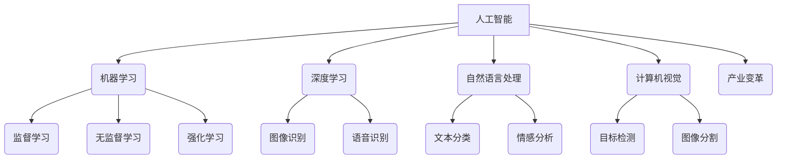

> 人工智能 (AI)、机器学习 (ML)、深度学习 (DL)、自然语言处理 (NLP)、计算机视觉 (CV)、产业变革、应用场景

## 1. 背景介绍

人工智能 (AI) 正以惊人的速度发展，正在深刻地改变着我们生活的方方面面。从自动驾驶汽车到智能家居，从医疗诊断到金融交易，AI 的应用场景日益广泛。 

随着 AI 技术的不断成熟，其在产业变革中的作用也越来越重要。AI 能够帮助企业提高效率、降低成本、创造新的价值，并推动整个产业结构的升级。

## 2. 核心概念与联系

**2.1  人工智能 (AI)**

人工智能是指模拟人类智能行为的计算机系统。它涵盖了多种技术，包括机器学习、深度学习、自然语言处理、计算机视觉等。

**2.2  机器学习 (ML)**

机器学习是人工智能的一个重要分支，它使计算机能够从数据中学习，并根据学习到的知识进行预测或决策。机器学习算法可以分为监督学习、无监督学习和强化学习三大类。

**2.3  深度学习 (DL)**

深度学习是机器学习的一个子领域，它使用多层神经网络来模拟人类大脑的学习过程。深度学习算法能够处理海量数据，并提取出复杂的特征，从而在图像识别、语音识别、自然语言处理等领域取得了突破性的进展。

**2.4  自然语言处理 (NLP)**

自然语言处理是指使计算机能够理解和处理人类语言的技术。NLP 涉及到许多子领域，例如文本分类、情感分析、机器翻译等。

**2.5  计算机视觉 (CV)**

计算机视觉是指使计算机能够“看”和理解图像的技术。计算机视觉应用广泛，例如图像识别、目标检测、图像分割等。

**2.6  产业变革**

产业变革是指整个产业结构发生重大变化的过程。AI 技术的应用正在推动着各个行业的产业变革，例如制造业、金融业、医疗业等。

**2.7  联系**

AI 技术与产业变革之间存在着密切的联系。AI 技术能够帮助企业提高效率、降低成本、创造新的价值，从而推动整个产业结构的升级。



## 3. 核心算法原理 & 具体操作步骤

### 3.1  算法原理概述

**3.1.1  监督学习**

监督学习是一种机器学习算法，它利用标记数据来训练模型。标记数据是指每个样本都带有对应的标签，例如图像分类问题中，每个图像都标记了对应的类别。

**3.1.2  无监督学习**

无监督学习是一种机器学习算法，它利用未标记数据来训练模型。无监督学习算法试图从数据中发现隐藏的模式或结构。

**3.1.3  强化学习**

强化学习是一种机器学习算法，它通过奖励和惩罚机制来训练模型。强化学习算法的目标是找到一个策略，使得模型在环境中获得最大的奖励。

### 3.2  算法步骤详解

**3.2.1  监督学习算法步骤**

1.  **数据收集和预处理:** 收集相关数据并进行预处理，例如数据清洗、特征工程等。
2.  **模型选择:** 选择合适的监督学习算法，例如线性回归、逻辑回归、决策树、支持向量机等。
3.  **模型训练:** 使用标记数据训练模型，调整模型参数，使得模型能够准确地预测标签。
4.  **模型评估:** 使用测试数据评估模型的性能，例如准确率、召回率、F1-score等。
5.  **模型部署:** 将训练好的模型部署到实际应用场景中。

**3.2.2  无监督学习算法步骤**

1.  **数据收集和预处理:** 收集相关数据并进行预处理。
2.  **模型选择:** 选择合适的无监督学习算法，例如k-means聚类、主成分分析、降维等。
3.  **模型训练:** 使用未标记数据训练模型，发现数据中的隐藏模式或结构。
4.  **结果分析:** 分析模型训练的结果，例如聚类结果、降维后的特征等。

**3.2.3  强化学习算法步骤**

1.  **环境定义:** 定义强化学习环境，包括状态空间、动作空间、奖励函数等。
2.  **代理设计:** 设计强化学习代理，例如神经网络、Q-learning等。
3.  **训练过程:** 让代理在环境中进行交互，根据奖励和惩罚机制更新策略，最终找到最优策略。

### 3.3  算法优缺点

**3.3.1  监督学习**

*   **优点:** 准确率高，能够处理各种类型的任务。
*   **缺点:** 需要大量的标记数据，数据标注成本高。

**3.3.2  无监督学习**

*   **优点:** 不需要标记数据，能够发现数据中的隐藏模式。
*   **缺点:** 准确率相对较低，结果解释性较差。

**3.3.3  强化学习**

*   **优点:** 能够学习复杂的策略，适应动态环境。
*   **缺点:** 训练过程复杂，需要大量的试错和探索。

### 3.4  算法应用领域

**3.4.1  监督学习**

*   图像分类
*   语音识别
*   文本分类
*   欺诈检测
*   医疗诊断

**3.4.2  无监督学习**

*   客户画像
*   异常检测
*   数据聚类
*   推荐系统

**3.4.3  强化学习**

*   自动驾驶
*   机器人控制
*   游戏AI
*   个性化推荐

## 4. 数学模型和公式 & 详细讲解 & 举例说明

### 4.1  数学模型构建

**4.1.1  线性回归模型**

线性回归模型假设数据之间存在线性关系，可以使用以下公式来表示：

$$y = w_0 + w_1x_1 + w_2x_2 + ... + w_nx_n + \epsilon$$

其中：

*   $y$ 是目标变量
*   $x_1, x_2, ..., x_n$ 是输入特征
*   $w_0, w_1, w_2, ..., w_n$ 是模型参数
*   $\epsilon$ 是误差项

**4.1.2  逻辑回归模型**

逻辑回归模型用于二分类问题，它将线性回归模型的输出映射到0到1之间的概率值，表示样本属于正类的概率。

$$P(y=1|x) = \frac{1}{1 + e^{-(w_0 + w_1x_1 + w_2x_2 + ... + w_nx_n)}}$$

### 4.2  公式推导过程

**4.2.1  线性回归模型参数估计**

可以使用最小二乘法来估计线性回归模型的参数。最小二乘法的目标是找到一组参数，使得模型预测值与实际值之间的误差平方和最小。

**4.2.2  逻辑回归模型参数估计**

可以使用最大似然估计来估计逻辑回归模型的参数。最大似然估计的目标是找到一组参数，使得模型能够最大化观测数据的似然概率。

### 4.3  案例分析与讲解

**4.3.1  线性回归模型案例**

假设我们想要预测房价，输入特征包括房屋面积、房间数量、地理位置等。我们可以使用线性回归模型来建立房价预测模型。

**4.3.2  逻辑回归模型案例**

假设我们想要预测客户是否会点击广告，输入特征包括客户年龄、性别、浏览历史等。我们可以使用逻辑回归模型来建立客户点击广告的预测模型。

## 5. 项目实践：代码实例和详细解释说明

### 5.1  开发环境搭建

*   操作系统：Windows/macOS/Linux
*   编程语言：Python
*   深度学习框架：TensorFlow/PyTorch
*   其他工具：Jupyter Notebook、Git

### 5.2  源代码详细实现

```python
# 使用 TensorFlow 实现线性回归模型

import tensorflow as tf

# 定义模型输入
input_layer = tf.keras.Input(shape=(1,))

# 定义模型输出
output_layer = tf.keras.layers.Dense(1)(input_layer)

# 创建模型
model = tf.keras.Model(inputs=input_layer, outputs=output_layer)

# 编译模型
model.compile(optimizer='adam', loss='mse')

# 训练模型
model.fit(x_train, y_train, epochs=10)

# 评估模型
loss = model.evaluate(x_test, y_test)

# 预测结果
predictions = model.predict(x_new)
```

### 5.3  代码解读与分析

*   代码首先定义了模型输入和输出层。
*   然后创建了模型，并使用 Adam 优化器和均方误差损失函数进行编译。
*   接着使用训练数据训练模型，并设置训练轮数为 10。
*   训练完成后，使用测试数据评估模型的性能。
*   最后使用训练好的模型对新数据进行预测。

### 5.4  运行结果展示

运行结果将显示模型的训练过程和评估结果，例如训练损失、测试损失、准确率等。

## 6. 实际应用场景

### 6.1  制造业

*   **预测性维护:** 使用 AI 预测设备故障，提前进行维护，降低停机时间和维修成本。
*   **质量控制:** 使用计算机视觉识别产品缺陷，提高产品质量。
*   **智能制造:** 使用机器人和自动化系统提高生产效率。

### 6.2  金融业

*   **欺诈检测:** 使用机器学习识别欺诈交易，保护客户资金安全。
*   **风险管理:** 使用 AI 分析市场数据，预测金融风险。
*   **个性化金融服务:** 使用机器学习提供个性化的金融产品和服务。

### 6.3  医疗业

*   **疾病诊断:** 使用深度学习分析医学图像，辅助医生诊断疾病。
*   **药物研发:** 使用 AI 加速药物研发过程，降低研发成本。
*   **个性化医疗:** 使用 AI 分析患者数据，提供个性化的治疗方案。

### 6.4  未来应用展望

AI 技术的应用场景还在不断扩展，未来将有更多新的应用场景出现，例如：

*   **自动驾驶:** AI 将推动自动驾驶技术的普及，改变交通出行方式。
*   **智能家居:** AI 将使家居更加智能化，提高生活品质。
*   **个性化教育:** AI 将提供个性化的教育方案，提高教育效率。

## 7. 工具和资源推荐

### 7.1  学习资源推荐

*   **在线课程:** Coursera、edX、Udacity
*   **书籍:** 《深度学习》、《机器学习》、《人工智能》
*   **博客:** Towards Data Science、Machine Learning Mastery

### 7.2  开发工具推荐

*   **深度学习框架:** TensorFlow、PyTorch、Keras
*   **编程语言:** Python
*   **数据处理工具:** Pandas、NumPy

### 7.3  相关论文推荐

*   《ImageNet Classification with Deep Convolutional Neural Networks》
*   《Attention Is All You Need》
*   《Generative Adversarial Networks》

## 8. 总结：未来发展趋势与挑战

### 8.1  研究成果总结

近年来，AI 技术取得了长足的进步，在各个领域都取得了突破性的应用。深度学习算法的出现，使得 AI 能够处理更复杂的数据，并取得更高的准确率。

### 8.