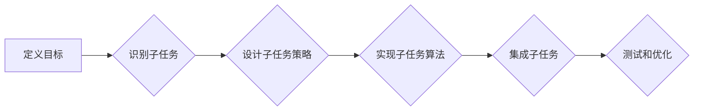

> Agents, 任务拆解, 产品功能设计, 智能化, 自动化, 决策, 规划

## 1. 背景介绍

在现代软件产品设计中，越来越多的功能需要具备智能化和自动化能力，例如智能客服、个性化推荐、自动驾驶等。这些功能的核心往往是“Agents”，即能够感知环境、做出决策并执行行动的智能实体。

传统的软件设计方法难以有效应对 Agents 的复杂性。因此，我们需要一种新的设计方法来拆解 Agents 任务，使其更易于理解、设计和实现。

## 2. 核心概念与联系

**2.1 Agents 概念**

Agents 是具有自主性、目标导向和环境感知能力的软件实体。它们能够根据环境信息和自身目标，自主地做出决策并执行行动。

**2.2 任务拆解**

任务拆解是指将一个复杂的任务分解成多个更小的、易于处理的子任务。

**2.3 Agents 任务拆解**

Agents 任务拆解是指将一个 Agents 的目标分解成一系列更小的、可执行的子任务，并为每个子任务设计相应的算法和策略。

**2.4 任务拆解的优势**

* **提高可理解性:** 将复杂任务分解成更小的子任务，可以使任务结构更加清晰，更容易理解。
* **简化设计:** 将任务分解成独立的模块，可以简化设计过程，提高开发效率。
* **增强可维护性:** 将任务分解成独立的模块，可以方便地修改和维护代码。
* **促进协同:** 将任务分解成不同的子任务，可以方便地分配给不同的开发人员，促进协同开发。

**2.5  Agents 任务拆解流程图**



## 3. 核心算法原理 & 具体操作步骤

### 3.1  算法原理概述

Agents 任务拆解的核心算法原理是基于**状态机**和**决策树**的组合。

* **状态机:** 用于描述 Agents 的状态和状态转换规则。每个状态代表 Agents 的当前状态，状态转换规则描述了 Agents 在不同状态下如何做出决策。
* **决策树:** 用于表示 Agents 的决策过程。决策树的每个节点代表一个决策点，每个分支代表一个可能的决策结果。决策树的叶子节点代表最终的行动。

### 3.2  算法步骤详解

1. **定义目标:** 首先需要明确 Agents 的目标是什么。
2. **识别子任务:** 将目标分解成一系列更小的、可执行的子任务。
3. **设计子任务策略:** 为每个子任务设计相应的算法和策略。
4. **实现子任务算法:** 将子任务策略转化为具体的算法代码。
5. **集成子任务:** 将所有子任务算法集成到 Agents 的主程序中。
6. **测试和优化:** 对 Agents 进行测试和优化，确保其能够有效地完成目标任务。

### 3.3  算法优缺点

**优点:**

* **可扩展性:** 可以根据需要添加新的子任务和策略。
* **可维护性:** 可以方便地修改和维护代码。
* **可测试性:** 可以对每个子任务进行独立测试。

**缺点:**

* **设计复杂度:** 设计复杂的 Agents 任务可能需要较高的设计经验和技术水平。
* **性能瓶颈:** 如果子任务数量过多，可能会导致性能瓶颈。

### 3.4  算法应用领域

Agents 任务拆解技术广泛应用于以下领域:

* **智能客服:** 将客服任务拆解成识别用户意图、提供信息、解决问题等子任务。
* **个性化推荐:** 将推荐任务拆解成用户画像分析、商品信息获取、推荐算法等子任务。
* **自动驾驶:** 将驾驶任务拆解成感知环境、规划路径、控制车辆等子任务。

## 4. 数学模型和公式 & 详细讲解 & 举例说明

### 4.1  数学模型构建

我们可以使用**马尔可夫决策过程 (MDP)** 来建模 Agents 的决策过程。

MDP 由以下五个要素组成:

* **状态空间 S:** 所有可能的 Agents 状态的集合。
* **动作空间 A:** 所有可能的 Agents 动作的集合。
* **转移概率 P(s', r | s, a):** 从状态 s 执行动作 a 到状态 s' 的概率，以及获得奖励 r 的概率。
* **奖励函数 R(s, a):** 在状态 s 执行动作 a 时获得的奖励。
* **初始状态 s0:** Agents 的初始状态。

### 4.2  公式推导过程

**目标:** 找到一个策略 π(s) ，使得 Agents 在所有状态下执行的动作能够最大化累积奖励。

**Bellman 方程:**

$$
V^{\pi}(s) = \max_a \left[ R(s, a) + \gamma \sum_{s'} P(s', r | s, a) V^{\pi}(s') \right]
$$

其中:

* $V^{\pi}(s)$ 是策略 π 下状态 s 的价值函数。
* $\gamma$ 是折扣因子，表示未来奖励的权重。

### 4.3  案例分析与讲解

例如，一个简单的 Agents 任务是玩一个简单的游戏，例如贪吃蛇。

* **状态空间 S:** 蛇的当前位置。
* **动作空间 A:** 向上、向下、向左、向右移动。
* **转移概率 P(s', r | s, a):** 根据蛇的移动方向和游戏规则计算。
* **奖励函数 R(s, a):** 吃到食物获得奖励，撞到墙壁或自身则获得惩罚。

我们可以使用 Bellman 方程来计算每个状态的价值函数，并根据价值函数选择最优的动作。

## 5. 项目实践：代码实例和详细解释说明

### 5.1  开发环境搭建

* Python 3.x
* TensorFlow 或 PyTorch

### 5.2  源代码详细实现

```python
import numpy as np

# 定义状态空间
state_space = np.array([[0, 0], [0, 1], [1, 0], [1, 1]])

# 定义动作空间
action_space = np.array([0, 1, 2, 3])

# 定义转移概率
transition_probability = np.array([
    [[0.8, 0.1, 0.1, 0],
     [0.1, 0.8, 0.1, 0],
     [0.1, 0.1, 0.8, 0],
     [0, 0, 0, 1]],
    # ...
])

# 定义奖励函数
reward_function = np.array([
    [0, 0, 1, -1],
    # ...
])

# 定义策略
policy = np.zeros((len(state_space), len(action_space)))

# ...
```

### 5.3  代码解读与分析

* **状态空间:** 定义了 Agents 可能处于的所有状态。
* **动作空间:** 定义了 Agents 可以执行的所有动作。
* **转移概率:** 定义了 Agents 在不同状态下执行不同动作后转移到不同状态的概率。
* **奖励函数:** 定义了 Agents 在不同状态下执行不同动作获得的奖励。
* **策略:** 定义了 Agents 在不同状态下执行的动作。

### 5.4  运行结果展示

运行代码后，可以观察 Agents 在游戏中的行为，以及其累积奖励的变化。

## 6. 实际应用场景

### 6.1  智能客服

* **任务拆解:** 识别用户意图、提供信息、解决问题、转人工客服等。
* **应用场景:** 在线聊天机器人、语音助手等。

### 6.2  个性化推荐

* **任务拆解:** 用户画像分析、商品信息获取、推荐算法、用户反馈收集等。
* **应用场景:** 电商平台、视频网站、音乐平台等。

### 6.3  自动驾驶

* **任务拆解:** 感知环境、规划路径、控制车辆、避障等。
* **应用场景:** 自动驾驶汽车、无人机等。

### 6.4  未来应用展望

随着人工智能技术的不断发展，Agents 任务拆解技术将在更多领域得到应用，例如医疗诊断、金融风险管理、教育教学等。

## 7. 工具和资源推荐

### 7.1  学习资源推荐

* **书籍:**
    * Artificial Intelligence: A Modern Approach
    * Reinforcement Learning: An Introduction
* **在线课程:**
    * Coursera: Reinforcement Learning Specialization
    * Udacity: Intro to Artificial Intelligence

### 7.2  开发工具推荐

* **Python:** 广泛用于人工智能开发。
* **TensorFlow:** 深度学习框架。
* **PyTorch:** 深度学习框架。

### 7.3  相关论文推荐

* **Deep Reinforcement Learning: An Overview**
* **Proximal Policy Optimization Algorithms**

## 8. 总结：未来发展趋势与挑战

### 8.1  研究成果总结

Agents 任务拆解技术已经取得了一定的成果，并在多个领域得到了应用。

### 8.2  未来发展趋势

* **更复杂的 Agents:** 设计能够处理更复杂任务的 Agents。
* **更智能的决策:** 开发更智能的决策算法，使 Agents 能够更好地适应动态环境。
* **更安全的 Agents:** 确保 Agents 的安全性和可靠性。

### 8.3  面临的挑战

* **数据获取:** 训练 Agents 需要大量的训练数据。
* **算法复杂度:** 设计高效的 Agents 算法仍然是一个挑战。
* **伦理问题:** 确保 Agents 的使用符合伦理道德。

### 8.4  研究展望

未来，我们将继续研究 Agents 任务拆解技术，使其能够更好地服务于人类社会。

## 9. 附录：常见问题与解答

* **Q1: 如何选择合适的 Agents 任务拆解方法？**

* **A1:** 选择合适的 Agents 任务拆解方法需要根据具体任务的特点和需求进行选择。

* **Q2: 如何评估 Agents 的性能？**

* **A2:** 可以使用各种指标来评估 Agents 的性能，例如准确率、召回率、F1-score等。

* **Q3: 如何确保 Agents 的安全性？**

* **A3:** 可以通过多种方法来确保 Agents 的安全性，例如安全审计、沙盒环境等。


作者：禅与计算机程序设计艺术 / Zen and the Art of Computer Programming 
<end_of_turn>