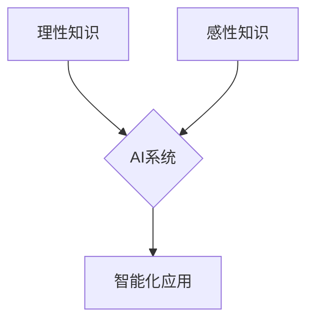

> 人工智能，理性知识，感性知识，知识表示，机器学习，深度学习，自然语言处理，计算机视觉，情感计算

## 1. 背景介绍

人工智能（AI）作为21世纪最具颠覆性的技术之一，正在深刻地改变着我们的生活和工作方式。从自动驾驶汽车到智能语音助手，从医疗诊断到金融风险评估，AI技术的应用领域日益广泛。然而，在AI发展过程中，一个关键问题始终备受关注：如何赋予AI“智能”？

传统的AI系统主要依赖于**理性知识**，即通过明确的规则和逻辑推理来解决问题。例如，围棋AI可以通过学习大量的棋谱和规则，并运用逻辑推理来制定最佳策略。然而，现实世界充满了复杂性和不确定性，单纯依靠理性知识难以应对这些挑战。

近年来，**感性知识**逐渐成为AI研究的热点。感性知识是指人类通过情感、直觉和经验积累而获得的知识，它往往是难以用逻辑规则表达的。例如，判断一个人的情绪、理解一个故事的深层含义，都需要依赖感性知识。

## 2. 核心概念与联系

**理性知识**和**感性知识**是两种不同的知识类型，它们在AI系统中扮演着不同的角色。

* **理性知识**：基于逻辑推理和规则，能够处理明确的问题，并给出精确的答案。
* **感性知识**：基于情感、直觉和经验，能够处理模糊的问题，并做出更符合人类情感的判断。

**AI系统**需要融合理性知识和感性知识才能真正实现智能。



## 3. 核心算法原理 & 具体操作步骤

### 3.1  算法原理概述

**深度学习**是近年来发展迅速的机器学习方法，它能够有效地学习和处理感性知识。深度学习算法的核心是**神经网络**，它由多个相互连接的层组成，每层都包含多个神经元。神经元之间通过权重进行连接，权重的大小决定了神经元之间的影响力。

深度学习算法通过**反向传播**算法来训练神经网络。反向传播算法通过不断调整神经元的权重，使得神经网络能够更好地拟合训练数据。

### 3.2  算法步骤详解

1. **数据预处理**: 将原始数据转换为深度学习算法可以理解的格式。
2. **网络结构设计**: 根据任务需求设计神经网络的结构，包括神经元的数量、连接方式等。
3. **参数初始化**: 为神经网络的参数（权重）赋予初始值。
4. **前向传播**: 将输入数据通过神经网络进行传播，得到输出结果。
5. **损失函数计算**: 计算输出结果与真实值的差异，即损失函数的值。
6. **反向传播**: 根据损失函数的值，反向传播误差信号，更新神经元的权重。
7. **迭代训练**: 重复步骤4-6，直到损失函数达到预设的阈值。

### 3.3  算法优缺点

**优点**:

* 能够学习复杂的数据模式。
* 性能优于传统机器学习算法。
* 能够处理大量数据。

**缺点**:

* 训练时间长，需要大量的计算资源。
* 对数据质量要求高。
* 难以解释模型的决策过程。

### 3.4  算法应用领域

* **图像识别**: 人脸识别、物体检测、图像分类等。
* **自然语言处理**: 语义理解、机器翻译、文本生成等。
* **语音识别**: 语音转文本、语音助手等。
* **医疗诊断**: 疾病预测、影像分析等。
* **金融风险评估**: 欺诈检测、信用评分等。

## 4. 数学模型和公式 & 详细讲解 & 举例说明

### 4.1  数学模型构建

深度学习算法的核心是神经网络，其数学模型可以表示为：

$$
y = f(W^L x^L + b^L)
$$

其中：

* $y$ 是输出结果。
* $x^L$ 是第 $L$ 层的输入。
* $W^L$ 是第 $L$ 层的权重矩阵。
* $b^L$ 是第 $L$ 层的偏置向量。
* $f$ 是激活函数。

### 4.2  公式推导过程

反向传播算法通过计算梯度来更新神经元的权重。梯度的计算公式如下：

$$
\frac{\partial L}{\partial W^L} = \frac{\partial L}{\partial y} \cdot \frac{\partial y}{\partial x^L} \cdot \frac{\partial x^L}{\partial W^L}
$$

其中：

* $L$ 是损失函数。

### 4.3  案例分析与讲解

例如，在图像识别任务中，深度学习算法可以学习图像特征，并将其映射到类别标签。

假设我们有一个包含猫和狗的图像数据集，深度学习算法可以学习到猫和狗的特征，例如耳朵形状、尾巴长度等。然后，当输入一个新的图像时，算法可以根据学习到的特征，预测图像中是猫还是狗。

## 5. 项目实践：代码实例和详细解释说明

### 5.1  开发环境搭建

* Python 3.x
* TensorFlow 或 PyTorch
* CUDA 和 cuDNN (可选，用于GPU加速)

### 5.2  源代码详细实现

```python
import tensorflow as tf

# 定义神经网络模型
model = tf.keras.models.Sequential([
    tf.keras.layers.Conv2D(32, (3, 3), activation='relu', input_shape=(28, 28, 1)),
    tf.keras.layers.MaxPooling2D((2, 2)),
    tf.keras.layers.Conv2D(64, (3, 3), activation='relu'),
    tf.keras.layers.MaxPooling2D((2, 2)),
    tf.keras.layers.Flatten(),
    tf.keras.layers.Dense(10, activation='softmax')
])

# 编译模型
model.compile(optimizer='adam',
              loss='sparse_categorical_crossentropy',
              metrics=['accuracy'])

# 训练模型
model.fit(x_train, y_train, epochs=10)

# 评估模型
loss, accuracy = model.evaluate(x_test, y_test)
print('Test loss:', loss)
print('Test accuracy:', accuracy)
```

### 5.3  代码解读与分析

* 代码首先定义了一个简单的卷积神经网络模型。
* 模型包含两个卷积层、两个最大池化层、一个全连接层和一个softmax输出层。
* 模型使用Adam优化器、交叉熵损失函数和准确率作为评估指标。
* 代码然后训练模型，并使用测试数据评估模型的性能。

### 5.4  运行结果展示

训练完成后，可以查看模型的测试准确率，以评估模型的性能。

## 6. 实际应用场景

### 6.1  医疗诊断

深度学习算法可以用于分析医学影像，例如X光片、CT扫描和MRI扫描，以辅助医生诊断疾病。例如，深度学习算法可以用于检测肺癌、脑肿瘤和心脏病等疾病。

### 6.2  金融风险评估

深度学习算法可以用于分析金融数据，例如交易记录、客户信息和市场趋势，以评估金融风险。例如，深度学习算法可以用于检测欺诈交易、评估信用风险和预测股票价格。

### 6.3  个性化推荐

深度学习算法可以用于分析用户的行为数据，例如浏览历史、购买记录和评分，以提供个性化的推荐。例如，深度学习算法可以用于推荐商品、电影和音乐。

### 6.4  未来应用展望

随着深度学习算法的不断发展，其应用场景将更加广泛。例如，深度学习算法可以用于自动驾驶、机器人控制、自然语言理解和情感计算等领域。

## 7. 工具和资源推荐

### 7.1  学习资源推荐

* **书籍**:
    * 深度学习 (Deep Learning) - Ian Goodfellow, Yoshua Bengio, Aaron Courville
    * 构建深度学习模型 (Hands-On Machine Learning with Scikit-Learn, Keras & TensorFlow) - Aurélien Géron
* **在线课程**:
    * 深度学习 Specialization - Andrew Ng (Coursera)
    * fast.ai - Practical Deep Learning for Coders
* **博客**:
    * The Gradient
    * Towards Data Science

### 7.2  开发工具推荐

* **TensorFlow**: Google开发的开源深度学习框架。
* **PyTorch**: Facebook开发的开源深度学习框架。
* **Keras**: TensorFlow的深度学习API，易于使用。

### 7.3  相关论文推荐

* **ImageNet Classification with Deep Convolutional Neural Networks** - Alex Krizhevsky, Ilya Sutskever, Geoffrey E. Hinton
* **Sequence to Sequence Learning with Neural Networks** - Ilya Sutskever, Oriol Vinyals, Quoc V. Le
* **Attention Is All You Need** - Ashish Vaswani, Noam Shazeer, Niki Parmar, Jakob Uszkoreit, Llion Jones, Aidan N. Gomez, Łukasz Kaiser, Illia Polosukhin

## 8. 总结：未来发展趋势与挑战

### 8.1  研究成果总结

近年来，深度学习算法取得了显著的成果，在图像识别、自然语言处理、语音识别等领域取得了突破性的进展。

### 8.2  未来发展趋势

* **模型更深、更广**: 研究更深层次、更广范围的神经网络模型，以提高模型的表达能力和泛化能力。
* **数据更丰富、更智能**: 利用更多的数据和更智能的数据处理方法，提高模型的训练效率和准确率。
* **算法更灵活、更高效**: 研究更灵活、更有效的深度学习算法，以解决更复杂的任务。
* **解释性更强**: 研究更能解释模型决策过程的深度学习算法，提高模型的可解释性和可信度。

### 8.3  面临的挑战

* **数据偏差**: 深度学习算法对训练数据的质量要求很高，如果训练数据存在偏差，模型可能会学习到错误的知识。
* **计算资源**: 训练深度学习模型需要大量的计算资源，这对于资源有限的机构或个人来说是一个挑战。
* **伦理问题**: 深度学习算法的应用可能会带来一些伦理问题，例如隐私泄露、算法歧视等，需要引起重视和解决。

### 8.4  研究展望

未来，深度学习技术将继续发展，并在更多领域发挥重要作用。研究人员将继续探索更深层次、更广范围的神经网络模型，并研究更灵活、更有效的深度学习算法。同时，也将更加关注深度学习算法的伦理问题，确保其安全、可靠和可持续发展。

## 9. 附录：常见问题与解答

### 9.1  什么是深度学习？

深度学习是一种机器学习方法，它使用多层神经网络来学习数据特征。

### 9.2  深度学习算法有哪些？

常见的深度学习算法包括卷积神经网络 (CNN)、循环神经网络 (RNN) 和生成对抗网络 (GAN)。

### 9.3  如何训练深度学习模型？

训练深度学习模型需要使用大量的训练数据和强大的计算资源。训练过程通常包括以下步骤：

1. 数据预处理
2. 模型设计
3. 参数初始化
4. 前向传播
5. 损失函数计算
6. 反向传播
7. 参数更新
8. 迭代训练

### 9.4  深度学习的应用领域有哪些？

深度学习的应用领域非常广泛，包括图像识别、自然语言处理、语音识别、医疗诊断、金融风险评估、个性化推荐等。

### 9.5  深度学习的未来发展趋势是什么？

深度学习的未来发展趋势包括模型更深、更广、数据更丰富、更智能、算法更灵活、更高效、解释性更强等。


作者：禅与计算机程序设计艺术 / Zen and the Art of Computer Programming 
<end_of_turn>