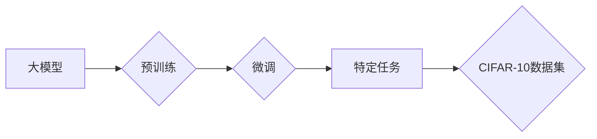

> 大模型开发, 微调, CIFAR-10, 深度学习, 计算机视觉, 迁移学习, 模型压缩

## 1. 背景介绍

近年来，深度学习在计算机视觉、自然语言处理等领域取得了突破性进展，这离不开大规模数据集和强大的计算资源的支持。大模型的出现，进一步推动了深度学习的发展，其强大的泛化能力和表达能力使其能够应用于更广泛的领域。然而，大模型的训练成本高昂，对硬件资源要求极高，对于普通开发者来说，直接训练大模型往往难以实现。

微调技术应运而生，它通过在预训练的大模型上进行针对性训练，来适应特定任务的需求。微调技术能够有效降低训练成本，同时还能提高模型的性能。CIFAR-10数据集作为图像分类任务的经典数据集，成为了微调技术的理想测试平台。

## 2. 核心概念与联系

### 2.1  大模型

大模型是指参数量达到数亿甚至数十亿的深度学习模型。它们通常通过大量的文本或图像数据进行预训练，学习到丰富的底层特征和知识。

### 2.2  微调

微调是指在预训练好的大模型上进行针对性训练，以适应特定任务的需求。微调过程通常只需要训练模型的一小部分参数，从而降低训练成本和时间。

### 2.3  CIFAR-10数据集

CIFAR-10数据集是一个包含60000张彩色图像的图像分类数据集，其中每张图像的大小为32x32像素，共有10个类别（飞机、汽车、鸟、猫、鹿、狗、船、卡车、人、马）。

**核心概念与联系流程图**



## 3. 核心算法原理 & 具体操作步骤

### 3.1  算法原理概述

微调的核心思想是利用预训练模型已经学习到的知识，通过在特定任务数据集上进行少量训练，来提升模型在该任务上的性能。

### 3.2  算法步骤详解

1. **选择预训练模型:** 选择一个在ImageNet等大型数据集上预训练好的模型，例如ResNet、VGG、Inception等。

2. **替换最后一层:** 将预训练模型的最后一层替换为与目标任务相匹配的输出层。例如，对于CIFAR-10数据集，最后一层需要输出10个类别。

3. **冻结部分参数:** 将预训练模型的大部分参数冻结，只训练最后一层和部分可调整的参数。

4. **训练模型:** 使用CIFAR-10数据集进行训练，调整模型参数。

5. **评估模型:** 使用验证集评估模型性能，并根据性能调整超参数。

6. **测试模型:** 使用测试集评估模型最终性能。

### 3.3  算法优缺点

**优点:**

* 训练成本低，时间短。
* 性能优于从头训练的模型。
* 可以利用现有的预训练模型，无需从头开始训练。

**缺点:**

* 仍然需要一定的计算资源。
* 如果预训练模型与目标任务不匹配，性能可能不佳。

### 3.4  算法应用领域

微调技术广泛应用于图像分类、目标检测、图像分割等计算机视觉任务，以及自然语言处理、语音识别等领域。

## 4. 数学模型和公式 & 详细讲解 & 举例说明

### 4.1  数学模型构建

微调过程本质上是一个优化问题，目标是找到最优的参数，使得模型在目标任务上的性能达到最大。

假设模型的输出为$y$, 目标值$y_i$，损失函数为$L(y, y_i)$，则模型的训练目标是：

$$
\min_w L(y, y_i)
$$

其中，$w$表示模型的参数。

### 4.2  公式推导过程

损失函数的具体形式取决于任务类型。例如，对于图像分类任务，常用的损失函数是交叉熵损失函数：

$$
L(y, y_i) = - \sum_{i=1}^{C} y_i \log(p_i)
$$

其中，$C$表示类别数，$y_i$表示真实标签，$p_i$表示模型预测的概率。

### 4.3  案例分析与讲解

假设我们使用ResNet模型进行CIFAR-10数据集的微调。

1. 我们首先选择一个在ImageNet数据集上预训练好的ResNet模型。

2. 然后，我们将ResNet模型的最后一层替换为一个包含10个神经元的输出层，用于输出CIFAR-10数据集的10个类别。

3. 我们冻结ResNet模型的大部分参数，只训练最后一层和部分可调整的参数。

4. 使用CIFAR-10数据集进行训练，并使用交叉熵损失函数计算损失。

5. 通过反向传播算法更新模型参数，直到模型性能达到预期。

## 5. 项目实践：代码实例和详细解释说明

### 5.1  开发环境搭建

* Python 3.6+
* TensorFlow/PyTorch
* CUDA/cuDNN

### 5.2  源代码详细实现

```python
import tensorflow as tf
from tensorflow.keras.applications import ResNet50
from tensorflow.keras.layers import Dense, GlobalAveragePooling2D
from tensorflow.keras.models import Model

# 加载预训练模型
base_model = ResNet50(weights='imagenet', include_top=False)

# 冻结预训练模型的层
for layer in base_model.layers:
    layer.trainable = False

# 添加新的输出层
x = base_model.output
x = GlobalAveragePooling2D()(x)
x = Dense(1024, activation='relu')(x)
predictions = Dense(10, activation='softmax')(x)

# 创建新的模型
model = Model(inputs=base_model.input, outputs=predictions)

# 编译模型
model.compile(optimizer='adam',
              loss='categorical_crossentropy',
              metrics=['accuracy'])

# 训练模型
model.fit(train_data, train_labels, epochs=10)

# 评估模型
loss, accuracy = model.evaluate(test_data, test_labels)
print('Test Loss:', loss)
print('Test Accuracy:', accuracy)
```

### 5.3  代码解读与分析

* 代码首先加载预训练的ResNet50模型，并冻结其所有层。
* 然后，添加一个新的输出层，用于输出CIFAR-10数据集的10个类别。
* 编译模型，使用Adam优化器、交叉熵损失函数和准确率作为评估指标。
* 最后，使用训练数据训练模型，并使用测试数据评估模型性能。

### 5.4  运行结果展示

训练完成后，可以查看模型的训练和验证损失以及准确率曲线，以及测试集上的准确率。

## 6. 实际应用场景

微调技术在图像分类、目标检测、图像分割等计算机视觉任务中有着广泛的应用。例如，可以将预训练的模型微调到特定领域的图像分类任务，例如医学图像分类、遥感图像分类等。

### 6.4  未来应用展望

随着大模型的不断发展，微调技术将会在更多领域得到应用，例如自然语言处理、语音识别、机器翻译等。

## 7. 工具和资源推荐

### 7.1  学习资源推荐

* TensorFlow官方文档：https://www.tensorflow.org/
* PyTorch官方文档：https://pytorch.org/
* 深度学习书籍：
    * 深度学习
    * 深度学习实践

### 7.2  开发工具推荐

* Jupyter Notebook
* Google Colab

### 7.3  相关论文推荐

* ImageNet Classification with Deep Convolutional Neural Networks
* Transfer Learning

## 8. 总结：未来发展趋势与挑战

### 8.1  研究成果总结

微调技术在降低大模型训练成本和提高模型性能方面取得了显著成果，为深度学习的普及和应用提供了重要的技术支撑。

### 8.2  未来发展趋势

* **模型压缩:** 研究更有效的模型压缩技术，降低模型大小和计算成本。
* **自动化微调:** 研究自动化微调方法，降低微调的门槛。
* **跨模态微调:** 研究跨模态微调技术，例如将图像和文本数据进行联合微调。

### 8.3  面临的挑战

* **数据标注:** 微调技术依赖于高质量的标注数据，数据标注成本高昂。
* **模型可解释性:** 大模型的决策过程难以解释，这限制了其在一些领域应用的推广。
* **公平性与偏见:** 大模型可能存在公平性与偏见问题，需要进行相应的研究和解决。

### 8.4  研究展望

未来，微调技术将会继续发展，并与其他深度学习技术相结合，推动深度学习在更多领域取得突破性进展。

## 9. 附录：常见问题与解答

* **Q: 微调需要多少数据才能达到较好的效果？**

* **A:** 微调所需的训练数据量取决于任务复杂度和模型大小。一般来说，1000-10000张图像就能够达到较好的效果。

* **Q: 如何选择合适的预训练模型？**

* **A:** 选择预训练模型时，需要考虑模型大小、架构、预训练数据集等因素。

* **Q: 如何评估微调模型的性能？**

* **A:** 可以使用验证集评估模型性能，并根据性能调整超参数。

* **Q: 微调模型的性能是否一定优于从头训练的模型？**

* **A:** 不一定，如果预训练模型与目标任务不匹配，微调模型的性能可能不如从头训练的模型。


作者：禅与计算机程序设计艺术 / Zen and the Art of Computer Programming 
<end_of_turn>