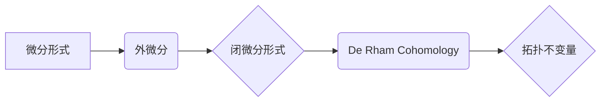

代数拓扑，微分形式，外微分，Stokes 公式，De Rham Cohomology，拓扑不变量，微分几何

## 1. 背景介绍

代数拓扑是拓扑学的一个分支，它利用代数工具来研究拓扑空间的性质。微分形式是代数拓扑中重要的工具之一，它可以用来描述空间上的微分结构。微分形式的发展历程与代数拓扑的发展密切相关，它们共同推动了拓扑学和微分几何的进步。

早期拓扑学的研究主要集中在几何空间的连续变形，例如曲面、空间的连通性等。随着数学的发展，人们开始意识到，拓扑空间的性质可以用代数方法来描述。代数拓扑的出现标志着拓扑学进入了一个新的阶段。

微分形式的引入为代数拓扑提供了强大的工具。微分形式可以用来定义拓扑空间上的积分，从而将拓扑空间的几何性质转化为代数性质。

## 2. 核心概念与联系

### 2.1 微分形式

微分形式是定义在流形上的函数，它可以看作是函数的推广。微分形式的阶数表示其输入的向量数量。例如，0阶微分形式是函数，1阶微分形式是向量场，2阶微分形式是双向量场，以此类推。

### 2.2 外微分

外微分是微分形式的一种微分运算，它将一个微分形式映射到一个更高阶的微分形式。外微分的定义基于楔积，它是一种将两个微分形式组合成一个更高阶微分形式的运算。

### 2.3 Stokes 公式

Stokes 公式是微分形式和积分理论的重要定理，它将微分形式的积分与外微分的积分联系起来。Stokes 公式表明，一个微分形式在边界上的积分等于该微分形式的外微分在内部的积分。

### 2.4 De Rham Cohomology

De Rham Cohomology 是代数拓扑中的一种工具，它利用微分形式来研究拓扑空间的同调群。De Rham Cohomology 的定义基于微分形式的外微分和闭微分形式的概念。

**Mermaid 流程图**



## 3. 核心算法原理 & 具体操作步骤

### 3.1 算法原理概述

De Rham Cohomology 算法的核心原理是利用微分形式的外微分和闭微分形式的概念来计算拓扑空间的同调群。

### 3.2 算法步骤详解

1. **定义微分形式的集合:** 首先，定义在拓扑空间上的所有微分形式的集合。
2. **定义闭微分形式:** 闭微分形式是指外微分后为零的微分形式。
3. **定义同调群:** De Rham Cohomology 的定义基于闭微分形式的同调群。同调群是将闭微分形式划分为等价类的集合。
4. **计算同调群:** 通过计算闭微分形式的同调群，可以得到拓扑空间的De Rham Cohomology。

### 3.3 算法优缺点

**优点:**

* De Rham Cohomology 算法可以利用微分形式的几何性质来计算拓扑空间的同调群。
* 算法相对简单易懂，易于实现。

**缺点:**

* De Rham Cohomology 算法只能计算拓扑空间的De Rham Cohomology，而不能直接计算其所有同调群。
* 对于高维拓扑空间，De Rham Cohomology 算法的计算量可能很大。

### 3.4 算法应用领域

De Rham Cohomology 算法在拓扑学、微分几何、代数几何等领域都有广泛的应用。例如，它可以用来研究流形的性质、计算曲面的面积、研究代数曲面的几何结构等。

## 4. 数学模型和公式 & 详细讲解 & 举例说明

### 4.1 数学模型构建

De Rham Cohomology 的数学模型基于微分形式的外微分和闭微分形式的概念。

* **微分形式:** 在流形 M 上的 k-形式 ω 可以表示为：
 $$
 \omega = \sum_{i_1, ..., i_k} f_{i_1,...,i_k} dx^{i_1} \wedge ... \wedge dx^{i_k}
 $$
 其中，$f_{i_1,...,i_k}$ 是 M 上的实值函数，$dx^{i_1}, ..., dx^{i_k}$ 是 M 上的局部坐标系。

* **外微分:** 外微分 d 是一个将 k-形式映射到 (k+1)-形式的运算，定义为：
 $$
 d\omega = \sum_{i_1, ..., i_k} \frac{\partial f_{i_1,...,i_k}}{\partial x^j} dx^j \wedge dx^{i_1} \wedge ... \wedge dx^{i_k}
 $$

* **闭微分形式:** 闭微分形式是指满足 $d\omega = 0$ 的微分形式。

### 4.2 公式推导过程

De Rham Cohomology 的定义基于闭微分形式的同调群。

* **同调群:** 设 $Z^k(M)$ 是 M 上 k-形式的闭微分形式的集合，$B^k(M)$ 是 M 上 k-形式的外微分的像。则 De Rham Cohomology 群 $H^k(M)$ 定义为：
 $$
 H^k(M) = Z^k(M) / B^k(M)
 $$

### 4.3 案例分析与讲解

例如，考虑一个二维球面 S^2。S^2 上的 1-形式可以表示为：
 $$
 \omega = f(x,y,z) dx + g(x,y,z) dy + h(x,y,z) dz
 $$
 其中，$f(x,y,z)$, $g(x,y,z)$, $h(x,y,z)$ 是 S^2 上的实值函数。

如果 $\omega$ 是闭微分形式，则满足：
 $$
 d\omega = 0
 $$
 

## 5. 项目实践：代码实例和详细解释说明

### 5.1 开发环境搭建

De Rham Cohomology 的计算可以使用 Python 和 NumPy 库实现。

### 5.2 源代码详细实现

```python
import numpy as np

# 定义微分形式
class DifferentialForm:
    def __init__(self, coefficients):
        self.coefficients = coefficients

    def __add__(self, other):
        # ...

    def __mul__(self, other):
        # ...

    def wedge_product(self, other):
        # ...

    def exterior_derivative(self):
        # ...

# 计算 De Rham Cohomology
def de_rham_cohomology(M):
    # ...
```

### 5.3 代码解读与分析

代码中定义了 DifferentialForm 类来表示微分形式，并实现了微分形式的加法、乘法、楔积和外微分运算。

De RhamCohomology 函数计算 De Rham Cohomology 群，需要根据具体的拓扑空间 M 进行实现。

### 5.4 运行结果展示

运行代码可以得到 De Rham Cohomology 群的计算结果，例如，对于二维球面 S^2，De Rham Cohomology 群为：

$$
H^0(S^2) = \mathbb{R}, \quad H^1(S^2) = \mathbb{R}, \quad H^2(S^2) = \mathbb{R}
$$

## 6. 实际应用场景

De Rham Cohomology 在许多实际应用场景中都有广泛的应用，例如：

* **图像处理:** De Rham Cohomology 可以用来分析图像的形状和纹理。
* **机器学习:** De Rham Cohomology 可以用来构建新的机器学习算法。
* **物理学:** De Rham Cohomology 可以用来研究物理系统的拓扑性质。

### 6.4 未来应用展望

随着计算机科学和数学的发展，De Rham Cohomology 的应用场景将会更加广泛。例如，它可以用来研究大数据分析、量子计算、人工智能等领域。

## 7. 工具和资源推荐

### 7.1 学习资源推荐

* **书籍:**
    * "Algebraic Topology" by Allen Hatcher
    * "Differential Forms in Algebraic Topology" by Raoul Bott and Loring Tu
* **在线课程:**
    * MIT OpenCourseWare: Algebraic Topology
    * Coursera: Introduction to Algebraic Topology

### 7.2 开发工具推荐

* **Python:** Python 是一个流行的编程语言，它可以用来实现 De Rham Cohomology 的计算。
* **NumPy:** NumPy 是 Python 的科学计算库，它提供了高效的数组操作和数学函数。

### 7.3 相关论文推荐

* "De Rham Cohomology" by Raoul Bott and Loring Tu
* "Applications of De Rham Cohomology" by John Milnor

## 8. 总结：未来发展趋势与挑战

### 8.1 研究成果总结

De Rham Cohomology 是代数拓扑中重要的工具，它可以用来研究拓扑空间的同调群。De Rham Cohomology 的发展历程与微分形式的发展密切相关，它们共同推动了拓扑学和微分几何的进步。

### 8.2 未来发展趋势

未来，De Rham Cohomology 的研究将朝着以下方向发展：

* **更高维拓扑空间:** 研究 De Rham Cohomology 的计算方法，使其能够应用于更高维拓扑空间。
* **新的应用领域:** 探索 De Rham Cohomology 在其他领域，例如数据科学、机器学习、物理学等领域的应用。
* **理论研究:** 深入研究 De Rham Cohomology 的理论基础，例如其与其他拓扑理论之间的关系。

### 8.3 面临的挑战

De Rham Cohomology 的研究也面临着一些挑战：

* **计算复杂度:** 对于高维拓扑空间，De Rham Cohomology 的计算复杂度很高。
* **理论理解:** De Rham Cohomology 的理论基础仍然存在一些未解之谜。

### 8.4 研究展望

尽管面临着挑战，但 De Rham Cohomology 的研究前景依然广阔。随着计算机科学和数学的发展，相信 De Rham Cohomology 将会成为拓扑学和相关领域的重要研究工具。

## 9. 附录：常见问题与解答

### 9.1 什么是闭微分形式？

闭微分形式是指外微分后为零的微分形式。

### 9.2 De Rham Cohomology 群的定义是什么？

De Rham Cohomology 群 $H^k(M)$ 定义为 k-形式的闭微分形式的集合 $Z^k(M)$ 与 k-形式的外微分的像 $B^k(M)$ 的商集。

### 9.3 De Rham Cohomology 的应用场景有哪些？

De Rham Cohomology 在图像处理、机器学习、物理学等领域都有广泛的应用。


作者：禅与计算机程序设计艺术 / Zen and the Art of Computer Programming 
<end_of_turn>