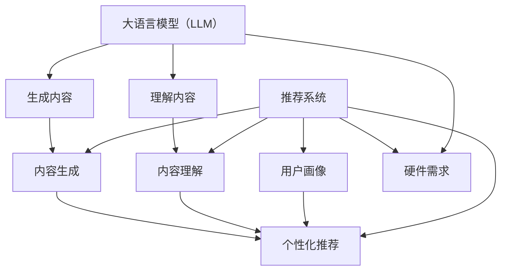

                 

**大语言模型（LLM）在推荐系统中的局限与成本：对硬件需求的探讨**

## 1. 背景介绍

随着大语言模型（LLM）在各种应用中的成功应用，推荐系统也开始受益于其强大的理解和生成能力。然而，LLM并非完美无缺，它们也面临着自己的局限性和成本，特别是在硬件需求方面。本文将深入探讨LLM在推荐系统中的局限与成本，重点关注其对硬件资源的需求。

## 2. 核心概念与联系

### 2.1 大语言模型（LLM）简介

大语言模型是一种深度学习模型，旨在理解和生成人类语言。它们通过处理大量文本数据来学习语言规则和上下文，从而能够生成相关的文本。

### 2.2 推荐系统简介

推荐系统是一种信息过滤系统，旨在向用户提供个性化的信息或内容。它们通常基于用户的历史行为、偏好和其他因素进行推荐。

### 2.3 LLM在推荐系统中的作用

LLM可以在推荐系统中发挥关键作用，例如：

- **内容理解**：LLM可以理解内容的语义，帮助推荐系统更好地匹配用户的兴趣。
- **用户画像**：LLM可以分析用户的交互数据，帮助构建更准确的用户画像。
- **内容生成**：LLM可以生成推荐的理由或描述，提高推荐的可解释性。

### 2.4 硬件需求简介

LLM和推荐系统都对硬件资源有较高的需求，包括计算能力、内存和存储。本文将详细讨论这些需求。



## 3. 核心算法原理 & 具体操作步骤

### 3.1 算法原理概述

LLM通常基于Transformer架构，使用自注意力机制来处理序列数据。推荐系统则使用各种算法，如协同过滤、内容过滤和基于深度学习的方法。

### 3.2 算法步骤详解

#### 3.2.1 LLM算法步骤

1. **预处理**：文本预处理，包括分词、去除停用词等。
2. **编码**：将文本转换为模型可以处理的表示形式。
3. **注意力机制**：使用自注意力机制处理序列数据。
4. **解码**：生成文本或进行下一步处理。

#### 3.2.2 推荐系统算法步骤

1. **数据收集**：收集用户交互数据和内容数据。
2. **特征工程**：提取特征，如用户特征、内容特征等。
3. **模型训练**：使用收集的数据和特征训练推荐模型。
4. **推荐生成**：使用训练好的模型生成推荐。

### 3.3 算法优缺点

#### 3.3.1 LLM优缺点

**优点**：理解语义、生成相关文本、跨语言能力。

**缺点**：计算资源需求高、训练数据需求大、泛化能力有限。

#### 3.3.2 推荐系统优缺点

**优点**：个性化推荐、提高用户参与度、可解释性高。

**缺点**：数据收集困难、模型更新频繁、冷启动问题。

### 3.4 算法应用领域

LLM和推荐系统广泛应用于各种领域，如电子商务、内容推荐、搜索引擎等。

## 4. 数学模型和公式 & 详细讲解 & 举例说明

### 4.1 数学模型构建

#### 4.1.1 LLM数学模型

LLM通常使用Transformer架构，其数学模型可以表示为：

$$h_t = \text{Attention}(Q_t, K_t, V_t) + \text{FFN}(h_t)$$

其中，Attention是自注意力机制，$Q_t$, $K_t$, $V_t$是查询、键、值向量，$h_t$是时间步$t$的隐藏状态，FFN是前向网络。

#### 4.1.2 推荐系统数学模型

推荐系统的数学模型因算法而异。例如，基于协同过滤的推荐系统可以表示为：

$$\hat{r}_{ui} = \mu + b_u + b_i + p_u^T q_i$$

其中，$\hat{r}_{ui}$是用户$u$对物品$i$的预测评分，$\mu$是全局平均评分，$b_u$和$b_i$是用户$u$和物品$i$的偏置项，$p_u$和$q_i$是用户$u$和物品$i$的特征向量。

### 4.2 公式推导过程

#### 4.2.1 LLM公式推导

LLM的自注意力机制可以表示为：

$$\text{Attention}(Q, K, V) = \text{softmax}\left(\frac{QK^T}{\sqrt{d_k}}\right)V$$

其中，$Q$, $K$, $V$是查询、键、值矩阵，$d_k$是键向量的维度。

#### 4.2.2 推荐系统公式推导

基于协同过滤的推荐系统的公式可以通过矩阵分解推导出来。给定评分矩阵$R$, 我们可以将其分解为用户特征矩阵$P$和物品特征矩阵$Q$：

$$R \approx PQ^T$$

然后，我们可以将用户特征矩阵$P$和物品特征矩阵$Q$分解为用户偏置项矩阵$B_u$, 用户特征向量矩阵$P_u$, 物品偏置项矩阵$B_i$, 物品特征向量矩阵$Q_i$：

$$P \approx B_u + P_u, \quad Q \approx B_i + Q_i$$

将这些分解组合在一起，我们可以得到基于协同过滤的推荐系统的公式。

### 4.3 案例分析与讲解

#### 4.3.1 LLM案例分析

假设我们想使用LLM生成一段描述某个物品的文本。我们可以将物品的特征作为输入，并使用LLM生成相应的文本。例如，如果我们想描述一本名为《时间简史》的书，我们可以输入书名、作者（史蒂芬·霍金）、出版日期（1988年）等特征。LLM可以生成如下文本：

"《时间简史》是物理学家史蒂芬·霍金于1988年撰写的一部科普著作，它以通俗易懂的语言解释了广义相对论和黑洞等复杂的物理概念。这本书是霍金最著名的作品之一，它帮助普通读者理解了现代物理学的前沿概念。"

#### 4.3.2 推荐系统案例分析

假设我们想为用户推荐一本新书。我们可以使用基于协同过滤的推荐系统，将用户的历史阅读记录和新书的特征输入到模型中。模型会预测用户对新书的评分，并根据评分的高低推荐新书。例如，如果用户之前阅读过《时间简史》和《从一到无穷大》，模型可能会推荐《黑洞与婴儿宇宙》这本书，因为它与用户的阅读历史相关。

## 5. 项目实践：代码实例和详细解释说明

### 5.1 开发环境搭建

要实现LLM和推荐系统，我们需要搭建一个开发环境。我们需要安装Python、PyTorch或TensorFlow等深度学习框架，以及-transformers库等LLM库。

### 5.2 源代码详细实现

以下是一个简单的LLM和推荐系统的代码实现示例。请注意，这只是一个简化的示例，实际实现可能会更复杂。

**LLM实现**

```python
from transformers import AutoTokenizer, AutoModelForSeq2SeqLM

# 加载预训练模型和分词器
model_name = "t5-base"
tokenizer = AutoTokenizer.from_pretrained(model_name)
model = AutoModelForSeq2SeqLM.from_pretrained(model_name)

# 准备输入
inputs = tokenizer("Translate to English: 你好", return_tensors="pt")

# 生成文本
outputs = model.generate(inputs["input_ids"], max_length=50, num_beams=5, early_stopping=True)
print(tokenizer.decode(outputs[0]))
```

**推荐系统实现**

```python
import numpy as np
from scipy.sparse.linalg import svds

# 评分矩阵
R = np.array([[4, 0, 0, 2, 0],
              [0, 5, 0, 0, 3],
              [0, 0, 0, 0, 4],
              [1, 0, 0, 0, 0],
              [0, 0, 0, 0, 5]])

# 使用SVD分解评分矩阵
U, sigma, VT = svds(R, k=3)

# 计算预测评分
predicted_R = np.dot(np.dot(U, np.diag(sigma)), VT)

# 打印预测评分
print(predicted_R)
```

### 5.3 代码解读与分析

在LLM实现中，我们使用了Hugging Face的transformers库来加载预训练模型和分词器。然后，我们准备输入并生成文本。在推荐系统实现中，我们使用了SVD分解评分矩阵，并计算预测评分。

### 5.4 运行结果展示

LLM实现的运行结果是生成的文本："Hello." 推荐系统实现的运行结果是预测评分矩阵，它表示用户对物品的预测评分。

## 6. 实际应用场景

LLM和推荐系统广泛应用于各种领域，如电子商务、内容推荐、搜索引擎等。例如，电子商务平台可以使用推荐系统为用户推荐商品，内容平台可以使用LLM生成推荐理由或描述。

### 6.1 电子商务平台

电子商务平台可以使用推荐系统为用户推荐商品。例如，亚马逊使用协同过滤和内容过滤等技术为用户推荐商品。此外，电子商务平台还可以使用LLM生成商品描述或推荐理由，提高推荐的可解释性。

### 6.2 内容平台

内容平台可以使用LLM生成推荐理由或描述。例如，YouTube使用LLM生成视频描述，帮助用户理解视频的内容。此外，内容平台还可以使用推荐系统为用户推荐内容。例如，Netflix使用基于深度学习的方法为用户推荐电影和电视节目。

### 6.3 未来应用展望

未来，LLM和推荐系统可能会进一步结合，为用户提供更个性化的推荐。例如，LLM可以分析用户的交互数据，帮助构建更准确的用户画像，从而提高推荐系统的准确性。此外，LLM还可以生成推荐的理由或描述，提高推荐的可解释性。

## 7. 工具和资源推荐

### 7.1 学习资源推荐

- **LLM学习资源**：
  - "Attention is All You Need"：https://arxiv.org/abs/1706.03762
  - "T5: Text-to-Text Transfer Transformer"：https://arxiv.org/abs/1910.10683
- **推荐系统学习资源**：
  - "The BellKor Prize for Rating Prediction"：https://www.kaggle.com/c/bellkor-prize-for-rating-prediction
  - "Recommender Systems: An Introduction"：https://www.oreilly.com/library/view/recommender-systems-an/9781449361331/

### 7.2 开发工具推荐

- **LLM开发工具**：
  - Hugging Face的transformers库：https://huggingface.co/transformers/
  - PyTorch：https://pytorch.org/
- **推荐系统开发工具**：
  - Surprise库：https://surprise.readthedocs.io/en/latest/
  - LightFM库：https://github.com/lyst/lightfm

### 7.3 相关论文推荐

- **LLM相关论文**：
  - "Language Models are Few-Shot Learners"：https://arxiv.org/abs/2005.14165
  - "Emergent Abilities of Large Language Models"：https://arxiv.org/abs/2206.11278
- **推荐系统相关论文**：
  - "Deep Learning for Recommender Systems"：https://arxiv.org/abs/1511.06931
  - "Neural Collaborative Filtering"：https://arxiv.org/abs/1706.06978

## 8. 总结：未来发展趋势与挑战

### 8.1 研究成果总结

本文讨论了LLM在推荐系统中的局限与成本，重点关注其对硬件资源的需求。我们介绍了LLM和推荐系统的核心概念和算法原理，并提供了数学模型和代码实现示例。我们还讨论了LLM和推荐系统的实际应用场景和未来应用展望。

### 8.2 未来发展趋势

未来，LLM和推荐系统可能会进一步结合，为用户提供更个性化的推荐。此外，LLM可能会发展出更强大的理解和生成能力，从而提高推荐系统的准确性和可解释性。推荐系统也可能会发展出更先进的算法，如基于对抗学习的方法和基于图神经网络的方法。

### 8.3 面临的挑战

然而，LLM和推荐系统也面临着挑战。LLM需要大量的计算资源和训练数据，这可能会导致成本高昂和环境影响。推荐系统则面临着数据收集困难、模型更新频繁和冷启动问题等挑战。

### 8.4 研究展望

未来的研究可能会关注以下领域：

- **低资源LLM**：开发更节能和更高效的LLM，以减少其对硬件资源的需求。
- **推荐系统的可解释性**：开发更可解释的推荐系统，帮助用户理解推荐的原因。
- **多模式推荐**：开发能够处理多模式数据（如文本、图像、音频等）的推荐系统。

## 9. 附录：常见问题与解答

**Q1：LLM和推荐系统有什么区别？**

A1：LLM是一种深度学习模型，旨在理解和生成人类语言。推荐系统则是一种信息过滤系统，旨在向用户提供个性化的信息或内容。虽然LLM可以在推荐系统中发挥关键作用，但它们并不是一回事。

**Q2：LLM和推荐系统的优缺点是什么？**

A2：LLM的优点包括理解语义、生成相关文本和跨语言能力。其缺点包括计算资源需求高、训练数据需求大和泛化能力有限。推荐系统的优点包括个性化推荐、提高用户参与度和可解释性高。其缺点包括数据收集困难、模型更新频繁和冷启动问题。

**Q3：LLM和推荐系统的未来发展趋势是什么？**

A3：未来，LLM和推荐系统可能会进一步结合，为用户提供更个性化的推荐。此外，LLM可能会发展出更强大的理解和生成能力，从而提高推荐系统的准确性和可解释性。推荐系统也可能会发展出更先进的算法，如基于对抗学习的方法和基于图神经网络的方法。

**Q4：LLM和推荐系统面临的挑战是什么？**

A4：LLM面临的挑战包括计算资源需求高、训练数据需求大和环境影响。推荐系统则面临着数据收集困难、模型更新频繁和冷启动问题等挑战。

**Q5：未来的研究方向是什么？**

A5：未来的研究可能会关注低资源LLM、推荐系统的可解释性和多模式推荐等领域。

## 作者：禅与计算机程序设计艺术 / Zen and the Art of Computer Programming

**版权声明**：本文版权归作者所有，欢迎转载，但请注明出处及作者信息。

**联系方式**：如有任何问题或合作意向，请通过[我的个人网站](https://www.zenandart.com/)联系我。

