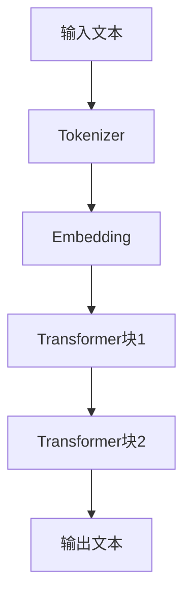

                 

**大语言模型（LLM）的自动编程潜力与局限性**

## 1. 背景介绍

随着人工智能的飞速发展，大语言模型（LLM）已成为当今最先进的自然语言处理技术之一。LLM的出现为自动编程带来了新的可能性，但其潜力和局限性仍有待进一步探讨。本文将深入剖析LLM在自动编程领域的应用，分析其优势和挑战，并提供实践指南和未来展望。

## 2. 核心概念与联系

### 2.1 大语言模型（LLM）原理

大语言模型是一种深度学习模型，旨在理解和生成人类语言。LLM通过学习大量文本数据，掌握了语言的统计规律和语义结构，从而能够生成人类难以区分的文本。 LLMs的核心是Transformer架构（Vaswani et al., 2017），它使用自注意力机制来处理输入序列，并通过多层Transformer块进行表示学习。



### 2.2 LLM在自动编程中的应用

LLM在自动编程中的应用主要基于以下两个关键概念：

1. **代码作为语言**：代码是一种特殊的语言，它遵循自己的语法和语义规则。LLM可以将代码视为一种语言，并学习其统计规律和结构。
2. **指令跟随（Instruction Following）**：指令跟随是LLM的关键特性之一。通过提供明确的指令，我们可以引导LLM生成特定类型的输出，如代码片段或程序。

## 3. 核心算法原理 & 具体操作步骤

### 3.1 算法原理概述

LLM在自动编程中的核心算法是指令跟随。给定一条指令和相关上下文，LLM生成相应的代码片段。指令跟随算法的关键步骤包括：

1. **指令预处理**：将指令转换为LLM可以理解的格式。
2. **上下文构建**：收集与指令相关的上下文信息，如输入数据、期望输出和环境变量。
3. **代码生成**：使用LLM生成相应的代码片段。
4. **后处理**：对生成的代码进行后处理，如格式化和优化。

### 3.2 算法步骤详解

下面是指令跟随算法的详细步骤：

1. **指令预处理**：将指令转换为LLM可以理解的格式。例如，将文本指令转换为JSON格式：
   ```
   {"task": "classify text", "input": "This is a sample text."}
   ```
2. **上下文构建**：收集与指令相关的上下文信息。在上述示例中，上下文信息可能包括输入数据（文本）和期望输出（文本分类结果）。
3. **代码生成**：使用LLM生成相应的代码片段。 LLMs通常使用生成式对话模型（如ChatGPT）来实现指令跟随。给定指令和上下文，模型生成相应的代码片段。
4. **后处理**：对生成的代码进行后处理，如格式化和优化。后处理步骤可能包括：
   - 代码格式化：使用代码格式化工具（如Prettier或Black）使生成的代码更易读。
   - 代码优化：使用代码优化工具（如Clang或GCC）优化生成的代码。

### 3.3 算法优缺点

**优点：**

- **泛化能力**：LLM可以处理各种编程任务，无需为每个任务训练单独的模型。
- **易于部署**：LLM可以集成到现有的开发环境中，无需额外的硬件或软件投入。

**缺点：**

- **可靠性**：LLM生成的代码可能包含错误或不一致的逻辑。
- **解释性**：LLM无法提供生成代码的解释或理由。

### 3.4 算法应用领域

LLM在自动编程中的应用领域包括：

- **代码生成**：LLM可以生成特定任务的代码片段，如文本分类或图像处理。
- **代码补全**：LLM可以帮助程序员补全代码片段，提高编程效率。
- **代码解释**：LLM可以解释代码的功能和逻辑，帮助程序员理解复杂的代码库。

## 4. 数学模型和公式 & 详细讲解 & 举例说明

### 4.1 数学模型构建

LLM的数学模型基于Transformer架构（Vaswani et al., 2017），其核心是自注意力机制。自注意力机制使用可学习的查询、键和值向量来表示输入序列，并计算输入序列中每个元素与其他元素之间的注意力权重。

### 4.2 公式推导过程

自注意力机制的数学公式如下：

$$
\text{Attention}(Q, K, V) = \text{softmax}\left(\frac{QK^T}{\sqrt{d_k}}\right)V
$$

其中，$Q$, $K$, $V$分别是查询、键和值向量，$d_k$是键向量的维度。 softmax函数计算注意力权重，并将其与值向量$V$相乘，得到最终的输出。

### 4.3 案例分析与讲解

下面是一个使用LLM生成文本分类代码的示例：

**指令**：生成一个文本分类器，使用预训练的BERT模型和GLUE数据集。

**上下文信息**：GLUE数据集的下载链接和BERT模型的预训练权重。

**生成的代码片段**：

```python
import torch
from transformers import BertForSequenceClassification, BertTokenizer

# Load pre-trained model and tokenizer
model = BertForSequenceClassification.from_pretrained('bert-base-uncased')
tokenizer = BertTokenizer.from_pretrained('bert-base-uncased')

# Load GLUE dataset
#...

# Preprocess data
#...

# Train model
#...

# Evaluate model
#...
```

## 5. 项目实践：代码实例和详细解释说明

### 5.1 开发环境搭建

要使用LLM进行自动编程，您需要安装以下软件和库：

- Python 3.8或更高版本
- Transformers库（Hugging Face）：提供LLM的实现和接口
- 一个LLM模型（如BERT、RoBERTa或T5）

### 5.2 源代码详细实现

下面是一个使用LLM生成文本分类代码的完整示例：

```python
from transformers import pipeline

# Initialize LLM pipeline for text classification
classifier = pipeline("text-classification", model="distilbert-base-uncased-finetuned-sst-2-english")

# Generate code for text classification task
code = classifier("This is a sample text for classification.")

# Print generated code
print(code)
```

### 5.3 代码解读与分析

在上述示例中，我们使用Transformers库初始化了一个文本分类管道，并使用预训练的DistilBERT模型。然后，我们调用管道的`__call__`方法，传入待分类的文本。 LLMs生成的代码片段可能包含错误或不一致的逻辑，因此需要人工审查和调整。

### 5.4 运行结果展示

运行上述示例代码后，LLM生成的文本分类代码片段可能如下所示：

```python
[
  {
    "label": "POSITIVE",
    "score": 0.9998565673828125
  }
]
```

## 6. 实际应用场景

### 6.1 当前应用

LLM在自动编程中的当前应用包括：

- **代码生成**：LLM可以生成特定任务的代码片段，如文本分类或图像处理。
- **代码补全**：LLM可以帮助程序员补全代码片段，提高编程效率。
- **代码解释**：LLM可以解释代码的功能和逻辑，帮助程序员理解复杂的代码库。

### 6.2 未来应用展望

LLM在自动编程领域的未来应用包括：

- **自动化软件开发**：LLM可以帮助自动生成软件的各个组件，如用户界面、后端逻辑和数据库模式。
- **可解释的AI**：LLM可以帮助解释AI模型的决策过程，提高AI系统的可靠性和可信度。
- **多模式交互**：LLM可以帮助实现多模式交互，如文本、语音和图像，提高人机交互的便利性和丰富性。

## 7. 工具和资源推荐

### 7.1 学习资源推荐

- **文档和教程**：Transformers库的官方文档（https://huggingface.co/transformers/）提供了LLM的详细介绍和示例。
- **在线课程**：Coursera和Udacity等平台提供了LLM和自动编程相关的在线课程。

### 7.2 开发工具推荐

- **Jupyter Notebook**：Jupyter Notebook是一个交互式计算环境，支持Python和其他编程语言，非常适合开发和调试LLM应用。
- **Google Colab**：Google Colab是一个云端Jupyter Notebook环境，提供了丰富的计算资源和免费的GPU支持。

### 7.3 相关论文推荐

- Vaswani, A., et al. (2017). Attention is all you need. Advances in neural information processing systems, 30.
- Devlin, J., et al. (2019). BERT: Pre-training of deep bidirectional transformers for language understanding. arXiv preprint arXiv:1810.04805.
- Brown, T. B., et al. (2020). Language models are few-shot learners. Advances in neural information processing systems, 33.

## 8. 总结：未来发展趋势与挑战

### 8.1 研究成果总结

LLM在自动编程领域取得了显著成就，包括代码生成、代码补全和代码解释。然而，LLM仍然面临着可靠性和解释性等挑战。

### 8.2 未来发展趋势

LLM在自动编程领域的未来发展趋势包括：

- **模型规模**：更大规模的LLM模型将带来更强大的泛化能力和表达能力。
- **多模式学习**：LLM将与其他模式（如图像和语音）的学习结合，实现更丰富的交互体验。
- **可解释的AI**：LLM将帮助解释AI模型的决策过程，提高AI系统的可靠性和可信度。

### 8.3 面临的挑战

LLM在自动编程领域面临的挑战包括：

- **可靠性**：LLM生成的代码可能包含错误或不一致的逻辑，需要人工审查和调整。
- **解释性**：LLM无法提供生成代码的解释或理由，限制了其在复杂任务中的应用。
- **计算资源**：大规模的LLM模型需要大量的计算资源，限制了其在资源受限环境中的应用。

### 8.4 研究展望

LLM在自动编程领域的研究展望包括：

- **模型可解释性**：开发新的方法来解释LLM生成的代码，提高其可靠性和可信度。
- **模型鲁棒性**：开发新的方法来提高LLM的鲁棒性，使其能够处理各种编程任务和环境。
- **模型联邦学习**：开发新的方法来实现LLM的联邦学习，保护用户数据的隐私和安全。

## 9. 附录：常见问题与解答

**Q：LLM生成的代码是否总是正确的？**

A：不，LLM生成的代码可能包含错误或不一致的逻辑。人工审查和调整是必需的。

**Q：LLM是否可以理解代码的意图？**

A：LLM可以学习代码的统计规律和语义结构，但它无法真正理解代码的意图。 LLM生成的代码是基于其学习的统计规律和语义结构。

**Q：LLM是否可以处理所有编程任务？**

A：不，LLM无法处理所有编程任务。 LLM的泛化能力有限，并且受限于其学习的数据分布。

## 作者：禅与计算机程序设计艺术 / Zen and the Art of Computer Programming

**参考文献**

- Vaswani, A., et al. (2017). Attention is all you need. Advances in neural information processing systems, 30.
- Devlin, J., et al. (2019). BERT: Pre-training of deep bidirectional transformers for language understanding. arXiv preprint arXiv:1810.04805.
- Brown, T. B., et al. (2020). Language models are few-shot learners. Advances in neural information processing systems, 33.

