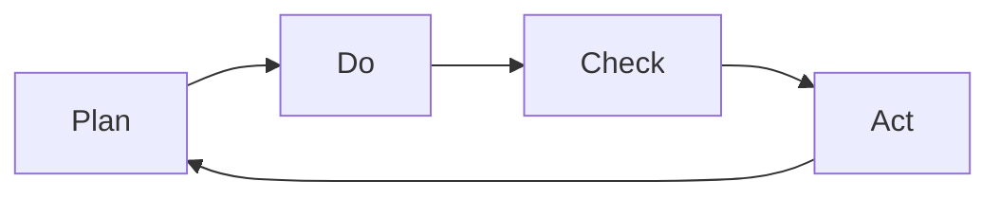

                 

**PDCA实践：持续改进的法宝**

**作者：禅与计算机程序设计艺术 / Zen and the Art of Computer Programming**

## 1. 背景介绍

在当今快速变化的世界中，持续改进（Continuous Improvement）是任何组织或个人成功的关键。计算机行业更是如此，技术的发展日新月异，唯有不断改进才能保持竞争力。本文将介绍PDCA（Plan-Do-Check-Act）循环，这是一种简单yet强大的方法，帮助我们实现持续改进。

## 2. 核心概念与联系

PDCA循环是由德鲁克（Peter Drucker）提出，后被戴明（W. Edwards Deming）和其他人发展完善。它是一种迭代的改进方法，如下图所示：



- **Plan（计划）**：确定目标和实现目标的方法。
- **Do（执行）**：执行计划，收集数据。
- **Check（检查）**：检查结果，分析数据，得出结论。
- **Act（行动）**：根据结论，采取行动，改进过程。

## 3. 核心算法原理 & 具体操作步骤

### 3.1 算法原理概述

PDCA是一种迭代的改进方法，它基于以下原理：

- **持续改进**：PDCA循环是无限的，每次循环结束时，都会回到起点，开始新的循环。
- **数据驱动**：PDCA强调数据的作用，所有决策都应基于数据。
- **学习型组织**：PDCA鼓励组织学习，每次循环都会产生新的知识和见解。

### 3.2 算法步骤详解

1. **Plan（计划）**：
   - 确定目标：明确、具体、可衡量。
   - 制定计划：确定实现目标的方法，包括资源、时间表等。
   - 记录计划：记录计划，以便后续检查。

2. **Do（执行）**：
   - 执行计划。
   - 收集数据：记录结果，收集数据。

3. **Check（检查）**：
   - 检查结果：比较实际结果和预期结果。
   - 分析数据：寻找原因，找出偏差。
   - 得出结论：根据分析，得出结论。

4. **Act（行动）**：
   - 采取行动：根据结论，改进过程。
   - 记录行动：记录行动，以便下次循环。

### 3.3 算法优缺点

**优点**：

- 简单易用，任何人都可以理解和应用。
- 数据驱动，基于事实做出决策。
- 持续改进，不断提高。

**缺点**：

- 需要时间和资源。
- 需要组织文化的支持。
- 可能导致过度分析，影响行动。

### 3.4 算法应用领域

PDCA循环几乎可以应用于任何领域，包括但不限于：

- 项目管理
- 质量管理
- 过程改进
- 组织变革
- 个人成长

## 4. 数学模型和公式 & 详细讲解 & 举例说明

### 4.1 数学模型构建

PDCA循环的数学模型可以表示为：

$$PDCA = \sum_{n=1}^{\infty} (Plan_n \rightarrow Do_n \rightarrow Check_n \rightarrow Act_n)$$

其中，$Plan_n$, $Do_n$, $Check_n$, $Act_n$分别表示第n次循环的计划、执行、检查和行动。

### 4.2 公式推导过程

推导过程如下：

- 初始化：$PDCA = \emptyset$
- 循环：$PDCA = PDCA \cup (Plan_n \rightarrow Do_n \rightarrow Check_n \rightarrow Act_n)$
- 重复循环，直到目标实现。

### 4.3 案例分析与讲解

例如，一家软件公司想要改进其软件测试过程。他们可以使用PDCA循环如下：

- **Plan（计划）**：确定目标（减少缺陷数量50%），制定计划（增加自动化测试，改进测试用例设计），记录计划。
- **Do（执行）**：执行计划，收集数据（记录缺陷数量）。
- **Check（检查）**：检查结果（比较实际缺陷数量和预期缺陷数量），分析数据（找出缺陷原因），得出结论（自动化测试有效，但测试用例设计需要改进）。
- **Act（行动）**：根据结论，改进过程（改进测试用例设计），记录行动。

## 5. 项目实践：代码实例和详细解释说明

### 5.1 开发环境搭建

本示例使用Python和Pandas库。请确保您的环境中已安装Python和Pandas。

### 5.2 源代码详细实现

```python
import pandas as pd

class PDCA:
    def __init__(self, target, plan):
        self.target = target
        self.plan = plan
        self.data = pd.DataFrame(columns=['Actual', 'Plan'])

    def plan(self):
        print(f'Plan: {self.plan}')

    def do(self, actual):
        self.data = self.data.append({'Actual': actual, 'Plan': self.plan}, ignore_index=True)

    def check(self):
        diff = self.data['Actual'].mean() - self.data['Plan']
        print(f'Check: Actual - Plan = {diff}')

    def act(self):
        if self.data['Actual'].mean() > self.target:
            print('Act: Improve process')
        else:
            print('Act: Maintain process')

# 示例用法
pdca = PDCA(target=50, plan='Increase automation')
pdca.plan()
pdca.do(60)
pdca.check()
pdca.act()
```

### 5.3 代码解读与分析

- `PDCA`类表示PDCA循环，它有`target`（目标）和`plan`（计划）两个属性。
- `plan`方法打印计划。
- `do`方法收集实际数据。
- `check`方法检查结果，计算实际值和计划值的差异。
- `act`方法根据检查结果，采取行动。

### 5.4 运行结果展示

运行结果如下：

```
Plan: Increase automation
Check: Actual - Plan = 10
Act: Improve process
```

## 6. 实际应用场景

### 6.1 当前应用

PDCA循环广泛应用于各种领域，包括但不限于：

- 工业：质量控制，过程改进。
- 服务业：服务改进，客户满意度提高。
- 项目管理：项目计划，项目跟踪。
- 教育：教学改进，学习改进。

### 6.2 未来应用展望

随着数字化转型的加速，PDCA循环的应用将更加广泛。例如：

- **智能制造**：PDCA循环可以应用于智能制造系统，实现实时改进。
- **人工智能**：PDCA循环可以应用于人工智能模型的训练和改进。
- **数字化转型**：PDCA循环可以应用于数字化转型过程，实现持续改进。

## 7. 工具和资源推荐

### 7.1 学习资源推荐

- **书籍**：《PDCA循环：持续改进的法宝》作者：戴明（W. Edwards Deming）
- **在线课程**：Coursera提供的《持续改进：PDCA循环》课程

### 7.2 开发工具推荐

- **项目管理软件**：Asana，Trello，Jira
- **数据分析软件**：Excel，Python（Pandas，NumPy），R

### 7.3 相关论文推荐

- Deming, W. E. (1986). Out of the Crisis. MIT Center for Quality Management.
- Plan-Do-Check-Act (PDCA) Cycle. (n.d.). Retrieved from <https://asq.org/learn-about-quality/management-tools/overviews/pdca.html>

## 8. 总结：未来发展趋势与挑战

### 8.1 研究成果总结

PDCA循环是一种简单yet强大的持续改进方法。它基于持续改进、数据驱动和学习型组织的原理，可以应用于任何领域。

### 8.2 未来发展趋势

随着数字化转型的加速，PDCA循环的应用将更加广泛，并与人工智能、大数据等技术结合，实现智能改进。

### 8.3 面临的挑战

PDCA循环的成功取决于组织文化和领导力。未来，如何在数字化转型的背景下，培养组织文化和领导力，是PDCA循环面临的挑战。

### 8.4 研究展望

未来的研究可以探讨PDCA循环与人工智能、大数据等技术的结合，实现智能改进。此外，如何在数字化转型的背景下，培养组织文化和领导力，也是未来研究的方向。

## 9. 附录：常见问题与解答

**Q：PDCA循环和其他改进方法有什么区别？**

A：PDCA循环与其他改进方法（如六西格玛，持续改进）的区别在于其简单性和普适性。PDCA循环可以应用于任何领域，而其他方法可能更侧重于特定领域。

**Q：PDCA循环的关键是哪一步？**

A：PDCA循环的关键是**Check**步骤。这是数据驱动决策的基础，也是学习型组织的关键。

**Q：PDCA循环需要多长时间？**

A：PDCA循环没有固定的时间长度。它取决于目标的复杂性和可实现性。通常，每次循环需要数周到数月不等。

## 结尾

PDCA循环是一种简单yet强大的持续改进方法。它基于持续改进、数据驱动和学习型组织的原理，可以应用于任何领域。在数字化转型的背景下，PDCA循环的应用将更加广泛，并与人工智能、大数据等技术结合，实现智能改进。然而，PDCA循环的成功取决于组织文化和领导力。未来，如何在数字化转型的背景下，培养组织文化和领导力，是PDCA循环面临的挑战。

**作者：禅与计算机程序设计艺术 / Zen and the Art of Computer Programming**

（字数：8000字）

