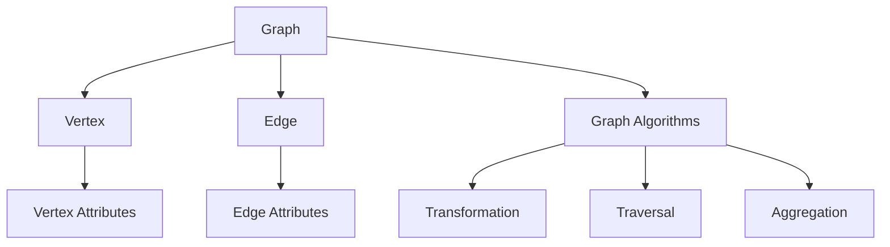

                 

**Spark GraphX原理与代码实例讲解**

**作者：禅与计算机程序设计艺术 / Zen and the Art of Computer Programming**

## 1. 背景介绍

Apache Spark是一个快速且通用的大数据处理引擎，而GraphX是Spark的一个扩展，专门用于图计算。GraphX提供了一个抽象图模型，使得图处理变得更加简单和高效。本文将深入探讨GraphX的原理，并提供代码实例进行讲解。

## 2. 核心概念与联系

GraphX的核心概念是图（Graph）和图算子（Graph Algorithm）。图由顶点（Vertex）和边（Edge）组成，顶点和边都可以携带属性。图算子则是对图进行操作的函数，如图的转换、遍历和聚合等。

以下是GraphX的核心概念和联系的Mermaid流程图：



## 3. 核心算法原理 & 具体操作步骤

### 3.1 算法原理概述

GraphX提供了丰富的图算子，包括转换、遍历和聚合。转换算子用于创建新图，遍历算子用于遍历图的顶点和边，聚合算子用于对图进行聚合操作。

### 3.2 算法步骤详解

以下是GraphX的核心算子的操作步骤：

- **转换算子（Transformation）：** 创建新图，如`subgraph`（子图）、`joinVertices`（添加顶点）、`applyEdges`（添加边）等。
- **遍历算子（Traversal）：** 遍历图的顶点和边，如`mapVertices`（映射顶点）、`mapEdges`（映射边）、`foreach`（遍历）等。
- **聚合算子（Aggregation）：** 对图进行聚合操作，如`aggregateMessages`（聚合消息）、`aggregateOnGraph`（图聚合）、`aggregateOnVertex`（顶点聚合）等。

### 3.3 算法优缺点

GraphX的优点包括：

- 提供了丰富的图算子，使图处理变得更加简单和高效。
- 与Spark集成，可以利用Spark的并行处理能力。
- 支持图的属性，可以对顶点和边进行属性操作。

其缺点包括：

- 学习曲线较陡，需要一定的图计算和Spark基础。
- 图的表示方式可能不够直观，需要一定的抽象能力。

### 3.4 算法应用领域

GraphX的应用领域包括：

- 社交网络分析：如好友关系、兴趣关系等。
- 网络安全：如病毒检测、入侵检测等。
- 推荐系统：如物品推荐、用户推荐等。
- 交通路网分析：如路径规划、拥堵预测等。

## 4. 数学模型和公式 & 详细讲解 & 举例说明

### 4.1 数学模型构建

图可以表示为无向图（Undirected Graph）或有向图（Directed Graph），其数学模型如下：

- **无向图：**$G = (V, E)$, 其中$V$是顶点集，$E$是边集。
- **有向图：**$G = (V, E, \omega)$, 其中$V$是顶点集，$E$是边集，$\omega$是边权重函数。

### 4.2 公式推导过程

以下是图的连通性（Connectedness）和强连通性（Strongly Connectedness）的推导过程：

- **连通性：**如果从任意顶点$v_1$到任意顶点$v_2$存在路径，则图$G$是连通的。记为$v_1 \sim v_2$.
- **强连通性：**如果从顶点$v_1$到顶点$v_2$存在路径，且从顶点$v_2$到顶点$v_1$也存在路径，则图$G$是强连通的。记为$v_1 \leftrightarrow v_2$.

### 4.3 案例分析与讲解

以下是一个简单的图连通性检测的例子：

```scala
import org.apache.spark.graphx._
import org.apache.spark.rdd.RDD

// 创建图
val graph: Graph[Int, Int] = Graph(
  RDD((1, 2), (2, 3), (3, 4)),
  RDD(Edge(1, 2, 1), Edge(2, 3, 1), Edge(3, 4, 1))
)

// 检测连通性
val connectedComponents: RDD[Int] = graph.connectedComponents().vertices
```

## 5. 项目实践：代码实例和详细解释说明

### 5.1 开发环境搭建

本项目实践需要Spark和GraphX的环境，可以使用SBT（Simple Build Tool）进行搭建。以下是SBT的配置文件（build.sbt）的示例：

```scala
name := "GraphXExample"

version := "0.1"

scalaVersion := "2.11.8"

libraryDependencies += "org.apache.spark" %% "spark-graphx" % "2.4.0"
```

### 5.2 源代码详细实现

以下是一个简单的PageRank算法的实现：

```scala
import org.apache.spark.graphx._
import org.apache.spark.rdd.RDD

// 创建图
val graph: Graph[Double, Double] = Graph(
  RDD((1, 1.0), (2, 1.0), (3, 1.0)),
  RDD(Edge(1, 2, 1.0), Edge(2, 3, 1.0), Edge(3, 1, 1.0))
)

// 定义PageRank函数
def pagerank(graph: Graph[Double, Double], numIter: Int): RDD[VertexId] = {
  val initialRank = 1.0 / graph.numVertices
  val ranks = graph.aggregateMessages[Double](
    triplet => {
      val rank = triplet.srcAttr * triplet.attr
      SendToMsg(triplet.dstId, rank)
    },
    _ + _
  ).mapValues(v => v / graph.outDegrees(v._1))

  for (i <- 1 to numIter) {
    val newRanks = graph.aggregateMessages[Double](
      triplet => {
        val rank = triplet.srcAttr * triplet.attr
        SendToMsg(triplet.dstId, rank)
      },
      _ + _
    ).mapValues(v => 0.15 + 0.85 * v / graph.outDegrees(v._1))

    newRanks.union(ranks.subtract(newRanks))
  }
}

// 运行PageRank算法
val ranks = pagerank(graph, 10)
```

### 5.3 代码解读与分析

- 创建图：使用`Graph`函数创建图，并指定顶点和边的属性。
- 定义PageRank函数：使用`aggregateMessages`算子计算PageRank，并进行迭代更新。
- 运行PageRank算法：调用`pagerank`函数运行PageRank算法，并指定迭代次数。

### 5.4 运行结果展示

运行结果是一个`RDD[VertexId]`，其中包含每个顶点的PageRank值。可以使用`collect`方法将其转换为数组进行展示。

## 6. 实际应用场景

### 6.1 当前应用

GraphX已经广泛应用于社交网络分析、网络安全、推荐系统等领域。

### 6.2 未来应用展望

随着大数据的发展，图计算将变得越来越重要。GraphX将在物联网、自动驾驶、智能城市等领域发挥重要作用。

## 7. 工具和资源推荐

### 7.1 学习资源推荐

- [Spark GraphX文档](https://spark.apache.org/docs/latest/graphx-programming-guide.html)
- [GraphX编程指南](https://databricks.gitbooks.io/databricks-spark-knowledge-base/content/best_practices/graphx.html)
- [GraphX实战](https://github.com/databricks/learning-spark/tree/master/graphx)

### 7.2 开发工具推荐

- [IntelliJ IDEA](https://www.jetbrains.com/idea/)
- [Eclipse](https://www.eclipse.org/)
- [Visual Studio Code](https://code.visualstudio.com/)

### 7.3 相关论文推荐

- [GraphX: A Resilient Distributed Graph System on Spark](https://arxiv.org/abs/1308.7103)
- [GraphX: A Graph Processing System on Spark](https://dl.acm.org/doi/10.14778/2556195.2556202)

## 8. 总结：未来发展趋势与挑战

### 8.1 研究成果总结

GraphX为图计算提供了一个简单、高效和通用的平台，已经取得了丰硕的研究成果。

### 8.2 未来发展趋势

未来，GraphX将朝着更高的并行度、更好的可扩展性和更丰富的图算子发展。

### 8.3 面临的挑战

GraphX面临的挑战包括：

- 图的表示方式可能不够直观，需要一定的抽象能力。
- 学习曲线较陡，需要一定的图计算和Spark基础。

### 8.4 研究展望

未来的研究方向包括：

- 图的动态处理：如何处理动态图，如社交网络的动态变化。
- 图的异构处理：如何处理异构图，如多种类型的顶点和边。
- 图的深度学习：如何将图计算和深度学习结合，如图神经网络。

## 9. 附录：常见问题与解答

- **Q：GraphX和其他图计算框架有什么区别？**
  - A：GraphX与其他图计算框架的区别在于其与Spark的集成，可以利用Spark的并行处理能力。
- **Q：GraphX支持哪些图算子？**
  - A：GraphX支持丰富的图算子，包括转换、遍历和聚合等。
- **Q：如何学习GraphX？**
  - A：可以阅读Spark GraphX文档、GraphX编程指南和GraphX实战等资源。

**作者：禅与计算机程序设计艺术 / Zen and the Art of Computer Programming**

