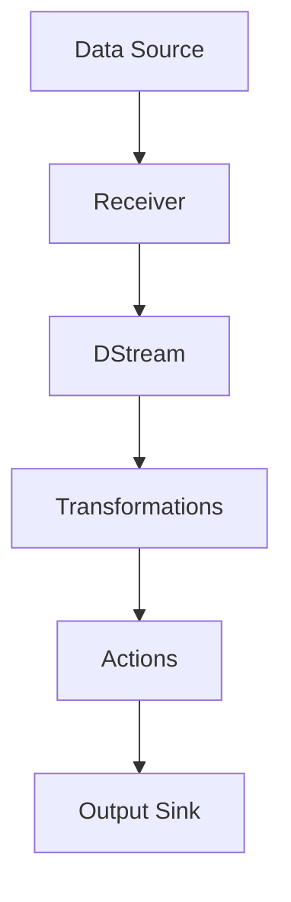

                 

**Spark Streaming原理与代码实例讲解**

**作者：禅与计算机程序设计艺术 / Zen and the Art of Computer Programming**

## 1. 背景介绍

在大数据时代，实时处理和分析数据流（如社交媒体数据、物联网数据、金融数据等）变得越来越重要。Apache Spark的Streaming API提供了一种简单且高效的方式来实时处理数据流。本文将深入探讨Spark Streaming的原理，并提供代码实例进行讲解。

## 2. 核心概念与联系

### 2.1 核心概念

- **DStream（Discretized Stream）**：Spark Streaming的基本数据结构，表示连续的数据流。
- **Batch Processing**：Spark Streaming将数据流分割成批处理，每个批处理包含一段时间内的数据。
- **Transformations and Actions**：与Spark RDD类似，DStream也支持转换操作（如map、filter）和行动操作（如reduce、foreach）。
- **Receiver**：从外部数据源接收数据的组件。
- **Batch Interval**：Spark Streaming处理数据的时间间隔。

### 2.2 Mermaid 流程图



## 3. 核心算法原理 & 具体操作步骤

### 3.1 算法原理概述

Spark Streaming将数据流分割成批处理，每个批处理包含一段时间内的数据。然后，它使用Spark的批处理引擎来处理这些批处理。最后，它将结果发送到输出端。

### 3.2 算法步骤详解

1. 从数据源接收数据。
2. 将数据流分割成批处理。
3. 对批处理应用转换操作。
4. 对批处理应用行动操作。
5. 将结果发送到输出端。

### 3.3 算法优缺点

**优点：**

- 简单易用，与Spark RDD接口一致。
- 与Spark集群无缝集成。
- 可靠性高，支持容错和故障恢复。

**缺点：**

- 批处理延迟可能会导致实时性下降。
- 处理大数据流时可能会面临内存问题。

### 3.4 算法应用领域

- 实时监控和分析社交媒体数据。
- 实时处理物联网数据。
- 实时分析金融数据。

## 4. 数学模型和公式 & 详细讲解 & 举例说明

### 4.1 数学模型构建

设数据流为$D(t)$, 批处理间隔为$T$, 则第$n$个批处理包含时间段$[nT, (n+1)T)$内的数据。

### 4.2 公式推导过程

假设数据流$D(t)$是连续的，则第$n$个批处理的大小为$|D(nT, (n+1)T)|$.

### 4.3 案例分析与讲解

例如，考虑一个每秒钟产生1000条数据的数据流。如果批处理间隔为1秒，则每个批处理包含1000条数据。如果批处理间隔为5秒，则每个批处理包含5000条数据。

## 5. 项目实践：代码实例和详细解释说明

### 5.1 开发环境搭建

- Spark：2.4.0
- Scala：2.11.12
- SBT：1.3.13

### 5.2 源代码详细实现

```scala
import org.apache.spark._
import org.apache.spark.streaming._
import org.apache.spark.streaming.kafka._

object SparkStreamingExample {
  def main(args: Array[String]): Unit = {
    val conf = new SparkConf().setMaster("local[*]").setAppName("Spark Streaming Example")
    val ssc = new StreamingContext(conf, Seconds(1))

    // Create a direct stream from a Kafka topic
    val kafkaParams = Map[String, String](
      "metadata.broker.list" -> "localhost:9092",
      "group.id" -> "spark-streaming-kafka-group",
      "auto.offset.reset" -> "latest"
    )
    val messages = KafkaUtils.createDirectStream[String, String, StringDecoder, StringDecoder](
      ssc, kafkaParams, Set("topic1")
    )

    // Process the messages
    val words = messages.flatMap(_._2.split(" "))
    val wordCounts = words.map(x => (x, 1)).reduceByKey(_ + _)

    // Print the word counts
    wordCounts.print()

    ssc.start()
    ssc.awaitTermination()
  }
}
```

### 5.3 代码解读与分析

- 创建一个StreamingContext，指定批处理间隔为1秒。
- 创建一个直接流，从Kafka主题读取数据。
- 将每条消息分割成单词，并对单词进行计数。
- 打印单词计数结果。

### 5.4 运行结果展示

运行代码后，您应该看到单词计数结果实时打印在控制台上。

## 6. 实际应用场景

### 6.1 当前应用

Spark Streaming广泛应用于实时监控和分析社交媒体数据、实时处理物联网数据、实时分析金融数据等领域。

### 6.2 未来应用展望

随着物联网和人工智能的发展，Spark Streaming将在实时数据处理和分析领域发挥更大的作用。

## 7. 工具和资源推荐

### 7.1 学习资源推荐

- [Spark Streaming Programming Guide](https://spark.apache.org/docs/latest/streaming-programming-guide.html)
- [Spark Streaming with Kafka](https://spark.apache.org/docs/latest/streaming-kafka-integration.html)

### 7.2 开发工具推荐

- IntelliJ IDEA
- SBT

### 7.3 相关论文推荐

- [Spark Streaming: A Resilient Distributed Streaming System for Real-time Data Processing](https://www.usenix.org/system/files/login/articles/login_summer13_07_venkatesan.pdf)

## 8. 总结：未来发展趋势与挑战

### 8.1 研究成果总结

Spark Streaming提供了一种简单且高效的方式来实时处理数据流。

### 8.2 未来发展趋势

随着物联网和人工智能的发展，Spark Streaming将在实时数据处理和分析领域发挥更大的作用。

### 8.3 面临的挑战

- 批处理延迟可能会导致实时性下降。
- 处理大数据流时可能会面临内存问题。

### 8.4 研究展望

未来的研究将关注如何进一步提高Spark Streaming的实时性和可扩展性。

## 9. 附录：常见问题与解答

**Q：Spark Streaming与Apache Flink有何区别？**

**A：Spark Streaming和Apache Flink都是用于实时数据处理的框架，但它们有几个关键区别。**

- **事件时间支持**：Flink支持事件时间，这意味着它可以处理不同时间戳的数据。Spark Streaming则主要基于处理时间。
- **容错机制**：Flink使用检查点机制来容错，而Spark Streaming使用线性化一致性模型。
- **延迟**：Flink通常具有更低的延迟，因为它可以在事件时间上处理数据。

**Q：如何处理大数据流？**

**A：处理大数据流时，您可以考虑以下几种方法：**

- **增加批处理间隔**：这可以减少每个批处理的大小，从而减少内存使用。
- **使用缩放**：您可以水平扩展您的Spark集群来处理更大的数据流。
- **使用结构化流**：Spark Structured Streaming提供了一种更有效的方式来处理大数据流。

## 结束语

本文介绍了Spark Streaming的原理，并提供了代码实例进行讲解。Spark Streaming是一个强大的工具，可以帮助您轻松实时处理和分析数据流。随着物联网和人工智能的发展，Spark Streaming将在实时数据处理和分析领域发挥更大的作用。

**作者：禅与计算机程序设计艺术 / Zen and the Art of Computer Programming**

