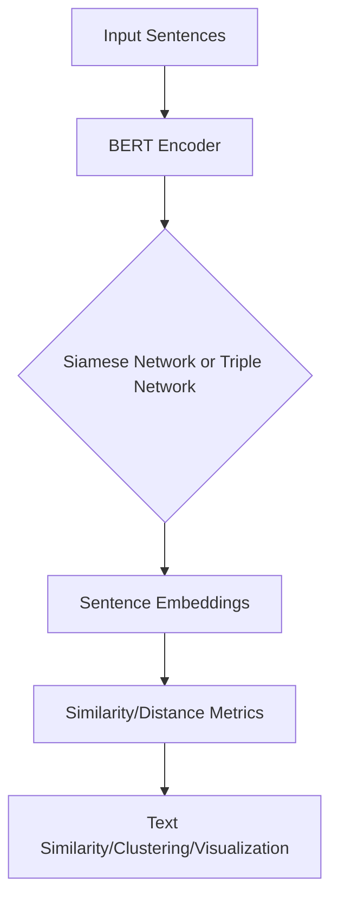

                 

## 1. 背景介绍

在当今的自然语言处理（NLP）领域，理解文本的意义和关系是一项关键任务。传统的方法，如词袋模型和TF-IDF，无法捕捉文本的语义和上下文。深度学习的出现带来了新的希望，其中transformer模型和其变体，如BERT（Bidirectional Encoder Representations from Transformers），在NLP任务中取得了显著的成功。

本文将重点关注Sentence-BERT（SBERT），一种用于学习文本表示的模型，它结合了BERT的优点和传统的向量空间模型。SBERT允许我们在向量空间中比较和聚类文本，从而更好地理解文本的意义和关系。

## 2. 核心概念与联系

### 2.1 核心概念

- **BERT（Bidirectional Encoder Representations from Transformers）**：BERT是一种 transformer模型，它使用双向注意力机制在两个方向上编码文本。它预训练了大量的语言模型任务，如掩码语言模型和下一句预测，并提供了大量的预训练模型，可以在各种NLP任务上进行微调。

- **Sentence-BERT（SBERT）**：SBERT是BERT的一种变体，它使用 Siamese和Triple网络架构，在向量空间中学习文本表示。SBERT生成的向量可以用于文本相似度计算、聚类和可视化。

### 2.2 核心架构


图1：SBERT架构（图片来源：[Understanding SBERT](https://towardsdatascience.com/understanding-sentence-transformers-214062f7548e)）

如图1所示，SBERT使用Siamese网络或Triple网络架构。Siamese网络接受两个输入句子，并生成它们的表示。Triple网络接受三个输入句子，并生成表示，以表示句子之间的关系（如相似性或反义词关系）。

### 2.3 Mermaid 流程图



## 3. 核心算法原理 & 具体操作步骤

### 3.1 算法原理概述

SBERT使用BERT作为编码器，生成句子的表示。然后，它使用Siamese或Triple网络学习句子表示之间的关系。SBERT使用对比学习的方法，最大化相似句子的相似度，并最小化不相似句子的相似度。

### 3.2 算法步骤详解

1. **预训练BERT模型**：首先，我们需要一个预训练的BERT模型。BERT在大量的文本数据上预训练了语言模型任务，学习了大量的语言知识。

2. **句子编码**：将输入句子传递给BERT编码器，生成句子表示。SBERT使用[CLS]标记的隐藏状态作为句子表示。

3. **对比学习**：使用Siamese或Triple网络学习句子表示之间的关系。SBERT最大化相似句子的相似度，并最小化不相似句子的相似度。

4. **训练**：使用交叉熵损失函数训练模型。SBERT使用Adam优化器和学习率为1e-5的学习率。

5. **推理**：在训练完成后，我们可以使用SBERT生成新句子的表示，并计算它们之间的相似度。

### 3.3 算法优缺点

**优点**：

- SBERT生成的表示可以在向量空间中比较和聚类文本。
- SBERT可以在各种NLP任务上进行微调，如文本相似度、聚类和可视化。
- SBERT使用BERT的预训练模型，可以在大量的文本数据上学习语言知识。

**缺点**：

- SBERT需要大量的计算资源来训练和推理。
- SBERT的性能取决于BERT模型的质量。
- SBERT无法处理长度超过512个标记的句子。

### 3.4 算法应用领域

SBERT可以应用于各种NLP任务，如：

- **文本相似度**：SBERT可以计算两个句子之间的相似度，从而帮助我们理解文本的意义和关系。
- **聚类**：SBERT可以将文本聚类到相似的主题，从而帮助我们理解文本的结构和组织。
- **可视化**：SBERT可以将文本表示在向量空间中，从而帮助我们可视化文本的意义和关系。

## 4. 数学模型和公式 & 详细讲解 & 举例说明

### 4.1 数学模型构建

SBERT使用BERT作为编码器，生成句子表示。然后，它使用Siamese或Triple网络学习句子表示之间的关系。SBERT使用对比学习的方法，最大化相似句子的相似度，并最小化不相似句子的相似度。

数学上，SBERT的目标函数可以表示为：

$$L = - \log \frac{e^{s(c, p) / \tau}}{e^{s(c, p) / \tau} + \sum_{i=1}^{K} e^{s(c, n_i) / \tau}}$$

其中，$c$和$p$是相似的句子，$n_i$是不相似的句子，$s(.,.)$是句子表示之间的余弦相似度，$K$是负样本的数量，$\tau$是温度参数。

### 4.2 公式推导过程

SBERT使用对比学习的方法，最大化相似句子的相似度，并最小化不相似句子的相似度。数学上，SBERT的目标函数可以表示为上述公式。

### 4.3 案例分析与讲解

例如，假设我们想要计算两个句子"我喜欢狗"和"我喜欢猫"之间的相似度。我们首先使用BERT编码器生成句子表示。然后，我们计算句子表示之间的余弦相似度。最后，我们使用SBERT的目标函数计算相似度分数。

$$s("我喜欢狗", "我喜欢猫") = \cos(\theta)$$

其中，$\theta$是句子表示之间的夹角。如果$\theta$接近0，则句子表示是相似的，否则它们是不相似的。

## 5. 项目实践：代码实例和详细解释说明

### 5.1 开发环境搭建

要使用SBERT，我们需要安装transformers库。我们可以使用以下命令安装：

```bash
pip install transformers
```

### 5.2 源代码详细实现

以下是使用SBERT计算两个句子之间相似度的示例代码：

```python
from sentence_transformers import SentenceTransformer
import numpy as np

# Load pre-trained model
model = SentenceTransformer('all-MiniLM-L6-v2')

# Encode sentences
sentence1 = "我喜欢狗"
sentence2 = "我喜欢猫"
embedding1 = model.encode([sentence1])
embedding2 = model.encode([sentence2])

# Calculate cosine similarity
cos_sim = np.dot(embedding1, embedding2) / (np.linalg.norm(embedding1) * np.linalg.norm(embedding2))

print("Similarity score:", cos_sim)
```

### 5.3 代码解读与分析

在示例代码中，我们首先加载预训练的SBERT模型。然后，我们使用模型编码输入句子，生成句子表示。最后，我们计算句子表示之间的余弦相似度。

### 5.4 运行结果展示

示例代码的输出将是两个句子之间的相似度分数。分数接近1表示句子是相似的，分数接近0表示句子是不相似的。

## 6. 实际应用场景

### 6.1 文本相似度

SBERT可以计算两个句子之间的相似度，从而帮助我们理解文本的意义和关系。例如，我们可以使用SBERT在客户服务聊天机器人中提供更好的自动回答。

### 6.2 聚类

SBERT可以将文本聚类到相似的主题，从而帮助我们理解文本的结构和组织。例如，我们可以使用SBERT在新闻文章中自动生成主题。

### 6.3 可视化

SBERT可以将文本表示在向量空间中，从而帮助我们可视化文本的意义和关系。例如，我们可以使用SBERT在文本数据集中可视化文本的主题和结构。

### 6.4 未来应用展望

SBERT的未来应用包括：

- **跨语言文本表示**：SBERT可以学习跨语言文本表示，从而帮助我们在不同语言之间比较和聚类文本。
- **文本分类**：SBERT可以学习文本表示，从而帮助我们在文本分类任务中提高性能。
- **问答系统**：SBERT可以学习文本表示，从而帮助我们在问答系统中提供更好的自动回答。

## 7. 工具和资源推荐

### 7.1 学习资源推荐

- [Sentence Transformers Documentation](https://www.sbert.net/docs/quick_start.html)
- [Understanding SBERT](https://towardsdatascience.com/understanding-sentence-transformers-214062f7548e)
- [BERT: Pre-training of Deep Bidirectional Transformers for Language Understanding](https://arxiv.org/abs/1810.04805)

### 7.2 开发工具推荐

- **transformers库**：transformers库提供了SBERT模型的实现，并支持各种预训练模型。
- **Hugging Face Transformers**：Hugging Face Transformers是一个开源的库，提供了各种预训练的NLP模型，包括SBERT。

### 7.3 相关论文推荐

- [Sentence-BERT: Sentence Embeddings using Siamese BERT-Networks](https://arxiv.org/abs/1908.10084)
- [BERT: Pre-training of Deep Bidirectional Transformers for Language Understanding](https://arxiv.org/abs/1810.04805)

## 8. 总结：未来发展趋势与挑战

### 8.1 研究成果总结

SBERT是一种用于学习文本表示的模型，它结合了BERT的优点和传统的向量空间模型。SBERT允许我们在向量空间中比较和聚类文本，从而更好地理解文本的意义和关系。

### 8.2 未来发展趋势

SBERT的未来发展趋势包括：

- **跨语言文本表示**：SBERT可以学习跨语言文本表示，从而帮助我们在不同语言之间比较和聚类文本。
- **文本分类**：SBERT可以学习文本表示，从而帮助我们在文本分类任务中提高性能。
- **问答系统**：SBERT可以学习文本表示，从而帮助我们在问答系统中提供更好的自动回答。

### 8.3 面临的挑战

SBERT面临的挑战包括：

- **计算资源**：SBERT需要大量的计算资源来训练和推理。
- **模型质量**：SBERT的性能取决于BERT模型的质量。
- **句子长度**：SBERT无法处理长度超过512个标记的句子。

### 8.4 研究展望

SBERT的研究展望包括：

- **跨模态学习**：SBERT可以学习跨模态文本表示，从而帮助我们在文本和图像、文本和音频等模态之间比较和聚类文本。
- **低资源语言**：SBERT可以学习低资源语言的文本表示，从而帮助我们在低资源语言中比较和聚类文本。
- **可解释性**：SBERT可以学习可解释的文本表示，从而帮助我们理解文本表示的意义和关系。

## 9. 附录：常见问题与解答

**Q：SBERT和BERT有什么区别？**

A：SBERT是BERT的一种变体，它使用Siamese和Triple网络架构，在向量空间中学习文本表示。SBERT生成的向量可以用于文本相似度计算、聚类和可视化。BERT是一种transformer模型，它使用双向注意力机制在两个方向上编码文本。BERT预训练了大量的语言模型任务，并提供了大量的预训练模型，可以在各种NLP任务上进行微调。

**Q：SBERT可以处理长度超过512个标记的句子吗？**

A：不可以。SBERT无法处理长度超过512个标记的句子，因为BERT模型的最大输入长度为512个标记。

**Q：SBERT可以学习跨语言文本表示吗？**

A：可以。SBERT可以学习跨语言文本表示，从而帮助我们在不同语言之间比较和聚类文本。SBERT的多语言版本，如Multi-Lingual BERT（mBERT），可以学习多种语言的文本表示。

## 作者：禅与计算机程序设计艺术 / Zen and the Art of Computer Programming

