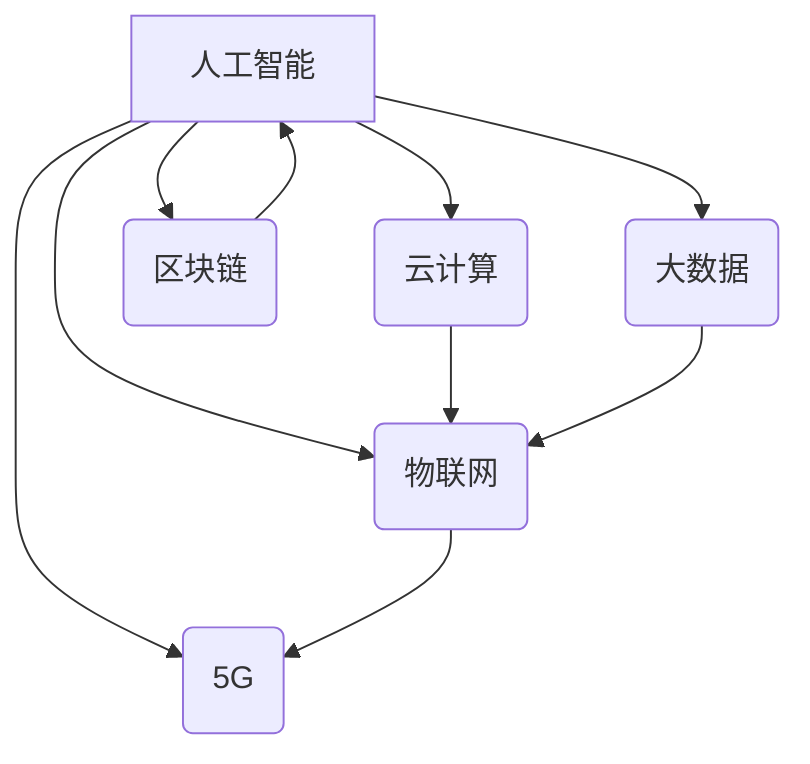

>  人工智能、云计算、大数据、物联网、区块链、5G、网络安全

## 1. 背景介绍

信息技术作为人类社会发展的重要驱动力，近年来发展迅速，深刻地改变着人们的生活方式和生产方式。互联网作为信息技术的核心载体，经历了从静态网页到动态交互、从个人电脑到移动设备的演变，并不断向更智能、更便捷、更安全的方向发展。

当前，全球范围内涌现出许多新的技术和应用，例如人工智能、云计算、大数据、物联网、区块链等，这些技术相互融合，共同推动着互联网的快速发展。

## 2. 核心概念与联系

**2.1  核心概念**

* **人工智能 (AI):**  人工智能是指模拟人类智能行为的计算机系统。它涵盖了机器学习、深度学习、自然语言处理、计算机视觉等多个领域。
* **云计算 (Cloud Computing):** 云计算是指通过互联网提供计算资源、存储资源、网络资源等服务的模式。它具有按需付费、弹性伸缩、高可用性等特点。
* **大数据 (Big Data):** 大数据是指海量、高速、多样化的数据。它蕴含着巨大的价值，但需要强大的处理能力和分析工具才能挖掘出来。
* **物联网 (IoT):** 物联网是指通过传感器、网络等技术，将物理设备连接到互联网，实现设备之间的互联互通。
* **区块链 (Blockchain):** 区块链是一种分布式账本技术，它可以记录和验证交易信息，具有安全、透明、不可篡改等特点。
* **5G:** 5G是第五代移动通信技术，它具有更高的带宽、更低的延迟、更强的连接能力，为物联网、人工智能等应用提供了强大的基础设施支持。

**2.2  核心概念联系**

这些核心概念相互关联，共同推动着互联网的发展。例如，人工智能可以利用云计算的强大计算能力进行训练，大数据可以为人工智能提供训练数据，物联网可以为人工智能提供数据来源，区块链可以保障人工智能应用的安全性和可靠性，5G可以为物联网和人工智能提供高速的网络连接。



## 3. 核心算法原理 & 具体操作步骤

**3.1  算法原理概述**

这里，我们以机器学习算法为例，介绍其原理和操作步骤。机器学习是一种人工智能技术，它通过训练模型，从数据中学习规律，从而实现预测、分类、聚类等任务。

**3.2  算法步骤详解**

1. **数据收集和预处理:** 收集相关数据，并进行清洗、转换、特征工程等预处理操作，以确保数据质量和模型训练效果。
2. **模型选择:** 根据具体任务选择合适的机器学习模型，例如线性回归、逻辑回归、决策树、支持向量机、神经网络等。
3. **模型训练:** 使用训练数据训练模型，调整模型参数，使模型能够准确地预测或分类数据。
4. **模型评估:** 使用测试数据评估模型的性能，例如准确率、召回率、F1-score等指标。
5. **模型调优:** 根据评估结果，调整模型参数或选择其他模型，以提高模型性能。
6. **模型部署:** 将训练好的模型部署到实际应用场景中，用于预测、分类、聚类等任务。

**3.3  算法优缺点**

* **优点:**
    * 自动学习，无需人工编程。
    * 能够处理复杂的数据关系。
    * 性能不断提升，应用范围不断扩大。
* **缺点:**
    * 需要大量的数据进行训练。
    * 模型解释性较差，难以理解模型的决策过程。
    * 容易受到数据偏差的影响。

**3.4  算法应用领域**

机器学习算法广泛应用于各个领域，例如：

* **图像识别:** 人脸识别、物体检测、图像分类等。
* **自然语言处理:** 文本分类、情感分析、机器翻译等。
* **推荐系统:** 商品推荐、内容推荐、用户画像等。
* **金融领域:** 风险评估、欺诈检测、信用评分等。
* **医疗领域:** 疾病诊断、药物研发、医疗影像分析等。

## 4. 数学模型和公式 & 详细讲解 & 举例说明

**4.1  数学模型构建**

机器学习算法通常基于数学模型进行构建。例如，线性回归模型的数学表达式为：

$$y = w_0 + w_1x_1 + w_2x_2 + ... + w_nx_n + \epsilon$$

其中：

* $y$ 是预测值。
* $w_0, w_1, w_2, ..., w_n$ 是模型参数。
* $x_1, x_2, ..., x_n$ 是输入特征。
* $\epsilon$ 是误差项。

**4.2  公式推导过程**

模型参数的学习过程通常使用梯度下降算法进行优化。梯度下降算法的目标是找到使模型预测值与真实值误差最小化的参数值。

**4.3  案例分析与讲解**

假设我们想要预测房价，输入特征包括房屋面积、房间数量、地理位置等。我们可以使用线性回归模型进行预测。通过训练模型，我们可以得到模型参数，例如房屋面积每增加1平方米，房价会增加多少元。

## 5. 项目实践：代码实例和详细解释说明

**5.1  开发环境搭建**

* Python 3.x
* TensorFlow 或 PyTorch 等深度学习框架
* Jupyter Notebook 或 VS Code 等开发工具

**5.2  源代码详细实现**

```python
import tensorflow as tf

# 定义模型
model = tf.keras.models.Sequential([
    tf.keras.layers.Dense(64, activation='relu', input_shape=(784,)),
    tf.keras.layers.Dense(10, activation='softmax')
])

# 编译模型
model.compile(optimizer='adam',
              loss='sparse_categorical_crossentropy',
              metrics=['accuracy'])

# 训练模型
model.fit(x_train, y_train, epochs=10)

# 评估模型
loss, accuracy = model.evaluate(x_test, y_test)
print('Loss:', loss)
print('Accuracy:', accuracy)
```

**5.3  代码解读与分析**

这段代码实现了简单的深度学习模型训练。

* `tf.keras.models.Sequential` 定义了一个顺序模型，即层级结构的模型。
* `tf.keras.layers.Dense` 定义了一个全连接层，每个神经元都连接到上一层的每个神经元。
* `activation='relu'` 指定了激活函数为ReLU函数，它可以提高模型的表达能力。
* `optimizer='adam'` 指定了优化算法为Adam算法，它可以加速模型训练。
* `loss='sparse_categorical_crossentropy'` 指定了损失函数为类别交叉熵损失函数，它适用于多分类问题。
* `metrics=['accuracy']` 指定了评估指标为准确率。

**5.4  运行结果展示**

训练完成后，我们可以使用测试数据评估模型的性能，例如准确率。

## 6. 实际应用场景

**6.1  智能客服**

人工智能技术可以用于构建智能客服系统，自动回答用户常见问题，提高客户服务效率。

**6.2  个性化推荐**

大数据和机器学习技术可以用于分析用户行为数据，提供个性化的商品、内容、服务推荐。

**6.3  精准营销**

通过分析用户数据，可以进行精准营销，将广告投放给目标用户，提高广告效果。

**6.4  未来应用展望**

随着人工智能、云计算、大数据等技术的不断发展，互联网将更加智能化、个性化、安全化。未来，我们将看到更多基于这些技术的创新应用，例如：

* **虚拟现实 (VR) 和增强现实 (AR):** 沉浸式体验、虚拟世界、增强现实应用。
* **自动驾驶:** 无人驾驶汽车、无人机、自动物流等。
* **医疗保健:** 智能诊断、远程医疗、个性化治疗等。
* **教育:** 个性化学习、智能辅导、在线教育等。

## 7. 工具和资源推荐

**7.1  学习资源推荐**

* **在线课程:** Coursera、edX、Udacity 等平台提供丰富的机器学习、人工智能等课程。
* **书籍:** 《深度学习》、《机器学习实战》等书籍。
* **博客和论坛:** Kaggle、Medium、Stack Overflow 等平台提供大量技术文章和讨论。

**7.2  开发工具推荐**

* **Python:** 广泛应用于人工智能和数据科学领域。
* **TensorFlow:** Google 开发的开源深度学习框架。
* **PyTorch:** Facebook 开发的开源深度学习框架。
* **Jupyter Notebook:** 用于交互式编程和数据可视化的工具。

**7.3  相关论文推荐**

* **《ImageNet Classification with Deep Convolutional Neural Networks》**
* **《Attention Is All You Need》**
* **《Generative Adversarial Networks》**

## 8. 总结：未来发展趋势与挑战

**8.1  研究成果总结**

近年来，人工智能、云计算、大数据等技术的快速发展，为互联网带来了巨大的变革。这些技术相互融合，共同推动着互联网的智能化、个性化、安全化发展。

**8.2  未来发展趋势**

* **更智能的应用:** 人工智能将更加智能化，能够更好地理解和响应用户的需求。
* **更个性化的体验:** 大数据和机器学习将提供更加个性化的产品和服务。
* **更安全的网络环境:** 区块链技术将提高网络安全性和数据隐私保护。
* **更广泛的应用场景:** 互联网将应用于更多领域，例如医疗、教育、交通等。

**8.3  面临的挑战**

* **数据安全和隐私保护:** 大数据时代，数据安全和隐私保护面临新的挑战。
* **算法偏见和公平性:** 人工智能算法可能存在偏见，需要解决算法公平性问题。
* **技术伦理:** 人工智能技术发展需要遵循伦理规范，避免负面影响。

**8.4  研究展望**

未来，我们需要继续加强对人工智能、云计算、大数据等技术的研发，探索新的应用场景，并解决技术带来的伦理和社会问题。


## 9. 附录：常见问题与解答

**9.1  常见问题**

* **什么是人工智能？**
* **什么是云计算？**
* **什么是大数据？**
* **什么是物联网？**
* **什么是区块链？**

**9.2  解答**

* **什么是人工智能？** 人工智能是指模拟人类智能行为的计算机系统。
* **什么是云计算？** 云计算是指通过互联网提供计算资源、存储资源、网络资源等服务的模式。
* **什么是大数据？** 大数据是指海量、高速、多样化的数据。
* **什么是物联网？** 物联网是指通过传感器、网络等技术，将物理设备连接到互联网，实现设备之间的互联互通。
* **什么是区块链？** 区块链是一种分布式账本技术，它可以记录和验证交易信息，具有安全、透明、不可篡改等特点。


作者：禅与计算机程序设计艺术 / Zen and the Art of Computer Programming 
<end_of_turn>