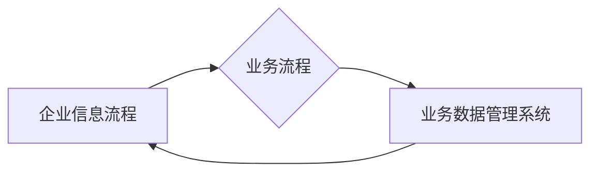

> 信息搭建, 企业信息流程, 业务流程, 业务数据管理系统, 数据模型, 数据库设计, 软件架构, 系统开发

## 1. 背景介绍

在当今数字化时代，企业信息化建设已成为发展的重要驱动力。高效的信息管理和处理能力直接关系到企业运营效率、决策准确性和竞争力。企业信息流程、业务流程和业务数据管理系统搭建是企业信息化建设的关键环节，也是实现企业数字化转型的重要基础。

传统的企业信息管理模式往往存在着信息孤岛、数据冗余、流程不规范等问题，难以满足现代企业对信息化管理的需求。随着互联网、云计算、大数据等技术的快速发展，企业信息管理模式也面临着新的挑战和机遇。

## 2. 核心概念与联系

**2.1 企业信息流程**

企业信息流程是指企业内部信息从产生、收集、加工、存储、传递、利用到最终反馈的整个过程。它涵盖了企业内部各个部门和岗位的信息交互和处理活动，是企业信息化管理的基础。

**2.2 业务流程**

业务流程是指企业为了实现特定目标而进行的一系列有组织、有步骤的活动。它涉及到企业内部和外部的各种资源和人员，是企业运营的核心环节。

**2.3 业务数据管理系统**

业务数据管理系统是指用于收集、存储、处理、分析和管理企业业务数据的系统。它可以帮助企业实现数据标准化、数据共享、数据安全和数据分析等功能，为企业决策提供支持。

**2.4 信息搭建**

信息搭建是指根据企业业务需求，构建企业内部信息系统和数据平台，实现信息资源的整合、共享和利用。它包括以下几个方面：

* **数据模型设计:**  定义企业业务数据结构和关系，建立数据模型。
* **数据库设计:**  根据数据模型设计数据库结构，实现数据存储和管理。
* **系统架构设计:**  设计企业信息系统架构，实现信息系统功能和性能。
* **系统开发:**  开发企业信息系统，实现信息系统功能。

**2.5 核心概念联系**

企业信息流程、业务流程和业务数据管理系统是相互关联、相互影响的。

* **企业信息流程**是业务流程的基础，业务流程的执行需要依赖于企业信息流程的顺利进行。
* **业务数据管理系统**是企业信息流程和业务流程的支撑，它为企业信息流程和业务流程提供数据支持和管理服务。
* **信息搭建**是企业信息流程、业务流程和业务数据管理系统的基础，它为企业信息化建设提供技术支撑。

**2.6 流程图**



## 3. 核心算法原理 & 具体操作步骤

**3.1 算法原理概述**

在信息搭建过程中，需要采用多种算法来实现数据模型设计、数据库设计、系统架构设计等功能。常见的算法包括：

* **数据挖掘算法:** 用于从海量数据中发现隐藏的模式和规律。
* **机器学习算法:** 用于构建预测模型，实现数据分析和决策支持。
* **图论算法:** 用于分析和处理复杂的关系数据。
* **算法优化算法:** 用于提高算法效率和性能。

**3.2 算法步骤详解**

具体算法的步骤详解取决于具体的算法类型和应用场景。例如，数据挖掘算法的步骤一般包括：

1. 数据预处理：清洗、转换和格式化数据。
2. 特征提取：从原始数据中提取特征。
3. 模型训练：使用训练数据训练模型。
4. 模型评估：使用测试数据评估模型性能。
5. 模型部署：将训练好的模型部署到生产环境中。

**3.3 算法优缺点**

不同的算法具有不同的优缺点，需要根据具体的应用场景选择合适的算法。例如，决策树算法易于理解和解释，但泛化能力较弱；支持向量机算法泛化能力强，但训练时间较长。

**3.4 算法应用领域**

算法在信息搭建领域有着广泛的应用，例如：

* **数据分析:** 用于分析企业业务数据，发现趋势和模式。
* **预测分析:** 用于预测未来业务发展趋势，辅助决策。
* **个性化推荐:** 用于根据用户行为推荐个性化内容。
* **风险控制:** 用于识别和控制企业风险。

## 4. 数学模型和公式 & 详细讲解 & 举例说明

**4.1 数学模型构建**

在信息搭建过程中，需要构建数学模型来描述企业业务数据和信息流程。例如，可以构建一个数据模型来描述企业客户信息，包括客户姓名、联系方式、购买历史等。

**4.2 公式推导过程**

可以根据数据模型构建相应的公式，例如，可以计算客户的平均购买金额、客户的购买频率等。

**4.3 案例分析与讲解**

例如，假设企业想要构建一个客户关系管理系统，需要构建一个客户数据模型，并根据客户数据计算客户的价值。

* **数据模型:** 客户ID，姓名，联系方式，购买历史，购买金额等。
* **公式:** 客户价值 = 购买金额 * 购买频率 * 客户忠诚度

**4.4 数学公式**

$$
客户价值 = \sum_{i=1}^{n} 购买金额_i * 购买频率_i * 客户忠诚度_i
$$

其中：

* $购买金额_i$ 表示第 $i$ 次购买的金额。
* $购买频率_i$ 表示第 $i$ 次购买的频率。
* $客户忠诚度_i$ 表示第 $i$ 个客户的忠诚度。

## 5. 项目实践：代码实例和详细解释说明

**5.1 开发环境搭建**

* 操作系统：Windows/Linux/macOS
* 编程语言：Python
* 数据库：MySQL/PostgreSQL
* 开发工具：VS Code/PyCharm

**5.2 源代码详细实现**

```python
# 数据模型
class Customer:
    def __init__(self, customer_id, name, contact, purchase_history, purchase_amount):
        self.customer_id = customer_id
        self.name = name
        self.contact = contact
        self.purchase_history = purchase_history
        self.purchase_amount = purchase_amount

# 计算客户价值
def calculate_customer_value(customer):
    total_purchase_amount = sum(customer.purchase_history)
    purchase_frequency = len(customer.purchase_history)
    customer_loyalty = # 计算客户忠诚度
    return total_purchase_amount * purchase_frequency * customer_loyalty

# 示例代码
customer = Customer(1, "张三", "1234567890", [100, 200, 300], 600)
customer_value = calculate_customer_value(customer)
print(f"客户{customer.name}的价值为：{customer_value}")
```

**5.3 代码解读与分析**

* 代码定义了一个 `Customer` 类来表示客户信息。
* `calculate_customer_value` 函数计算客户的价值，并使用公式进行计算。
* 示例代码创建了一个客户对象，并调用 `calculate_customer_value` 函数计算其价值。

**5.4 运行结果展示**

```
客户张三的价值为：1800
```

## 6. 实际应用场景

**6.1 客户关系管理 (CRM)**

CRM 系统可以利用信息搭建技术，构建客户数据模型，并根据客户数据分析客户行为、预测客户需求，实现精准营销和客户关系管理。

**6.2 企业资源规划 (ERP)**

ERP 系统可以利用信息搭建技术，整合企业内部各个部门的数据，实现企业资源的优化配置和管理。

**6.3 电子商务 (E-commerce)**

电子商务平台可以利用信息搭建技术，构建商品数据模型，实现商品推荐、订单管理和物流追踪等功能。

**6.4 金融科技 (FinTech)**

金融科技公司可以利用信息搭建技术，构建金融数据模型，实现风险控制、欺诈检测和个性化金融服务等功能。

**6.5 未来应用展望**

随着人工智能、大数据、云计算等技术的不断发展，信息搭建技术将得到更广泛的应用，例如：

* **智能化信息管理:** 利用人工智能技术，实现信息自动分类、识别和分析。
* **个性化信息服务:** 根据用户需求，提供个性化信息服务。
* **跨行业信息共享:** 建立跨行业信息共享平台，促进信息资源的共享和利用。

## 7. 工具和资源推荐

**7.1 学习资源推荐**

* **书籍:**
    * 《数据结构与算法分析》
    * 《数据库系统概论》
    * 《软件工程》
* **在线课程:**
    * Coursera
    * edX
    * Udemy

**7.2 开发工具推荐**

* **数据库:** MySQL, PostgreSQL, MongoDB
* **编程语言:** Python, Java, C++
* **开发工具:** VS Code, PyCharm, Eclipse

**7.3 相关论文推荐**

* **信息架构:**
    * "Information Architecture for the World Wide Web" by Peter Morville and Louis Rosenfeld
* **数据模型:**
    * "Database System Concepts" by Abraham Silberschatz, Henry F. Korth, and S. Sudarshan
* **软件架构:**
    * "Designing Data-Intensive Applications" by Martin Kleppmann

## 8. 总结：未来发展趋势与挑战

**8.1 研究成果总结**

信息搭建技术在企业信息化建设中发挥着越来越重要的作用，它帮助企业实现信息资源的整合、共享和利用，提高企业运营效率和竞争力。

**8.2 未来发展趋势**

未来，信息搭建技术将朝着以下方向发展：

* **智能化:** 利用人工智能技术，实现信息自动分类、识别和分析。
* **个性化:** 根据用户需求，提供个性化信息服务。
* **云化:** 基于云计算平台，实现信息资源的共享和利用。

**8.3 面临的挑战**

信息搭建技术的发展也面临着一些挑战，例如：

* **数据安全:** 企业数据安全问题日益突出，需要加强数据安全防护措施。
* **数据标准化:** 数据标准化问题仍然存在，需要加强数据标准化工作。
* **技术人才短缺:** 信息搭建技术人才短缺，需要加强人才培养和引进。

**8.4 研究展望**

未来，我们将继续致力于信息搭建技术的研究和应用，探索新的技术和方法，为企业信息化建设提供更强大的技术支撑。

## 9. 附录：常见问题与解答

**9.1 如何选择合适的数据库？**

选择数据库需要考虑以下因素：

* 数据类型
* 数据量
* 查询需求
* 性能要求
* 安全要求

**9.2 如何设计数据模型？**

数据模型设计需要考虑以下因素：

* 数据实体
* 数据属性
* 数据关系
* 数据完整性

**9.3 如何优化系统性能？**

系统性能优化可以从以下几个方面入手：

* 数据库优化
* 代码优化
* 硬件优化

**9.4 如何保障数据安全？**

数据安全保障措施包括：

* 数据加密
* 数据备份
* 访问控制
* 安全审计


作者：禅与计算机程序设计艺术 / Zen and the Art of Computer Programming 
<end_of_turn>