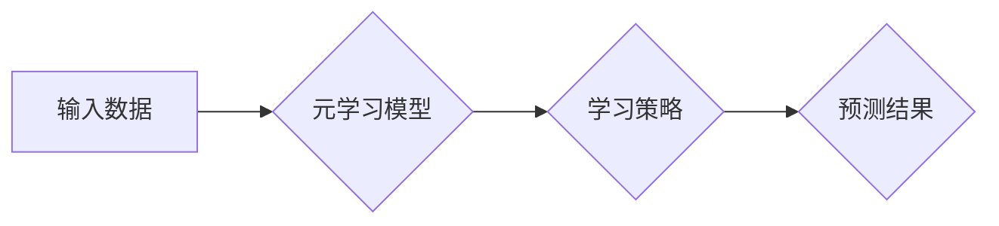

> 元学习，Meta Learning，迁移学习，Few-Shot Learning，One-Shot Learning，深度学习，神经网络，模型训练

## 1. 背景介绍

在机器学习领域，传统的训练方式通常需要大量的 labeled 数据才能达到令人满意的性能。然而，在现实世界中，获取大量 labeled 数据往往成本高昂且耗时费力。为了解决这个问题，元学习 (Meta Learning) 应运而生。

元学习，也称为“学习如何学习”，是一种机器学习范式，旨在学习学习算法本身，从而能够快速适应新的任务和环境。换句话说，元学习的目标不是直接学习某个特定任务，而是学习如何从有限的样本数据中快速学习新任务的策略。

## 2. 核心概念与联系

元学习的核心概念是“学习一个学习算法”。它通过学习一系列任务的经验，来提高对新任务的学习能力。

**元学习的流程可以概括为以下步骤：**

1. **训练阶段:** 在一个包含多个任务的数据集上训练一个元学习模型。每个任务都包含少量的数据样本。
2. **测试阶段:** 将训练好的元学习模型应用于一个新的任务，该任务在训练阶段没有出现过。元学习模型需要利用之前学习到的知识，从少量的新任务数据中快速学习。

**元学习与其他机器学习方法的关系:**

* **迁移学习:** 元学习可以看作是一种更高级的迁移学习。迁移学习是指利用已学习到的知识来帮助学习新的任务，而元学习则学习如何迁移知识到任何新的任务。
* **Few-Shot Learning 和 One-Shot Learning:** 元学习可以用于 Few-Shot Learning 和 One-Shot Learning。Few-Shot Learning是指在少量样本数据下学习新任务，而 One-Shot Learning是指仅使用一个样本数据学习新任务。

**元学习的架构:**



## 3. 核心算法原理 & 具体操作步骤

### 3.1  算法原理概述

元学习算法的核心思想是学习一个通用的学习策略，该策略能够适应不同的任务。常见的元学习算法包括：

* **Model-Agnostic Meta-Learning (MAML):** MAML 是一种基于梯度的元学习算法，它通过在元训练阶段更新模型参数，使其能够快速适应新的任务。
* **Prototypical Networks:** Prototypical Networks 是一种基于原型的方法，它将每个类别的样本聚类成一个原型，然后根据新样本与原型之间的距离进行分类。
* **Matching Networks:** Matching Networks 是一种基于匹配的方法，它通过计算新样本与训练样本之间的相似度来进行分类。

### 3.2  算法步骤详解

以 MAML 为例，其具体操作步骤如下：

1. **初始化模型参数:** 为模型参数赋予初始值。
2. **元训练阶段:**
    * 从训练数据集中随机抽取一个任务。
    * 在该任务上进行少量样本的训练，并计算损失函数的值。
    * 使用梯度下降算法更新模型参数，使其能够更好地适应该任务。
3. **元测试阶段:**
    * 选择一个新的任务，该任务在元训练阶段没有出现过。
    * 使用训练好的模型参数，在该任务上进行少量样本的训练，并计算损失函数的值。
    * 评估模型在该任务上的性能。

### 3.3  算法优缺点

**优点:**

* 可以快速适应新的任务。
* 能够在少量样本数据下学习新任务。
* 适用于各种机器学习任务。

**缺点:**

* 元训练阶段需要大量的计算资源。
* 算法的复杂度较高。

### 3.4  算法应用领域

元学习在以下领域具有广泛的应用前景:

* **自然语言处理:** 文本分类、机器翻译、问答系统等。
* **计算机视觉:** 图像识别、目标检测、图像分割等。
* **机器人学:** 运动规划、任务学习、适应性控制等。

## 4. 数学模型和公式 & 详细讲解 & 举例说明

### 4.1  数学模型构建

元学习的数学模型通常基于优化问题。目标是找到一个模型参数 θ，使得在所有任务上的性能都达到最大化。

**定义:**

* T: 任务集
* D: 数据集
* θ: 模型参数
* L(θ, D): 在数据集 D 上的损失函数

**目标函数:**

$$
\min_{\theta} \sum_{T \in T} L(\theta, D_T)
$$

### 4.2  公式推导过程

MAML 算法的推导过程基于梯度下降算法。

**目标:**

找到一个模型参数 θ，使得在所有任务上的性能都达到最大化。

**梯度下降算法:**

$$
\theta = \theta - \alpha \nabla_{\theta} \sum_{T \in T} L(\theta, D_T)
$$

**MAML 的关键思想:**

在元训练阶段，更新模型参数 θ，使其能够适应所有任务。

**更新规则:**

$$
\theta = \theta - \alpha \nabla_{\theta} \sum_{T \in T} L(\theta, D_T)
$$

### 4.3  案例分析与讲解

假设我们有一个包含多个手写数字分类任务的数据集。每个任务包含少量的手写数字样本。

使用 MAML 算法，我们可以训练一个元学习模型，该模型能够从这些任务中学习到一个通用的学习策略。

在元测试阶段，我们可以将这个模型应用于一个新的手写数字分类任务，该任务在元训练阶段没有出现过。

由于模型已经学习到一个通用的学习策略，因此它能够从少量的新任务数据中快速学习，并达到较高的分类精度。

## 5. 项目实践：代码实例和详细解释说明

### 5.1  开发环境搭建

* Python 3.6+
* PyTorch 1.0+
* CUDA 10.0+ (可选)

### 5.2  源代码详细实现

```python
import torch
import torch.nn as nn
import torch.optim as optim

# 定义元学习模型
class MetaModel(nn.Module):
    def __init__(self, input_size, hidden_size, output_size):
        super(MetaModel, self).__init__()
        self.fc1 = nn.Linear(input_size, hidden_size)
        self.fc2 = nn.Linear(hidden_size, output_size)

    def forward(self, x):
        x = torch.relu(self.fc1(x))
        x = self.fc2(x)
        return x

# 定义元学习算法
class MAML(object):
    def __init__(self, model, lr, num_tasks):
        self.model = model
        self.optimizer = optim.Adam(model.parameters(), lr=lr)
        self.num_tasks = num_tasks

    def train(self, train_data):
        for task in train_data:
            # 训练一个任务
            self.train_task(task)

    def train_task(self, task):
        # 训练一个任务
        # ...

# 训练元学习模型
model = MetaModel(input_size=784, hidden_size=128, output_size=10)
maml = MAML(model, lr=0.001, num_tasks=10)
maml.train(train_data)

# 测试元学习模型
# ...
```

### 5.3  代码解读与分析

* **MetaModel:** 定义了元学习模型的结构，包括两个全连接层和一个ReLU激活函数。
* **MAML:** 定义了 MAML 算法的实现，包括模型初始化、优化器、训练任务循环等步骤。
* **train() 方法:** 训练元学习模型，循环遍历所有训练任务。
* **train_task() 方法:** 训练一个具体的任务，包括前向传播、损失函数计算、反向传播和参数更新等步骤。

### 5.4  运行结果展示

运行代码后，可以观察到元学习模型在元测试阶段的性能，例如分类精度等。

## 6. 实际应用场景

元学习在以下实际应用场景中具有广泛的应用前景:

* **个性化推荐:** 根据用户的历史行为数据，学习用户的偏好，并推荐个性化的商品或内容。
* **医疗诊断:** 利用少量病历数据，学习疾病的诊断规则，辅助医生进行诊断。
* **自动驾驶:** 利用少量驾驶数据，学习驾驶策略，提高自动驾驶系统的安全性。

### 6.4  未来应用展望

随着元学习算法的不断发展，其应用场景将会更加广泛。未来，元学习可能在以下领域发挥重要作用:

* **人工智能的通用性:** 元学习可以帮助人工智能系统学习更广泛的任务，并更好地适应新的环境。
* **数据效率:** 元学习可以帮助机器学习模型在更少的数据下达到更高的性能。
* **可解释性:** 元学习可以帮助我们更好地理解机器学习模型的决策过程。

## 7. 工具和资源推荐

### 7.1  学习资源推荐

* **论文:**
    * Model-Agnostic Meta-Learning for Fast Adaptation of Deep Networks
    * Prototypical Networks for Few-Shot Learning
    * Matching Networks for One Shot Learning
* **博客:**
    * OpenAI Blog: Meta-Learning
    * Towards Data Science: Meta-Learning

### 7.2  开发工具推荐

* **PyTorch:** 深度学习框架，支持元学习算法的实现。
* **TensorFlow:** 深度学习框架，也支持元学习算法的实现。

### 7.3  相关论文推荐

* **Meta-Learning with Differentiable Convex Optimization**
* **Learning to Learn by Gradient Descent by Gradient Descent**
* **Meta-Learning for Few-Shot Natural Language Processing**

## 8. 总结：未来发展趋势与挑战

### 8.1  研究成果总结

元学习是一个新兴的机器学习范式，取得了显著的进展。

* 算法性能不断提高，能够在更少的数据下学习新任务。
* 应用场景不断扩展，涵盖自然语言处理、计算机视觉、机器人学等多个领域。

### 8.2  未来发展趋势

* **更有效的元学习算法:** 研究更有效的元学习算法，提高算法的效率和性能。
* **更广泛的应用场景:** 将元学习应用到更多实际应用场景中，例如医疗诊断、自动驾驶等。
* **理论研究:** 深入研究元学习的理论基础，例如学习策略的泛化能力、元学习的效率等。

### 8.3  面临的挑战

* **计算资源:** 元学习算法通常需要大量的计算资源，这限制了其在实际应用中的推广。
* **数据标注:** 元学习算法需要大量的标注数据，这在某些领域可能难以获取。
* **可解释性:** 元学习模型的决策过程往往难以解释，这可能阻碍其在一些敏感领域中的应用。

### 8.4  研究展望

元学习是一个充满潜力的研究领域，未来将会有更多的研究成果涌现。

* **探索新的元学习算法:** 研究更有效的、更鲁棒的元学习算法。
* **开发新的元学习应用:** 将元学习应用到更多实际应用场景中，解决现实世界中的问题。
* **提高元学习的可解释性:** 研究元学习模型的决策过程，使其更加透明和可解释。

## 9. 附录：常见问题与解答

**Q1: 元学习和迁移学习有什么区别？**

**A1:** 元学习是一种更高级的迁移学习。迁移学习是指利用已学习到的知识来帮助学习新的任务，而元学习则学习如何迁移知识到任何新的任务。

**Q2: 元学习需要多少数据才能训练？**

**A2:** 元学习算法通常需要比传统机器学习算法更少的训练数据，但仍然需要一定的标注数据。

**Q3: 元学习的应用场景有哪些？**

**A3:** 元学习的应用场景非常广泛，包括